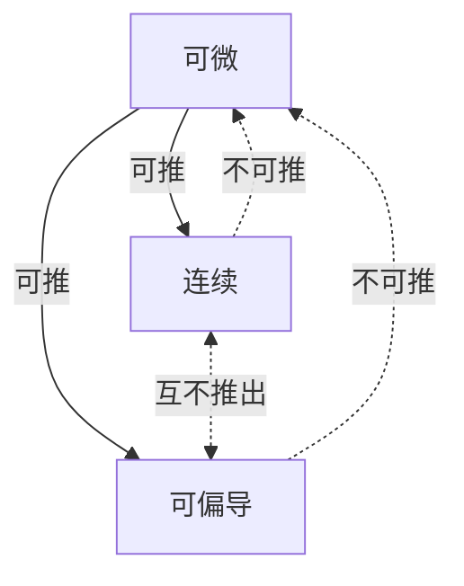

---

# 杰哥800题答案_第1页.png

# 专升本数学严选800题
---
● 周斌 编著
（答案册）

湘潭大学出版社
XIANGTAN UNIVERSITY PRESS

---


版权所有 侵权必究

## 图书在版编目(CIP)数据
专升本数学严选800题 / 周斌编著. -- 湘潭 : 湘潭大学出版社, 2023.8
ISBN 978-7-5687-1240-8

Ⅰ. ①专… Ⅱ. ①周… Ⅲ. ①高等数学—成人高等教育—习题集—升学参考资料 Ⅳ. ①O13-44

中国国家版本馆CIP数据核字(2023)第167198号

## 专升本数学严选800题
ZHUANSHENGBEN SHUXUE YANXUAN 800 TI
周斌 编著

责任编辑：杨 淼
出版发行：湘潭大学出版社
社　　址：湖南省湘潭大学工程训练大楼
电　　话：0731-58298960 0731-58298966（传真）
邮　　编：411105
网　　址：http://press.xtu.edu.cn/
印　　刷：成都市兴雅致印务有限责任公司
经　　销：湖南省新华书店
开　　本：$787\ \text{mm} \times 1092\ \text{mm}\ 1/16$
印　　张：21.25
字　　数：385千字
版　　次：2023年8月第1版
印　　次：2023年8月第1次印刷
书　　号：ISBN 978-7-5687-1240-8
定　　价：89.00元（全两册）

---


# 目录
*CONTENTS*

## 基础部分答案解析
填空题 …………………………………………………… 003
选择题 …………………………………………………… 043

## 强化部分答案解析
填空题 …………………………………………………… 063
选择题 …………………………………………………… 097
解答题 …………………………………………………… 116
证明题 …………………………………………………… 166

01

---

# 基础部分答案解析

---

## 填空题

## 第1题
【答案】$x\in(-3,3)$
【解】由$9-x^2>0$，得$-3<x<3$，故定义域为：$x\in(-3,3)$。

## 第2题
【答案】$x\in(2,4]$
【解】由$\begin{cases}-1\leqslant x-3\leqslant1,\\x-2>0,\end{cases}$解得$\begin{cases}2\leqslant x\leqslant4,\\x>2,\end{cases}$取交集得$2<x\leqslant4$，故定义域为：$x\in(2,4]$。

## 第3题 
【答案】$x\in(0,3]$
【解】由$f(x)$的定义域为$-1<x\leqslant2$，知$f(x-1)$的定义域为$-1<x-1\leqslant2$，
解得$0<x\leqslant3$，故定义域为：$x\in(0,3]$。

## 第4题
【答案】$x\in[-5,7)$
【解】由$f(1-3x)$的定义域为$-1<x\leqslant3$，知$-8\leqslant1-3x<4$，
从而$f(x-3)$的定义域为$-8\leqslant x-3<4$，解得$-5\leqslant x<7$。

## 第5题
【答案】$-\dfrac{1}{2+x}$
【解】令$1-\dfrac{1}{x}=t$，则$x=\dfrac{1}{1-t}$，故$f(t)=\dfrac{\dfrac{1}{1-t}}{1-\dfrac{3}{1-t}}=\dfrac{1}{-2-t}=-\dfrac{1}{2+t}$，
因此，$f(x)=-\dfrac{1}{2+x}$。

## 第6题
【答案】$2x^2-1$
【解】由$f(\cos x)=1-2\sin^2 x=1-2(1-\cos^2 x)=2\cos^2 x-1$，
知$f(x)=2x^2-1$。

## 第7题
 【答案】$y=x^3-2,\ x\in\mathbb{R}$
【解】由$y=\sqrt[3]{x+2}$，解得$x=y^3-2$，故所求反函数为$y=x^3-2,\ x\in\mathbb{R}$。

003

---

## 第8题
【答案】$y=\frac{1}{4}\arcsin\frac{1}{3}x,\ x\in[-3,3]$
【解】由$y=3\sin4x$，解得$x=\frac{1}{4}\arcsin\frac{1}{3}y$，故所求反函数为$y=\frac{1}{4}\arcsin\frac{1}{3}x$，$x\in[-3,3]$。

## 第9题
 【答案】$1+\sin^2 x$
【解】$f[g(x)]=1+g^2(x)=1+\sin^2 x$。

## 第10题
【答案】$y=u^2,\ u=\sin v,\ v=2x+1$
【解】$y=\sin^2(2x+1)=[\sin(2x+1)]^2$，
分解得：$y=u^2,\ u=\sin v,\ v=2x+1$。

## 第11题
【答案】$2$
【解】
$$\lim_{x \to 0}\frac{x^2 - x - 6}{x^2 - 2x - 3}=\frac{\lim\limits_{x \to 0}(x^2 - x - 6)}{\lim\limits_{x \to 0}(x^2 - 2x - 3)}=\frac{0-0-6}{0-0-3}=2.$$

## 第12题
【答案】$0$
【解】
$$\lim_{x \to \infty}\frac{2x^2 + x + 1}{3x^3 + 2x + 1}=\lim_{x \to \infty}\frac{\frac{2}{x}+\frac{1}{x^2}+\frac{1}{x^3}}{3+\frac{2}{x^2}+\frac{1}{x^3}}=\frac{0+0+0}{3+0+0}=0.$$
此题也可以利用“抓大头”的方法：分子的大头是$2x^2$，分母的大头是$3x^3$。

## 第13题
【答案】$1$
【解】
$$\lim_{x \to +\infty}\frac{\pi^x}{\pi^x - e^x}=\lim_{x \to +\infty}\frac{1}{1-\left(\frac{e}{\pi}\right)^x}=\frac{1}{1-0}=1.$$
注：由于$0<\frac{e}{\pi}<1$，故$\lim\limits_{x \to +\infty}\left(\frac{e}{\pi}\right)^x=0$。
此题也可以利用“抓大头”的方法：分子的大头是$\pi^x$，分母的大头是$\pi^x$。

004

---


## 第14题
【答案】$1$
【解】
$$\lim_{x \to 0} \frac{2\tan 3x}{3\sin 2x} = \lim_{x \to 0} \frac{2 \cdot 3x}{3 \cdot 2x} = 1.$$

## 第15题
【答案】$2$
【解】
$$\lim_{x \to 0} \frac{1-\cos 2x}{x\sin x} = \lim_{x \to 0} \frac{\frac{1}{2}(2x)^2}{x \cdot x} = 2.$$

## 第16题
【答案】$2$
【解】
$$\lim_{n \to \infty} 3^n \tan \frac{2}{3^n} = \lim_{n \to \infty} 3^n \cdot \frac{2}{3^n} = 2. \quad (n \to \infty \text{时，} \tan \frac{2}{3^n} \sim \frac{2}{3^n}).$$

## 第17题
【答案】$\dfrac{3}{4}$
【解】
$$\lim_{x \to 0} \frac{1-\sqrt{1-3x^2}}{2x^2} = -\lim_{x \to 0} \frac{\sqrt{1-3x^2} -1}{2x^2} = -\lim_{x \to 0} \frac{(1-3x^2)^{\frac{1}{2}} -1}{2x^2} = -\lim_{x \to 0} \frac{-\frac{3}{2}x^2}{2x^2} = \frac{3}{4}.$$
注：$x \to 0$时，$(1+x)^\alpha -1 \sim \alpha x$.

## 第18题
【答案】$\dfrac{1}{6}$
【解】
$$\lim_{x \to 0} \frac{\sin x - x}{x^2 \ln(1-x)} = \lim_{x \to 0} \frac{-\frac{1}{6}x^3}{x^2 \cdot (-x)} = \frac{1}{6}.$$

## 第19题
【答案】$\dfrac{5}{4}$
【解一】
$$\lim_{x \to 1} \frac{x^5 -1}{x^4 -1} = \lim_{x \to 1} \frac{(x-1)(x^4 + x^3 + x^2 + x +1)}{(x-1)(x^3 + x^2 + x +1)} = \lim_{x \to 1} \frac{x^4 + x^3 + x^2 + x +1}{x^3 + x^2 + x +1} = \frac{5}{4}.$$
【解二】
$$\lim_{x \to 1} \frac{x^5 -1}{x^4 -1} = \lim_{x \to 1} \frac{5x^4}{4x^3} = \frac{5}{4} \quad (\text{洛必达法则}).$$

005

---


## 第20题
【答案】$-\dfrac{3}{5}$
【解】
$$\lim_{x \to \pi} \frac{\sin 3x}{\tan 5x} = \lim_{x \to \pi} \frac{3\cos 3x}{5\sec^2 5x} = \frac{3\cos 3\pi}{5\sec^2 5\pi} = -\frac{3}{5} \quad (\text{洛必达法则}).$$
注：此题不能用等价替换，不要误以为$x \to \pi$时，$\sin 3x \sim 3x$，原因是$3x \to 3\pi \neq 0$。
## 第21题
【答案】$\mathrm{e}^{\frac{2}{3}}$
【解】
由于$\lim_{x \to 0} \frac{2x}{3x} = \frac{2}{3}$，故
$$\lim_{x \to 0} (1+2x)^{\frac{1}{3x}} = \mathrm{e}^{\frac{2}{3}}.$$
## 第22题
【答案】$\mathrm{e}^{-\frac{1}{3}}$
【解】
改写为标准形式：
$$\lim_{x \to \infty} \left( \frac{x+4}{x+5} \right)^{\frac{x-1}{3}} = \lim_{x \to \infty} \left( \frac{x+5-1}{x+5} \right)^{\frac{x-1}{3}} = \lim_{x \to \infty} \left( 1+\frac{-1}{x+5} \right)^{\frac{x-1}{3}},$$
由于
$$\lim_{x \to \infty} \frac{-1}{x+5} \cdot \frac{x-1}{3} = \lim_{x \to \infty} \frac{1-x}{3x+15} = -\frac{1}{3},$$
故原式$=\mathrm{e}^{-\frac{1}{3}}$。
## 第23题
【答案】$-1$
【解】
由于$\lim_{n \to \infty} \frac{5}{n} \cdot nk = 5k$，故
$$\lim_{n \to \infty} \left(1+\frac{5}{n}\right)^{nk} = \mathrm{e}^{5k}.$$
由$\mathrm{e}^{5k} = \mathrm{e}^{-5}$，得$k=-1$。
## 第24题
【答案】$\mathrm{e}^{4}$
【解】
由于$\lim_{x \to 0} \frac{2\sin x^2}{1-\cos x} = \lim_{x \to 0} \frac{2x^2}{\frac{1}{2}x^2} = 4$，故
$$\lim_{x \to 0} (1+2\sin x^2)^{\frac{1}{1-\cos x}} = \mathrm{e}^{4}.$$
## 第25题
【答案】$3$
【解】
$$\lim_{x \to 2} \frac{x^3 - 3x^2 + 4}{x^2 - 4x + 4} = \lim_{x \to 2} \frac{3x^2 - 6x}{2x - 4} = \lim_{x \to 2} \frac{6x - 6}{2} = 3.$$
页码：006

---


## 26. 【答案】$-1$
【解一】
$$\lim_{x \to 0} \frac{e^{-x} - e^x}{\sin 2x} = \lim_{x \to 0} \frac{-e^{-x} - e^x}{2\cos 2x} = -1 \quad (\text{洛必达法则}).$$

【解二】
$$\lim_{x \to 0} \frac{e^{-x} - 1 + 1 - e^x}{\sin 2x} = \lim_{x \to 0} \frac{e^{-x} - 1}{\sin 2x} + \lim_{x \to 0} \frac{1 - e^x}{\sin 2x} = \lim_{x \to 0} \frac{-x}{\sin 2x} + \lim_{x \to 0} \frac{-x}{\sin 2x} = -1.$$

## 27. 【答案】$0$
【解】
$$\lim_{x \to 0^+} x \ln x = \lim_{x \to 0^+} \frac{\ln x}{\frac{1}{x}} = \lim_{x \to 0^+} \frac{\frac{1}{x}}{-\frac{1}{x^2}} = \lim_{x \to 0^+} (-x) = 0.$$

## 28. 【答案】$1$
【解】
$$\lim_{x \to 0^+} x^{\sin x} = \lim_{x \to 0^+} e^{\sin x \cdot \ln x},$$

由于
$$\lim_{x \to 0^+} \sin x \cdot \ln x = \lim_{x \to 0^+} x \cdot \ln x = \lim_{x \to 0^+} \frac{\ln x}{\frac{1}{x}} = \lim_{x \to 0^+} \frac{\frac{1}{x}}{-\frac{1}{x^2}} = \lim_{x \to 0^+} (-x) = 0,$$

故
$$\lim_{x \to 0^+} x^{\sin x} = e^0 = 1.$$

## 29. 【答案】$\dfrac{1}{6}$
【解】
$$\lim_{x \to 0} \left( x^{-2} - \frac{\sin x}{x^3} \right) = \lim_{x \to 0} \left( \frac{1}{x^2} - \frac{\sin x}{x^3} \right) = \lim_{x \to 0} \frac{x - \sin x}{x^3} = \lim_{x \to 0} \frac{\frac{1}{6}x^3}{x^3} = \frac{1}{6}.$$

## 30. 【答案】$1$
【解】由于极限$\lim_{x \to 0} \frac{a + e^x - 2}{x - x^2}$存在且$\lim_{x \to 0} (x - x^2) = 0$，知$\lim_{x \to 0} (a + e^x - 2) = 0$，

因此$\lim_{x \to 0} (a + e^x - 2) = a + 1 - 2 = 0$，解得$a=1$。

## 31. 【答案】$-2$
【解】由
$$\lim_{x \to 0} \frac{\sqrt{1 - ax^2} - 1}{x \sin x} = \lim_{x \to 0} \frac{-\frac{1}{2}ax^2}{x^2} = -\frac{1}{2}a = 1,$$
知$a=-2$。

007

---


## 32. 【答案】1
【解】由$\lim\limits_{x \to 0} \frac{2x \arcsin x^2}{x \sin x^{n+1}} = \lim\limits_{x \to 0} \frac{2x^3}{x^{n+2}} = k \neq 0$，知$n+2=3$，因此$n=1$。

## 33. 【答案】2
【解】$\lim\limits_{x \to 0^+} f(x) = \lim\limits_{x \to 0^+} \frac{\sin kx}{x} = k$；$\lim\limits_{x \to 0^-} f(x) = \lim\limits_{x \to 0^-} (\cos x + 1) = 2$。

由于$\lim\limits_{x \to 0} f(x)$存在，故$k=2$。

## 34. 【答案】不存在
【解】$\lim\limits_{x \to 0^+} f(x) = \lim\limits_{x \to 0^+} \frac{|x|}{x} = \lim\limits_{x \to 0^+} \frac{x}{x} = 1$；$\lim\limits_{x \to 0^-} f(x) = \lim\limits_{x \to 0^-} \frac{|x|}{x} = \lim\limits_{x \to 0^-} \frac{-x}{x} = -1$。

由于$\lim\limits_{x \to 0^+} f(x) \neq \lim\limits_{x \to 0^-} f(x)$，故$\lim\limits_{x \to 0} f(x)$不存在。

## 35. 【答案】不存在
【解】由于$\lim\limits_{x \to 0^+} \frac{e^{\frac{1}{x}} + 2}{e^{\frac{1}{x}} - 2} = 1$；$\lim\limits_{x \to 0^-} \frac{e^{\frac{1}{x}} + 2}{e^{\frac{1}{x}} - 2} = \lim\limits_{x \to 0^-} \frac{0+2}{0-2} = -1$。

故$\lim\limits_{x \to 0} \frac{e^{\frac{1}{x}} + 2}{e^{\frac{1}{x}} - 2}$不存在。

注：$\lim\limits_{x \to 0^+} \frac{1}{x} = +\infty$，$\lim\limits_{x \to 0^-} \frac{1}{x} = -\infty$。

## 36. 【答案】不存在
【解】由于$\lim\limits_{x \to 0^+} \arctan \frac{1}{x} = \frac{\pi}{2}$；$\lim\limits_{x \to 0^-} \arctan \frac{1}{x} = -\frac{\pi}{2}$。

故$\lim\limits_{x \to 0} \arctan \frac{1}{x}$不存在。

## 37. 【答案】连续
【解】$\lim\limits_{x \to 0^-} f(x) = \lim\limits_{x \to 0^-} (e^x - 1) = 0$；$\lim\limits_{x \to 0^+} f(x) = \lim\limits_{x \to 0^+} x^2 \sin \frac{1}{x} = 0$；$f(0)=0$。

故$f(x)$在$x=0$处连续。

008

---


## 第38题
【答案】连续
【解】由于$\lim\limits_{x \to 0^-} f(x) = \lim\limits_{x \to 0^-} (2\cos x - 1) = 1$；
$$\lim_{x \to 0^+} f(x) = \lim_{x \to 0^+} \left(x\sin \frac{1}{x} + \frac{1}{x}\sin x\right) = 0 + 1 = 1；$$
$f(0) = 1$。
故$f(x)$在$x=0$处连续。

## 第39题
【答案】$\mathrm{e}^2$
【解】$\lim\limits_{x \to 0} f(x) = \lim\limits_{x \to 0} (1+2x)^{\frac{1}{x}} = \mathrm{e}^2$；$f(0) = a$。
由$f(x)$在$x=0$处连续，得$a = \mathrm{e}^2$。

## 第40题
【答案】可去
【解】由于$\lim\limits_{x \to 0} x\cos \frac{1}{x} = 0$，但$x=0$时，$y = x\cos \frac{1}{x}$无定义。
因此，$x=0$是$y = x\cos \frac{1}{x}$的可去间断点。

## 第41题
【答案】可去
【解】由于$\lim\limits_{x \to 2} f(x) = \lim\limits_{x \to 2} \frac{x^2 - 4}{x - 2} = \lim\limits_{x \to 2} \frac{(x+2)(x-2)}{x - 2} = \lim\limits_{x \to 2} (x+2) = 4$；$f(2) = 0$。
故$x=2$是$f(x)$的可去间断点。

## 第42题
【答案】跳跃
【解】由于$\lim\limits_{x \to 0^-} f(x) = \lim\limits_{x \to 0^-} \frac{\ln(1-x)}{2x} = \lim\limits_{x \to 0^-} \frac{-x}{2x} = -\frac{1}{2}$；
$$\lim_{x \to 0^+} f(x) = \lim_{x \to 0^+} \frac{\sin x^2}{x\tan x} = \lim_{x \to 0^+} \frac{x^2}{x \cdot x} = 1.$$
故$x=0$是$f(x)$的跳跃间断点。

## 第43题
【答案】跳跃
【解】由于$\lim\limits_{x \to 1^+} f(x) = \frac{1}{1 - \mathrm{e}^{\frac{x}{1-x}}} = 1$；$\lim\limits_{x \to 1^-} f(x) = \frac{1}{1 - \mathrm{e}^{\frac{x}{1-x}}} = 0$。
故$x=1$是$f(x)$的跳跃间断点。

009

---


## 第44题
【答案】$\dfrac{1}{2}$
【解】
$$\lim_{x \to 0} f(x) = \lim_{x \to 0} \frac{e^{2ax} - 1}{x} = \lim_{x \to 0} \frac{2ax}{x} = 2a; \quad f(0)=b.$$
由于$f(x)$在$x=0$处连续，故$2a = b$，因此$\dfrac{a}{b} = \dfrac{1}{2}$。

## 第45题
【答案】$-1$
【解】
$$
\begin{aligned}
\lim_{\Delta x \to 0} \frac{f(x_0 - 2\Delta x) - f(x_0)}{\Delta x} &= -2\lim_{\Delta x \to 0} \frac{f(x_0 - 2\Delta x) - f(x_0)}{-2\Delta x} = -2f'(x_0) \\
&= -2 \cdot \frac{1}{2} = -1.
\end{aligned}
$$

## 第46题
【答案】$5A$
【解】
$$
\begin{aligned}
\lim_{\Delta x \to 0} \frac{f(x_0 + 2\Delta x) - f(x_0 - 3\Delta x)}{\Delta x}
&= \lim_{\Delta x \to 0} \frac{f(x_0 + 2\Delta x) - f(x_0) + f(x_0) - f(x_0 - 3\Delta x)}{\Delta x} \\
&= \lim_{\Delta x \to 0} \frac{f(x_0 + 2\Delta x) - f(x_0)}{\Delta x} + \lim_{\Delta x \to 0} \frac{f(x_0) - f(x_0 - 3\Delta x)}{\Delta x} \\
&= 2\lim_{\Delta x \to 0} \frac{f(x_0 + 2\Delta x) - f(x_0)}{2\Delta x} + 3\lim_{\Delta x \to 0} \frac{f(x_0 - 3\Delta x) - f(x_0)}{-3\Delta x} \\
&= 2f'(x_0) + 3f'(x_0) = 5A.
\end{aligned}
$$

## 第47题
【答案】$0$；$2$
【解】由$\lim\limits_{x \to 1} \dfrac{f(x)}{x-1} = 2$且$\lim\limits_{x \to 1}(x-1) = 0$，知$\lim\limits_{x \to 1} f(x) = 0$，
又$f(x)$在$x=1$处连续，得$f(1) = \lim\limits_{x \to 1} f(x) = 0$。
因此
$$\lim_{x \to 1} \frac{f(x)}{x-1} = \lim_{x \to 1} \frac{f(x) - f(1)}{x-1} = f'(1) = 2.$$

010

---


## 第48题
【答案】$2$
【解】
$$\lim_{n \to \infty} n\left[ f\left(x_0 + \frac{1}{n}\right) - f(x_0) \right] = \lim_{n \to \infty} \frac{f\left(x_0 + \frac{1}{n}\right) - f(x_0)}{\frac{1}{n}} = f'(x_0) = 2.$$

## 第49题
【答案】$-3$
【解】
$$\lim_{x \to 0} \frac{f(3x)}{x} = 3\lim_{x \to 0} \frac{f(3x)}{3x} = 3\lim_{x \to 0} \frac{f(3x) - f(0)}{3x - 0} = 3f'(0) = -3.$$

## 第50题
【答案】$3$；$-2$
【解】
$$\lim_{x \to 1^+} f(x) = \lim_{x \to 1^+} (ax + b) = a + b; \quad \lim_{x \to 1^-} f(x) = \lim_{x \to 1^-} x^3 = 1.$$
由连续性，知$a + b = 1$.
$$\lim_{x \to 1^+} \frac{f(x) - f(1)}{x - 1} = \lim_{x \to 1^+} \frac{ax + b - 1}{x - 1} = a；（洛必达法则）$$
$$\lim_{x \to 1^-} \frac{f(x) - f(1)}{x - 1} = \lim_{x \to 1^-} \frac{x^3 - 1}{x - 1} = \lim_{x \to 1^-} \frac{3x^2}{1} = 3.（洛必达法则）$$
由可导性，知$a=3$，从而$b=-2$.

## 第51题
【答案】$-2$；$2$；不存在
【解】
$$f'_-(0) = \lim_{x \to 0^-} \frac{f(x) - f(0)}{x - 0} = \lim_{x \to 0^-} \frac{|\sin 2x|}{x} = \lim_{x \to 0^-} \frac{-\sin 2x}{x} = -2；$$
$$f'_+(0) = \lim_{x \to 0^+} \frac{f(x) - f(0)}{x - 0} = \lim_{x \to 0^+} \frac{|\sin 2x|}{x} = \lim_{x \to 0^+} \frac{\sin 2x}{x} = 2.$$
由于$f'_+(0) \neq f'_-(0)$，故$f'(0)$不存在.

## 第52题
【答案】$0$
【解】定积分$\int_{0}^{1} x \arcsin x \, \mathrm{d}x$是常数，故导数为$0$.

## 第53题
【答案】$\dfrac{22}{5} x^{\frac{6}{5}}$
【解】由于$2x^2 \cdot \sqrt[5]{x} = 2x^2 \cdot x^{\frac{1}{5}} = 2x^{\frac{11}{5}}$，故
$$(2x^2 \cdot \sqrt[5]{x})' = 2 \cdot \frac{11}{5} x^{\frac{6}{5}} = \frac{22}{5} x^{\frac{6}{5}}.$$

011

---


## 第54题
【答案】$\dfrac{1}{x\ln x}$
【解】
$$\frac{\mathrm{d}y}{\mathrm{d}x} = \left[\ln(\ln x)\right]' = \frac{1}{\ln x} \cdot \frac{1}{x} = \frac{1}{x\ln x}.$$

## 第55题
【答案】$1$
【解】由$y'=\dfrac{1}{1+(\mathrm{e}^{2x})^2} \cdot \mathrm{e}^{2x} \cdot 2 = \dfrac{2\mathrm{e}^{2x}}{1+(\mathrm{e}^{2x})^2}$，得$\left.y'\right|_{x=0} = \dfrac{2}{1+1}=1$.

## 第56题
【答案】$2xf(\sqrt{x})+\dfrac{1}{2}x^{\frac{3}{2}}f'(\sqrt{x})$
【解】
$$y' = 2xf(\sqrt{x}) + f'(\sqrt{x}) \cdot \frac{1}{2\sqrt{x}} \cdot x^2 = 2xf(\sqrt{x}) + \frac{1}{2}x^{\frac{3}{2}}f'(\sqrt{x}).$$

## 第57题
【答案】$2x\sin\dfrac{1}{x} - \cos\dfrac{1}{x}$
【解】
$$y' = 2x\sin\frac{1}{x} + x^2\cos\frac{1}{x} \cdot \left(-\frac{1}{x^2}\right) = 2x\sin\frac{1}{x} - \cos\frac{1}{x}.$$

## 第58题
【答案】$-2(x^2-1)^{-\frac{3}{2}}\mathrm{d}x$
【解】由于
$$
y' = \frac{2\sqrt{x^2-1} - \dfrac{1}{2\sqrt{x^2-1}} \cdot 2x \cdot 2x}{x^2-1} = \frac{2(x^2-1)-2x^2}{(x^2-1)\sqrt{x^2-1}} = -\frac{2}{(x^2-1)^{\frac{3}{2}}},
$$
故
$$\mathrm{d}y = -\frac{2}{(x^2-1)^{\frac{3}{2}}}\mathrm{d}x = -2(x^2-1)^{-\frac{3}{2}}\mathrm{d}x.$$

## 第59题
【答案】$36x^4 f''(2x^3)+12x f'(2x^3)$
【解】
$$
\frac{\mathrm{d}y}{\mathrm{d}x} = f'(2x^3) \cdot 6x^2,
$$
$$
\frac{\mathrm{d}^2 y}{\mathrm{d}x^2} = f''(2x^3) \cdot 6x^2 \cdot 6x^2 + 12x f'(2x^3) = 36x^4 f''(2x^3) + 12x f'(2x^3).
$$

012

---


## 第60题
【答案】 $\dfrac{\mathrm{e}^y}{1-x\mathrm{e}^y}$
【解】令$F(x,y) = y - x\mathrm{e}^y$，

由于$F_x' = -\mathrm{e}^y$；$F_y' = 1-x\mathrm{e}^y$。

因此$$\frac{\mathrm{d}y}{\mathrm{d}x} = -\frac{F_x'}{F_y'} = -\frac{-\mathrm{e}^y}{1-x\mathrm{e}^y} = \frac{\mathrm{e}^y}{1-x\mathrm{e}^y}.$$

## 第61题
【答案】 $\dfrac{y-3x^2}{3y^2 - x}\mathrm{d}x$
【解】令$F(x,y) = y^3 + x^3 - xy$，

由于$F_x' = 3x^2 - y$；$F_y' = 3y^2 - x$。

从而$$\frac{\mathrm{d}y}{\mathrm{d}x} = -\frac{F_x'}{F_y'} = -\frac{3x^2 - y}{3y^2 - x} = \frac{y-3x^2}{3y^2 - x},$$

因此$$\mathrm{d}y = \frac{y-3x^2}{3y^2 - x}\mathrm{d}x.$$

## 第62题
【答案】 $-\dfrac{3}{2}\mathrm{e}^{5t}$
【解】$$\frac{\mathrm{d}y}{\mathrm{d}x} = \frac{y'(t)}{x'(t)} = \frac{3\mathrm{e}^{3t}}{-2\mathrm{e}^{-2t}} = -\frac{3}{2}\mathrm{e}^{5t}.$$

## 第63题
【答案】 $\dfrac{\sin t - t\cos t}{4t^3}$
【解】$$\frac{\mathrm{d}y}{\mathrm{d}x} = \frac{\frac{\mathrm{d}y}{\mathrm{d}t}}{\frac{\mathrm{d}x}{\mathrm{d}t}} = \frac{-\sin t}{2t},$$
$$
\frac{\mathrm{d}^2 y}{\mathrm{d} x^2} = \frac{\dfrac{\mathrm{d}\left( \dfrac{\mathrm{d}y}{\mathrm{d}x} \right)}{\mathrm{d}t}}{\dfrac{\mathrm{d}x}{\mathrm{d}t}} = \frac{-\dfrac{2t\cos t - 2\sin t}{4t^2}}{2t} = \frac{\sin t - t\cos t}{4t^3}.
$$

## 第64题
【答案】
$$
f'(x)=
\begin{cases}
2x\cos\dfrac{1}{x}+\sin\dfrac{1}{x}, & x\neq 0,\\
0, & x=0
\end{cases}
$$
【解】
$$
f'(0)=\lim_{x \to 0} \frac{f(x)-f(0)}{x-0} = \lim_{x \to 0} \frac{x^2\cos\dfrac{1}{x}}{x} = \lim_{x \to 0} x\cos\frac{1}{x} = 0,
$$
$x\neq0$时，
$$
f'(x)=2x\cos\frac{1}{x} + x^2\left(-\sin\frac{1}{x}\right)\cdot\left(-\frac{1}{x^2}\right) = 2x\cos\frac{1}{x}+\sin\frac{1}{x}.
$$
故
$$
f'(x)=
\begin{cases}
2x\cos\dfrac{1}{x}+\sin\dfrac{1}{x}, & x\neq 0,\\
0, & x=0.
\end{cases}
$$

## 第65题
【答案】$x\sin x$
【解】
$$
\frac{\mathrm{d}}{\mathrm{d}x}\left( \int_{a}^{x} t\sin t \,\mathrm{d}t \right) = x\sin x.
$$
注：
$$
\frac{\mathrm{d}}{\mathrm{d}x}\left( \int_{a}^{x} f(t)\,\mathrm{d}t \right) = f(x).
$$

## 第66题
【答案】$\cos x\ln(1+\sin x)-2x\ln(1+x^2)$
【解】
$$
F'(x)=\cos x\ln(1+\sin x)-2x\ln(1+x^2).
$$
注：
$$
\frac{\mathrm{d}}{\mathrm{d}x}\left( \int_{\phi_1(x)}^{\phi_2(x)} f(t)\,\mathrm{d}t \right) = \phi_2'(x)f\left[\phi_2(x)\right] - \phi_1'(x)f\left[\phi_1(x)\right].
$$

## 第67题
【答案】$-2x\sin x^2$
【解】
$$
g'(x)=-\sin(-x^2)\cdot(-2x) = 2x\sin(-x^2) = -2x\sin x^2.
$$
注：
$$
\frac{\mathrm{d}}{\mathrm{d}x}\left( \int_{\phi(x)}^{a} f(t)\,\mathrm{d}t \right) = -\phi'(x)f\left[\phi(x)\right].
$$

014

---

## 第68题
【答案】$2x\int_{0}^{x} \cos t \mathrm{d}t + x^2 \cos x$
【解】由于$F(x)=\int_{0}^{x} x^2 \cos t \mathrm{d}t = x^2 \int_{0}^{x} \cos t \mathrm{d}t$，
故$F'(x)=2x\int_{0}^{x} \cos t \mathrm{d}t + x^2 \cos x$。
注：变限积分求导时，如果积分里含有$x$，则先把含有$x$的项提到积分之外，再求导。
## 第69题
【答案】$\mathrm{e}^{x^2 \ln x}\left(2x\ln x + x\right)\mathrm{d}x$
【解】由于$y = x^{x^2} = \mathrm{e}^{x^2 \ln x}$，
故$y' = \mathrm{e}^{x^2 \ln x}\left(2x\ln x + x^2 \cdot \frac{1}{x}\right) = \mathrm{e}^{x^2 \ln x}(2x\ln x + x)$，
从而$\mathrm{d}y = \mathrm{e}^{x^2 \ln x}(2x\ln x + x)\mathrm{d}x$。
## 第70题
【答案】$(x+n)\mathrm{e}^x$
【解】由于$y'=(x+1)\mathrm{e}^x$，$y''=(x+2)\mathrm{e}^x$，$y'''=(x+3)\mathrm{e}^x$，
不难看出$y^{(n)}=(x+n)\mathrm{e}^x$。
## 第71题
【答案】$5^n \mathrm{e}^{5x}$
【解】由于$y'=5\mathrm{e}^{5x}$，$y''=5^2 \mathrm{e}^{5x}$，$y'''=5^3 \mathrm{e}^{5x}$，因此$y^{(n)}=5^n \mathrm{e}^{5x}$。
## 第72题
【答案】$-2$
【解】由$\lim\limits_{x \to 0} \frac{f(1-x)-f(1)}{2x} = -\frac{1}{2}\lim\limits_{x \to 0} \frac{f(1-x)-f(1)}{-x} = -\frac{1}{2}f'(1) = 1$，知$f'(1)=-2$。
因此，曲线在点$[1,f(1)]$处切线的斜率为$-2$。
## 第73题
【答案】$y=2x+1$
【解】当$x=0$时，$y=1$，
由$y'=1+\mathrm{e}^x$，知$y'(0)=2$。
因此切线方程为：$y-1=2(x-0)$，化简得$y=2x+1$。
## 第74题
【答案】$y=x+1$
【解】$y'=3x^2 +1$，$y''=6x$，
令$y''=0$，得$x=0$，
又$x<0$时，$y''<0$；$x>0$时，$y''>0$。
故$(0,1)$为拐点。
因此，切线方程为：$y-1=1(x-0)$，化简得$y=x+1$。

## 第75题
【答案】$-4$；$-4$
【解】$y'=2ax-2b$。
由$y=ax^2-2bx-1$在$x=1$处取得极大值3，
得
$$\begin{cases}
y(1)=3, \\
y'(1)=0,
\end{cases}$$
从而
$$\begin{cases}
a-2b-1=3, \\
2a-2b=0,
\end{cases}$$
解得$a=-4$，$b=-4$。

## 第76题
【答案】$\sqrt{\dfrac{4-\pi}{\pi}}$
【解】$f'(x)=\dfrac{1}{1+x^2}$，
由
$$\dfrac{1}{1+\xi^2}=\dfrac{f(1)-f(0)}{1-0}=\dfrac{\dfrac{\pi}{4}}{1}=\dfrac{\pi}{4},$$
得$\xi=\sqrt{\dfrac{4-\pi}{\pi}}$或$-\sqrt{\dfrac{4-\pi}{\pi}}$（舍去）。

## 第77题
【答案】$x=-3$
【解】由于$\lim\limits_{x \to -3}\dfrac{2}{(x+3)^2}=\infty$，因此$x=-3$为垂直渐近线。

## 第78题
【答案】$y=\dfrac{\pi}{2}$；$y=-\dfrac{\pi}{2}$
【解】由$\lim\limits_{x \to +\infty}\left(\dfrac{1}{x}+\arctan x\right)=0+\dfrac{\pi}{2}=\dfrac{\pi}{2}$，知$y=\dfrac{\pi}{2}$为水平渐近线；
由$\lim\limits_{x \to -\infty}\left(\dfrac{1}{x}+\arctan x\right)=0-\dfrac{\pi}{2}=-\dfrac{\pi}{2}$，知$y=-\dfrac{\pi}{2}$为水平渐近线。

## 第79题
【答案】$y=0$
【解】由$\lim\limits_{x \to \infty}\dfrac{x^2}{1-x^3}=0$，知$y=0$为水平渐近线。

## 第80题
【答案】$-4$
【解】$(2\mathrm{e}^{-2x})'=-4\mathrm{e}^{-2x}$，由$-4\mathrm{e}^{-2x}=a\mathrm{e}^{-2x}$，得$a=-4$。

<div align="center">016</div>

---


## 第81题
【答案】$-\frac{1}{3}\sin(1-3\mathrm{e}^x)+C$
【解】
$$
\begin{align*}
\int \mathrm{e}^x f'(1-3\mathrm{e}^x)\mathrm{d}x&=\int f'(1-3\mathrm{e}^x)\mathrm{d}\mathrm{e}^x=-\frac{1}{3}\int f'(1-3\mathrm{e}^x)\mathrm{d}(1-3\mathrm{e}^x)\\
&=-\frac{1}{3}f(1-3\mathrm{e}^x)+C=-\frac{1}{3}\sin(1-3\mathrm{e}^x)+C.
\end{align*}
$$

## 第82题
【答案】$x\cos x - \sin x + C$
【解】由$\sin x$是$f(x)$的原函数，知$f(x)=(\sin x)'=\cos x$，
从而
$$
\int x f'(x)\mathrm{d}x=\int x\mathrm{d}f(x)=xf(x)-\int f(x)\mathrm{d}x=x\cos x - \sin x + C.
$$

## 第83题
【答案】$\frac{5}{16}x^{\frac{16}{5}}+C$
【解】
$$
\int x^2\cdot\sqrt[5]{x}\mathrm{d}x=\int x^2\cdot x^{\frac{1}{5}}\mathrm{d}x=\int x^{\frac{11}{5}}\mathrm{d}x=\frac{5}{16}x^{\frac{16}{5}}+C.
$$

## 第84题
【答案】$3\mathrm{e}^x + \arctan x + C$
【解】
$$
\begin{align*}
\int \mathrm{e}^x\left(3+\frac{\mathrm{e}^{-x}}{1+x^2}\right)\mathrm{d}x&=\int 3\mathrm{e}^x\mathrm{d}x+\int \frac{1}{1+x^2}\mathrm{d}x\\
&=3\mathrm{e}^x + \arctan x + C.
\end{align*}
$$

## 第85题
【答案】$\frac{(5\mathrm{e})^x}{\ln(5\mathrm{e})}-x + C$
【解】
$$
\int (5^x \mathrm{e}^x -1)\mathrm{d}x=\int \left[(5\mathrm{e})^x -1\right]\mathrm{d}x=\frac{(5\mathrm{e})^x}{\ln(5\mathrm{e})}-x + C.
$$

## 第86题
【答案】$-\frac{1}{2}x^{-2} - \frac{2}{x}+\ln|x|+C$
【解】
$$
\int \frac{(1+x)^2}{x^3}\mathrm{d}x=\int \frac{1+2x+x^2}{x^3}\mathrm{d}x=\int\left(x^{-3}+2\cdot x^{-2}+\frac{1}{x}\right)\mathrm{d}x=-\frac{1}{2}x^{-2}-\frac{2}{x}+\ln|x|+C.
$$

## 第87题
【答案】$x - \arctan x + C$
【解】
$$
\int \frac{x^2}{1+x^2}\mathrm{d}x=\int \frac{x^2+1-1}{1+x^2}\mathrm{d}x=\int\left(1-\frac{1}{1+x^2}\right)\mathrm{d}x=x - \arctan x + C.
$$

017

---


## 第88题
【答案】$\sin x + \cos x + C$
【解】
$$
\begin{aligned}
\int \frac{\cos 2x}{\cos x + \sin x} \mathrm{d}x &= \int \frac{\cos^2 x - \sin^2 x}{\cos x + \sin x} \mathrm{d}x = \int \frac{(\cos x - \sin x)(\cos x + \sin x)}{\cos x + \sin x} \mathrm{d}x \\
&= \int (\cos x - \sin x)\mathrm{d}x = \sin x + \cos x + C.
\end{aligned}
$$

## 第89题
【答案】$\frac{1}{2}(x + \sin x) + C$
【解】
$$
\int \cos^2 \frac{x}{2} \mathrm{d}x = \int \frac{1+\cos x}{2} \mathrm{d}x = \frac{1}{2}\int (1+\cos x)\mathrm{d}x = \frac{1}{2}(x + \sin x) + C.
$$
注：$\cos^2 x = \frac{1+\cos 2x}{2}$。

## 第90题
【答案】$-\cot x - \tan x + C$
【解】
$$
\begin{aligned}
\int \frac{\cos 2x}{\cos^2 x \cdot \sin^2 x} \mathrm{d}x &= \int \frac{\cos^2 x - \sin^2 x}{\cos^2 x \cdot \sin^2 x} \mathrm{d}x = \int \left( \frac{1}{\sin^2 x} - \frac{1}{\cos^2 x} \right)\mathrm{d}x \\
&= \int (\csc^2 x - \sec^2 x)\mathrm{d}x = -\cot x - \tan x + C.
\end{aligned}
$$

## 第91题
【答案】$\frac{1}{2}\ln|5+2x| + C$
【解】
$$
\int \frac{1}{5+2x} \mathrm{d}x = \frac{1}{2}\int \frac{1}{5+2x} \mathrm{d}(5+2x) = \frac{1}{2}\ln|5+2x| + C.
$$

## 第92题
【答案】$\sin 2x + C$
【解】
$$
\int 2\cos 2x \mathrm{d}x = \int \cos 2x \mathrm{d}(2x) = \sin 2x + C.
$$

## 第93题
【答案】$-\mathrm{e}^{-x^2} + C$
【解】
$$
\int 2x\mathrm{e}^{-x^2} \mathrm{d}x = \int \mathrm{e}^{-x^2} \mathrm{d}(x^2) = -\int \mathrm{e}^{-x^2} \mathrm{d}(-x^2) = -\mathrm{e}^{-x^2} + C.
$$

## 第94题
【答案】$-\frac{1}{12}(1-4x^2)^{\frac{3}{2}} + C$
【解】
$$
\begin{aligned}
\int x\sqrt{1-4x^2} \mathrm{d}x &= \frac{1}{2}\int \sqrt{1-4x^2} \mathrm{d}(x^2) = -\frac{1}{8}\int \sqrt{1-4x^2} \mathrm{d}(1-4x^2) \\
&= -\frac{1}{12}(1-4x^2)^{\frac{3}{2}} + C.
\end{aligned}
$$

018

---


## 第95题
【答案】$-\frac{1}{4}\ln|5-4\ln x|+C$
【解】
$$
\begin{aligned}
\int \frac{1}{x(5-4\ln x)} \mathrm{d}x &= \int \frac{1}{5-4\ln x} \mathrm{d}(\ln x) = -\frac{1}{4}\int \frac{1}{5-4\ln x} \mathrm{d}(5-4\ln x) \\
&= -\frac{1}{4}\ln|5-4\ln x|+C.
\end{aligned}
$$

## 第96题
【答案】$-\frac{2}{3}\mathrm{e}^{-3\sqrt{x}}+C$
【解】
$$
\int \frac{\mathrm{e}^{-3\sqrt{x}}}{\sqrt{x}} \mathrm{d}x = 2\int \mathrm{e}^{-3\sqrt{x}} \mathrm{d}\sqrt{x} = -\frac{2}{3}\int \mathrm{e}^{-3\sqrt{x}} \mathrm{d}(-3\sqrt{x}) = -\frac{2}{3}\mathrm{e}^{-3\sqrt{x}}+C.
$$

## 第97题
【答案】$-\cos(2\sqrt{x})+C$
【解】
$$
\int \frac{\sin 2\sqrt{x}}{\sqrt{x}} \mathrm{d}x = \int \sin 2\sqrt{x} \mathrm{d}(2\sqrt{x}) = -\cos(2\sqrt{x})+C.
$$

## 第98题
【答案】$\frac{1}{3}\cos^3 x - \cos x + C$
【解】
$$
\begin{aligned}
\int \sin^3 x \mathrm{d}x &= -\int \sin^2 x \mathrm{d}(\cos x) = -\int (1-\cos^2 x)\mathrm{d}(\cos x) \\
&= -\left( \cos x - \frac{1}{3}\cos^3 x \right) + C \\
&= \frac{1}{3}\cos^3 x - \cos x + C.
\end{aligned}
$$

## 第99题
【答案】$\frac{1}{2}x + \frac{1}{4}\sin 2x + C$
【解】
$$
\begin{aligned}
\int \cos^2 x \mathrm{d}x &= \int \frac{1+\cos 2x}{2} \mathrm{d}x = \int \frac{1}{2}\mathrm{d}x + \frac{1}{2}\int \cos 2x \mathrm{d}x \\
&= \frac{1}{2}x + \frac{1}{4}\int \cos 2x \mathrm{d}(2x) = \frac{1}{2}x + \frac{1}{4}\sin 2x + C.
\end{aligned}
$$

## 第100题
【答案】$\frac{2^{\arcsin x}}{\ln 2} + C$
【解】
$$
\int \frac{2^{\arcsin x}}{\sqrt{1-x^2}} \mathrm{d}x = \int 2^{\arcsin x} \mathrm{d}(\arcsin x) = \frac{2^{\arcsin x}}{\ln 2} + C.
$$

019

---


## 第101题
【答案】$\dfrac{1}{2}\sec^2 x + C$
【解】
$$
\begin{aligned}
\int \frac{\sin x}{\cos^3 x} \mathrm{d}x &= -\int \frac{1}{\cos^3 x} \mathrm{d}(\cos x) = -\int (\cos x)^{-3} \mathrm{d}(\cos x) \\
&= \frac{1}{2}(\cos x)^{-2} + C = \frac{1}{2\cos^2 x} + C = \frac{1}{2}\sec^2 x + C.
\end{aligned}
$$

## 第102题
【答案】$\arctan \mathrm{e}^x + C$
【解】
$$
\int \frac{\mathrm{e}^x}{1+\mathrm{e}^{2x}} \mathrm{d}x = \int \frac{1}{1+(\mathrm{e}^x)^2} \mathrm{d}(\mathrm{e}^x) = \arctan \mathrm{e}^x + C.
$$

## 第103题
【答案】$-\sqrt{3-x^2} + C$
【解】
$$
\begin{aligned}
\int \frac{x}{\sqrt{3-x^2}} \mathrm{d}x &= \frac{1}{2}\int \frac{1}{\sqrt{3-x^2}} \mathrm{d}(x^2) = -\frac{1}{2}\int \frac{1}{\sqrt{3-x^2}} \mathrm{d}(3-x^2) \\
&= -\sqrt{3-x^2} + C.
\end{aligned}
$$

## 第104题
【答案】$\dfrac{1}{2}\left[x^2 - 9\ln(9+x^2)\right] + C$
【解】
$$
\begin{aligned}
\int \frac{x^3}{9+x^2} \mathrm{d}x &= \frac{1}{2}\int \frac{x^2}{9+x^2} \mathrm{d}(x^2) \quad \text{令}x^2=u \\
&= \frac{1}{2}\int \frac{u}{9+u} \mathrm{d}u = \frac{1}{2}\int \frac{u+9-9}{9+u} \mathrm{d}u \\
&= \frac{1}{2}\left( \int 1\mathrm{d}u - 9\int \frac{1}{9+u} \mathrm{d}u \right) \\
&= \frac{1}{2}\left( u - 9\ln|9+u| \right) + C \\
&= \frac{1}{2}\left[ x^2 - 9\ln(9+x^2) \right] + C.
\end{aligned}
$$

## 第105题
【答案】$\dfrac{1}{3}\ln\left| \dfrac{x-2}{x+1} \right| + C$
【解】
$$
\begin{aligned}
\int \frac{1}{(x+1)(x-2)} \mathrm{d}x &= \frac{1}{3}\int \frac{(x+1)-(x-2)}{(x+1)(x-2)} \mathrm{d}x = \frac{1}{3}\left( \int \frac{1}{x-2} \mathrm{d}x - \int \frac{1}{x+1} \mathrm{d}x \right) \\
&= \frac{1}{3}\ln\left| \frac{x-2}{x+1} \right| + C.
\end{aligned}
$$

020

---


## 第106题
【答案】$\boldsymbol{\arccos \dfrac{1}{x} + C}$
【解】令$x = \sec t$，$\mathrm{d}x = \tan t \cdot \sec t \,\mathrm{d}t$，
则
$$\int \frac{1}{x\sqrt{x^2 - 1}} \,\mathrm{d}x = \int \frac{1}{\sec t \cdot \sqrt{\sec^2 t - 1}} \cdot \tan t \cdot \sec t \,\mathrm{d}t = \int 1\,\mathrm{d}t = t + C = \arccos \frac{1}{x} + C.$$

## 第107题
【答案】$\boldsymbol{\dfrac{1}{2}\arcsin \dfrac{2x}{3} + C}$
【解】
$$\int \frac{1}{\sqrt{9-4x^2}} \,\mathrm{d}x = \int \frac{1}{\sqrt{4\left(\dfrac{9}{4} - x^2\right)}} \,\mathrm{d}x = \frac{1}{2}\int \frac{1}{\sqrt{\left(\dfrac{3}{2}\right)^2 - x^2}} \,\mathrm{d}x = \frac{1}{2}\arcsin \frac{2x}{3} + C.$$

## 第108题
【答案】$\boldsymbol{\sqrt{2x} - \ln(1+\sqrt{2x}) + C}$
【解】令$\sqrt{2x} = t$，$x = \dfrac{1}{2}t^2$，$\mathrm{d}x = t\,\mathrm{d}t$，
则
$$
\begin{aligned}
\int \frac{1}{1+\sqrt{2x}} \,\mathrm{d}x &= \int \frac{t}{1+t} \,\mathrm{d}t = \int \frac{t+1-1}{1+t} \,\mathrm{d}t = \int \left(1 - \frac{1}{1+t}\right)\mathrm{d}t \\
&= t - \ln|1+t| + C = \sqrt{2x} - \ln(1+\sqrt{2x}) + C.
\end{aligned}
$$

## 第109题
【答案】$\boldsymbol{\dfrac{1}{3}\sec^3 x - \sec x + C}$
【解】
$$
\begin{aligned}
\int \tan^3 x \cdot \sec x \,\mathrm{d}x &= \int \tan^2 x \,\mathrm{d}(\sec x) = \int (\sec^2 x - 1)\,\mathrm{d}(\sec x) \\
&= \frac{1}{3}\sec^3 x - \sec x + C.
\end{aligned}
$$

## 第110题
【答案】$\boldsymbol{\dfrac{1}{6}\tan^6 x + C}$
【解】
$$\int \tan^5 x \cdot \sec^2 x \,\mathrm{d}x = \int \tan^5 x \,\mathrm{d}(\tan x) = \frac{1}{6}\tan^6 x + C.$$

## 第111题
【答案】$\boldsymbol{x - \ln(\mathrm{e}^x + 1) + C}$
【解】
$$
\begin{aligned}
\int \frac{1}{\mathrm{e}^x + 1} \,\mathrm{d}x &= \int \frac{1+\mathrm{e}^x - \mathrm{e}^x}{\mathrm{e}^x + 1} \,\mathrm{d}x = \int 1\,\mathrm{d}x - \int \frac{\mathrm{e}^x}{\mathrm{e}^x + 1} \,\mathrm{d}x \\
&= x - \int \frac{1}{\mathrm{e}^x + 1} \,\mathrm{d}(\mathrm{e}^x + 1) = x - \ln(\mathrm{e}^x + 1) + C.
\end{aligned}
$$

021

---


## 112. 【答案】$x\ln x - x + C$
【解】
$$\int \ln x \,\mathrm{d}x = x\ln x - \int x\cdot \frac{1}{x}\,\mathrm{d}x = x\ln x - x + C.$$

## 113. 【答案】$x\arctan x - \frac{1}{2}\ln(1+x^2) + C$
【解】
$$
\begin{aligned}
\int \arctan x \,\mathrm{d}x &= x\arctan x - \int \frac{x}{1+x^2}\,\mathrm{d}x \\
&= x\arctan x - \frac{1}{2}\int \frac{1}{1+x^2}\,\mathrm{d}(1+x^2) \\
&= x\arctan x - \frac{1}{2}\ln(1+x^2) + C.
\end{aligned}
$$

## 114. 【答案】$-x\mathrm{e}^{-x} - \mathrm{e}^{-x} + C$
【解】
$$\int x\mathrm{e}^{-x}\,\mathrm{d}x = -\int x\,\mathrm{d}(\mathrm{e}^{-x}) = -\left(x\mathrm{e}^{-x} - \int \mathrm{e}^{-x}\,\mathrm{d}x\right) = -x\mathrm{e}^{-x} - \mathrm{e}^{-x} + C.$$

## 115. 【答案】$\frac{1}{3}\left(x^3\ln x - \frac{1}{3}x^3\right) + C$
【解】
$$
\begin{aligned}
\int x^2 \ln x \,\mathrm{d}x &= \frac{1}{3}\int \ln x \,\mathrm{d}(x^3) = \frac{1}{3}\left(x^3\ln x - \int x^3\cdot \frac{1}{x}\,\mathrm{d}x\right) \\
&= \frac{1}{3}\left(x^3\ln x - \frac{1}{3}x^3\right) + C.
\end{aligned}
$$

## 116. 【答案】$\frac{1}{2}(x^2\arctan x - x + \arctan x) + C$
【解】
$$
\begin{aligned}
\int x\arctan x \,\mathrm{d}x &= \frac{1}{2}\int \arctan x \,\mathrm{d}(x^2) = \frac{1}{2}\left(x^2\arctan x - \int \frac{x^2}{1+x^2}\,\mathrm{d}x\right) \\
&= \frac{1}{2}\left[ x^2\arctan x - \int \left(1 - \frac{1}{1+x^2}\right)\mathrm{d}x \right] \\
&= \frac{1}{2}(x^2\arctan x - x + \arctan x) + C.
\end{aligned}
$$

## 117. 【答案】$\frac{1}{2}(\mathrm{e}^x \cos x + \mathrm{e}^x \sin x) + C$
【解】
$$
\begin{aligned}
\int \mathrm{e}^x \cos x \,\mathrm{d}x &= \int \cos x \,\mathrm{d}(\mathrm{e}^x) = \mathrm{e}^x \cos x + \int \mathrm{e}^x \sin x \,\mathrm{d}x \\
&= \mathrm{e}^x \cos x + \int \sin x \,\mathrm{d}(\mathrm{e}^x) = \mathrm{e}^x \cos x + \mathrm{e}^x \sin x - \int \mathrm{e}^x \cos x \,\mathrm{d}x.
\end{aligned}
$$
即$\int \mathrm{e}^x \cos x \mathrm{d}x = \mathrm{e}^x \cos x + \mathrm{e}^x \sin x - \int \mathrm{e}^x \cos x \mathrm{d}x$ .
故$\int \mathrm{e}^x \cos x \mathrm{d}x = \frac{1}{2}\left(\mathrm{e}^x \cos x + \mathrm{e}^x \sin x\right) + C$ .

## 118.
【答案】$-\frac{1}{2}\left(t\mathrm{e}^{-2t} + \frac{1}{2}\mathrm{e}^{-2t}\right) + C$
【解】
$$
\begin{align*}
\int t\mathrm{e}^{-2t}\mathrm{d}t &= -\frac{1}{2}\int t\mathrm{d}(\mathrm{e}^{-2t}) = -\frac{1}{2}\left(t\mathrm{e}^{-2t} - \int \mathrm{e}^{-2t}\mathrm{d}t\right) \\
&= -\frac{1}{2}\left(t\mathrm{e}^{-2t} + \frac{1}{2}\mathrm{e}^{-2t}\right) + C .
\end{align*}
$$

## 119.
【答案】$\frac{1}{2}\left[x^2 \ln(1-x) - \frac{1}{2}x^2 - x - \ln(1-x)\right] + C$
【解】
$$
\int x\ln(1-x)\mathrm{d}x = \frac{1}{2}\int \ln(1-x)\mathrm{d}(x^2) = \frac{1}{2}\left[x^2 \ln(1-x) + \int \frac{x^2}{1-x}\mathrm{d}x\right],
$$
由于
$$
\int \frac{x^2}{1-x}\mathrm{d}x = \int \frac{x^2-1+1}{1-x}\mathrm{d}x = \int \left[-(x+1) + \frac{1}{1-x}\right]\mathrm{d}x = -\frac{1}{2}x^2 - x - \ln(1-x) + C ,
$$
故
$$
\int x\ln(1-x)\mathrm{d}x = \frac{1}{2}\left[x^2 \ln(1-x) - \frac{1}{2}x^2 - x - \ln(1-x)\right] + C .
$$

## 120.
【答案】$2\sqrt{x}\sin\sqrt{x} + 2\cos\sqrt{x} + C$
【解】令$\sqrt{x} = t$，$x = t^2$，$\mathrm{d}x = 2t\mathrm{d}t$，
则
$$
\begin{align*}
\int \cos\sqrt{x}\mathrm{d}x &= 2\int t\cos t\mathrm{d}t = 2\int t\mathrm{d}(\sin t) \\
&= 2\left(t\sin t - \int \sin t\mathrm{d}t\right) \\
&= 2t\sin t + 2\cos t + C \\
&= 2\sqrt{x}\sin\sqrt{x} + 2\cos\sqrt{x} + C .
\end{align*}
$$

## 121.
【答案】$2\sqrt{t}\mathrm{e}^{\sqrt{t}} - 2\mathrm{e}^{\sqrt{t}} + C$
【解】令$\sqrt{t} = u$，$t = u^2$，$\mathrm{d}t = 2u\mathrm{d}u$，
则
$$
\begin{align*}
\int \mathrm{e}^{\sqrt{t}}\mathrm{d}t &= 2\int u\mathrm{e}^u\mathrm{d}u = 2\int u\mathrm{d}(\mathrm{e}^u) = 2\left(u\mathrm{e}^u - \int \mathrm{e}^u\mathrm{d}u\right) \\
&= 2u\mathrm{e}^u - 2\mathrm{e}^u + C = 2\sqrt{t}\mathrm{e}^{\sqrt{t}} - 2\mathrm{e}^{\sqrt{t}} + C .
\end{align*}
$$


## 122. 【答案】$\ln\left|\dfrac{x-3}{x-2}\right|+C$

【解】
$$
\begin{aligned}
\int \frac{1}{x^2-5x+6}\mathrm{d}x&=\int \frac{1}{x^2-5x+\dfrac{25}{4}-\dfrac{25}{4}+6}\mathrm{d}x=\int \frac{1}{\left(x-\dfrac{5}{2}\right)^2-\dfrac{1}{4}}\mathrm{d}x\\
&=\int \frac{1}{\left(x-\dfrac{5}{2}\right)^2-\left(\dfrac{1}{2}\right)^2}\mathrm{d}\left(x-\dfrac{5}{2}\right)=\ln\left|\frac{x-3}{x-2}\right|+C.
\end{aligned}
$$

注：$\displaystyle\int \frac{1}{x^2-a^2}\mathrm{d}x=\frac{1}{2a}\ln\left|\dfrac{x-a}{x+a}\right|+C$

## 123. 【答案】$\dfrac{1}{\sqrt{2}}\arctan\dfrac{x-1}{\sqrt{2}}+C$

【解】
$$
\begin{aligned}
\int \frac{1}{x^2-2x+3}\mathrm{d}x&=\int \frac{1}{(x-1)^2+2}\mathrm{d}x=\int \frac{1}{(x-1)^2+(\sqrt{2})^2}\mathrm{d}(x-1)\\
&=\frac{1}{\sqrt{2}}\arctan\frac{x-1}{\sqrt{2}}+C.
\end{aligned}
$$

注：$\displaystyle\int \frac{1}{a^2+x^2}\mathrm{d}x=\frac{1}{a}\arctan\dfrac{x}{a}+C$

## 124. 【答案】$-\dfrac{1}{2(x+x^2)^2}+C$

【解】
$$
\begin{aligned}
\int \frac{1+2x}{(x+x^2)^3}\mathrm{d}x&=\int \frac{1}{(x+x^2)^3}\mathrm{d}(x+x^2) \quad \text{令}x+x^2=u\\
&=\int \frac{1}{u^3}\mathrm{d}u=\int u^{-3}\mathrm{d}u=-\frac{1}{2}u^{-2}+C\\
&=-\frac{1}{2}(x+x^2)^{-2}+C=-\frac{1}{2(x+x^2)^2}+C.
\end{aligned}
$$

## 125. 【答案】$>$

【解】当$1\leqslant x\leqslant 2$时，$0\leqslant \ln x\leqslant \ln2<1$，则$\ln x\geqslant (\ln x)^2$，当且仅当$x=1$时等号成立。

故$\displaystyle\int_{1}^{2}\ln x\mathrm{d}x>\int_{1}^{2}(\ln x)^2\mathrm{d}x$.

## 126. 【答案】$2$

【解】由$\displaystyle\int_{-1}^{1}2f(x)\mathrm{d}x=6$，得$\displaystyle\int_{-1}^{1}f(x)\mathrm{d}x=3$，

故$\int_{1}^{3} f(x)\mathrm{d}x = \int_{-1}^{3} f(x)\mathrm{d}x - \int_{-1}^{1} f(x)\mathrm{d}x = 5-3=2$.

## 127. 【答案】$6\pi$
【解】
$$
\begin{aligned}
\int_{-2}^{2} (3+x)\sqrt{4-x^2}\mathrm{d}x &= 3\int_{-2}^{2}\sqrt{4-x^2}\mathrm{d}x + \int_{-2}^{2}x\sqrt{4-x^2}\mathrm{d}x \\
&=3\int_{-2}^{2}\sqrt{4-x^2}\mathrm{d}x =6\int_{0}^{2}\sqrt{4-x^2}\mathrm{d}x \\
&=6\cdot \frac{1}{4}\pi\cdot 4 =6\pi
\end{aligned}
$$

## 128. 【答案】$\frac{3}{8}\pi$
【解】
$$
\begin{aligned}
\int_{-\frac{\pi}{2}}^{\frac{\pi}{2}} \left(\sin^3 x + \cos^4 x\right)\mathrm{d}x &= \int_{-\frac{\pi}{2}}^{\frac{\pi}{2}}\cos^4 x \mathrm{d}x =2\int_{0}^{\frac{\pi}{2}}\cos^4 x \mathrm{d}x \\
&=2\cdot \frac{3}{4}\cdot \frac{1}{2}\cdot \frac{\pi}{2} =\frac{3}{8}\pi
\end{aligned}
$$

## 129. 【答案】$\frac{31}{3}$
【解】
$$
\int_{1}^{4} \sqrt{x}(2\sqrt{x}-1)\mathrm{d}x = \int_{1}^{4}(2x-\sqrt{x})\mathrm{d}x = \left.\left(x^2 - \frac{2}{3}x^{\frac{3}{2}}\right)\right|_{1}^{4} =\frac{31}{3}
$$

## 130. 【答案】$\frac{\pi}{6}$
【解】
$$
\int_{\frac{1}{\sqrt{3}}}^{\sqrt{3}} \frac{1}{1+x^2}\mathrm{d}x = \left.\arctan x\right|_{\frac{1}{\sqrt{3}}}^{\sqrt{3}} = \frac{\pi}{3} - \frac{\pi}{6} =\frac{\pi}{6}
$$
注：$\tan\frac{\pi}{3}=\sqrt{3}$，$\tan\frac{\pi}{6}=\frac{1}{\sqrt{3}}$.

## 131. 【答案】$1-\frac{\pi}{4}$
【解】
$$
\int_{0}^{\frac{\pi}{4}} \tan^2\theta \mathrm{d}\theta = \int_{0}^{\frac{\pi}{4}}\left(\sec^2\theta -1\right)\mathrm{d}\theta = \left.(\tan\theta -\theta)\right|_{0}^{\frac{\pi}{4}} =1-\frac{\pi}{4}
$$

## 132. 【答案】$8$
【解】
$$
\int_{0}^{4\pi} |\sin x|\mathrm{d}x =4\int_{0}^{\pi}|\sin x|\mathrm{d}x =4\int_{0}^{\pi}\sin x \mathrm{d}x = \left.-4\cos x\right|_{0}^{\pi}=8
$$

025

---


## 133. 【答案】$\dfrac{49}{3}$
【解】
$$
\begin{aligned}
\int_{0}^{2} f(x)\mathrm{d}x&=\int_{0}^{1} f(x)\mathrm{d}x+\int_{1}^{2} f(x)\mathrm{d}x=\int_{0}^{1}(x^2+1)\mathrm{d}x+\int_{1}^{2}4x^3\mathrm{d}x\\
&=\left.\left(\frac{1}{3}x^3 +x\right)\right|_{0} ^{1}+\left.x^4\right|_{1} ^{2}=\frac{49}{3}.
\end{aligned}
$$

## 134. 【答案】$\dfrac{2}{9}$
【解】
$$
\begin{aligned}
\int_{0}^{1}\frac{1}{(1+2x)^3}\mathrm{d}x&=\frac{1}{2}\int_{0}^{1}\frac{1}{(1+2x)^3}\mathrm{d}(1+2x)=\frac{1}{2}\int_{0}^{1}(1+2x)^{-3}\mathrm{d}(1+2x)\\
&=-\frac{1}{4}(1+2x)^{-2}\bigg|_{0}^{1}=\frac{2}{9}.
\end{aligned}
$$

## 135. 【答案】$\dfrac{1}{4}$
【解】
$$
\int_{0}^{\frac{\pi}{2}}\sin x \cdot \cos^3 x \mathrm{d}x=-\int_{0}^{\frac{\pi}{2}}\cos^3 x \mathrm{d}(\cos x)=-\frac{1}{4}\cos^4 x\bigg|_{0}^{\frac{\pi}{2}}=\frac{1}{4}.
$$

## 136. 【答案】$\dfrac{1}{6}$
【解】令$\sqrt{5-4x}=t$，则$x=\dfrac{1}{4}(5-t^2)$，$\mathrm{d}x=-\dfrac{1}{2}t\mathrm{d}t$，
$$
\begin{aligned}
\int_{-1}^{1}\frac{x}{\sqrt{5-4x}}\mathrm{d}x&=\int_{3}^{1}\frac{\frac{1}{4}(5-t^2)}{t}\cdot\left(-\frac{1}{2}t\right)\mathrm{d}t=\frac{1}{8}\int_{1}^{3}(5-t^2)\mathrm{d}t\\
&=\frac{1}{8}\left.\left(5t-\frac{1}{3}t^3\right)\right|_{1} ^{3}=\frac{1}{6}.
\end{aligned}
$$

## 137. 【答案】$1-\dfrac{\pi}{4}$
【解】令$x=\sin t$，则$\mathrm{d}x=\cos t \mathrm{d}t$，
$$
\begin{aligned}
\int_{\frac{1}{\sqrt{2}}}^{1}\frac{\sqrt{1-x^2}}{x^2}\mathrm{d}x&=\int_{\frac{\pi}{4}}^{\frac{\pi}{2}}\frac{\cos t}{\sin^2 t}\cdot\cos t \mathrm{d}t=\int_{\frac{\pi}{4}}^{\frac{\pi}{2}}\cot^2 t \mathrm{d}t\\
&=\int_{\frac{\pi}{4}}^{\frac{\pi}{2}}(\csc^2 t -1)\mathrm{d}t=\left.(-\cot t -t)\right|_{\frac{\pi}{4}} ^{\frac{\pi}{2}}=1-\frac{\pi}{4}.
\end{aligned}
$$

026

---


## 138. 【答案】$\frac{1}{2}(1-\mathrm{e}^{-1})$
【解】
$$\int_{0}^{1} t\mathrm{e}^{-t^2}\mathrm{d}t = -\frac{1}{2}\int_{0}^{1}\mathrm{e}^{-t^2}\mathrm{d}(-t^2) = -\frac{1}{2}\mathrm{e}^{-t^2}\bigg|_{0}^{1} = \frac{1}{2}(1-\mathrm{e}^{-1}).$$

## 139. 【答案】$2$
【解】
$$\int_{1}^{\mathrm{e}^3} \frac{1}{x\sqrt{1+\ln x}}\mathrm{d}x = \int_{1}^{\mathrm{e}^3} \frac{1}{\sqrt{1+\ln x}}\mathrm{d}(1+\ln x) = 2\sqrt{1+\ln x}\bigg|_{1}^{\mathrm{e}^3} = 2.$$

## 140. 【答案】$\ln 3$
【解】
$$\int_{0}^{1} \frac{3x^2+2x}{x^3+x^2+1}\mathrm{d}x = \int_{0}^{1} \frac{1}{x^3+x^2+1}\mathrm{d}(x^3+x^2+1) = \ln(x^3+x^2+1)\bigg|_{0}^{1} = \ln 3.$$

## 141. 【答案】$\frac{\pi}{2}$
【解】
$$\int_{0}^{2} \frac{1}{x^2-2x+2}\mathrm{d}x = \int_{0}^{2} \frac{1}{(x-1)^2+1}\mathrm{d}(x-1) = \arctan(x-1)\bigg|_{0}^{2} = \frac{\pi}{2}.$$

## 142. 【答案】$\frac{\pi^3}{192}$
【解】
$$\int_{0}^{1} \frac{(\arctan x)^2}{1+x^2}\mathrm{d}x = \int_{0}^{1} (\arctan x)^2\mathrm{d}(\arctan x) = \frac{1}{3}(\arctan x)^3\bigg|_{0}^{1} = \frac{\pi^3}{192}.$$

## 143. 【答案】$1-2\mathrm{e}^{-1}$
【解】
$$
\begin{aligned}
\int_{0}^{1} x\mathrm{e}^{-x}\mathrm{d}x &= -\int_{0}^{1}x\mathrm{d}(\mathrm{e}^{-x}) = -\left( x\mathrm{e}^{-x}\bigg|_{0}^{1} - \int_{0}^{1}\mathrm{e}^{-x}\mathrm{d}x \right) \\
&= -\left( x\mathrm{e}^{-x}\bigg|_{0}^{1} + \mathrm{e}^{-x}\bigg|_{0}^{1} \right) = 1-2\mathrm{e}^{-1}.
\end{aligned}
$$

## 144. 【答案】$6\ln 3 -4$
【解】
$$
\begin{aligned}
\int_{1}^{9} \frac{\ln x}{2\sqrt{x}}\mathrm{d}x &= \int_{1}^{9} \ln x \mathrm{d}(\sqrt{x}) = \sqrt{x}\ln x\bigg|_{1}^{9} - \int_{1}^{9} \frac{1}{\sqrt{x}}\mathrm{d}x \\
&= 6\ln 3 - 2\sqrt{x}\bigg|_{1}^{9} = 6\ln 3 -4.
\end{aligned}
$$

<center>027</center>

---


## 145.
【答案】$\dfrac{\pi}{4}-\dfrac{1}{2}$
【解】
$$
\begin{aligned}
\int_{0}^{1} x \arctan x \, \mathrm{d}x &= \frac{1}{2}\int_{0}^{1} \arctan x \, \mathrm{d}(x^2) = \frac{1}{2}\left( \left. x^2 \arctan x \right|_{0}^{1} - \int_{0}^{1} \frac{x^2}{1+x^2} \, \mathrm{d}x \right) \\
&= \frac{1}{2}\left[ \frac{\pi}{4} - \left. (x - \arctan x) \right|_{0}^{1} \right] = \frac{\pi}{4} - \frac{1}{2}.
\end{aligned}
$$

## 146.
【答案】$\dfrac{1}{3}$
【解】
$$
\int_{1}^{+\infty} \frac{1}{x^4} \, \mathrm{d}x = \int_{1}^{+\infty} x^{-4} \, \mathrm{d}x = \left. -\frac{1}{3}x^{-3} \right|_{1}^{+\infty} = \frac{1}{3}.
$$

## 147.
【答案】$\dfrac{\pi}{4}$
【解】
$$
\int_{0}^{+\infty} \frac{1}{x^2 + 2x + 2} \, \mathrm{d}x = \int_{0}^{+\infty} \frac{1}{(x+1)^2 + 1} \, \mathrm{d}(x+1) = \left. \arctan(x+1) \right|_{0}^{+\infty} = \frac{\pi}{4}.
$$

## 148.
【答案】$\dfrac{9}{2}$
【解】联立方程组$\begin{cases} y = x^2 \\ x - y + 2 = 0 \end{cases}$，解得交点横坐标为$x=-1$或$x=2$。
因此围成区域的面积为：
$$
S = \int_{-1}^{2} (x+2 - x^2) \, \mathrm{d}x = \frac{9}{2}.
$$

题148 积分区域示意图：
```tikz
\begin{document}
\definecolor{shadegray}{rgb}{0.85,0.85,0.85}
\begin{tikzpicture}[x=1cm,y=1cm,scale=0.8]
    \draw[->] (-1.5,0) -- (2.8,0) node[right,font=\small] {$x$};
    \draw[->] (0,-0.5) -- (0,4.5) node[above,font=\small] {$y$};
    % 坐标轴刻度与标注
    \draw (-1,0) node[below,font=\footnotesize] {$-1$} -- (-1,0.06);
    \draw (0,0) node[below left,font=\footnotesize] {$O$};
    \draw (2,0) node[below,font=\footnotesize] {$2$} -- (2,0.06);
    % 绘制函数曲线
    \draw[thick, smooth, samples=120, domain=-1.2:2.3] plot(\x,{\x*\x}) node[above right,font=\small] {$y=x^2$};
    \draw[thick, domain=-1.5:2.3] plot(\x,{\x+2}) node[above right,font=\small] {$y=x+2$};
    % 填充围成的阴影区域
    \fill[shadegray] plot[domain=-1:2, samples=120] (\x,{\x+2}) -- plot[domain=2:-1, samples=120] (\x,{\x*\x}) -- cycle;
\end{tikzpicture}
\end{document}
```

## 149.
【答案】$\dfrac{3}{10}\pi$
【解】联立方程组$\begin{cases} y = x^2 \\ x = y^2 \end{cases}$，解得交点横坐标为$x=0$或$x=1$。
利用柱壳法计算区域绕$y$轴旋转的旋转体体积：
$$
\begin{aligned}
V_y &= 2\pi \int_{0}^{1} x \cdot \sqrt{x} \, \mathrm{d}x - 2\pi \int_{0}^{1} x \cdot x^2 \, \mathrm{d}x \\
&= 2\pi \int_{0}^{1} x^{\frac{3}{2}} \, \mathrm{d}x - 2\pi \int_{0}^{1} x^3 \, \mathrm{d}x \\
&= 2\pi \cdot \left. \frac{2}{5}x^{\frac{5}{2}} \right|_{0}^{1} - 2\pi \cdot \left. \frac{1}{4}x^4 \right|_{0}^{1} \\
&= \frac{3}{10}\pi.
\end{aligned}
$$

题149 积分区域示意图：
```tikz
\begin{document}
\definecolor{shadegray}{rgb}{0.85,0.85,0.85}
\begin{tikzpicture}[x=1cm,y=1cm,scale=1]
    \draw[->] (-0.5,0) -- (1.5,0) node[right,font=\small] {$x$};
    \draw[->] (0,-1.3) -- (0,1.5) node[above,font=\small] {$y$};
    % 坐标轴刻度与标注
    \draw (0,0) node[below left,font=\footnotesize] {$O$};
    \draw (1,0) node[below,font=\footnotesize] {$1$} -- (1,0.06);
    % 绘制函数曲线
    \draw[thick, smooth, samples=120, domain=-1.1:1.2] plot(\x,{\x*\x}) node[above right,font=\small] {$y=x^2$};
    \draw[thick, smooth, samples=120, domain=0:1.2] plot(\x,{sqrt(\x)});
    \draw[thick, smooth, samples=120, domain=0:1.2] plot(\x,{-sqrt(\x)}) node[below right,font=\small] {$x=y^2$};
    % 填充围成的阴影区域
    \fill[shadegray] plot[domain=0:1, samples=120] (\x,{sqrt(\x)}) -- plot[domain=1:0, samples=120] (\x,{\x*\x}) -- cycle;
\end{tikzpicture}
\end{document}
```

<div align="center">028</div>

---


## 150. 【答案】$y = \frac{1}{3}x^3 + \frac{1}{2}x^2 + C$
【解】由$x^2 + x - y' = 0$，得$\frac{\mathrm{d}y}{\mathrm{d}x} = x^2 + x$，
分离变量，$\mathrm{d}y = (x^2 + x)\mathrm{d}x$，
两边积分，$\int \mathrm{d}y = \int (x^2 + x)\mathrm{d}x$，得$y = \frac{1}{3}x^3 + \frac{1}{2}x^2 + C$。

## 151. 【答案】$y = Cx\mathrm{e}^{-x}$
【解】$y' - \frac{1-x}{x}y = 0$，其中$P(x) = -\frac{1-x}{x} = 1 - \frac{1}{x}$，$Q(x) = 0$，
故通解：$y = C\mathrm{e}^{-\int\left(1-\frac{1}{x}\right)\mathrm{d}x} = C\mathrm{e}^{\ln x - x} = C\mathrm{e}^{\ln x} \cdot \mathrm{e}^{-x} = Cx\mathrm{e}^{-x}$。

## 152. 【答案】$\frac{1+y}{1-y} = C\sec^2 x$
【解】分离变量，得$\frac{1}{1-y^2}\mathrm{d}y = \tan x \,\mathrm{d}x$，
两边积分，$\int \frac{1}{1-y^2}\mathrm{d}y = \int \tan x \,\mathrm{d}x$，
$$
\frac{1}{2}\ln\left|\frac{1+y}{1-y}\right| = -\ln|\cos x| + \ln|C_1|,
$$
$$
\frac{1}{2}\ln\left|\frac{1+y}{1-y}\right| = \ln\left|\frac{C_1}{\cos x}\right|,
$$
$$
\ln\left|\frac{1+y}{1-y}\right| = \ln\frac{C_1^2}{\cos^2 x},
$$
$$
\frac{1+y}{1-y} = \pm C_1^2 \sec^2 x,
$$
故通解为：$\frac{1+y}{1-y} = C\sec^2 x$。

## 153. 【答案】$\sin\frac{y}{x} = Cx$
【解】令$\frac{y}{x} = u$，$y = ux$，$\frac{\mathrm{d}y}{\mathrm{d}x} = \frac{\mathrm{d}u}{\mathrm{d}x}\cdot x + u$，则$\frac{\mathrm{d}u}{\mathrm{d}x}\cdot x + u = u + \tan u$，
分离变量，$\cot u \,\mathrm{d}u = \frac{1}{x}\mathrm{d}x$，
$$
\ln|\sin u| = \ln|x| + \ln|C_1|,
$$$$
\begin{aligned}
\ln|\sin u|&=\ln|C_1x|,\\
\sin u&=\pm C_1x,\\
\sin u&=Cx.
\end{aligned}
$$
故通解为：$\sin\dfrac{y}{x}=Cx$。

## 154.
【答案】$y=Ce^{x^2}-\dfrac{1}{2}$
【解】由一阶线性微分方程通解公式：
$$
\begin{aligned}
y&=e^{-\int (-2x)\mathrm{d}x}\left(\int x e^{\int -2x\mathrm{d}x}\mathrm{d}x + C\right),\\
y&=e^{x^2}\left(\int x e^{-x^2}\mathrm{d}x + C\right),\\
y&=e^{x^2}\left[-\frac{1}{2}\int e^{-x^2}\mathrm{d}(-x^2) + C\right],\\
y&=e^{x^2}\left(-\frac{1}{2}e^{-x^2} + C\right),
\end{aligned}
$$
整理得通解为：$y=Ce^{x^2}-\dfrac{1}{2}$。

## 155.
【答案】$y=C_1e^{-2x}+C_2e^x$
【解】特征方程：$r^2+r-2=0$，即$(r+2)(r-1)=0$，
特征根：$r_1=-2$，$r_2=1$。
通解：$y=C_1e^{-2x}+C_2e^x$。

## 156.
【答案】$y=e^{-3x}\left(C_1\cos2x+C_2\sin2x\right)$
【解】特征方程：$r^2+6r+13=0$，
特征根：$r_{1,2}=\dfrac{-6\pm\sqrt{-16}}{2}=-3\pm2i$。
通解：$y=e^{-3x}\left(C_1\cos2x+C_2\sin2x\right)$。

## 157.
【答案】$y=\left(C_1+C_2x\right)e^x$
【解】特征方程：$r^2-2r+1=0$，即$(r-1)^2=0$，
特征根：$r_1=r_2=1$。
通解：$y=\left(C_1+C_2x\right)e^x$。

<p align="center">030</p>

---


## 158. 【答案】$y = C_1 + C_2\mathrm{e}^{-2x} + C_3\mathrm{e}^{2x}$
【解】特征方程：$r^3 - 4r = 0$，即$r(r+2)(r-2)=0$，
特征根：$r_1=0$；$r_2=-2$；$r_3=2$。
通解：$y = C_1\mathrm{e}^{0x} + C_2\mathrm{e}^{-2x} + C_3\mathrm{e}^{2x}$，即$y = C_1 + C_2\mathrm{e}^{-2x} + C_3\mathrm{e}^{2x}$。

## 159. 【答案】$y^* = ax\mathrm{e}^x$
【解】特征方程：$r^2 - 3r + 2 = 0$，特征根：$r_1=1$；$r_2=2$。
故特解可设为：$y^* = ax\mathrm{e}^x$。

## 160. 【答案】$y^* = x(ax+b)\mathrm{e}^x$
【解】特征方程：$r^2 - 1 = 0$，特征根：$r_1=-1$；$r_2=1$。
故特解可设为：$y^* = x(ax+b)\mathrm{e}^x$。

## 161. 【答案】$y^* = ax\mathrm{e}^{-x}$
【解】特征方程：$r^2 - 1 = 0$，特征根：$r_1=-1$；$r_2=1$。
故特解可设为：$y^* = ax\mathrm{e}^{-x}$。

## 162. 【答案】$-2$
【解】
$$\lim_{(x,y)\to(0,0)} \frac{2\sin x^2 y^2}{\ln\left(1-x^2 y^2\right)} = \lim_{(x,y)\to(0,0)} \frac{2x^2 y^2}{-x^2 y^2} = -2.$$

## 163. 【答案】$\dfrac{1}{2}$
【解】
$$\lim_{\substack{x\to0 \\ y\to0}} \frac{\sqrt{1+2xy} -1}{\mathrm{e}^{2xy} -1} = \lim_{\substack{x\to0 \\ y\to0}} \frac{\frac{1}{2}\cdot(2xy)}{2xy} = \frac{1}{2}.$$

## 164. 【答案】$-\dfrac{1}{\left(x+y^2\right)^2}$
【解】$\dfrac{\partial z}{\partial x} = \dfrac{1}{x+y^2}$；$\dfrac{\partial^2 z}{\partial x^2} = -\dfrac{1}{\left(x+y^2\right)^2}$。

031

---


## 165. 【答案】$yx^{y-1}$，$x^y \ln x$
【解】
$$\frac{\partial z}{\partial x} = yx^{y-1};\quad \frac{\partial z}{\partial y} = x^y \ln x.$$

## 166. 【答案】$\left[\mathrm{e}^{xy} + y\mathrm{e}^{xy}(x+y)\right]\mathrm{d}x + \left[\mathrm{e}^{xy} + x\mathrm{e}^{xy}(x+y)\right]\mathrm{d}y$
【解】由
$$\frac{\partial z}{\partial x} = \mathrm{e}^{xy} + y\mathrm{e}^{xy}(x+y),\quad \frac{\partial z}{\partial y} = \mathrm{e}^{xy} + x\mathrm{e}^{xy}(x+y),$$
得
$$\mathrm{d}z = \frac{\partial z}{\partial x}\mathrm{d}x + \frac{\partial z}{\partial y}\mathrm{d}y = \left[\mathrm{e}^{xy} + y\mathrm{e}^{xy}(x+y)\right]\mathrm{d}x + \left[\mathrm{e}^{xy} + x\mathrm{e}^{xy}(x+y)\right]\mathrm{d}y.$$

## 167. 【答案】$\frac{2}{5}\mathrm{d}x + \frac{2}{5}\mathrm{d}y$
【解】由
$$\frac{\partial z}{\partial x} = \frac{1}{1+\left(x^2+y^2\right)^2} \cdot 2x,\quad \frac{\partial z}{\partial y} = \frac{1}{1+\left(x^2+y^2\right)^2} \cdot 2y,$$
得
$$\mathrm{d}z = \frac{2x}{1+\left(x^2+y^2\right)^2}\mathrm{d}x + \frac{2y}{1+\left(x^2+y^2\right)^2}\mathrm{d}y.$$
故
$$\left.\mathrm{d}z\right|_{(1,1)} = \frac{2}{5}\mathrm{d}x + \frac{2}{5}\mathrm{d}y.$$

## 168. 【答案】$\frac{2}{x}$
【解】
$$\frac{\partial z}{\partial y} = \ln\left(x^2 y\right) + \frac{1}{x^2 y} \cdot x^2 \cdot y = \ln\left(x^2 y\right) + 1,$$
$$\frac{\partial^2 z}{\partial y \partial x} = \frac{1}{x^2 y} \cdot 2xy = \frac{2}{x}.$$

## 169. 【答案】$\cos\left(x\mathrm{e}^{2x}\right)\cdot\left(\mathrm{e}^{2x} + 2x\mathrm{e}^{2x}\right)$
【解】由于$z = \sin xy = \sin\left(x\mathrm{e}^{2x}\right)$，
故
$$\frac{\mathrm{d}z}{\mathrm{d}x} = \cos\left(x\mathrm{e}^{2x}\right)\cdot\left(\mathrm{e}^{2x} + 2x\mathrm{e}^{2x}\right).$$

## 170. 【答案】$xy$
【解】
$$\frac{\partial w}{\partial z} = xy.$$

032

---


## 171. 【答案】$\dfrac{2y}{2\mathrm{e}^{2z}-\cos z}$
【解】令$F(x,y,z)=\sin z - \mathrm{e}^{2z} + 2xy$，
其中$F_x'=2y$，$F_y'=2x$；$F_z'=\cos z - 2\mathrm{e}^{2z}$。
故$\dfrac{\partial z}{\partial x}=-\dfrac{F_x'}{F_z'}=\dfrac{2y}{2\mathrm{e}^{2z}-\cos z}$。

## 172. 【答案】$2(x-y)^2\cos(x+y)$
【解】由于$z=u^2\sin v=(x-y)^2\sin(x+y)$，
故$\dfrac{\partial z}{\partial x}=2(x-y)\sin(x+y)+(x-y)^2\cos(x+y)$，
$\dfrac{\partial z}{\partial y}=-2(x-y)\sin(x+y)+(x-y)^2\cos(x+y)$，
因此，$\dfrac{\partial z}{\partial x}+\dfrac{\partial z}{\partial y}=2(x-y)^2\cos(x+y)$。

## 173. 【答案】$6t^2 f_u' + \sin 2t f_v' - 2\mathrm{e}^{-2t} f_w'$
【解】$z=f(u,v,w)=f\left(2t^3,\sin^2 t,\mathrm{e}^{-2t}\right)$，
$$
\begin{aligned}
\frac{\mathrm{d}z}{\mathrm{d}t}&=f_u'\cdot 6t^2 + f_v'\cdot 2\sin t\cos t + f_w'\cdot \mathrm{e}^{-2t}\cdot(-2)\\
&=6t^2 f_u' + \sin 2t f_v' - 2\mathrm{e}^{-2t} f_w'.
\end{aligned}
$$

## 174. 【答案】$-2x + yf'(u)$
【解】$z=2\sin y^2 - x^2 + f(u)=2\sin y^2 - x^2 + f(xy)$，
$\dfrac{\partial z}{\partial x}=-2x + yf'(u)$。

## 175. 【答案】$-\dfrac{y}{x^2}f_1'+\dfrac{1}{y}f_2'$；$\dfrac{1}{x}f_1'-\dfrac{x}{y^2}f_2'$
【解】$\dfrac{\partial z}{\partial x}=-\dfrac{y}{x^2}\cdot f_1'+\dfrac{1}{y}f_2'$；$\dfrac{\partial z}{\partial y}=\dfrac{1}{x}f_1'-\dfrac{x}{y^2}f_2'$。

033

---


## 176. 【答案】6
【解】$\iint\limits_D k\mathrm{d}\sigma = kS_D$，$S_D$为积分区域面积，
$$\iint\limits_D 3\mathrm{d}\sigma = 3S_D = 6.$$

积分区域示意图：
```tikz
\begin{document}
\begin{tikzpicture}[x=1.2cm,y=1.2cm,scale=1]
    \fill[black] (1,0) -- (0,1) -- (-1,0) -- (0,-1) -- cycle;
    \fill[white] (0,0) circle (0.15);
    \draw (0,0) circle (0.15);
    \draw[->] (-1.3,0) -- (1.3,0) node[right,font=\small] {$x$};
    \draw[->] (0,-1.3) -- (0,1.3) node[above,font=\small] {$y$};
    \draw (-1,0) node[left,font=\small] {$-1$} (1,0) node[below right,font=\small] {$1$};
    \draw (0,-1) node[below,font=\small] {$-1$} (0,1) node[left,font=\small] {$1$};
\end{tikzpicture}
\end{document}
```

## 177. 【答案】0
【解】由于$D$关于$x$轴对称，且$x\sin xy^3$关于$y$为奇函数，
故$$\iint\limits_D x\sin xy^3 \mathrm{d}x\mathrm{d}y = 0.$$

积分区域示意图：
```tikz
\begin{document}
\begin{tikzpicture}[x=1.2cm,y=1.2cm,scale=1]
    \fill[black] (0,0) -- (1,1) -- (1,-1) -- cycle;
    \draw[->] (-0.3,0) -- (1.3,0) node[right,font=\small] {$x$};
    \draw[->] (0,-1.3) -- (0,1.3) node[above,font=\small] {$y$};
    \draw (1,0) node[below,font=\small] {$1$};
    \draw (0,0) node[below left,font=\small] {$O$};
    \draw[dashed] (0,0) -- (1.2,1.2) node[above right,font=\small] {$y=x$};
    \draw[dashed] (0,0) -- (1.2,-1.2) node[below right,font=\small] {$y=-x$};
\end{tikzpicture}
\end{document}
```

## 178. 【答案】$2\pi$
【解】
$$
\begin{aligned}
\iint\limits_D 2x^2\left(y^3+\frac{1}{x^2}\right)\mathrm{d}x\mathrm{d}y &= \iint\limits_D \left(2x^2y^3 + 2\right)\mathrm{d}x\mathrm{d}y \\
&= \iint\limits_D 2\mathrm{d}x\mathrm{d}y = 2S_D = 2\pi.
\end{aligned}
$$

积分区域示意图：
```tikz
\begin{document}
\begin{tikzpicture}[x=1.2cm,y=1.2cm,scale=1]
    \draw[thick] (0,0) circle (1);
    \draw[->] (-1.3,0) -- (1.3,0) node[right,font=\small] {$x$};
    \draw[->] (0,-1.3) -- (0,1.3) node[above,font=\small] {$y$};
    \draw (1,0) node[below right,font=\small] {$1$};
    \draw (0,0) node[below left,font=\small] {$O$};
    \node[above right,font=\small] at (0.7,0.7) {$x^2+y^2=1$};
\end{tikzpicture}
\end{document}
```

## 179. 【答案】$\dfrac{29}{15}$
【解】
$$
\begin{aligned}
\iint\limits_D x^2 y\mathrm{d}x\mathrm{d}y &= \int_{1}^{2} \mathrm{d}x \int_{1}^{x} x^2 y\mathrm{d}y \\
&= \int_{1}^{2} \left( x^2 \cdot \frac{1}{2}y^2 \bigg|_{1}^{x} \right) \mathrm{d}x \\
&= \int_{1}^{2} \left( \frac{1}{2}x^4 - \frac{1}{2}x^2 \right) \mathrm{d}x \\
&= \frac{1}{2}\left( \frac{1}{5}x^5 - \frac{1}{3}x^3 \right)\bigg|_{1}^{2} \\
&= \frac{29}{15}.
\end{aligned}
$$

积分区域示意图：
```tikz
\begin{document}
\begin{tikzpicture}[x=1.2cm,y=1.2cm,scale=1]
    \fill[black] (1,1) -- (2,1) -- (2,2) -- cycle;
    \draw[->] (-0.3,0) -- (2.3,0) node[right,font=\small] {$x$};
    \draw[->] (0,-0.3) -- (0,2.3) node[above,font=\small] {$y$};
    \draw (1,0) node[below,font=\small] {$1$} (2,0) node[below,font=\small] {$2$};
    \draw (0,1) node[left,font=\small] {$1$};
    \draw (0,0) node[below left,font=\small] {$O$};
    \draw (0,1) -- (2.3,1) node[right,font=\small] {$y=1$};
    \draw (2,0) -- (2,2.3) node[above,font=\small] {$x=2$};
    \draw[dashed] (0,0) -- (2.3,2.3) node[above right,font=\small] {$y=x$};
    \draw[dashed] (1,1) -- (1,0);
    \draw[dashed] (1,1) -- (0,1);
\end{tikzpicture}
\end{document}
```

## 180. 【答案】$\dfrac{4}{3}$
【解】
$$
\begin{aligned}
\iint\limits_D \left(x^2 + xy^3\right)\mathrm{d}x\mathrm{d}y &= \iint\limits_D x^2\mathrm{d}x\mathrm{d}y = \int_{-1}^{1} \mathrm{d}x \int_{-1}^{1} x^2\mathrm{d}y \\
&= \int_{-1}^{1} 2x^2\mathrm{d}x = \frac{4}{3}.
\end{aligned}
$$

积分区域示意图：
```tikz
\begin{document}
\begin{tikzpicture}[x=1.2cm,y=1.2cm,scale=1]
    \fill[black] (-1,-1) rectangle (1,1);
    \fill[white] (-0.3,-0.3) rectangle (0.3,0.3);
    \draw (-0.3,-0.3) rectangle (0.3,0.3);
    \draw[->] (-1.3,0) -- (1.3,0) node[right,font=\small] {$x$};
    \draw[->] (0,-1.3) -- (0,1.3) node[above,font=\small] {$y$};
    \draw (-1,0) node[left,font=\small] {$-1$} (1,0) node[below right,font=\small] {$1$};
    \draw (0,-1) node[below,font=\small] {$-1$} (0,1) node[left,font=\small] {$1$};
    \draw (0,0) node[below left,font=\small] {$O$};
\end{tikzpicture}
\end{document}
```

<center>034</center>

---


## 181. 【答案】$\pi\left(\mathrm{e}^4 - 1\right)$
【解】利用极坐标计算二重积分：
$$
\begin{align*}
\iint\limits_D \mathrm{e}^{x^2+y^2} \mathrm{d}x\mathrm{d}y &= \int_{0}^{2\pi} \mathrm{d}\theta \int_{0}^{2} r\cdot \mathrm{e}^{r^2} \mathrm{d}r = 2\pi \int_{0}^{2} r\mathrm{e}^{r^2} \mathrm{d}r \\
&= \pi \int_{0}^{2} \mathrm{e}^{r^2} \mathrm{d}\left(r^2\right) = \left. \pi \mathrm{e}^{r^2} \right|_{0}^{2} \\
&= \pi\left(\mathrm{e}^4 - 1\right).
\end{align*}
$$
```tikz
\begin{document}
\begin{tikzpicture}[x=1cm,y=1cm,scale=1.2]
    \draw[->] (-2.5,0) -- (2.5,0) node[right,font=\small] {$x$};
    \draw[->] (0,-2.5) -- (0,2.5) node[above,font=\small] {$y$};
    \draw[thick] (0,0) circle (2);
    \draw (2,0) node[below right,font=\small] {$2$};
    \draw (0,0) node[below left,font=\small] {$O$};
\end{tikzpicture}
\end{document}
```
*图181-1 积分区域：圆心在原点、半径为2的圆形闭区域*
## 182. 【答案】$\int_{1}^{2} \mathrm{d}y \int_{0}^{\ln y} f(x,y) \mathrm{d}x$
【解】原积分区域为$D=\{(x,y)\mid \mathrm{e}^x \leqslant y \leqslant 2, 0\leqslant x\leqslant \ln 2\}$，如图所示：
```tikz
\begin{document}
\begin{tikzpicture}[x=1cm,y=1cm,scale=1.2]
    \draw[->] (-0.5,0) -- (1.3,0) node[right,font=\small] {$x$};
    \draw[->] (0,-0.5) -- (0,3) node[above,font=\small] {$y$};
    \draw[thick] (-0.5,2) -- (1.2,2) node[right,font=\small] {$y=2$};
    \draw[thick, smooth, samples=100, domain=-0.5:0.7] plot(\x, {exp(\x)}) node[above right,font=\small] {$y=e^x$};
    \draw[dashed] (0.693,0) -- (0.693,2);
    \fill[gray!20] (0,1) -- plot[domain=0:0.693] (\x, {exp(\x)}) -- (0.693,2) -- (0,2) -- cycle;
    \draw (0,1) node[left,font=\small] {$1$};
    \draw (0.693,0) node[below,font=\small] {$\ln 2$};
    \draw (0,0) node[below left,font=\small] {$O$};
\end{tikzpicture}
\end{document}
```
*图182-1 积分区域：由$y=\mathrm{e}^x$、$y=2$与$y$轴围成的闭区域*
交换积分次序，得$D=\{(x,y)\mid 0\leqslant x\leqslant \ln y, 1\leqslant y\leqslant 2\}$，则
$$
\text{原式}=\int_{1}^{2} \mathrm{d}y \int_{0}^{\ln y} f(x,y) \mathrm{d}x.
$$
## 183. 【答案】$\int_{0}^{1} \mathrm{d}x \int_{0}^{x^2} \frac{y^3}{1+x^2} \mathrm{d}y$
【解】原积分区域为$D=\{(x,y)\mid \sqrt{y} \leqslant x\leqslant 1, 0\leqslant y\leqslant 1\}$，如图所示：
```tikz
\begin{document}
\begin{tikzpicture}[x=1cm,y=1cm,scale=1.5]
    \draw[->] (-0.2,0) -- (1.3,0) node[right,font=\small] {$x$};
    \draw[->] (0,-0.2) -- (0,1.3) node[above,font=\small] {$y$};
    \draw[thick, smooth, samples=100, domain=0:1] plot(\x, {\x*\x}) node[above left,font=\small] {$y=x^2$};
    \draw[thick] (1,0) -- (1,1);
    \draw[dashed] (0,1) -- (1,1);
    \fill[gray!20] (0,0) -- (1,0) -- (1,1) -- plot[domain=1:0, samples=100] (\x, {\x*\x}) -- cycle;
    \draw (1,0) node[below,font=\small] {$1$};
    \draw (0,1) node[left,font=\small] {$1$};
    \draw (0,0) node[below left,font=\small] {$O$};
\end{tikzpicture}
\end{document}
```
*图183-1 积分区域：由$y=x^2$、$x=1$与$x$轴围成的闭区域*
交换积分次序，得$D=\{(x,y)\mid 0\leqslant y\leqslant x^2, 0\leqslant x\leqslant 1\}$，则
$$
\text{原式}=\int_{0}^{1} \mathrm{d}x \int_{0}^{x^2} \frac{y^3}{1+x^2} \mathrm{d}y.
$$
<p align="center">035</p>

---


## 184.
【答案】$\boldsymbol{\dfrac{29}{30}}$
【解】积分路径$L$为抛物线$y=x^2$上从$O(0,0)$到$A(1,1)$的弧段，将$y=x^2$，$\mathrm{d}y=2x\mathrm{d}x$代入曲线积分，得：
$$
\begin{align*}
\int_L xy^2\mathrm{d}x + 2x^3\mathrm{d}y &= \int_0^1 x\cdot x^4\mathrm{d}x + 2x^3\cdot 2x\mathrm{d}x \\
&= \int_0^1 \left(x^5 + 4x^4\right)\mathrm{d}x \\
&= \left.\left(\frac{1}{6}x^6 + \frac{4}{5}x^5\right)\right|_0^1 \\
&= \frac{29}{30}.
\end{align*}
$$

```tikz
\begin{document}
\begin{tikzpicture}[x=1cm,y=1cm,scale=1.5]
    \draw[->] (-0.2,0) -- (1.4,0) node[right,font=\small] {$x$};
    \draw[->] (0,-0.2) -- (0,1.4) node[above,font=\small] {$y$};
    \draw[line width=0.8pt, smooth, samples=100, domain=0:1] plot(\x, {\x*\x});
    \draw[dashed] (1,0) -- (1,1) node[above right,font=\small] {$A(1,1)$};
    \draw[dashed] (0,1) -- (1,1);
    \node[below left,font=\small] at (0,0) {$O$};
    \node[below right,font=\small] at (0.5,0.25) {$y=x^2$};
    \draw[->, >=stealth] (0.7,0.49) -- (0.75,0.5625);
    \node[below,font=\small] at (1,0) {$1$};
    \node[left,font=\small] at (0,1) {$1$};
\end{tikzpicture}
\end{document}
```

## 185.
【答案】$\boldsymbol{-\dfrac{4}{3}}$
【解】积分路径$L$为抛物线$y=x^3$上从$O(0,0)$到$A(2,8)$的弧段，将$y=x^3$代入曲线积分，得：
$$
\begin{align*}
\int_L \left(x^2 - y\right)\mathrm{d}x &= \int_0^2 \left(x^2 - x^3\right)\mathrm{d}x \\
&= \left.\left(\frac{1}{3}x^3 - \frac{1}{4}x^4\right)\right|_0^2 \\
&= -\frac{4}{3}.
\end{align*}
$$

```tikz
\begin{document}
\begin{tikzpicture}[x=0.8cm,y=0.2cm,scale=1.2]
    \draw[->] (-0.3,0) -- (2.5,0) node[right,font=\small] {$x$};
    \draw[->] (0,-0.5) -- (0,9) node[above,font=\small] {$y$};
    \draw[line width=0.8pt, smooth, samples=100, domain=0:2] plot(\x, {\x*\x*\x});
    \draw[dashed] (2,0) -- (2,8) node[above right,font=\small] {$A(2,8)$};
    \draw[dashed] (0,8) -- (2,8);
    \node[below left,font=\small] at (0,0) {$O$};
    \node[below right,font=\small] at (1.2,1.8) {$y=x^3$};
    \draw[->, >=stealth] (1.5,3.375) -- (1.6,4.096);
    \node[below,font=\small] at (2,0) {$2$};
    \node[left,font=\small] at (0,8) {$8$};
\end{tikzpicture}
\end{document}
```

## 186.
【答案】$\boldsymbol{\dfrac{\pi}{2}}$
【解】令$P(x,y)=-(x^2 y + 1)$，$Q(x,y)=xy^2 + 1$，计算偏导数：
$$\frac{\partial P}{\partial y} = -x^2,\quad \frac{\partial Q}{\partial x} = y^2.$$
积分路径为单位圆周$x^2+y^2=1$（正向闭合曲线），由格林公式得：
$$
\begin{align*}
\oint_L (xy^2 + 1)\mathrm{d}y - (x^2 y + 1)\mathrm{d}x &= \iint_D \left(y^2 + x^2\right)\mathrm{d}\sigma \\
&= \int_0^{2\pi} \mathrm{d}\theta \int_0^1 r\cdot r^2\mathrm{d}r \\
&= 2\pi\cdot\left.\frac{1}{4}r^4\right|_0^1 = \frac{\pi}{2}.
\end{align*}
$$

```tikz
\begin{document}
\begin{tikzpicture}[x=1cm,y=1cm,scale=1.2]
    \draw[->] (-1.5,0) -- (1.5,0) node[right,font=\small] {$x$};
    \draw[->] (0,-1.5) -- (0,1.5) node[above,font=\small] {$y$};
    \fill[black] (0,0) circle (1);
    \fill[white] (0,0) circle (0.3);
    \draw (0,0) circle (1);
    \node[above right,font=\small] at (0.6,0.8) {$x^2+y^2=1$};
    \node[below left,font=\small] at (0,0) {$O$};
    \node[below,font=\small] at (1,0) {$1$};
\end{tikzpicture}
\end{document}
```

## 187.
【答案】无关
【解】计算偏导数得：
$$\frac{\partial P}{\partial y} = 2,\quad \frac{\partial Q}{\partial x} = 2.$$
由于$\frac{\partial P}{\partial y} = \frac{\partial Q}{\partial x}$，故积分与路径无关。

<p align="center">036</p>

---


## 188. 【答案】$3$
【解】$\frac{\partial P}{\partial y}=6xy-6y^2$；$\frac{\partial Q}{\partial x}=2axy-6y^2$.
由积分与路径无关，知$6xy-6y^2=2axy-6y^2$，
因此，$2a=6$，即$a=3$.

## 189. 【答案】$-1$；$\frac{1}{4}$；$-\frac{1}{9}$
【解】$\sum_{n=1}^{\infty}\frac{(-1)^n}{n^2}=-1+\frac{1}{4}-\frac{1}{9}+\cdots+\frac{(-1)^n}{n^2}+\cdots$，故前三项为：$-1$；$\frac{1}{4}$；$-\frac{1}{9}$.

190. 【答案】$1$
【解】由于$a_n=\frac{1}{n(n+1)}=\frac{1}{n}-\frac{1}{n+1}$，
故前$n$项和$S_n=1-\frac{1}{2}+\frac{1}{2}-\frac{1}{3}+\cdots+\frac{1}{n}-\frac{1}{n+1}=1-\frac{1}{n+1}$，
从而，$\sum_{n=1}^{\infty}\frac{1}{n(n+1)}=\lim_{n\to\infty}S_n=\lim_{n\to\infty}\left(1-\frac{1}{n+1}\right)=1$.

## 191. 【答案】错
【解】取$u_n=\frac{1}{n}$，虽然$\lim_{n\to\infty}u_n=0$，但是$\sum_{n=1}^{\infty}\frac{1}{n}$为调和级数，是发散的.

## 192. 【答案】发散
【解】由于$\lim_{n\to\infty}\frac{n^2}{n^2+1}=1\neq0$，故$\sum_{n=1}^{\infty}\frac{n^2}{n^2+1}$发散.

## 193. 【答案】发散
【解】由于$\lim_{n\to\infty}\left(1+\frac{1}{n}\right)^{2n}=\mathrm{e}^2\neq0$，故$\sum_{n=1}^{\infty}\left(1+\frac{1}{n}\right)^{2n}$发散.

## 194. 【答案】收敛；$\frac{4}{3}$
【解】$\sum_{n=2}^{\infty}\frac{2^n}{3^n}=\sum_{n=2}^{\infty}\left(\frac{2}{3}\right)^n$为等比级数，公比$q=\frac{2}{3}$，
由$\left|\frac{2}{3}\right|<1$，知$\sum_{n=2}^{\infty}\frac{2^n}{3^n}$收敛，
$$\sum_{n=2}^{\infty}\frac{2^n}{3^n}=\frac{\frac{4}{9}}{1-\frac{2}{3}}=\frac{4}{3}.$$

## 195. 【答案】发散
【解】由于$\sum_{n=1}^{\infty}\frac{1}{\sqrt[4]{n^3}}=\sum_{n=1}^{\infty}\frac{1}{n^{\frac{3}{4}}}$发散，$\sum_{n=1}^{\infty}\frac{1}{2^n}=\sum_{n=1}^{\infty}\left(\frac{1}{2}\right)^n$收敛，
故$\sum_{n=1}^{\infty}\left(\frac{1}{\sqrt[4]{n^3}}+\frac{1}{2^n}\right)$发散。

## 196. 【答案】2
【解】由于
$$\sum_{n=1}^{\infty}\frac{1}{2^n}=\frac{\frac{1}{2}}{1-\frac{1}{2}}=1,\quad \lim_{x \to 0}\frac{\sin ax}{\ln(1+2x)}=\lim_{x \to 0}\frac{ax}{2x}=\frac{a}{2},$$
故$\frac{a}{2}=1$，解得$a=2$。

## 197. 【答案】发散
【解】由
$$\lim_{n \to \infty}\frac{\frac{n+1}{1+n^2}}{\frac{1}{n}}=\lim_{n \to \infty}\frac{n(n+1)}{1+n^2}=1,$$
知$\sum_{n=1}^{\infty}\frac{n+1}{1+n^2}$与$\sum_{n=1}^{\infty}\frac{1}{n}$同敛散；
又$\sum_{n=1}^{\infty}\frac{1}{n}$发散，故$\sum_{n=1}^{\infty}\frac{n+1}{1+n^2}$发散。

## 198. 【答案】收敛
【解】由
$$\lim_{n \to \infty}\frac{\sin\frac{1}{2^n}}{\frac{1}{2^n}}=\lim_{n \to \infty}\frac{\frac{1}{2^n}}{\frac{1}{2^n}}=1,$$
知$\sum_{n=1}^{\infty}\sin\frac{1}{2^n}$与$\sum_{n=1}^{\infty}\frac{1}{2^n}$同敛散；
又$\sum_{n=1}^{\infty}\frac{1}{2^n}$收敛，故$\sum_{n=1}^{\infty}\sin\frac{1}{2^n}$收敛。

038

---


## 199. 【答案】收敛
【解】由$\lim\limits_{n \to \infty} \frac{\frac{2^{n+1}}{(n+1)!}}{\frac{2^n}{n!}} = \lim\limits_{n \to \infty} \frac{2^{n+1} \cdot n!}{2^n \cdot (n+1)!} = \lim\limits_{n \to \infty} \frac{2}{n+1} = 0 < 1$，知$\sum\limits_{n=1}^{\infty} \frac{2^n}{n!}$收敛。
## 200. 【答案】收敛
【解】由$\lim\limits_{n \to \infty} \sqrt[n]{\left( \frac{n}{2n+1} \right)^n} = \lim\limits_{n \to \infty} \frac{n}{2n+1} = \frac{1}{2} < 1$，知$\sum\limits_{n=1}^{\infty} \left( \frac{n}{2n+1} \right)^n$收敛。
## 201. 【答案】收敛
【解】由$\lim\limits_{n \to \infty} \frac{3^n \tan \frac{1}{4^n}}{\frac{3^n}{4^n}} = 1$，知$\sum\limits_{n=1}^{\infty} 3^n \tan \frac{1}{4^n}$与$\sum\limits_{n=1}^{\infty} \left( \frac{3}{4} \right)^n$同敛散；
而$\sum\limits_{n=1}^{\infty} \left( \frac{3}{4} \right)^n$收敛，故$\sum\limits_{n=1}^{\infty} 3^n \tan \frac{1}{4^n}$收敛。
## 202. 【答案】发散
【解】由
$$
\begin{aligned}
\lim\limits_{n \to \infty} \frac{\frac{3^{n+1} \cdot (n+1)!}{(n+1)^{n+1}}}{\frac{3^n \cdot n!}{n^n}} &= \lim\limits_{n \to \infty} \frac{3^{n+1} \cdot (n+1)! \cdot n^n}{(n+1)^{n+1} \cdot 3^n \cdot n!} = 3\lim\limits_{n \to \infty} \frac{n^n}{(n+1)^n} \\
&= 3\lim\limits_{n \to \infty} \left( \frac{n}{n+1} \right)^n = \frac{3}{\mathrm{e}} > 1.
\end{aligned}
$$
故$\sum\limits_{n=1}^{\infty} \frac{3^n \cdot n!}{n^n}$发散。
## 203. 【答案】发散
【解】$\sum\limits_{n=1}^{\infty} \frac{(-1)^n +1}{n} = \sum\limits_{n=1}^{\infty} \left[ \frac{(-1)^n}{n} + \frac{1}{n} \right]$，
由于$\sum\limits_{n=1}^{\infty} \frac{(-1)^n}{n}$收敛，$\sum\limits_{n=1}^{\infty} \frac{1}{n}$发散，因此$\sum\limits_{n=1}^{\infty} \frac{(-1)^n +1}{n}$发散。
039

---


## 204. 【答案】收敛
【解】由$u_n = \frac{1}{\ln(1+2n)}$单调递减且$\lim\limits_{n \to \infty} \frac{1}{\ln(1+2n)} = 0$，
知$\sum\limits_{n=1}^{\infty} \frac{(-1)^{n-1}}{\ln(1+2n)}$收敛。

## 205. 【答案】条件收敛
【解】由于$\sum\limits_{n=1}^{\infty} \left| (-1)^{n-1} \frac{1}{\sqrt{n}} \right| = \sum\limits_{n=1}^{\infty} \frac{1}{\sqrt{n}}$发散，
但$\sum\limits_{n=1}^{\infty} (-1)^{n-1} \frac{1}{\sqrt{n}}$满足莱布尼茨准则，收敛，故$\sum\limits_{n=1}^{\infty} (-1)^{n-1} \frac{1}{\sqrt{n}}$条件收敛。

## 206. 【答案】绝对收敛
【解】由$\sum\limits_{n=1}^{\infty} \left| (-1)^n \frac{1}{n\sqrt{n}} \right| = \sum\limits_{n=1}^{\infty} \frac{1}{n\cdot\sqrt{n}} = \sum\limits_{n=1}^{\infty} \frac{1}{n^{\frac{3}{2}}}$收敛，知$\sum\limits_{n=1}^{\infty} (-1)^n \frac{1}{n\sqrt{n}}$绝对收敛。

## 207. 【答案】$(-\infty,+\infty)$
【解】由$\lim\limits_{n \to \infty} \left| \frac{u_{n+1}}{u_n} \right| = \lim\limits_{n \to \infty} \frac{n!}{(n+1)!} = \lim\limits_{n \to \infty} \frac{1}{n+1} = 0$，知收敛半径$R=+\infty$，从而收敛区间为$(-\infty,+\infty)$。

## 208. 【答案】$1$；$(-1,1]$
【解】由
$$\lim\limits_{n \to \infty} \left| \frac{u_{n+1}}{u_n} \right| = \lim\limits_{n \to \infty} \left| \frac{\frac{(-1)^n}{2(n+1)+1}}{\frac{(-1)^{n-1}}{2n+1}} \right| = \lim\limits_{n \to \infty} \frac{2n+1}{2n+3} = 1$$
知收敛半径$R=\frac{1}{1}=1$，
$x=1$时，$\sum\limits_{n=1}^{\infty} \frac{(-1)^{n-1}}{2n+1}$收敛；$x=-1$时，$\sum\limits_{n=1}^{\infty} \frac{(-1)^{n-1}}{2n+1} \cdot (-1)^n = -\sum\limits_{n=1}^{\infty} \frac{1}{2n+1}$发散。
故收敛域为：$(-1,1]$。

040

---


## 209.
【答案】$\left(-\dfrac{\sqrt{2}}{2},\dfrac{\sqrt{2}}{2}\right)$
【解】由
$$\lim_{n \to \infty}\left|\frac{u_{n+1}}{u_n}\right|=\lim_{n \to \infty}\left|\frac{\dfrac{2^{n+1}}{n+3}}{\dfrac{2^n}{n+2}}\right|=\lim_{n \to \infty}\frac{2(n+2)}{n+3}=2$$
知收敛半径$R=\sqrt{\dfrac{1}{2}}=\dfrac{\sqrt{2}}{2}$。

当$x=\pm\dfrac{\sqrt{2}}{2}$时，
$$\sum_{n=1}^{\infty}\frac{2^n}{n+2}\left(\pm\frac{\sqrt{2}}{2}\right)^{2n}=\sum_{n=1}^{\infty}\frac{1}{n+2}$$
该级数发散。

故收敛域为：$\left(-\dfrac{\sqrt{2}}{2},\dfrac{\sqrt{2}}{2}\right)$。

## 210.
【答案】$(-3,1)$
【解】由$\sum\limits_{n=1}^{\infty}a_n(x-1)^n$的收敛半径为2，知$\sum\limits_{n=1}^{\infty}a_n(x+1)^n$的收敛半径$R=2$，从而收敛区间为$(-3,1)$。

注：幂级数$\sum\limits_{n=0}^{\infty}a_n(x-x_0)^n$的收敛半径取决于系数$a_n$。

## 211.
【答案】$(-3,-1)$
【解】由$\sum\limits_{n=1}^{\infty}a_nx^n$在$x=1$处条件收敛，知收敛半径$R=1$，从而$\sum\limits_{n=1}^{\infty}a_n(x+2)^n$的收敛半径为1，收敛区间为$(-3,-1)$。

## 212.
【答案】收敛
【解】当$x=2$时，级数为$\sum\limits_{n=1}^{\infty}\dfrac{1}{2^n\cdot n}$，其中$u_n=\dfrac{1}{2^n\cdot n}$。
由比值判别法：
$$\lim_{n \to \infty}\frac{u_{n+1}}{u_n}=\lim_{n \to \infty}\frac{\dfrac{1}{2^{n+1}\cdot(n+1)}}{\dfrac{1}{2^n\cdot n}}=\lim_{n \to \infty}\frac{n}{2(n+1)}=\frac{1}{2}<1$$
因此$\sum\limits_{n=1}^{\infty}\dfrac{1}{2^n\cdot n}$收敛。

## 213.
【答案】$\mathrm{e}^x-1,\ x\in(-\infty,+\infty)$；$\mathrm{e}^{\frac{1}{2}}-1$
【解】由指数函数的麦克劳林展开式可得：
$$\sum_{n=1}^{\infty}\frac{x^n}{n!}=\sum_{n=0}^{\infty}\frac{x^n}{n!}-1=\mathrm{e}^x-1,\quad x\in(-\infty,+\infty)$$

$$\sum_{n=1}^{\infty} \frac{1}{2^n \cdot n!} = \sum_{n=1}^{\infty} \frac{\left(\frac{1}{2}\right)^n}{n!} = e^{\frac{1}{2}} - 1.$$

## 第214题
【答案】$\dfrac{x}{(1-x)^2}$
【解】由$\lim\limits_{n \to \infty} \left| \dfrac{u_{n+1}}{u_n} \right| = 1$，知收敛半径$R=1$。

当$x=\pm1$时，由于$\lim\limits_{n \to \infty} n\cdot (\pm1)^n \neq 0$，因此收敛域为$(-1,1)$。
$$\sum_{n=1}^{\infty} n x^n = x\sum_{n=1}^{\infty} n x^{n-1} = x\cdot \left( \sum_{n=1}^{\infty} x^n \right)' = x\cdot \left( \frac{x}{1-x} \right)' = \frac{x}{(1-x)^2},\quad x\in(-1,1).$$

## 第215题
【答案】$\sum\limits_{n=0}^{\infty} \left( \dfrac{1}{5} \right)^{n+1} x^n,\quad x\in(-5,5)$
【解】
$$f(x)=\frac{1}{5-x} = \frac{1}{5}\cdot \frac{1}{1-\frac{1}{5}x} = \frac{1}{5}\sum_{n=0}^{\infty} \left( \frac{1}{5}x \right)^n = \sum_{n=0}^{\infty} \left( \frac{1}{5} \right)^{n+1} x^n,\quad (-5<x<5).$$


## 选择题

## 216. 【答案】B
【解】由$\begin{cases}4-x^2\geqslant0,\\\mathrm{e}^x -1>0,\end{cases}$即$\begin{cases}x^2\leqslant4,\\\mathrm{e}^x>1,\end{cases}$解得$\begin{cases}-2\leqslant x\leqslant2,\\x>0.\end{cases}$
故定义域为：$x\in(0,2]$，因此，选B.

## 217. 【答案】D
【解】A. $f(x)=x$，$g(x)=\sqrt{x^2}=|x|$；
B. $D_f$：$x\in(0,+\infty)$，$D_g$：$x\in\mathbf{R}$；
C. $D_f$：$x\in(0,+\infty)$，$D_g$：$x\in\mathbf{R}$；
因此，选D.

## 218. 【答案】B
【解】A. $D_f$：$x\in\mathbf{R}$，$D_g$：$x\neq0$；
C. $D_f$：$x\in\mathbf{R}$，$D_g$：$x\in(0,+\infty)$；
D. $D_f$：$x\in(0,+\infty)$，$D_g$：$x\in\mathbf{R}$；
因此，选B.

## 219. 【答案】C
【解】$\arcsin\frac{1}{2}=\frac{\pi}{6}$，$\arccos\frac{\sqrt{3}}{2}=\frac{\pi}{6}$，$\arcsin1=\frac{\pi}{2}$.

## 220. 【答案】C
【解】对于C选项：由$y(x+1)=x+1-[x+1]=x-[x]=y$，因此$T=1$是$y=x-[x]$的周期，实际上$y=x-[x]$的最小正周期是1.

## 221. 【答案】C
【解】由于$x^2$，$\cos x$，$|x|$是偶函数，$\sin x$是奇函数，故$y=\dfrac{x^2\cos x}{\sin x}|x|$为奇函数.

043


## 222. 【答案】A
【解】对于A选项：令$y = f(x) + f(-x)$，
由$y(-x) = f(-x) + f(x) = y$，知$y = f(x) + f(-x)$为偶函数，
B、C、D均为奇函数.

## 223. 【答案】D
【解】函数在一个点的极限与这一点函数值无关.

## 224. 【答案】B
【解】由于$\lim\limits_{x \to 1^+} f(x) = \lim\limits_{x \to 1^+} (2 - x^3) = 1$，$\lim\limits_{x \to 1^-} f(x) = \lim\limits_{x \to 1^-} (2x^2 - 1) = 1$，
因此，$\lim\limits_{x \to 1} f(x) = 1$，选B.

## 225. 【答案】D
【解】由于$\lim\limits_{x \to 0^+} \arctan\frac{1}{x} = \frac{\pi}{2}$；$\lim\limits_{x \to 0^-} \arctan\frac{1}{x} = -\frac{\pi}{2}$，因此$\lim\limits_{x \to 0} \arctan\frac{1}{x}$不存在，选D.

## 226. 【答案】C
【解】由于$\lim\limits_{x \to 1^+} \mathrm{e}^{\frac{1}{1-x}} = 0$；$\lim\limits_{x \to 1^-} \mathrm{e}^{\frac{1}{1-x}} = +\infty$，因此$\lim\limits_{x \to 1} \mathrm{e}^{\frac{1}{1-x}}$不存在，选C.

## 227. 【答案】B
【解】由于$\lim\limits_{x \to 1} \ln x = 0$，因此选B.

## 228. 【答案】C
【解】无穷小量是以0为极限，任何非零常数都不是无穷小量，0是唯一作为常数的无穷小量，对于D选项，若$f(x)=0$，则$\frac{1}{f(x)}$无意义.

## 229. 【答案】C
【解】
$$\lim_{x \to 0} \left( x \cdot \sin\frac{1}{x} + \frac{1}{x}\sin x \right) = 0 + 1 = 1.$$

## 230. 【答案】B
【解】
$$\lim_{x \to \infty} \frac{\arctan x}{x} = \lim_{x \to \infty} \frac{1}{x} \cdot \arctan x = 0.$$
注：$\arctan x$是有界函数：$|\arctan x| \leqslant \frac{\pi}{2}$.

044

---

## 231. 【答案】D
【解】由$\lim\limits_{x \to 1}\frac{2x+1}{3}=1$，得$\lim\limits_{x \to 1}\arctan\frac{2x+1}{3}=\arctan 1=\frac{\pi}{4}$。
## 232. 【答案】A
【解】
$$\lim_{n \to \infty}\frac{n+1}{n^2-2n+1}=\lim_{n \to \infty}\frac{\frac{1}{n}+\frac{1}{n^2}}{1-\frac{2}{n}+\frac{1}{n^2}}=0.$$
## 233. 【答案】A
【解】
$$\lim_{x \to 0}\left[(1+x)^x + (1+x)^{\frac{1}{x}}\right]=\lim_{x \to 0}(1+x)^x + \lim_{x \to 0}(1+x)^{\frac{1}{x}}=1+e.$$
## 234. 【答案】B
【解】$\lim\limits_{x \to \infty}\left(\frac{2x+1}{2x-1}\right)^x=\lim\limits_{x \to \infty}\left(1+\frac{2}{2x-1}\right)^x$，由$\lim\limits_{x \to \infty}\frac{2x}{2x-1}=1$，故原式$=e^1=e$。
## 235. 【答案】D
【解】
A. $\lim\limits_{x \to 0}\frac{\sin^2 x}{(1+\cos x)x^2}=\frac{1}{2}\lim\limits_{x \to 0}\frac{\sin^2 x}{x^2}=\frac{1}{2}\lim\limits_{x \to 0}\frac{x^2}{x^2}=\frac{1}{2}$；
B. $\lim\limits_{x \to 0}\frac{x-\sin x}{x^3}=\lim\limits_{x \to 0}\frac{\frac{1}{6}x^3}{x^3}=\frac{1}{6}$；
C. $\lim\limits_{x \to 0}\frac{\cos x -1}{x\tan x}=\lim\limits_{x \to 0}\frac{-\frac{1}{2}x^2}{x^2}=-\frac{1}{2}$；
D. $\lim\limits_{x \to 0}\frac{\arcsin 2x^2}{x-\sin x}=\lim\limits_{x \to 0}\frac{2x^2}{\frac{1}{6}x^3}=\lim\limits_{x \to 0}\frac{12}{x}=\infty$。
## 236. 【答案】C
【解】
A. $x\sin x^2 \sim x^3$；
B. $2x\arctan^2 x \sim 2x^3$；
C. $x(x-\sin x)\sim \frac{1}{6}x^4$；
D. $1-\cos 2x \sim 2x^2$。
<div align="center">045</div>

---


## 237. 【答案】B
【解】
A. $\sqrt{1+2x}-1 \sim x$；
B. $\cos x-1 \sim -\frac{1}{2}x^2$；
C. $x\tan x^2 \sim x^3$；
D. $x^3 + x^2\sin x \sim 2x^3$。

## 238. 【答案】D
【解】由
$$1=\lim_{x\to0}\frac{x\sin ax^2}{\sqrt{1-x^3}-1}=\lim_{x\to0}\frac{ax^3}{-\frac{1}{2}x^3}=-2a$$
得$a=-\frac{1}{2}$。

## 239. 【答案】B
【解】
A. $x^2 + x^4 \sim x^2$；
B. $x-\sin x \sim \frac{1}{6}x^3$；
C. $\ln(1+2x) \sim 2x$。

## 240. 【答案】B
【解】由
$$\lim_{x\to0}\frac{e^x -1 -x}{x^k}=\lim_{x\to0}\frac{e^x -1}{kx^{k-1}}=\lim_{x\to0}\frac{x}{kx^{k-1}}=C\ (C\neq0),$$
知$k-1=1$，从而$k=2$。

## 241. 【答案】A
【解】$x\sin x^{n+1} \sim x^{n+2}$，$1-\cos x^2 \sim \frac{1}{2}x^4$；$x\sin 2x \sim 2x^2$。
由题意，知$2 < n+2 <4$，因此$n=1$。

## 242. 【答案】A
【解】$f(x)$的定义域为$(0,1)\bigcup(1,+\infty)$，故$x=1$为间断点。

## 243. 【答案】B
【解】初等函数在其定义域内处处连续。
由于$x=0$，$x=3$，$x=-5$时，$f(x)$无定义，也是间断点，
故$f(x)$在$(-4,-1)$内连续，选B。

## 244. 【答案】C
【解】由
$$\lim_{x\to0}f(x)=\lim_{x\to0}\frac{e^x -1}{x}=1,\quad f(0)=0,$$
知$x=0$是$f(x)$的可去间断点。

## 245. 【答案】B
【解】
$$\lim_{x\to0}f(x)=\lim_{x\to0}(1-ax)^{\frac{1}{\sin x}}=e^{-a},\quad f(0)=e.$$

由于$f(x)$在$x=0$处连续，故$\mathrm{e}^{-a}=\mathrm{e}$，从而$a=-1$.

## 246. 【答案】B
【解】$\lim\limits_{x \to 0^+} f(x) = \lim\limits_{x \to 0^+} \mathrm{e}^{\frac{1}{x}} = +\infty$；$\lim\limits_{x \to 0^-} f(x) = \lim\limits_{x \to 0^-} \sin x = 0$，故$x=0$为$f(x)$的无穷间断点.

## 247. 【答案】C
【解】$\lim\limits_{x \to 0} f(x) = \lim\limits_{x \to 0} x\sin\frac{1}{x} = 0$；$f(0)=a+1$，由于$f(x)$在$x=0$处连续，知$a+1=0$，
因此$a=-1$.

## 248. 【答案】A
【解】若$f(x)$在$x_0$处连续，则$\lim\limits_{x \to x_0} f(x)$存在，反之不对.

## 249. 【答案】D
【解】$f(x)$在$x=x_0$处可导$\Leftrightarrow \lim\limits_{x \to x_0} \frac{f(x)-f(x_0)}{x-x_0}$存在，因此$f(x)$在$x=x_0$处有定义.

## 250. 【答案】A
【解】$f'_+(1) = \lim\limits_{x \to 1^+} \frac{f(x)-f(1)}{x-1} = \lim\limits_{x \to 1^+} \frac{x^3}{x-1} = \infty$；
$f'_-(1) = \lim\limits_{x \to 1^-} \frac{f(x)-f(1)}{x-1} = \lim\limits_{x \to 1^-} \frac{3x^2-3}{x-1} = \lim\limits_{x \to 1^-} 6x = 6$.
因此，选A.

## 251. 【答案】B
【解】$\lim\limits_{\Delta x \to 0} \frac{f(1-2\Delta x)-f(1)}{\Delta x} = -2\lim\limits_{\Delta x \to 0} \frac{f(1-2\Delta x)-f(1)}{-2\Delta x} = -2f'(1) = -1$.

## 252. 【答案】A
【解】
$$
\begin{aligned}
\lim_{\Delta x \to 0} \frac{f(a+\Delta x)-f(a-\Delta x)}{\Delta x} &= \lim_{\Delta x \to 0} \frac{f(a+\Delta x)-f(a)}{\Delta x} + \lim_{\Delta x \to 0} \frac{f(a)-f(a-\Delta x)}{\Delta x} \\
&= f'(a) + \lim_{\Delta x \to 0} \frac{f(a-\Delta x)-f(a)}{-\Delta x} \\
&= f'(a)+f'(a) = 2f'(a).
\end{aligned}
$$

047

---


## 253. 【答案】D
【解】由$\lim\limits_{x \to 0} f(x) = \lim\limits_{x \to 0} x^2 \cos\frac{1}{x} = 0$，$f(0)=0$，知$f(x)$在$x=0$处连续，
由$\lim\limits_{x \to 0} \frac{f(x)-f(0)}{x-0} = \lim\limits_{x \to 0} \frac{x^2 \cos\frac{1}{x} - 0}{x} = \lim\limits_{x \to 0} x\cos\frac{1}{x} = 0$，
知$f(x)$在$x=0$处可导且$f'(0)=0$。

## 254. 【答案】D
【解】
A. $\left(x^x\right)' = \left(\mathrm{e}^{x\ln x}\right)' = \mathrm{e}^{x\ln x}(\ln x + 1)$；
B. $(\cos \mathrm{e})' = 0$；
C. $(\ln \sin x)' = \frac{1}{\sin x} \cdot \cos x = \cot x$；
D. $(\ln \cos x)' = \frac{1}{\cos x} \cdot (-\sin x) = -\tan x$。

## 255. 【答案】C
【解】$f'_+(0) = \lim\limits_{x \to 0^+} \frac{f(x)-f(0)}{x-0} = \lim\limits_{x \to 0^+} \frac{2x}{x} = 2$，
$f'_-(0) = \lim\limits_{x \to 0^-} \frac{f(x)-f(0)}{x-0} = \lim\limits_{x \to 0^-} \frac{x^3}{x} = 0$。
因此，$f'(0)$不存在。
$x<0$时，$f'(x)=3x^2$；$x>0$时，$f'(x)=2$。
故
$$
f'(x)=
\begin{cases}
3x^2, & x<0, \\
\text{不存在}, & x=0, \\
2, & x>0.
\end{cases}
$$

## 256. 【答案】C
【解】$\varphi'(x) = \sin x^2 \cdot \left(x^2\right)' = 2x\sin x^2$。

## 257. 【答案】B
【解】
$$
\begin{align*}
f'(0) &= \lim\limits_{x \to 0} \frac{f(x)-f(0)}{x-0} = \lim\limits_{x \to 0} \frac{x(x+1)\cdots(x+100)}{x} = \lim\limits_{x \to 0} (x+1)\cdots(x+100) \\
&= 100!.
\end{align*}
$$

048

---


## 258. 【答案】D
【解】由于$y'=f\left(x^2\right)+xf'\left(x^2\right)\cdot 2x = f\left(x^2\right)+2x^2 f'\left(x^2\right)$，
故$\mathrm{d}y=\left[f\left(x^2\right)+2x^2 f'\left(x^2\right)\right]\mathrm{d}x$。

## 259. 【答案】D
【解】由$\lim\limits_{x \to 0} \frac{f(x)}{x}$存在，知道$\lim\limits_{x \to 0} f(x)=0$，又$f(0)=0$，
因此，$f(x)$在$x=0$处连续。
由$\lim\limits_{x \to 0} \frac{f(x)}{x} = \lim\limits_{x \to 0} \frac{f(x)-f(0)}{x-0} = f'(0)=A$，
知$f(x)$在$x=0$处可导且$f'(0)=A$。

## 260. 【答案】C
【解】函数在驻点和不可导点处都有可能取得极值。

## 261. 【答案】A
【解】若$f(x)$二阶可导且在$\left[x_0,f(x_0)\right]$处取得拐点，则$f''(x_0)=0$，反之不然。

## 262. 【答案】B
【解】$f'(x)=3x^2+2ax+b$，
由题意，得$\begin{cases} f(1)=-2, \\ f'(1)=0, \end{cases}$因此$\begin{cases} 1+a+b=-2, \\ 3+2a+b=0, \end{cases}$解得$a=0$，$b=-3$。

## 263. 【答案】C
【解】由于$y=x^2$在$[-1,1]$连续，$(-1,1)$内可导且$y(-1)=y(1)$，故满足罗尔定理。

## 264. 【答案】C
【解】A.$\int f'(x)\mathrm{d}x = f(x)+C$； B.$\int \mathrm{d}f(x) = f(x)+C$； D.$\mathrm{d}\int f(x)\mathrm{d}x = f(x)\mathrm{d}x$。

## 265. 【答案】B
【解】$f(x)=\int f'(x)\mathrm{d}x = \int x\mathrm{e}^{-x^2}\mathrm{d}x = -\frac{1}{2}\int \mathrm{e}^{-x^2}\mathrm{d}\left(-x^2\right) = -\frac{1}{2}\mathrm{e}^{-x^2}+C$。
由$f(0)=\frac{1}{2}$，得$C=1$，故$f(x)=-\frac{1}{2}\mathrm{e}^{-x^2}+1$。

049

---


## 266. 【答案】A
【解】$\int f'(x)\,\mathrm{d}x = f(x)+C_1 = x\mathrm{e}^x + 1 + C_1 = x\mathrm{e}^x + C$.（记：$1+C_1=C$）
## 267. 【答案】C
【解】$f(x)=(\sin 2x + C)' = 2\cos 2x$.
## 268. 【答案】B
【解】任意两个原函数相差一个常数.
## 269. 【答案】A
【解】$\int xf\left(3+x^2\right)\,\mathrm{d}x = \frac{1}{2}\int f\left(3+x^2\right)\,\mathrm{d}\left(3+x^2\right) = \frac{1}{2}F\left(3+x^2\right)+C$.
## 270. 【答案】B
【解】$\int \frac{f'(\ln x)}{x}\,\mathrm{d}x = \int f'(\ln x)\,\mathrm{d}(\ln x) = f(\ln x)+C = \mathrm{e}^{-2\ln x} + C = \frac{1}{x^2} + C$.
## 271. 【答案】B
【解】含间断点的函数，定积分也可能存在.
## 272. 【答案】B
【解】A. $0<x<1$时，$x^2 < x$，从而$\int_{0}^{1}x^2\,\mathrm{d}x < \int_{0}^{1}x\,\mathrm{d}x$；
B. $0<x<1$时，$x>x^2$，$\mathrm{e}^x > \mathrm{e}^{x^2}$，从而$\int_{0}^{1}\mathrm{e}^x\,\mathrm{d}x > \int_{0}^{1}\mathrm{e}^{x^2}\,\mathrm{d}x$；
C. $0<x<\frac{\pi}{2}$时，$\sin x < x$，从而$\int_{0}^{\frac{\pi}{2}}\sin x\,\mathrm{d}x < \int_{0}^{\frac{\pi}{2}}x\,\mathrm{d}x$.
## 273. 【答案】B
【解】
$$
\begin{aligned}
\int_{1}^{3}|x-2|\,\mathrm{d}x &= \int_{1}^{2}(2-x)\,\mathrm{d}x + \int_{2}^{3}(x-2)\,\mathrm{d}x \\
&= \left.\left(2x - \frac{1}{2}x^2\right)\right|_{1}^{2} + \left.\left(\frac{1}{2}x^2 - 2x\right)\right|_{2}^{3} = 1.
\end{aligned}
$$
## 274. 【答案】C
【解】由于$\sin(\tan x)$为奇函数，故$\int_{-1}^{1}\sin(\tan x)\,\mathrm{d}x = 0$.
## 275. 【答案】A
【解】$\int_{-2}^{2}(x+1)\sqrt{4-x^2}\,\mathrm{d}x = \int_{-2}^{2}x\sqrt{4-x^2}\,\mathrm{d}x + \int_{-2}^{2}\sqrt{4-x^2}\,\mathrm{d}x$
$$=2\int_{0}^{2}\sqrt{4-x^2}\,\mathrm{d}x = 2\cdot\frac{1}{4}\cdot\pi\cdot4 = 2\pi.$$
## 276. 【答案】D
【解】
$$\int_{-\frac{\pi}{2}}^{\frac{\pi}{2}}(x+2)\sin^2 x\,\mathrm{d}x = \int_{-\frac{\pi}{2}}^{\frac{\pi}{2}}x\sin^2 x\,\mathrm{d}x + 2\int_{-\frac{\pi}{2}}^{\frac{\pi}{2}}\sin^2 x\,\mathrm{d}x = 4\int_{0}^{\frac{\pi}{2}}\sin^2 x\,\mathrm{d}x = 4\cdot\frac{1}{2}\cdot\frac{\pi}{2} = \pi.$$
## 277. 【答案】C
【解】
$$\int_{-1}^{1}(\sin x+1)x^2\,\mathrm{d}x = \int_{-1}^{1}x^2\sin x\,\mathrm{d}x + \int_{-1}^{1}x^2\,\mathrm{d}x = 2\int_{0}^{1}x^2\,\mathrm{d}x = 2\cdot\left.\frac{1}{3}x^3\right|_{0}^{1} = \frac{2}{3}.$$
## 278. 【答案】A
【解】
$$\lim_{x \to 0}(1-x)^{\frac{a}{x}} = \mathrm{e}^{-a},$$
$$\int_{-1}^{1}x\left(\sin x^2 + \frac{3}{2}x\right)\mathrm{d}x = \int_{-1}^{1}x\sin x^2\,\mathrm{d}x + \frac{3}{2}\int_{-1}^{1}x^2\,\mathrm{d}x = 3\int_{0}^{1}x^2\,\mathrm{d}x = 1.$$
由$\mathrm{e}^{-a}=1$，得$a=0$。
## 279. 【答案】C
【解】
$$
\begin{aligned}
\int_{0}^{1}xf''(x)\,\mathrm{d}x &= \int_{0}^{1}x\,\mathrm{d}\left[f'(x)\right] = \left.xf'(x)\right|_{0}^{1} - \int_{0}^{1}f'(x)\,\mathrm{d}x \\
&= f'(1) - \left.f(x)\right|_{0}^{1} = f'(1) - f(1) + f(0) = 4.
\end{aligned}
$$
## 280. 【答案】B
【解】
A. $\displaystyle\int_{2}^{+\infty}\frac{1}{x\ln x}\,\mathrm{d}x = \int_{2}^{+\infty}\frac{1}{\ln x}\,\mathrm{d}(\ln x) = \left.\ln(\ln x)\right|_{2}^{+\infty}$，发散；
B. $\displaystyle\int_{1}^{+\infty}\frac{1}{x^2}\,\mathrm{d}x = \left.-\frac{1}{x}\right|_{1}^{+\infty} = -(0-1) = 1$，收敛；
C. $\displaystyle\int_{1}^{+\infty}\frac{x}{1+x^2}\,\mathrm{d}x = \frac{1}{2}\int_{1}^{+\infty}\frac{1}{1+x^2}\,\mathrm{d}(1+x^2) = \left.\frac{1}{2}\ln(1+x^2)\right|_{1}^{+\infty}$，发散；
D. $\displaystyle\int_{1}^{+\infty}\frac{1}{1+x}\,\mathrm{d}x = \left.\ln(1+x)\right|_{1}^{+\infty}$，发散。
## 281. 【答案】C
【解】
$$\int_{0}^{+\infty}\mathrm{e}^{-t}\,\mathrm{d}t = \left.(-\mathrm{e}^{-t})\right|_{0}^{+\infty} = 1.$$
## 282. 【答案】C
【解】导数的最高阶数为微分方程的阶。


## 283. 【答案】B
【解】最高阶导数为$\dfrac{\mathrm{d}^2 s}{\mathrm{d} t^2}$（二阶）。

## 284. 【答案】B
【解】由$y=x^2$，得$y'=2x$，代入微分方程，得$x\cdot 2x=2x^2$。

故$y=x^2$是方程$xy'=2y$的特解。

## 285. 【答案】D
【解】
$$
y=\mathrm{e}^{-\int 1\mathrm{d}x}\left(\int \mathrm{e}^{-x}\cdot \mathrm{e}^{\int 1\mathrm{d}x}\mathrm{d}x + C\right)=\mathrm{e}^{-x}\left(\int 1\mathrm{d}x + C\right)=\mathrm{e}^{-x}(x+C).
$$

## 286. 【答案】A
【解】将$y'=xy$变形，得$y'-xy=0$，
$$
y=C\mathrm{e}^{-\int -x\mathrm{d}x}=C\mathrm{e}^{\frac{1}{2}x^2}.
$$

## 287. 【答案】A
【解】将$xy'+y-x=0$变形，得$y'+\dfrac{1}{x}y=1$，
通解：
$$
\begin{aligned}
y&=\mathrm{e}^{-\int \frac{1}{x}\mathrm{d}x}\left(\int 1\cdot \mathrm{e}^{\int \frac{1}{x}\mathrm{d}x}\mathrm{d}x + C\right)=\mathrm{e}^{-\ln x}\left(\int \mathrm{e}^{\ln x}\mathrm{d}x + C\right)\\
&=\frac{1}{x}\left(\frac{1}{2}x^2 + C\right)=\frac{1}{2}x + \frac{C}{x}.
\end{aligned}
$$

## 288. 【答案】B
【解】特征方程$r^2-2r+1=0$，即$(r-1)^2=0$；特征根$r_1=r_2=1$，通解$y=(C_1+C_2x)\mathrm{e}^x$。

## 289. 【答案】B
【解】特征方程$r^2-4r+5=0$，特征根：
$$
r_{1,2}=\frac{4\pm\sqrt{16-20}}{2}=\frac{4\pm 2i}{2}=2\pm i.
$$

通解为$y=\mathrm{e}^{2x}\left(C_1\cos x + C_2\sin x\right)$。

## 290. 【答案】B
【解】特征方程$r^2-6r+9=0$，即$(r-3)^2=0$，特征根$r_1=r_2=3$，

因此特解可设为：$y^*=x^2(ax+b)\mathrm{e}^{3x}$。

<center>052</center>

---


## 291. 【答案】D
【解】$1=1\cdot \mathrm{e}^{0x}$
特征方程：$r^2 - r = 0$，即$r(r-1)=0$，特征根$r_1=0$，$r_2=1$，
因此特解可设为$y^* = ax$。
## 292. 【答案】C
【解】连续、可偏导、可微三者之间的关系，如下图所示：

图示说明：该图为二元函数连续、可偏导、可微的逻辑关系：可微必定连续且必定存在偏导数；连续与可偏导之间无必然推出关系，即连续未必可偏导，可偏导未必连续；连续、可偏导均无法推出可微。
## 293. 【答案】B
【解】$\frac{\partial z}{\partial x} = y^x \ln y$；$\frac{\partial z}{\partial y} = x y^{x-1}$。
## 294. 【答案】D
【解】$\frac{\partial z}{\partial x} = y + \frac{1}{y}$；$\frac{\partial z}{\partial y} = x - \frac{x}{y^2}$。
$$\mathrm{d}z = \frac{\partial z}{\partial x}\mathrm{d}x + \frac{\partial z}{\partial y}\mathrm{d}y = \left(y+\frac{1}{y}\right)\mathrm{d}x + \left(x-\frac{x}{y^2}\right)\mathrm{d}y.$$
## 295. 【答案】A
【解】令$F(x,y,z) = z^3 + 3xyz -14$，
$$F'_x = 3yz,\quad F'_y = 3xz,\quad F'_z = 3z^2 + 3xy.$$
$$\text{故}\frac{\partial z}{\partial x} = -\frac{F'_x}{F'_z} = -\frac{yz}{z^2 + xy};\quad \frac{\partial z}{\partial y} = -\frac{F'_y}{F'_z} = -\frac{xz}{z^2 + xy}.$$
## 296. 【答案】B
【解】$z = \sin u \cdot \ln v = \sin(x+y)\cdot\ln(x-y)$，
$$\frac{\partial z}{\partial x} = \cos(x+y)\cdot\ln(x-y) + \frac{\sin(x+y)}{x-y},$$
$$\frac{\partial z}{\partial y} = \cos(x+y)\cdot\ln(x-y) - \frac{\sin(x+y)}{x-y}.$$
<div align="center">053</div>

---


## 297. 【答案】D
【解】
$$\frac{\partial z}{\partial x} = f_1' + 2xy f_2',\quad \frac{\partial z}{\partial y} = x^2 f_2'.$$

## 298. 【答案】B
【解】设$f(x,y)$在$(x_0,y_0)$处可偏导且取得极值，则$f_x'(x_0,y_0)=f_y'(x_0,y_0)=0$，反之不然。

## 299. 【答案】A
【解】由于$x^2 y$关于$y$是奇函数，故
$$\iint\limits_D \left(1+x^2 y\right)\mathrm{d}\sigma = \iint\limits_D 1\mathrm{d}\sigma = S_D =1.$$

积分区域$D$示意图：
```tikz
\begin{document}
\definecolor{shadegray}{rgb}{0.85,0.85,0.85}
\begin{tikzpicture}[x=1cm,y=1cm,scale=2]
    \draw[->] (-0.2,0) -- (1.2,0) node[right,font=\small] {$x$};
    \draw[->] (0,-1.2) -- (0,1.2) node[above,font=\small] {$y$};
    \fill (0,0) circle (0.5pt) node[below left,font=\small] {$O$};
    \fill (1,0) circle (0.5pt) node[below,font=\small] {$1$};
    \draw[thick] (0,1) -- (1,0) node[above right,font=\small] {$y=-x+1$};
    \draw[thick] (0,-1) -- (1,0) node[below right,font=\small] {$y=x-1$};
    \fill[shadegray,opacity=0.6] (0,1) -- (1,0) -- (0,-1) -- cycle;
\end{tikzpicture}
\end{document}
```

## 300. 【答案】C
【解】
$$
\begin{align*}
\iint\limits_D y\mathrm{d}\sigma &= \int_{1}^{3} \mathrm{d}y \int_{y-1}^{y} y\mathrm{d}x \\
&= \int_{1}^{3} y\,\mathrm{d}y = \left. \frac{1}{2}y^2 \right|_{1}^{3} = 4.
\end{align*}
$$

积分区域$D$示意图：
```tikz
\begin{document}
\definecolor{shadegray}{rgb}{0.85,0.85,0.85}
\begin{tikzpicture}[x=1cm,y=1cm,scale=1.2]
    \draw[->] (-0.5,0) -- (4,0) node[right,font=\small] {$x$};
    \draw[->] (0,-0.5) -- (0,4) node[above,font=\small] {$y$};
    \fill (0,0) circle (0.5pt) node[below left,font=\small] {$O$};
    \draw[thick] (0,1) node[left,font=\small] {$1$} -- (3.5,1) node[right,font=\small] {$y=1$};
    \draw[thick] (0,3) node[left,font=\small] {$3$} -- (4,3) node[right,font=\small] {$y=3$};
    \draw[thick] (0,0) -- (3.5,3.5) node[above right,font=\small] {$y=x$};
    \draw[thick] (-0.5,0.5) -- (3,3.5) node[above right,font=\small] {$y=x+1$};
    \fill[shadegray,opacity=0.6] (0,1) -- (1,1) -- (3,3) -- (2,3) -- cycle;
\end{tikzpicture}
\end{document}
```

## 301. 【答案】B
【解】设$D_1$为区域$D$的第一象限部分，
$$
\begin{align*}
\iint\limits_D \left(x+y^2\right)\mathrm{d}\sigma &= \iint\limits_D y^2\mathrm{d}\sigma = 4\iint\limits_{D_1} y^2\mathrm{d}\sigma \\
&= 4\int_{0}^{1} \mathrm{d}y \int_{0}^{1-y} y^2 \mathrm{d}x \\
&= 4\int_{0}^{1} y^2(1-y)\mathrm{d}y \\
&= 4\cdot \left( \left. \frac{1}{3}y^3 \right|_{0}^{1} - \left. \frac{1}{4}y^4 \right|_{0}^{1} \right) = \frac{1}{3}.
\end{align*}
$$

积分区域$D$与$D_1$示意图：
```tikz
\begin{document}
\definecolor{shadegray}{rgb}{0.85,0.85,0.85}
\begin{tikzpicture}[x=1cm,y=1cm,scale=2]
    \draw[->] (-1.2,0) -- (1.2,0) node[right,font=\small] {$x$};
    \draw[->] (0,-1.2) -- (0,1.2) node[above,font=\small] {$y$};
    \fill (0,0) circle (0.5pt) node[below left,font=\small] {$O$};
    \fill (1,0) circle (0.5pt) node[below,font=\small] {$1$};
    \fill (0,1) circle (0.5pt) node[left,font=\small] {$1$};
    \draw[thick] (1,0) -- (0,1) -- (-1,0) -- (0,-1) -- cycle;
    \draw (0.5,0.5) node[above right,font=\small] {$x+y=1$};
    \fill[shadegray,opacity=0.6] (0,0) -- (1,0) -- (0,1) -- cycle;
    \node at (0.4,0.6) [font=\small] {$D_1$};
\end{tikzpicture}
\end{document}
```

---
054

---

## 302. 【答案】D
【解】利用极坐标计算单位圆盘$D: x^2+y^2\leqslant1$上的二重积分：
$$
\begin{align*}
\iint_D \left(x^2+y^2\right)\mathrm{d}\sigma &= \int_{0}^{2\pi} \mathrm{d}\theta \int_{0}^{1} r^3 \mathrm{d}r \\
&= 2\pi \cdot \left. \frac{1}{4}r^4 \right|_{0}^{1} = \frac{\pi}{2}.
\end{align*}
$$
积分区域示意图：
```tikz
\begin{document}
\begin{tikzpicture}[x=1cm,y=1cm,scale=1.2]
    \draw[->] (-1.5,0) -- (1.5,0) node[right,font=\small] {$x$};
    \draw[->] (0,-1.5) -- (0,1.5) node[above,font=\small] {$y$};
    % 绘制单位圆积分区域
    \draw (0,0) circle (1);
    % 标注原点与刻度
    \fill (0,0) circle (0.8pt);
    \node at (0.2,-0.2) [font=\small] {$O$};
    \node at (1,-0.2) [font=\small] {$1$};
\end{tikzpicture}
\end{document}
```

## 303. 【答案】B
【解】原积分区域为$D=\{(x,y)\mid y\leqslant x\leqslant 1,\, 0\leqslant y\leqslant 1\}$，如图所示：
```tikz
\begin{document}
\begin{tikzpicture}[x=1cm,y=1cm,scale=1.5]
    \draw[->] (-0.2,0) -- (1.3,0) node[right,font=\small] {$x$};
    \draw[->] (0,-0.2) -- (0,1.3) node[above,font=\small] {$y$};
    % 绘制区域边界
    \draw (0,0) -- (1,1) node[above left,font=\small] {$y=x$};
    \draw (1,0) -- (1,1) node[above right,font=\small] {$x=1$};
    % 填充积分区域
    \fill[gray!30,opacity=0.8] (0,0) -- (1,0) -- (1,1) -- cycle;
    % 标注原点与刻度
    \fill (0,0) circle (0.8pt);
    \node at (-0.2,-0.2) [font=\small] {$O$};
    \node at (1,-0.2) [font=\small] {$1$};
    \node at (-0.2,1) [font=\small] {$1$};
\end{tikzpicture}
\end{document}
```
交换积分次序，重新描述区域为$D=\{(x,y)\mid 0\leqslant y\leqslant x,\, 0\leqslant x\leqslant 1\}$，则
$$\text{原式} = \int_{0}^{1} \mathrm{d}x \int_{0}^{x} f(x,y)\mathrm{d}y.$$

## 304. 【答案】D
【解】原积分区域为$D=\{(x,y)\mid x^2\leqslant y\leqslant 1,\, 0\leqslant x\leqslant 1\}$，如图所示：
```tikz
\begin{document}
\begin{tikzpicture}[x=1cm,y=1cm,scale=1.5]
    \draw[->] (-0.2,0) -- (1.3,0) node[right,font=\small] {$x$};
    \draw[->] (0,-0.2) -- (0,1.3) node[above,font=\small] {$y$};
    % 绘制区域边界
    \draw (0,1) -- (1,1) node[right,font=\small] {$y=1$};
    \draw[smooth,samples=100,domain=0:1] plot(\x,{\x*\x}) node[below right,font=\small] {$y=x^2$};
    % 填充积分区域
    \fill[gray!30,opacity=0.8] plot[smooth,samples=100,domain=0:1](\x,{\x*\x}) -- (1,1) -- (0,1) -- cycle;
    % 标注原点与刻度
    \fill (0,0) circle (0.8pt);
    \node at (-0.2,-0.2) [font=\small] {$O$};
    \node at (1,-0.2) [font=\small] {$1$};
    \node at (-0.2,1) [font=\small] {$1$};
\end{tikzpicture}
\end{document}
```
交换积分次序，重新描述区域为$D=\{(x,y)\mid 0\leqslant x\leqslant \sqrt{y},\, 0\leqslant y\leqslant 1\}$，则
$$\text{原式} = \int_{0}^{1} \mathrm{d}y \int_{0}^{\sqrt{y}} \frac{y}{1+x^2} \mathrm{d}x.$$

## 305. 【答案】C
【解】利用极坐标计算单位圆盘$D:x^2+y^2\leqslant1$上的二重积分：
$$
\begin{align*}
\iint_D \mathrm{e}^{-x^2-y^2} \mathrm{d}\sigma &= \int_{0}^{2\pi} \mathrm{d}\theta \int_{0}^{1} r\mathrm{e}^{-r^2} \mathrm{d}r \\
&= 2\pi \int_{0}^{1} r\mathrm{e}^{-r^2} \mathrm{d}r \\
&= -\pi \int_{0}^{1} \mathrm{e}^{-r^2} \mathrm{d}(-r^2) \\
&= -\pi \left. \mathrm{e}^{-r^2} \right|_{0}^{1} = \pi\left(1-\mathrm{e}^{-1}\right).
\end{align*}
$$
积分区域示意图：
```tikz
\begin{document}
\begin{tikzpicture}[x=1cm,y=1cm,scale=1.2]
    \draw[->] (-1.5,0) -- (1.5,0) node[right,font=\small] {$x$};
    \draw[->] (0,-1.5) -- (0,1.5) node[above,font=\small] {$y$};
    % 绘制单位圆积分区域
    \draw (0,0) circle (1);
    % 标注原点与刻度
    \fill (0,0) circle (0.8pt);
    \node at (0.2,-0.2) [font=\small] {$O$};
    \node at (1,-0.2) [font=\small] {$1$};
\end{tikzpicture}
\end{document}
```

<p align="center">055</p>

---


## 306. 【答案】D
【解】
$$\iint\limits_D (3x+2y)\mathrm{d}x\mathrm{d}y = \int_0^2 \mathrm{d}x \int_0^{2-x} (3x+2y)\mathrm{d}y,$$
由于$\int_0^{2-x} (3x+2y)\mathrm{d}y = 3x(2-x) + y^2\big|_0^{2-x} = -2x^2 +2x +4$。
故
$$
\begin{align*}
\iint\limits_D (3x+2y)\mathrm{d}x\mathrm{d}y &= \int_0^2 \left(-2x^2 +2x +4\right)\mathrm{d}x \\
&= \left. \left(-\frac{2}{3}x^3 +x^2 +4x\right) \right|_0^2 = \frac{20}{3}.
\end{align*}
$$

```tikz
\begin{document}
\begin{tikzpicture}[x=1cm,y=1cm,scale=1]
    \draw[->] (-0.3,0) -- (2.5,0) node[right,font=\small] {$x$};
    \draw[->] (0,-0.3) -- (0,2.5) node[above,font=\small] {$y$};
    \draw[thick] (0,2) node[left,font=\small] {$2$} -- (2,0) node[below,font=\small] {$2$};
    \draw[thick] (0,0) node[below left,font=\small] {$O$} -- (0,2);
    \draw[thick] (0,0) -- (2,0);
    \node at (1.2,1.2) {$x+y=2$};
\end{tikzpicture}
\end{document}
```

## 307. 【答案】B
【解】
$$
\begin{align*}
\int_L xy\mathrm{d}x &= \int_{-1}^1 y^2 \cdot y \cdot 2y\mathrm{d}y = 2\int_{-1}^1 y^4 \mathrm{d}y \\
&=4\int_0^1 y^4 \mathrm{d}y = \frac{4}{5}.
\end{align*}
$$

```tikz
\begin{document}
\begin{tikzpicture}[x=1cm,y=1cm,scale=1]
    \draw[->] (-0.3,0) -- (1.5,0) node[right,font=\small] {$x$};
    \draw[->] (0,-1.5) -- (0,1.5) node[above,font=\small] {$y$};
    \draw[thick,smooth,samples=100,domain=-1:1] plot ({\x*\x},\x);
    \node at (0,0) [below left,font=\small] {$O$};
    \fill (1,1) circle (1pt) node[above right,font=\small] {$B(1,1)$};
    \fill (1,-1) circle (1pt) node[below right,font=\small] {$A(1,-1)$};
    \node at (1.2,0.8) {$x=y^2$};
    \draw[->,thick] (0.8,-0.8) -- (0.85,-0.7);
    \draw[->,thick] (0.8,0.8) -- (0.85,0.7);
\end{tikzpicture}
\end{document}
```

## 308. 【答案】A
【解】
$$\frac{\partial P}{\partial y}=-1;\quad \frac{\partial Q}{\partial x}=2.$$
由格林公式，得原积分$=\iint\limits_D 3\mathrm{d}\sigma = 3S_D =3$。

```tikz
\begin{document}
\begin{tikzpicture}[x=1cm,y=1cm,scale=1]
    \draw[->] (-0.3,0) -- (2.5,0) node[right,font=\small] {$x$};
    \draw[->] (0,-0.3) -- (0,1.5) node[above,font=\small] {$y$};
    \node at (0,0) [below left,font=\small] {$O$};
    \fill (2,0) circle (1pt) node[below,font=\small] {$(2,0)$};
    \fill (2,1) circle (1pt) node[above right,font=\small] {$(2,1)$};
    \draw[->,thick] (0,0) -- (2,0);
    \draw[->,thick] (2,0) -- (2,1);
    \draw[->,thick] (2,1) -- (0,0);
\end{tikzpicture}
\end{document}
```

## 309. 【答案】C
【解】
$$\frac{\partial P}{\partial y}=2axy -3y^2;\quad \frac{\partial Q}{\partial x}=12xy -by^2.$$
由积分与路径无关，得$2axy -3y^2 =12xy -by^2$，因此$a=6$，$b=3$，
从而
$$\lim_{x \to 0} (1+ax)^{\frac{1}{bx}} = \mathrm{e}^{\frac{a}{b}} = \mathrm{e}^2.$$

## 310. 【答案】C
【解】
$$\frac{\partial P}{\partial y}=-3;\quad \frac{\partial Q}{\partial x}=1.$$
由格林公式，
$$\int_L x\mathrm{d}y -3y\mathrm{d}x = \iint\limits_D 4\mathrm{d}\sigma =4S_D =3\pi.$$

```tikz
\begin{document}
\begin{tikzpicture}[x=1cm,y=1cm,scale=1]
    \draw[->] (-0.3,0) -- (2,0) node[right,font=\small] {$x$};
    \draw[->] (0,-0.3) -- (0,2) node[above,font=\small] {$y$};
    \node at (0,0) [below left,font=\small] {$O$};
    \fill ({sqrt(3)},0) circle (1pt) node[below,font=\small] {$\sqrt{3}$};
    \draw[thick] (0,{sqrt(3)}) arc (90:0:{sqrt(3)});
    \draw[thick,->] ({sqrt(3)},0) -- (0,0);
    \draw[thick,->] (0,0) -- (0,{sqrt(3)});
    \draw[->,thick] (0.5,{sqrt(3)-0.2}) arc (70:20:{sqrt(3)});
    \node at (1.2,1.2) {$x^2+y^2=3$};
\end{tikzpicture}
\end{document}
```

056

---


## 311. 【答案】C
【解】取$u_n = \frac{(-1)^n}{n}$，显然$\sum_{n=1}^{\infty} \frac{(-1)^n}{n}$收敛，但$\sum_{n=1}^{\infty} \left| \frac{(-1)^n}{n} \right| = \sum_{n=1}^{\infty} \frac{1}{n}$发散。

## 312. 【答案】C
【解】由$\sum_{n=0}^{\infty} u_n$收敛，知$\lim_{n \to \infty} u_n = 0$，故$\lim_{n \to \infty} (u_n + 2) = 2$。

## 313. 【答案】B
【解】收敛$\pm$收敛=收敛；收敛$\pm$发散=发散；发散$\pm$发散=不一定。

## 314. 【答案】C
【解】$\sum_{n=1}^{\infty} \frac{1}{\sqrt{n^3}} = \sum_{n=1}^{\infty} \frac{1}{n^{\frac{3}{2}}}$，其中$p = \frac{3}{2} > 1$，故$\sum_{n=1}^{\infty} \frac{1}{\sqrt{n^3}}$收敛。

## 315. 【答案】D
【解】由$\lim_{n \to \infty} \frac{1 - \cos \frac{1}{n}}{\frac{1}{n^2}} = \lim_{n \to \infty} \frac{\frac{1}{2}\left( \frac{1}{n} \right)^2}{\frac{1}{n^2}} = \frac{1}{2}$，知$\sum_{n=1}^{\infty} \left(1 - \cos \frac{1}{n}\right)$与$\sum_{n=1}^{\infty} \frac{1}{n^2}$同敛散，
而$\sum_{n=1}^{\infty} \frac{1}{n^2}$收敛，故$\sum_{n=1}^{\infty} \left(1 - \cos \frac{1}{n}\right)$收敛。

## 316. 【答案】C
【解】由于$\sum_{n=1}^{\infty} \frac{(-1)^{n-1}}{n}$收敛，$\sum_{n=1}^{\infty} \frac{1}{n}$发散，故$\sum_{n=1}^{\infty} \frac{(-1)^{n-1} + 1}{n} = \sum_{n=1}^{\infty} \left[ \frac{(-1)^{n-1}}{n} + \frac{1}{n} \right]$发散。

## 317. 【答案】C
【解】对于$\sum_{n=1}^{\infty} \frac{2^n}{n!}$，其中$u_n = \frac{2^n}{n!}$，
由于$\lim_{n \to \infty} \frac{u_{n+1}}{u_n} = \lim_{n \to \infty} \frac{2^{n+1}}{(n+1)!} \cdot \frac{n!}{2^n} = 0 < 1$，故$\sum_{n=1}^{\infty} \frac{2^n}{n!}$收敛。

## 318. 【答案】B
【解】A.取$u_n = \frac{(-1)^n}{n}$，虽然$\sum_{n=1}^{\infty} \frac{(-1)^n}{n}$收敛，但$\sum_{n=1}^{\infty} \left| \frac{(-1)^n}{n} \right| = \sum_{n=1}^{\infty} \frac{1}{n}$发散；

C.取$u_n = \frac{1}{n}$，虽然$\lim\limits_{n \to \infty} \frac{1}{n} = 0$，但$\sum\limits_{n=1}^{\infty} \frac{1}{n}$发散；

D.取$u_n = \frac{1}{n}$，虽然$\sum\limits_{n=1}^{\infty} (-1)^n \cdot \frac{1}{n}$收敛，但$\sum\limits_{n=1}^{\infty} \frac{1}{n}$发散.

## 319. 【答案】B
【解】由于$\sum\limits_{n=1}^{\infty} \left| \frac{(-1)^n}{\sqrt{n}} \right| = \sum\limits_{n=1}^{\infty} \frac{1}{\sqrt{n}}$发散，但$\sum\limits_{n=1}^{\infty} \frac{(-1)^n}{\sqrt{n}}$收敛，因此$\sum\limits_{n=1}^{\infty} \frac{(-1)^n}{\sqrt{n}}$条件收敛.

## 320. 【答案】C
【解】由于$\left| \frac{\cos n\pi}{3^n} \right| \leqslant \left| \frac{1}{3^n} \right| = \frac{1}{3^n}$，而$\sum\limits_{n=1}^{\infty} \frac{1}{3^n} = \sum\limits_{n=1}^{\infty} \left( \frac{1}{3} \right)^n$收敛，

因此，由比较判别法知$\sum\limits_{n=1}^{\infty} \left| \frac{\cos n\pi}{3^n} \right|$收敛，从而$\sum\limits_{n=1}^{\infty} \frac{\cos n\pi}{3^n}$绝对收敛.

## 321. 【答案】C
【解】
$$x - \frac{x^2}{2} + \frac{x^3}{3} + \cdots + (-1)^{n-1} \frac{x^n}{n} = \sum_{n=1}^{\infty} \frac{(-1)^{n-1}}{n} x^n.$$

由$\lim\limits_{n \to \infty} \left| \frac{u_{n+1}}{u_n} \right| = 1$，知收敛半径$R = \frac{1}{1} = 1$，

当$x=1$时，$\sum\limits_{n=1}^{\infty} \frac{(-1)^{n-1}}{n}$收敛，

当$x=-1$时，$\sum\limits_{n=1}^{\infty} \frac{(-1)^{n-1}}{n} \cdot (-1)^n = \sum\limits_{n=1}^{\infty} \frac{(-1)^{2n-1}}{n} = \sum\limits_{n=1}^{\infty} \frac{-1}{n}$发散.

故收敛域为$(-1,1]$.

## 322. 【答案】B
【解】由$\lim\limits_{n \to \infty} \left| \frac{u_{n+1}}{u_n} \right| = 1$，知收敛半径$R = \frac{1}{1} = 1$.

当$x=1$时，$\sum\limits_{n=1}^{\infty} \frac{(-1)^n}{n+3}$收敛，当$x=-1$时，$\sum\limits_{n=1}^{\infty} \frac{1}{n+3}$发散.

故收敛域为$(-1,1]$.

058

---


## 323. 【答案】C
【解】
$$\lim_{n \to \infty} \left| \frac{u_{n+1}}{u_n} \right| = \lim_{n \to \infty} \frac{n+1}{3^{n+1}} \cdot \frac{3^n}{n} = \frac{1}{3},$$
知收敛半径$R=\sqrt{3}$。

## 324. 【答案】D
【解】由于$\sum\limits_{n=1}^{\infty} a_n x^n$的收敛域为$(-1,1]$，即$-1 < x \leqslant 1$，
故$\sum\limits_{n=1}^{\infty} a_n (x-1)^n$的收敛域为$-1 < x-1 \leqslant 1$，解得$0 < x \leqslant 2$。

## 325. 【答案】A
【解】由
$$\lim_{n \to \infty} \left| \frac{u_{n+1}}{u_n} \right| = \lim_{n \to \infty} \frac{(n+1)!}{n!} = +\infty,$$
知收敛半径$R=0$。
注：收敛半径为$0$，表明级数仅在$x=0$处收敛。

## 326. 【答案】B
【解】由
$$
\begin{aligned}
\lim_{n \to \infty} \left| \frac{u_{n+1}}{u_n} \right| &= \lim_{n \to \infty} \frac{2}{(n+1)^{n+1}} \cdot \frac{n^n}{2} = \lim_{n \to \infty} \frac{n^n}{(n+1)^{n+1}} \\
&= \lim_{n \to \infty} \left( \frac{n}{n+1} \right)^n \cdot \frac{1}{n+1} = \frac{1}{\mathrm{e}} \cdot 0 = 0,
\end{aligned}
$$
知收敛半径$R=+\infty$，收敛区间为$(-\infty,+\infty)$。
注：收敛半径$R=+\infty$，表明级数处处收敛。

## 327. 【答案】A
【解】
$$\sum_{n=0}^{\infty} \frac{(-1)^n x^n}{n!} = \sum_{n=0}^{\infty} \frac{(-x)^n}{n!} = \mathrm{e}^{-x},\ x \in (-\infty,+\infty).$$

<center>059</center>

---


# 强化部分答案解析


# 填空题

## 328. 【答案】$(1,+\infty)$
【解】由$\begin{cases} x>0, \\ \ln x > 0, \end{cases}$解得$x>1$，故定义域为$(1,+\infty)$。

## 329. 【答案】$(-\infty,0]$
【解】由$0\leqslant \mathrm{e}^x \leqslant 1$，解得$x\leqslant 0$，故定义域为$(-\infty,0]$。

## 330. 【答案】$2x^6$
【解】由$f(\sin x)=1-\cos 2x=2\sin^2 x$，知$f(x)=2x^2$。
因此，$f\left(x^3\right)=2\left(x^3\right)^2=2x^6$。

## 331. 【答案】$-2$
【解】$f\left(x+\frac{1}{x}\right)=x^2+\frac{1}{x^2}=\left(x+\frac{1}{x}\right)^2 -2$，知$f(x)=x^2-2$，
则$\lim\limits_{x\to 0} f(x)=\lim\limits_{x\to 0}\left(x^2-2\right)=-2$。

## 332. 【答案】$y=\dfrac{1-x}{2x+3},\ x\neq-\dfrac{3}{2}$
【解】由$y=\dfrac{1-3x}{1+2x}$，知$(1+2x)y=1-3x$，解得$x=\dfrac{1-y}{2y+3}$，
因此反函数为$y=\dfrac{1-x}{2x+3},\ x\neq-\dfrac{3}{2}$。

## 333. 【答案】$y=\mathrm{e}^{x-3}-2,\ x\in\mathbf{R}$
【解】$y=3+\ln(x+2)$，$\ln(x+2)=y-3$，解得$x=\mathrm{e}^{y-3}-2$，
因此反函数为$y=\mathrm{e}^{x-3}-2,\ x\in\mathbf{R}$。

063

---


## 334.
【答案】$y = u^2$，$u = \ln v$，$v = \sin w$，$w = \sqrt{t}$，$t = x+1$
【解】
$$y = \ln^2 \sin\sqrt{x+1} = \left(\ln \sin\sqrt{x+1}\right)^2.$$
复合函数分解为：
$$y = u^2,\ u = \ln v,\ v = \sin w,\ w = \sqrt{t},\ t = x+1.$$

## 335.
【答案】奇函数
【解】
$$
\begin{align*}
y(-x) &= \ln\left(-x+\sqrt{1+x^2}\right) = \ln\frac{\left(\sqrt{1+x^2}-x\right)\left(\sqrt{1+x^2}+x\right)}{\sqrt{1+x^2}+x} = \ln\frac{1}{\sqrt{1+x^2}+x} \\
&= -\ln\left(x+\sqrt{1+x^2}\right) = -y(x).
\end{align*}
$$
因此，$y = \ln\left(x+\sqrt{1+x^2}\right)$为奇函数。

## 336.
【答案】$2$
【解】由$\lim\limits_{x \to \infty} \dfrac{(a^3 x + 1)\left(x^2 + 2\right)}{x^3 + 1} = 8$，知$a^3 = 8$，解得$a=2$。

## 337.
【答案】$0$；$-2$
【解】由$\lim\limits_{n \to \infty} \dfrac{n\left(an^2 -bn +1\right)}{n^2 +1} = \lim\limits_{n \to \infty} \dfrac{an^3 -bn^2 +n}{n^2 +1}=2$，知$a=0$，$b=-2$。

## 338.
【答案】$1$
【解】
$$\lim_{x \to +\infty} \frac{2x + e^x}{3x + e^x} = \lim_{x \to +\infty} \frac{2 + e^x}{3 + e^x} = \lim_{x \to +\infty} \frac{e^x}{e^x} =1. \quad (\text{洛必达法则})$$

## 339.
【答案】$\dfrac{1}{2}$
【解】
$$\lim_{n \to \infty} \frac{1+2+\cdots +n}{n^2} = \lim_{n \to \infty} \frac{\frac{1}{2}n(n+1)}{n^2} = \frac{1}{2}.$$

## 340.
【答案】$4$
【解】
$$
\lim_{x \to +\infty} \left(2x - \sqrt{ax^2 -x +1}\right) = \lim_{x \to +\infty} \frac{(2x)^2 - \left(ax^2 -x +1\right)}{2x + \sqrt{ax^2 -x +1}} = \lim_{x \to +\infty} \frac{(4-a)x^2 +x -1}{2x + \sqrt{ax^2 -x +1}},
$$
由极限存在，知$4-a=0$，即$a=4$。

064

---


## 341. 【答案】$-1$
【解】
$$
\begin{align*}
\lim_{x \to 1}\left( \frac{1}{1-x} - \frac{3}{1-x^3} \right)
&= \lim_{x \to 1}\left[ \frac{1}{1-x} - \frac{3}{(1-x)(x^2+x+1)} \right]
= \lim_{x \to 1} \frac{x^2 + x - 2}{(1-x)(x^2+x+1)} \\
&= \lim_{x \to 1} \frac{(x+2)(x-1)}{(1-x)(x^2+x+1)}
= -\lim_{x \to 1} \frac{x+2}{x^2+x+1} = -1.
\end{align*}
$$

## 342. 【答案】$-\dfrac{1}{2}$
【解】
$$
\begin{align*}
\lim_{x \to 1}\left( \frac{1}{x-1} - \frac{1}{\ln x} \right)
&= \lim_{x \to 1} \frac{\ln x - x + 1}{(x-1)\ln x}
= \lim_{x \to 1} \frac{\ln x - x + 1}{(x-1)\ln(1+x-1)} \\
&= \lim_{x \to 1} \frac{\ln x - x + 1}{(x-1)^2}
= \lim_{x \to 1} \frac{\dfrac{1}{x} - 1}{2(x-1)} \\
&= \lim_{x \to 1} \frac{1-x}{2x(x-1)}
= -\lim_{x \to 1} \frac{1}{2x} = -\frac{1}{2}.
\end{align*}
$$

## 343. 【答案】$1$
【解】
$$
\lim_{n \to \infty}\left(1+\frac{1}{n}\right)^{\sin n}
= \lim_{n \to \infty}\left(1+\frac{1}{n}\right)^{n \cdot \frac{1}{n}\sin n}
= \mathrm{e}^0 = 1.
$$
注：$\lim\limits_{n \to \infty} \dfrac{1}{n}\sin n = 0$。

## 344. 【答案】$\mathrm{e}^{-5}$
【解】
$$
\lim_{x \to 0} f(x) = \lim_{x \to 0} \sqrt[x]{1-5x} = \lim_{x \to 0} (1-5x)^{\frac{1}{x}} = \mathrm{e}^{-5}.
$$

## 345. 【答案】$-\dfrac{1}{36}$
【解】
$$
\lim_{x \to 0} \frac{(x-\sin x)(\tan x - x)}{x^2\left(\mathrm{e}^x +1\right)\ln\left(1-x^4\right)}
= \frac{1}{2}\lim_{x \to 0} \frac{\dfrac{1}{6}x^3 \cdot \dfrac{1}{3}x^3}{x^2 \cdot (-x^4)} = -\frac{1}{36}.
$$

## 346. 【答案】$2$
【解】
$$
\lim_{x \to 0} \frac{x}{\sqrt{x+1}-1} = \lim_{x \to 0} \frac{x}{\dfrac{1}{2}x} = 2.
$$

---
065

---


## 347. **【答案】** $-\dfrac{1}{2}$
**【解】**
$$\lim_{x \to 0} \frac{\mathrm{e}^{\sin x} - \mathrm{e}^{\tan x}}{\mathrm{e}^{x^3} - 1} = \lim_{x \to 0} \frac{\mathrm{e}^{\tan x}\left(\mathrm{e}^{\sin x - \tan x} - 1\right)}{x^3} = \lim_{x \to 0} \frac{\sin x - \tan x}{x^3} = \lim_{x \to 0} \frac{-\dfrac{1}{2}x^3}{x^3} = -\frac{1}{2}.$$
## 348. **【答案】** $4$
**【解】**
$$\lim_{x \to 0} \frac{\mathrm{e}^{2x} - 1 + \sin 2x}{x} = \lim_{x \to 0} \frac{\mathrm{e}^{2x} - 1}{x} + \lim_{x \to 0} \frac{\sin 2x}{x} = 2 + 2 = 4.$$
## 349. **【答案】** $2$
**【解】**
$$\lim_{x \to \infty} x^2 \sin \frac{2x}{x^3 + 1} = \lim_{x \to \infty} \frac{2x^3}{x^3 + 1} = 2.$$
注：$x \to \infty$时，$\sin \dfrac{2x}{x^3 + 1} \sim \dfrac{2x}{x^3 + 1}$。
## 350. **【答案】** $1$
**【解】**
$$\lim_{x \to 1} \frac{\ln x}{\sin(x-1)} = \lim_{x \to 1} \frac{\ln(1 + x - 1)}{\sin(x-1)} = \lim_{x \to 1} \frac{x-1}{x-1} = 1.$$
## 351. **【答案】** $\mathrm{e}^{\frac{1}{2}}$
**【解】** 由于$\lim_{x \to 0} \dfrac{\tan^2 x}{2x \arcsin x} = \lim_{x \to 0} \dfrac{x^2}{2x^2} = \dfrac{1}{2}$，故
$$\lim_{x \to 0} \left(1 + \tan^2 x\right)^{\frac{1}{2x \arcsin x}} = \mathrm{e}^{\frac{1}{2}}.$$
## 352. **【答案】** $6$
**【解】**
$$\lim_{x \to 0} \frac{2x}{\tan x} f\left( \frac{\sin x}{x} \right) = 2\lim_{x \to 0} f\left( \frac{\sin x}{x} \right) = 2f(1) = 6.$$
## 353. **【答案】** $0$
**【解】**
$$\lim_{x \to 0^+} \ln(1+x)\ln x = \lim_{x \to 0^+} x\ln x = \lim_{x \to 0^+} \frac{\ln x}{\dfrac{1}{x}} = \lim_{x \to 0^+} \frac{\dfrac{1}{x}}{-\dfrac{1}{x^2}} = \lim_{x \to 0^+} (-x) = 0.$$
## 354. **【答案】** $0$
**【解】**
$$\lim_{x \to +\infty} x^2 \mathrm{e}^{-2x} = \lim_{x \to +\infty} \frac{x^2}{\mathrm{e}^{2x}} = \lim_{x \to +\infty} \frac{2x}{2\mathrm{e}^{2x}} = \lim_{x \to +\infty} \frac{2}{4\mathrm{e}^{2x}} = 0.$$
---
066

---


## 355. 【答案】$\dfrac{2}{\pi}$
【解】
$$
\lim_{x \to 1} (1-x)\tan \frac{\pi}{2}x = \lim_{x \to 1} (1-x)\frac{\sin \frac{\pi}{2}x}{\cos \frac{\pi}{2}x} = \lim_{x \to 1} \frac{1-x}{\cos \frac{\pi}{2}x} = \lim_{x \to 1} \frac{-1}{-\frac{\pi}{2}\sin \frac{\pi}{2}x} = \frac{2}{\pi}.
$$
## 356. 【答案】$1$
【解】
$$
\lim_{x \to 1^+} (x-1)^{\ln x} = \lim_{x \to 1^+} e^{\ln x \cdot \ln(x-1)}.
$$
由于
$$
\begin{aligned}
\lim_{x \to 1^+} \ln x \cdot \ln(x-1) &= \lim_{x \to 1^+} (x-1)\ln(x-1) = \lim_{x \to 1^+} \frac{\ln(x-1)}{\frac{1}{x-1}} = \lim_{x \to 1^+} \frac{\frac{1}{x-1}}{-\frac{1}{(x-1)^2}} \\
&= \lim_{x \to 1^+} -(x-1) = 0,
\end{aligned}
$$
故原式$=e^0=1$.
## 357. 【答案】$3$
【解】由$\lim\limits_{x \to 1} \dfrac{x^2+2x-a}{x-1}$存在且$\lim\limits_{x \to 1}(x-1)=0$，知$\lim\limits_{x \to 1}(x^2+2x-a)=0$，因此$a=3$.
## 358. 【答案】不存在
【解】由于$\lim\limits_{x \to 0^+} (1+|x|)^{\frac{1}{x}} = \lim\limits_{x \to 0^+} (1+x)^{\frac{1}{x}} = \mathrm{e}$；$\lim\limits_{x \to 0^-} (1+|x|)^{\frac{1}{x}} = \lim\limits_{x \to 0^-} (1-x)^{\frac{1}{x}} = \mathrm{e}^{-1}$，故原极限不存在.
## 359. 【答案】$-\dfrac{1}{2}$
【解】
$$
\lim_{x \to 1} f(x) = \lim_{x \to 1} \frac{\sin(1-x)}{2(x-1)} = \lim_{x \to 1} \frac{1-x}{2(x-1)} = -\frac{1}{2};
$$
$f(1)=a$，由$f(x)$在$x=1$处连续知$a=-\dfrac{1}{2}$.
## 360. 【答案】$3$
【解】
$$
\lim_{x \to 0} f(x) = \lim_{x \to 0} \left[ -\frac{2}{\mathrm{e}}(1+x)^{\frac{1}{x}} + a \right] = -\frac{2}{\mathrm{e}} \cdot \mathrm{e} + a = a-2,
$$
$f(0)=1$，当$a-2=1$，即$a=3$时，$f(x)$在$x=0$处连续.
067

---


## 361. 【答案】可去
【解】由于
$$\lim_{x \to 1} \frac{\sin(x-1)}{x^2-1} = \lim_{x \to 1} \frac{\sin(x-1)}{(x+1)(x-1)} = \lim_{x \to 1} \frac{1}{x+1} = \frac{1}{2},$$
故$x=1$为$f(x)$的可去间断点。

## 362. 【答案】无穷
【解】由于$\lim_{x \to 0^+} \mathrm{e}^{\frac{2}{x}} = +\infty$，$\lim_{x \to 0^-} \mathrm{e}^{\frac{2}{x}} = 0$，故$x=0$为$f(x)$的无穷间断点。

## 363. 【答案】1
【解】显然$f(x)$在$x=0$处无定义，且$\lim_{x \to 0} \frac{\sin x}{x} = 1$，因此，要使$f(x)$在$x=0$处连续，应补充定义$f(0)=1$。

## 364. 【答案】$-\dfrac{1}{8}$
【解】
$$
\begin{aligned}
\lim_{x \to 0} \frac{f(1-x)-f(1+3x)}{x} &= \lim_{x \to 0} \frac{f(1-x)-f(1)}{x} + \lim_{x \to 0} \frac{f(1)-f(1+3x)}{x} \\
&= -\lim_{x \to 0} \frac{f(1-x)-f(1)}{-x} + (-3)\cdot\lim_{x \to 0} \frac{f(1+3x)-f(1)}{3x} \\
&= -f'(1) -3f'(1) = -4f'(1) = -8.
\end{aligned}
$$
故
$$\lim_{x \to 0} \frac{x}{f(1-x)-f(1+3x)} = -\frac{1}{8}.$$

## 365. 【答案】$(-1)^{n-1} (n-1)!$
【解】
$$
\begin{aligned}
f'(0) = \lim_{x \to 0} \frac{f(x)-f(0)}{x-0} &= \lim_{x \to 0} \frac{(\mathrm{e}^x -1)(\mathrm{e}^x -2)\cdots(\mathrm{e}^x -n)}{x} \\
&= \lim_{x \to 0} (\mathrm{e}^x -2)\cdots(\mathrm{e}^x -n) = -1\cdot(-2)\cdots[-(n-1)] = (-1)^{n-1} (n-1)!.
\end{aligned}
$$

## 366. 【答案】0
【解】
$$f'_+(0) = \lim_{x \to 0^+} \frac{f(x)-f(0)}{x-0} = \lim_{x \to 0^+} \frac{x^2}{x} = 0;$$
$$f'_-(0) = \lim_{x \to 0^-} \frac{f(x)-f(0)}{x-0} = \lim_{x \to 0^-} \frac{-x^2}{x} = 0.$$
因此，$f'(0)=0$。

068

---


## 367. **【答案】** 3；0
**【解】** $\lim\limits_{x \to 0^-} f(x) = \lim\limits_{x \to 0^-} \ln(1+3x) = 0$；$\lim\limits_{x \to 0^+} f(x) = \lim\limits_{x \to 0^+} (ax+b) = b$，
由连续性，知$b=0$。
$$f'_+(0) = \lim_{x \to 0^+} \frac{f(x)-f(0)}{x-0} = \lim_{x \to 0^+} \frac{ax}{x} = a；$$
$$f'_-(0) = \lim_{x \to 0^-} \frac{f(x)-f(0)}{x-0} = \lim_{x \to 0^-} \frac{\ln(1+3x)}{x} = 3.$$
由可导性，知$a=3$。

## 368. **【答案】** 3
**【解】** $f\left(\frac{1}{x}\right) = x^2 + \frac{1}{x} + 1 = \frac{1}{\left(\frac{1}{x}\right)^2} + \frac{1}{x} + 1$，知$f(x) = \frac{1}{x^2} + x + 1$，则$f'(x) = -\frac{2}{x^3} + 1$，
因此$f'(-1) = 3$。

## 369. **【答案】** $\dfrac{1}{\sqrt{a^2+x^2}}$
**【解】** $$y' = \frac{1}{x+\sqrt{a^2+x^2}} \cdot \left(1 + \frac{2x}{2\sqrt{a^2+x^2}}\right) = \frac{1}{x+\sqrt{a^2+x^2}} \cdot \frac{\sqrt{a^2+x^2} + x}{\sqrt{a^2+x^2}} = \frac{1}{\sqrt{a^2+x^2}}.$$

## 370. **【答案】** $f(\sin^2 x) + x\sin 2x \cdot f'(\sin^2 x)$
**【解】** $$y' = f(\sin^2 x) + x f'(\sin^2 x) \cdot 2\sin x \cdot \cos x = f(\sin^2 x) + x\sin 2x f'(\sin^2 x).$$

## 371. **【答案】** $6x^5$
**【解】** 由$f(x) = x^3 + 1$，$f'(x) = 3x^2$，$f'(x^2) = 3x^4$，知$\dfrac{\mathrm{d}}{\mathrm{d}x} f(x^2) = f'(x^2) \cdot 2x = 6x^5$。
注：$\dfrac{\mathrm{d}}{\mathrm{d}x} f(x^2)$表示$\left[f(x^2)\right]'$。

## 372. **【答案】** $\ln 3 \cdot (\sin 2x + 2x\cos 2x) 3^{x\sin 2x} \,\mathrm{d}x$
**【解】** $y' = 3^{x\sin 2x} \cdot \ln 3 \cdot (\sin 2x + 2x\cos 2x)$。

## 373. **【答案】** $(2x+1)\mathrm{e}^{2x}$
**【解】** $f(x) = \lim\limits_{t \to 0} x\cdot(1+2t)^{\frac{x}{t}} = x\mathrm{e}^{2x}$，$f'(x) = \mathrm{e}^{2x} + 2x\mathrm{e}^{2x} = (2x+1)\mathrm{e}^{2x}$。

069

---


## 374. 【答案】$x\cos x^2$
【解】$f(x)=\sin x^2 \cdot \int_0^1 t\mathrm{d}t=\frac{1}{2}\sin x^2$，$f'(x)=x\cos x^2$.

## 375. 【答案】$f(x)$
【解】
$$F(x)=\int_0^x (x-t)f(t)\mathrm{d}t=\int_0^x xf(t)\mathrm{d}t-\int_0^x tf(t)\mathrm{d}t=x\int_0^x f(t)\mathrm{d}t-\int_0^x tf(t)\mathrm{d}t,$$
$$F'(x)=\int_0^x f(t)\mathrm{d}t + xf(x) - xf(x)=\int_0^x f(t)\mathrm{d}t,$$
$$F''(x)=f(x).$$

## 376. 【答案】$f(x)$
【解】令$x-t=u$，$t=x-u$，$\mathrm{d}t=-\mathrm{d}u$，则$F(x)=\int_0^x f(x-t)\mathrm{d}t=\int_0^x f(u)\mathrm{d}u$，
故$F'(x)=f(x)$.

## 377. 【答案】$1$
【解】当$x=0$时，$y=0$，
令$F(x,y)=xy+\mathrm{e}^y -x -1$，$F'_x=y-1$，$F'_y=x+\mathrm{e}^y$，则$\frac{\mathrm{d}y}{\mathrm{d}x}=-\frac{F'_x}{F'_y}=\frac{1-y}{x+\mathrm{e}^y}$，
因此$\left.\frac{\mathrm{d}y}{\mathrm{d}x}\right|_{x=0}=1$.

## 378. 【答案】$2(1+t^2)$
【解】
$$\frac{\mathrm{d}y}{\mathrm{d}x}=\frac{\frac{\mathrm{d}y}{\mathrm{d}t}}{\frac{\mathrm{d}x}{\mathrm{d}t}}=\frac{\frac{2t}{1+t^2}}{\frac{1}{1+t^2}}=2t,\quad \frac{\mathrm{d}^2 y}{\mathrm{d}x^2}=\frac{\frac{\mathrm{d}\left( \frac{\mathrm{d}y}{\mathrm{d}x} \right)}{\mathrm{d}t}}{\frac{\mathrm{d}x}{\mathrm{d}t}}=\frac{2}{\frac{1}{1+t^2}}=2(1+t^2).$$

## 379. 【答案】
$$f'(x)=\begin{cases}
\text{不存在}, & x=0, \\
\cos\dfrac{1}{x}+\dfrac{1}{x}\sin\dfrac{1}{x}, & x\neq 0
\end{cases}$$
【解】$f'(0)=\lim_{x\to0}\frac{f(x)-f(0)}{x-0}=\lim_{x\to0}\frac{x\cos\frac{1}{x}}{x}=\lim_{x\to0}\cos\frac{1}{x}$不存在，
当$x\neq0$时，
$$f'(x)=\cos\frac{1}{x}+\left(-\sin\frac{1}{x}\right)\cdot\left(-\frac{1}{x^2}\right)\cdot x=\cos\frac{1}{x}+\frac{1}{x}\sin\frac{1}{x},$$


因此，
$$f'(x)=
\begin{cases}
\text{不存在}, & x=0, \\
\cos\dfrac{1}{x}+\dfrac{1}{x}\sin\dfrac{1}{x}, & x\neq 0.
\end{cases}
$$

## 380. 【答案】$\displaystyle \dfrac{(-1)^n \cdot n!\cdot 3^n}{(3x+4)^{n+1}}$
【解】公式：
$$\left(\frac{1}{ax+b}\right)^{(n)} = \frac{(-1)^n \cdot n!\cdot a^n}{(ax+b)^{n+1}}.$$

## 381. 【答案】$y=-4x+8$
【解】曲线与$x$轴的交点为$(2,0)$，由$y'=-2x$，得$y'(2)=-4$，
因此切线方程为：$y-0=-4(x-2)$，化简得$y=-4x+8$。

## 382. 【答案】$y=3x-8$
【解】
$$\frac{\mathrm{d}y}{\mathrm{d}x} = \frac{y'(t)}{x'(t)} = \frac{\mathrm{e}^t}{-3\mathrm{e}^{-t}} = -\frac{1}{3}\mathrm{e}^{2t},\quad \left.\frac{\mathrm{d}y}{\mathrm{d}x}\right|_{t=0} = -\frac{1}{3}.$$
当$t=0$时，$x=3$，$y=1$，因此法线方程为$y-1=3(x-3)$，化简得$y=3x-8$。

## 383. 【答案】$2\mathrm{e}$
【解】设切点为$\left(x_0,{x_0}^2\right)$，
由
$$\begin{cases}
{x_0}^2 = a\ln x_0, \\
2x_0 = \dfrac{a}{x_0},
\end{cases}$$
解得
$$\begin{cases}
a=2\mathrm{e}, \\
x_0=\mathrm{e}^{\frac{1}{2}}.
\end{cases}$$
注：两曲线相切，则切点处的函数值相同，导数值相同。

## 384. 【答案】$-6$
【解】$f'(x)=6x+a$，由$f'(2)=0$，得$a=-12$，
因此
$$\lim_{x\to 0}\frac{\sin ax}{2x} = \frac{a}{2}=-6.$$

## 385. 【答案】$-3$
【解】$f'(x)=3x^2+4ax+1$，$f''(x)=6x+4a$，由$f''(2)=0$，得$a=-3$。

## 386. 【答案】$y=0$
【解】由$\displaystyle \lim_{x\to+\infty} x\mathrm{e}^{-x} = \lim_{x\to+\infty} \frac{x}{\mathrm{e}^x} = \lim_{x\to+\infty} \frac{1}{\mathrm{e}^x}=0$（洛必达法则），知$y=0$为水平渐近线。

071

---


## 387
【答案】$x=-1$
【解】由$\lim\limits_{x \to -1} \frac{x^4}{(1+x)^3} = \infty$，知$x=-1$为垂直渐近线。

## 388
【答案】$y=x+1$
【解】
$$
k = \lim_{x \to \infty} \frac{y}{x} = \lim_{x \to \infty} \frac{x\mathrm{e}^{\frac{1}{x}}}{x} = \lim_{x \to \infty} \mathrm{e}^{\frac{1}{x}} = 1,
$$
$$
b = \lim_{x \to \infty} (y - kx) = \lim_{x \to \infty} \left( x\mathrm{e}^{\frac{1}{x}} - x \right) = \lim_{x \to \infty} x\left( \mathrm{e}^{\frac{1}{x}} - 1 \right) = \lim_{x \to \infty} x \cdot \frac{1}{x} = 1.
$$

## 389
【答案】$\dfrac{x\mathrm{e}^x - 2\mathrm{e}^x}{x} + C$
【解】由$\dfrac{\mathrm{e}^x}{x}$是$f(x)$的一个原函数，知
$$f(x) = \left( \frac{\mathrm{e}^x}{x} \right)' = \frac{\mathrm{e}^x (x-1)}{x^2},$$
则
$$
\begin{aligned}
\int x f'(x) \mathrm{d}x &= \int x \mathrm{d}\left[ f(x) \right] = x f(x) - \int f(x) \mathrm{d}x \\
&= \frac{\mathrm{e}^x (x-1)}{x} - \frac{\mathrm{e}^x}{x} + C = \frac{x\mathrm{e}^x - 2\mathrm{e}^x}{x} + C.
\end{aligned}
$$

## 390
【答案】$\dfrac{1}{4}x^2 - \dfrac{3}{2}x + \dfrac{3}{2}\ln|x| + \dfrac{1}{2x} + C$
【解】
$$
\begin{aligned}
\int \frac{(x-1)^3}{2x^2} \mathrm{d}x &= \frac{1}{2}\int \frac{x^3 - 3x^2 + 3x -1}{x^2} \mathrm{d}x = \frac{1}{2}\int \left( x - 3 + \frac{3}{x} - \frac{1}{x^2} \right) \mathrm{d}x \\
&= \frac{1}{2}\left( \frac{1}{2}x^2 - 3x + 3\ln|x| + \frac{1}{x} \right) + C = \frac{1}{4}x^2 - \frac{3}{2}x + \frac{3}{2}\ln|x| + \frac{1}{2x} + C.
\end{aligned}
$$

## 391
【答案】$\dfrac{1}{3}\arctan x^3 + C$
【解】
$$
\int \frac{x^2}{1+x^6} \mathrm{d}x = \frac{1}{3}\int \frac{1}{1+\left(x^3\right)^2} \mathrm{d}\left(x^3\right) = \frac{1}{3}\arctan x^3 + C.
$$

## 392
【答案】$2\arctan \mathrm{e}^x + C$
【解】
$$
\int \frac{2}{\mathrm{e}^x + \mathrm{e}^{-x}} \mathrm{d}x = 2\int \frac{\mathrm{e}^x}{\mathrm{e}^{2x} +1} \mathrm{d}x = 2\int \frac{1}{1+\left(\mathrm{e}^x\right)^2} \mathrm{d}\left(\mathrm{e}^x\right) = 2\arctan \mathrm{e}^x + C.
$$

072

---


## 393. 【答案】$\boldsymbol{\frac{1}{6}(1+2\ln x)^3 + C}$
【解】
$$
\begin{aligned}
\int \frac{(1+2\ln x)^2}{x} \mathrm{d}x &= \int (1+2\ln x)^2 \mathrm{d}(\ln x) = \frac{1}{2}\int (1+2\ln x)^2 \mathrm{d}(1+2\ln x) \\
&= \frac{1}{2} \cdot \frac{1}{3}(1+2\ln x)^3 + C = \frac{1}{6}(1+2\ln x)^3 + C.
\end{aligned}
$$

## 394. 【答案】$\boldsymbol{\frac{1}{8\left(1-2x^2\right)^2} + C}$
【解】
$$
\begin{aligned}
\int \frac{x}{\left(1-2x^2\right)^3} \mathrm{d}x &= \frac{1}{2}\int \frac{1}{\left(1-2x^2\right)^3} \mathrm{d}\left(x^2\right) = -\frac{1}{4}\int \frac{1}{\left(1-2x^2\right)^3} \mathrm{d}\left(1-2x^2\right), \text{令}1-2x^2=u \\
&= -\frac{1}{4}\int u^{-3} \mathrm{d}u = \frac{1}{8}u^{-2} + C = \frac{1}{8\left(1-2x^2\right)^2} + C.
\end{aligned}
$$

## 395. 【答案】$\boldsymbol{-\frac{1}{x+\sin x} + C}$
【解】
$$
\int \frac{1+\cos x}{(x+\sin x)^2} \mathrm{d}x = \int \frac{1}{(x+\sin x)^2} \mathrm{d}(x+\sin x) = -\frac{1}{x+\sin x} + C.
$$

## 396. 【答案】$\boldsymbol{2\ln\left(x+\sqrt{1+x}\right) + C}$
【解】
$$
\begin{aligned}
\int \frac{1}{\sqrt{x(1+x)}} \mathrm{d}x &= \int \frac{1}{\sqrt{x} \cdot \sqrt{1+x}} \mathrm{d}x = 2\int \frac{1}{\sqrt{1+\left(\sqrt{x}\right)^2}} \mathrm{d}\left(\sqrt{x}\right) \\
&= 2\ln\left(\sqrt{x} + \sqrt{1+x}\right) + C.
\end{aligned}
$$
注：$\int \frac{1}{\sqrt{a^2+x^2}} \mathrm{d}x = \ln\left|x+\sqrt{a^2+x^2}\right| + C$

## 397. 【答案】$\boldsymbol{\frac{1}{6}(2x+1)^{\frac{3}{2}} - \frac{1}{2}(2x+1)^{\frac{1}{2}} + C}$
【解】令$\sqrt{2x+1}=t$，则$x=\frac{1}{2}\left(t^2-1\right)$，$\mathrm{d}x = t\mathrm{d}t$，
$$
\begin{aligned}
\int \frac{x}{\sqrt{2x+1}} \mathrm{d}x &= \int \frac{\frac{1}{2}\left(t^2-1\right)}{t} \cdot t\mathrm{d}t = \frac{1}{2}\int \left(t^2-1\right) \mathrm{d}t = \frac{1}{6}t^3 - \frac{1}{2}t + C \\
&= \frac{1}{6}(2x+1)^{\frac{3}{2}} - \frac{1}{2}(2x+1)^{\frac{1}{2}} + C.
\end{aligned}
$$

073

---


## 第398题
【答案】$\displaystyle \ln\left|\frac{\sqrt{1+\mathrm{e}^x}-1}{\sqrt{1+\mathrm{e}^x}+1}\right|+C$
【解】令$\sqrt{1+\mathrm{e}^x}=t$，则$x=\ln(t^2-1)$，$\mathrm{d}x=\frac{2t}{t^2-1}\mathrm{d}t$
则
$$
\int \frac{1}{\sqrt{1+\mathrm{e}^x}}\mathrm{d}x = \int \frac{1}{t}\cdot \frac{2t}{t^2-1}\mathrm{d}t = \int \frac{2}{t^2-1}\mathrm{d}t = \ln\left|\frac{t-1}{t+1}\right|+C = \ln\left|\frac{\sqrt{1+\mathrm{e}^x}-1}{\sqrt{1+\mathrm{e}^x}+1}\right|+C
$$

## 第399题
【答案】$\displaystyle \frac{\sqrt{x^2-1}}{x}+C$
【解】令$x=\sec t$，则$\mathrm{d}x=\sec t\cdot\tan t\mathrm{d}t$，
则
$$
\begin{aligned}
\int \frac{1}{x^2\sqrt{x^2-1}}\mathrm{d}x &= \int \frac{1}{\sec^2 t\cdot\sqrt{\sec^2 t -1}}\cdot\sec t\cdot\tan t\mathrm{d}t = \int \cos t\mathrm{d}t \\
&=\sin t + C = \frac{\sqrt{x^2-1}}{x}+C.
\end{aligned}
$$

## 第400题
【答案】$x\arctan\sqrt{x}-\sqrt{x}+\arctan\sqrt{x}+C$
【解】令$\sqrt{x}=t$，则$x=t^2$，$\mathrm{d}x=2t\mathrm{d}t$，
则
$$
\begin{aligned}
\int \arctan\sqrt{x}\mathrm{d}x &= 2\int t\arctan t\mathrm{d}t = \int \arctan t\,\mathrm{d}(t^2) \\
&=t^2\arctan t - \int \frac{t^2}{1+t^2}\mathrm{d}t = t^2\arctan t - \int\left(1-\frac{1}{1+t^2}\right)\mathrm{d}t \\
&=t^2\arctan t - t + \arctan t + C \\
&=x\arctan\sqrt{x}-\sqrt{x}+\arctan\sqrt{x}+C.
\end{aligned}
$$

## 第401题
【答案】$\displaystyle -\frac{1}{x}\ln\left(1+x^2\right)+2\arctan x + C$
【解】
$$
\begin{aligned}
\int \frac{\ln\left(1+x^2\right)}{x^2}\mathrm{d}x &= -\int \ln\left(1+x^2\right)\mathrm{d}\left(\frac{1}{x}\right) = -\left[\frac{1}{x}\ln\left(1+x^2\right) - \int \frac{2}{1+x^2}\mathrm{d}x\right] \\
&=-\frac{1}{x}\ln\left(1+x^2\right)+2\arctan x + C.
\end{aligned}
$$

## 第402题
【答案】$\displaystyle -\frac{1}{6}\ln\left|\frac{5+x}{1-x}\right|+C$
【解】
$$
\int \frac{1}{x^2+4x-5}\mathrm{d}x = \int \frac{1}{(x+2)^2-9}\mathrm{d}x = \int \frac{1}{(x+2)^2-3^2}\mathrm{d}(x+2)
$$


$$=-\frac{1}{6}\ln\left|\frac{3+(x+2)}{3-(x+2)}\right|+C=-\frac{1}{6}\ln\left|\frac{5+x}{1-x}\right|+C.$$

注：$\int \frac{1}{a^2-x^2}\,\mathrm{d}x = \frac{1}{2a}\ln\left|\frac{a+x}{a-x}\right|+C.$

## 403. 【答案】$-2x^{-\frac{1}{2}}+C$
【解】由$f'(2x)=\mathrm{e}^{-x}=\mathrm{e}^{-\frac{1}{2}(2x)}$，知$f'(x)=\mathrm{e}^{-\frac{1}{2}x}$，
故$f(x)=\int f'(x)\,\mathrm{d}x=\int \mathrm{e}^{-\frac{1}{2}x}\,\mathrm{d}x=-2\mathrm{e}^{-\frac{1}{2}x}+C$，
从而$f(\ln x)=-2\mathrm{e}^{-\frac{1}{2}\ln x}+C=-2\mathrm{e}^{\ln x^{-\frac{1}{2}}}+C=-2x^{-\frac{1}{2}}+C.$

## 404. 【答案】$\frac{2}{3}$
【解】
$$
\begin{aligned}
\int_{-1}^{1} x^2\left[\ln\left(x+\sqrt{1+x^2}\right)+1\right]\mathrm{d}x&=\int_{-1}^{1} x^2\ln\left(x+\sqrt{1+x^2}\right)\mathrm{d}x+\int_{-1}^{1}x^2\mathrm{d}x\\
&=\int_{-1}^{1}x^2\mathrm{d}x=2\int_{0}^{1}x^2\mathrm{d}x=\frac{2}{3}.
\end{aligned}
$$

## 405. 【答案】$\frac{\pi}{2}$
【解】
$$
\begin{aligned}
\int_{-\frac{\pi}{2}}^{\frac{\pi}{2}} (x^3+1)\cos^2 x\,\mathrm{d}x&=\int_{-\frac{\pi}{2}}^{\frac{\pi}{2}}x^3\cos^2 x\,\mathrm{d}x+\int_{-\frac{\pi}{2}}^{\frac{\pi}{2}}\cos^2 x\,\mathrm{d}x=\int_{-\frac{\pi}{2}}^{\frac{\pi}{2}}\cos^2 x\,\mathrm{d}x\\
&=2\int_{0}^{\frac{\pi}{2}}\cos^2 x\,\mathrm{d}x=2\cdot\frac{1}{2}\cdot\frac{\pi}{2}=\frac{\pi}{2}.
\end{aligned}
$$

## 406. 【答案】$\frac{1}{2}\pi^3$
【解】
$$\int_{-\pi}^{\pi}\left(\sin^3 x+\sqrt{\pi^2-x^2}\right)\mathrm{d}x=\int_{-\pi}^{\pi}\sqrt{\pi^2-x^2}\,\mathrm{d}x=2\cdot\frac{1}{4}\pi\cdot\pi^2=\frac{1}{2}\pi^3.$$

## 407. 【答案】$\frac{24}{35}$
【解】
$$\int_{-1}^{1}\left(x^2+x^3\right)^2\mathrm{d}x=\int_{-1}^{1}\left(x^4+2x^2\cdot x^3+x^6\right)\mathrm{d}x=\int_{-1}^{1}\left(x^4+x^6\right)\mathrm{d}x=\frac{24}{35}.$$

075

---


## 408.
【答案】$x+\sqrt{1-x^2}-\frac{1}{3}-\frac{1}{6}\pi$
【解】令$\int_{0}^{1} f(x)\mathrm{d}x = A$，等式两边同时积分，得
$$\int_{0}^{1} f(x)\mathrm{d}x = \int_{0}^{1} x\mathrm{d}x + \int_{0}^{1} \sqrt{1-x^2}\mathrm{d}x - \int_{0}^{1} 2A\mathrm{d}x,$$
$$A = \frac{1}{2} + \frac{1}{4}\pi - 2A,$$
解得$A=\frac{1}{6}+\frac{1}{12}\pi$，因此$f(x)=x+\sqrt{1-x^2}-\frac{1}{3}-\frac{1}{6}\pi$。

## 409.
【答案】$\frac{1}{4}\left(\mathrm{e}^4 - 1\right)$
【解】$$\overline{f(x)} = \frac{\int_{0}^{2} f(x)\mathrm{d}x}{2-0} = \frac{1}{2}\int_{0}^{2} x\mathrm{e}^{x^2}\mathrm{d}x = \frac{1}{4}\int_{0}^{2} \mathrm{e}^{x^2}\mathrm{d}\left(x^2\right) = \left.\frac{1}{4}\mathrm{e}^{x^2}\right|_{0} ^{2} = \frac{1}{4}\left(\mathrm{e}^4 - 1\right).$$

## 410.
【答案】$2$
【解】$$\int_{1}^{\mathrm{e}^2} \frac{\ln^3 x}{2x}\mathrm{d}x = \frac{1}{2}\int_{1}^{\mathrm{e}^2} \ln^3 x \mathrm{d}(\ln x) = \left.\frac{1}{8}\ln^4 x\right|_{1} ^{\mathrm{e}^2} = 2.$$

## 411.
【答案】$\frac{1}{5}$
【解】$$\int_{0}^{\frac{\pi}{4}} \frac{\tan^4 x}{\cos^2 x}\mathrm{d}x = \int_{0}^{\frac{\pi}{4}} \tan^4 x \cdot \sec^2 x \mathrm{d}x = \int_{0}^{\frac{\pi}{4}} \tan^4 x \mathrm{d}(\tan x) = \left.\frac{1}{5}\tan^5 x\right|_{0} ^{\frac{\pi}{4}} = \frac{1}{5}.$$

## 412.
【答案】$\mathrm{e}-\mathrm{e}^{\frac{1}{2}}$
【解】$$\int_{0}^{\ln 2} \mathrm{e}^{-x+\mathrm{e}^{-x}}\mathrm{d}x = \int_{0}^{\ln 2} \mathrm{e}^{-x} \cdot \mathrm{e}^{\mathrm{e}^{-x}} \mathrm{d}x = -\int_{0}^{\ln 2} \mathrm{e}^{\mathrm{e}^{-x}} \mathrm{d}\left(\mathrm{e}^{-x}\right) = \left.-\mathrm{e}^{\mathrm{e}^{-x}}\right|_{0} ^{\ln 2} = \mathrm{e}-\mathrm{e}^{\frac{1}{2}}.$$

## 413.
【答案】$\frac{\pi^2}{4} - 2$
【解】
$$
\begin{aligned}
\int_{0}^{\frac{\pi}{2}} x^2 \cos x \mathrm{d}x &= \int_{0}^{\frac{\pi}{2}} x^2 \mathrm{d}(\sin x) = \left.x^2 \sin x\right|_{0} ^{\frac{\pi}{2}} - 2\int_{0}^{\frac{\pi}{2}} x \sin x \mathrm{d}x \\
&= \frac{\pi^2}{4} + 2\int_{0}^{\frac{\pi}{2}} x \mathrm{d}(\cos x) = \left.\frac{\pi^2}{4} + 2x\cos x\right|_{0} ^{\frac{\pi}{2}} - 2\int_{0}^{\frac{\pi}{2}} \cos x \mathrm{d}x
\end{aligned}
$$


$$=\frac{\pi^2}{4} - 2\sin x\bigg|_0^{\frac{\pi}{2}} = \frac{\pi^2}{4} - 2.$$

## 414. 【答案】$2$
【解】
$$
\begin{aligned}
\int_{0}^{\pi}\sqrt{1-\sin^2 x}\,\mathrm{d}x&=\int_{0}^{\pi}\sqrt{\cos^2 x}\,\mathrm{d}x=\int_{0}^{\pi}|\cos x|\,\mathrm{d}x\\
&=\int_{0}^{\frac{\pi}{2}}\cos x\,\mathrm{d}x+\int_{\frac{\pi}{2}}^{\pi}(-\cos x)\,\mathrm{d}x\\
&=\sin x\bigg|_{0}^{\frac{\pi}{2}} - \sin x\bigg|_{\frac{\pi}{2}}^{\pi}=2.
\end{aligned}
$$

## 415. 【答案】$\dfrac{11}{6}$
【解】
$$\int_{0}^{2}\min\left\{x,x^2\right\}\,\mathrm{d}x=\int_{0}^{1}x^2\,\mathrm{d}x+\int_{1}^{2}x\,\mathrm{d}x=\frac{1}{3}x^3\bigg|_{0}^{1} + \frac{1}{2}x^2\bigg|_{1}^{2}=\frac{11}{6}.$$

## 416. 【答案】$\dfrac{3}{4}\mathrm{e}^2 - \dfrac{1}{4}$
【解】
$$\int_{0}^{\mathrm{e}}f(x)\,\mathrm{d}x=\int_{0}^{1}\mathrm{e}^{2x}\,\mathrm{d}x+\int_{1}^{\mathrm{e}}x\ln x\,\mathrm{d}x=\frac{1}{2}\left(\mathrm{e}^2-1\right)+\int_{1}^{\mathrm{e}}x\ln x\,\mathrm{d}x.$$
由于
$$
\begin{aligned}
\int_{1}^{\mathrm{e}}x\ln x\,\mathrm{d}x&=\frac{1}{2}\int_{1}^{\mathrm{e}}\ln x\,\mathrm{d}\left(x^2\right)=\frac{1}{2}\left( x^2\ln x\bigg|_{1}^{\mathrm{e}} - \int_{1}^{\mathrm{e}}x\,\mathrm{d}x \right)\\
&=\frac{1}{2}\left( \mathrm{e}^2 - \frac{1}{2}x^2\bigg|_{1}^{\mathrm{e}} \right)=\frac{1}{4}\left(\mathrm{e}^2+1\right),
\end{aligned}
$$
故
$$\int_{0}^{\mathrm{e}}f(x)\,\mathrm{d}x=\frac{3}{4}\mathrm{e}^2 - \frac{1}{4}.$$

## 417. 【答案】$\dfrac{1}{2}$
【解】对$\displaystyle\int_{0}^{x^3}f(t)\,\mathrm{d}t=6x+1$两边同时求导，得$3x^2f\left(x^3\right)=6$，取$x=2$，得$12f(8)=6$，
因此$f(8)=\dfrac{1}{2}$。

## 418. 【答案】$\ln 3$
【解】由$f'(2x)=\dfrac{1}{1+4x}=\dfrac{1}{1+2\cdot 2x}$，得$f'(x)=\dfrac{1}{1+2x}$，

故$$\int_{0}^{4} f'(x) \mathrm{d}x = \int_{0}^{4} \frac{1}{1+2x} \mathrm{d}x = \left.\frac{1}{2}\ln(1+2x)\right|_{0}^{4} = \frac{1}{2}\ln9 = \frac{1}{2}\ln3^2 = \ln3.$$

## 419. 【答案】收敛
【解】由于$$\int_{0}^{+\infty} \mathrm{e}^{-2x} \mathrm{d}x = -\frac{1}{2}\int_{0}^{+\infty} \mathrm{e}^{-2x} \mathrm{d}(-2x) = \left.-\frac{1}{2}\mathrm{e}^{-2x}\right|_{0} ^{+\infty} = \frac{1}{2},$$ 故$\int_{0}^{+\infty} \mathrm{e}^{-2x} \mathrm{d}x$收敛。

## 420. 【答案】$\boldsymbol{\dfrac{\pi}{8}}$
【解】$$\int_{1}^{+\infty} \frac{1}{x^2+2x+5} \mathrm{d}x = \int_{1}^{+\infty} \frac{1}{(x+1)^2+2^2} \mathrm{d}(x+1) = \left.\frac{1}{2}\arctan \frac{x+1}{2}\right|_{1} ^{+\infty} = \frac{\pi}{8}.$$

## 421. 【答案】发散
【解】$$\int_{0}^{1} \frac{1}{(1-x)^2} \mathrm{d}x = -\int_{0}^{1} \frac{1}{(1-x)^2} \mathrm{d}(1-x) = \left.\frac{1}{1-x}\right|_{0} ^{1}.$$
由于$\lim\limits_{x \to 1^-} \frac{1}{1-x} = \infty$，故$\int_{0}^{1} \frac{1}{(1-x)^2} \mathrm{d}x$发散。

## 422. 【答案】$\boldsymbol{\sqrt{2}}$
【解】$$S = \int_{\frac{\pi}{4}}^{\pi} \sin x \mathrm{d}x - \int_{\frac{\pi}{4}}^{\frac{\pi}{2}} \cos x \mathrm{d}x = \left.-\cos x\right|_{\frac{\pi}{4}} ^{\pi} - \left.\sin x\right|_{\frac{\pi}{4}} ^{\frac{\pi}{2}} = \sqrt{2}.$$

```tikz
\begin{document}
\begin{tikzpicture}[x=1cm,y=1cm,scale=1.2]
    \draw[->] (-0.3,0) -- (3.5,0) node[right,font=\small] {$x$};
    \draw[->] (0,-0.6) -- (0,1.3) node[above,font=\small] {$y$};
    \fill (0,0) node[below left,font=\small] {$O$};
    % 坐标轴刻度
    \draw (0.785,0) node[below,font=\small] {$\frac{\pi}{4}$} -- (0.785,0.05);
    \draw (1.57,0) node[below,font=\small] {$\frac{\pi}{2}$} -- (1.57,0.05);
    \draw (3.14,0) node[below,font=\small] {$\pi$} -- (3.14,0.05);
    \draw (0,1) node[left,font=\small] {$1$} -- (0.05,1);
    % 绘制函数曲线
    \draw[thick,black,smooth,samples=200,domain=0:3.14] plot(\x,{sin(\x r)});
    \draw[thick,black,smooth,samples=200,domain=0:3.14] plot(\x,{cos(\x r)});
    % 曲线标注
    \node[right,font=\small] at (2.2,{sin(2.2 r)}) {$y=\sin x$};
    \node[right,font=\small] at (2.2,{cos(2.2 r)}) {$y=\cos x$};
    % 填充面积阴影
    \fill[gray!30,smooth,samples=100,domain=0.785:1.57] plot(\x,{sin(\x r)}) -- 
    plot[domain=1.57:0.785] (\x,{cos(\x r)}) -- cycle;
    \fill[gray!30,smooth,samples=100,domain=1.57:3.14] plot(\x,{sin(\x r)}) -- (3.14,0) -- (1.57,0) -- cycle;
\end{tikzpicture}
\end{document}
```
> 图：$y=\sin x$与$y=\cos x$围成的平面区域示意图，阴影部分为所求面积$S$。

## 423. 【答案】$\boldsymbol{2}$
【解】由$y=\ln x$，知$x=\mathrm{e}^y$，因此$$S = \int_{\ln3}^{\ln5} \mathrm{e}^y \mathrm{d}y = \left.\mathrm{e}^y\right|_{\ln3} ^{\ln5} = 2.$$

```tikz
\begin{document}
\begin{tikzpicture}[x=0.8cm,y=1.5cm,scale=1.2]
    \draw[->] (-0.5,0) -- (5.8,0) node[right,font=\small] {$x$};
    \draw[->] (0,-1.2) -- (0,2) node[above,font=\small] {$y$};
    \fill (0,0) node[below left,font=\small] {$O$};
    % y轴刻度
    \draw (0,1.0986) node[left,font=\small] {$\ln 3$} -- (0.05,1.0986);
    \draw (0,1.6094) node[left,font=\small] {$\ln 5$} -- (0.05,1.6094);
    % 绘制对数曲线
    \draw[thick,black,smooth,samples=200,domain=0.1:5.5] plot(\x,{ln(\x)});
    \node[right,font=\small] at (4,{ln(4)}) {$y=\ln x$};
    % 填充面积阴影
    \fill[gray!30] (0,1.0986) rectangle (3,1.6094);
    \fill[gray!30,smooth,samples=100,domain=3:5] plot(\x,{ln(\x)}) -- (5,1.0986) -- (3,1.0986) -- cycle;
\end{tikzpicture}
\end{document}
```
> 图：对$y$积分求面积示意图，阴影部分为$y=\ln x$与$y$轴、$y=\ln3$、$y=\ln5$围成的面积$S$。

<div align="center">078</div>

---


## 424. 【答案】$2$；$\dfrac{\pi^2}{2}$
【解】
$$S = \int_{0}^{\pi} \sin x \,\mathrm{d}x = -\cos x \big|_{0}^{\pi} = 2,$$
$$V_x = \pi \int_{0}^{\pi} \sin^2 x \,\mathrm{d}x = 2\pi \int_{0}^{\frac{\pi}{2}} \sin^2 x \,\mathrm{d}x = 2\pi \cdot \frac{1}{2} \cdot \frac{\pi}{2} = \frac{\pi^2}{2}.$$

## 425. 【答案】$y = \tan\left(x + \frac{1}{3}x^3 + C\right)$
【解】
$$\mathrm{d}y - (1+x^2)\mathrm{d}x = y^2(1+x^2)\mathrm{d}x,$$
$$\mathrm{d}y = y^2(1+x^2)\mathrm{d}x + (1+x^2)\mathrm{d}x = \left(y^2 + 1\right)(1+x^2)\mathrm{d}x,$$
分离变量，得$\dfrac{1}{y^2 + 1}\mathrm{d}y = (1+x^2)\mathrm{d}x$，
两边积分，$\displaystyle \int \frac{1}{y^2 + 1}\mathrm{d}y = \int (1+x^2)\mathrm{d}x$，
$$\arctan y = x + \frac{1}{3}x^3 + C,$$
$$y = \tan\left(x + \frac{1}{3}x^3 + C\right).$$

## 426. 【答案】$\sec \dfrac{y}{x} = Cx$
【解】等式两边同时除以$x$，得$\dfrac{\mathrm{d}y}{\mathrm{d}x} = \dfrac{y}{x} + \cot \dfrac{y}{x}$，
令$\dfrac{y}{x} = u$，$y = ux$，$\dfrac{\mathrm{d}y}{\mathrm{d}x} = \dfrac{\mathrm{d}u}{\mathrm{d}x} \cdot x + u$，
则$\dfrac{\mathrm{d}u}{\mathrm{d}x} \cdot x = \cot u$。
分离变量，得$\tan u \,\mathrm{d}u = \dfrac{1}{x}\mathrm{d}x$，
两边积分，$\displaystyle \int \tan u \,\mathrm{d}u = \int \frac{1}{x}\mathrm{d}x$，
$$-\ln|\cos u| = \ln|x| + \ln|C_1|,$$
$$\ln\left|\frac{1}{\cos u}\right| = \ln|C_1 x|,$$
$$\frac{1}{\cos u} = \pm C_1 x,\ \text{令}\pm C_1 = C,$$


因此，通解为$\sec \frac{y}{x} = Cx$.

## 427. 【答案】$y = \csc x(x+C)$
【解】
$$
\begin{aligned}
y&=\mathrm{e}^{-\int \cot x \mathrm{d}x}\left(\int \frac{1}{\sin x}\cdot \mathrm{e}^{\int \cot x \mathrm{d}x}\mathrm{d}x + C\right)\\
&=\mathrm{e}^{-\ln \sin x}\left(\int \frac{1}{\sin x}\cdot \mathrm{e}^{\ln \sin x}\mathrm{d}x + C\right)\\
&=\frac{1}{\sin x}\left(\int \frac{1}{\sin x}\cdot \sin x \mathrm{d}x + C\right)\\
&=\csc x(x+C).
\end{aligned}
$$

## 428. 【答案】$x=-y-1+C\mathrm{e}^y$
【解】$\frac{\mathrm{d}x}{\mathrm{d}y}=x+y$，即$\frac{\mathrm{d}x}{\mathrm{d}y}-x=y$，其中$P(y)=-1$，$Q(y)=y$，

故通解为：
$$
\begin{aligned}
x&=\mathrm{e}^{-\int -1\mathrm{d}y}\left(\int y\mathrm{e}^{\int -1\mathrm{d}y}\mathrm{d}y + C\right)\\
&=\mathrm{e}^{y}\left(\int y\mathrm{e}^{-y}\mathrm{d}y + C\right)\\
&=\mathrm{e}^{y}\left[-\int y\mathrm{d}(\mathrm{e}^{-y})+C\right]\\
&=\mathrm{e}^{y}\left(-y\mathrm{e}^{-y}+\int \mathrm{e}^{-y}\mathrm{d}y + C\right)\\
&=\mathrm{e}^{y}\left(-y\mathrm{e}^{-y}-\mathrm{e}^{-y}+C\right)\\
&=-y-1+C\mathrm{e}^y.
\end{aligned}
$$
即$x=-y-1+C\mathrm{e}^y$.

## 429. 【答案】$-\frac{1}{2}+\frac{3}{2}\mathrm{e}^{2x}$
【解】两边同时求导，得$f'(x)=2f(x)+1$，即$f'(x)-2f(x)=1$，

因此，
$$
\begin{aligned}
f(x)&=\mathrm{e}^{-\int -2\mathrm{d}x}\left(\int 1\cdot \mathrm{e}^{\int -2\mathrm{d}x}\mathrm{d}x + C\right)\\
&=\mathrm{e}^{2x}\left(\int \mathrm{e}^{-2x}\mathrm{d}x + C\right)\\
&=\mathrm{e}^{2x}\left(-\frac{1}{2}\mathrm{e}^{-2x}+C\right)\\
&=-\frac{1}{2}+C\mathrm{e}^{2x}.
\end{aligned}
$$

又$f(0)=1$，故$C=\frac{3}{2}$，从而$f(x)=-\frac{1}{2}+\frac{3}{2}\mathrm{e}^{2x}$。

## 430.
【答案】$2\mathrm{e}^x + \mathrm{e}^{-2x}$
【解】特征方程：$r^2 + r - 2 = 0$，特征根：$r_1=1$，$r_2=-2$，
通解：$y = C_1\mathrm{e}^x + C_2\mathrm{e}^{-2x}$，$y' = C_1\mathrm{e}^x - 2C_2\mathrm{e}^{-2x}$，
又$y=y(x)$在$x=0$处取得极值3，则$y(0)=3$，$y'(0)=0$，
因此，由
$$\begin{cases}
y(0)=3,\\
y'(0)=0,
\end{cases}$$
得
$$\begin{cases}
C_1 + C_2 = 3,\\
C_1 - 2C_2 = 0,
\end{cases}$$
解得$C_1=2$，$C_2=1$。
从而$y=2\mathrm{e}^x + \mathrm{e}^{-2x}$。

## 431.
【答案】$x\mathrm{e}^{-x}$
【解】由$\lim\limits_{x\to 0}\frac{f(x)}{x}=1$，得$f(0)=0$，$f'(0)=1$，
特征方程：$r^2 + 2r + 1 = 0$，特征根：$r_1=r_2=-1$，
通解：$y = \left(C_1 + C_2 x\right)\mathrm{e}^{-x}$。
由
$$\begin{cases}
f(0)=0,\\
f'(0)=1,
\end{cases}$$
得
$$\begin{cases}
C_1=0,\\
C_2 - C_1 = 1,
\end{cases}$$
解得$C_1=0$，$C_2=1$。
因此$y=x\mathrm{e}^{-x}$。

## 432.
【答案】$y^* = x^2(ax+b)\mathrm{e}^x$
【解】特征方程：$r^2 - 2r + 1 = 0$，特征根：$r_1=r_2=1$，
因此特解可设为$y^* = x^2(ax+b)\mathrm{e}^x$。

## 433.
【答案】$y^* = ax + b + cx\mathrm{e}^x$
【解】特征方程：$r^2 - 1 = 0$，特征根：$r_1=1$，$r_2=-1$，
对于$y'' - y = x$，其特解可设为$y_1^* = ax + b$，
对于$y'' - y = \mathrm{e}^x$，其特解可设为$y_2^* = cx\mathrm{e}^x$，
故$y'' - y = x + \mathrm{e}^x$的特解可设为$y^* = y_1^* + y_2^* = ax + b + cx\mathrm{e}^x$。

注：设$y_1^*$为$y'' + py' + qy = f_1(x)$的特解，$y_2^*$为$y'' + py' + qy = f_2(x)$的特解，
则$y_1^* + y_2^*$为$y'' + py' + qy = f_1(x) + f_2(x)$的特解。
此定理称为特解的叠加原理。

081

---


## 习题434
【答案】$\left\{(x,y)\mid x+y>0 \text{ 且 } x^2+y^2>0\right\}$
【解】由$\begin{cases}x+y>0 \\ x^2+y^2>0\end{cases}$得定义域为$\left\{(x,y)\mid x+y>0 \text{ 且 } x^2+y^2>0\right\}$。

## 习题435
【答案】$1$；$0$
【解】$z = x^{x-y} = \mathrm{e}^{(x-y)\ln x}$
$$\frac{\partial z}{\partial x} = \mathrm{e}^{(x-y)\ln x}\cdot\left[\ln x + \frac{1}{x}(x-y)\right];\quad \left.\frac{\partial z}{\partial x}\right|_{(1,0)} = 1.$$
$$\frac{\partial z}{\partial y} = x^{x-y}\cdot\ln x\cdot(-1) = -x^{x-y}\cdot\ln x;\quad \left.\frac{\partial z}{\partial y}\right|_{(1,0)} = 0.$$

## 习题436
【答案】$2$
【解】$z(0,y)=y^2$，$z'_y(0,y)=2y$，$z'_y(0,1)=2$。
注：求具体点偏导数时，如果函数复杂，可考虑“先代后求”。

## 习题437
【答案】$2\mathrm{e}\mathrm{d}x + (\mathrm{e}+2)\mathrm{d}y$
【解】
$$\frac{\partial z}{\partial x} = \mathrm{e}^{x+y} + x\mathrm{e}^{x+y} + \ln(1+y);\quad \left.\frac{\partial z}{\partial x}\right|_{(1,0)} = 2\mathrm{e}.$$
$$\frac{\partial z}{\partial y} = x\mathrm{e}^{x+y} + \frac{x+1}{1+y};\quad \left.\frac{\partial z}{\partial y}\right|_{(1,0)} = \mathrm{e}+2.$$
$$\left.\mathrm{d}z\right|_{(1,0)} = 2\mathrm{e}\mathrm{d}x + (\mathrm{e}+2)\mathrm{d}y.$$

## 习题438
【答案】$(2s-t)(s+3t)^2(10s+9t)$；$(s+3t)^2(2s-t)(16s-15t)$
【解】$z = x^3y^2 = (s+3t)^3\cdot(2s-t)^2$，
$$\frac{\partial z}{\partial s} = 3(s+3t)^2\cdot(2s-t)^2 + 4(2s-t)\cdot(s+3t)^3 = (2s-t)(s+3t)^2(10s+9t),$$
$$\frac{\partial z}{\partial t} = 9(s+3t)^2(2s-t)^2 - 2(2s-t)(s+3t)^3 = (s+3t)^2(2s-t)(16s-15t).$$

## 习题439
【答案】$yf'_1\mathrm{d}x + \left(xf'_1 + 2yf'_2\right)\mathrm{d}y$
【解】
$$\frac{\partial z}{\partial x} = f'_1\cdot y;\quad \frac{\partial z}{\partial y} = f'_1\cdot x + f'_2\cdot 2y,\quad \mathrm{d}z = yf'_1\mathrm{d}x + \left(xf'_1 + 2yf'_2\right)\mathrm{d}y.$$

082

---


## 440. 【答案】$f\left(xy^2,y\sin y\right)+xy^2 f_1'$
【解】$\dfrac{\partial z}{\partial x} = f\left(xy^2,y\sin y\right) + xy^2 f_1'$.
## 441. 【答案】$\dfrac{45}{8}$
【解】由$\begin{cases} y^2 = x, \\ y = x-2, \end{cases}$解得交点坐标为$(1,-1)$，$(4,2)$，
$$
\begin{align*}
\iint_D xy\,\mathrm{d}x\mathrm{d}y &= \int_{-1}^{2} \mathrm{d}y \int_{y^2}^{y+2} xy\,\mathrm{d}x = \int_{-1}^{2} y\cdot \frac{1}{2}x^2\bigg|_{y^2}^{y+2} \,\mathrm{d}y \\
&= \frac{1}{2}\int_{-1}^{2} \left(y^3 +4y^2 +4y - y^5\right)\mathrm{d}y = \frac{45}{8}
\end{align*}
$$
441题积分区域示意图：抛物线$x=y^2$与直线$y=x-2$围成的平面区域$D$：
```tikz
\begin{document}
\definecolor{fillgray}{rgb}{0.8,0.8,0.8}
\begin{tikzpicture}[x=1cm,y=1cm,scale=1]
    \draw[->] (-0.5,0) -- (4.5,0) node[right,font=\small] {$x$};
    \draw[->] (0,-1.5) -- (0,2.5) node[above,font=\small] {$y$};
    % 标注刻度与原点
    \draw (0,2) node[left,font=\small] {$2$};
    \draw (0,-1) node[left,font=\small] {$-1$};
    \draw (0,0) node[below left,font=\small] {$O$};
    % 绘制抛物线x=y²
    \draw[line width=0.6pt, black, smooth, samples=100, domain=0:4] 
        plot(\x, {sqrt(\x)}) node[above right,font=\small] {$x=y^2$};
    \draw[line width=0.6pt, black, smooth, samples=100, domain=0:4] 
        plot(\x, {-sqrt(\x)});
    % 绘制直线y=x-2
    \draw[line width=0.6pt, black, domain=1:4] 
        plot(\x, {\x-2}) node[above right,font=\small] {$y=x-2$};
    % 填充积分区域
    \fill[fillgray, smooth] 
        plot[variable=\y, domain=-1:2] ({\y*\y}, \y) -- 
        plot[variable=\y, domain=2:-1] ({\y+2}, \y) -- cycle;
\end{tikzpicture}
\end{document}
```
## 442. 【答案】$\dfrac{\pi}{4}$
【解】
$$
\begin{align*}
\iint_D \left(x^2 - 2y\right)\mathrm{d}x\mathrm{d}y &= \iint_D x^2 \,\mathrm{d}x\mathrm{d}y = \int_{0}^{2\pi} \mathrm{d}\theta \int_{0}^{1} r^3 \cos^2\theta \,\mathrm{d}r \\
&= \frac{1}{4}\int_{0}^{2\pi} \cos^2\theta \,\mathrm{d}\theta = \frac{1}{8}\int_{0}^{2\pi} (1+\cos2\theta)\mathrm{d}\theta \\
&= \frac{1}{8}\left.\left( \theta + \frac{1}{2}\sin2\theta \right)\right|_{0}^{2\pi} = \frac{\pi}{4}.
\end{align*}
$$
442题积分区域示意图：圆心在原点的单位圆盘$D: x^2+y^2\leq1$：
```tikz
\begin{document}
\definecolor{fillgray}{rgb}{0.8,0.8,0.8}
\begin{tikzpicture}[x=1cm,y=1cm,scale=1]
    \draw[->] (-1.5,0) -- (1.5,0) node[right,font=\small] {$x$};
    \draw[->] (0,-1.5) -- (0,1.5) node[above,font=\small] {$y$};
    \draw (0,0) node[below left,font=\small] {$O$};
    \draw (1,0) node[below right,font=\small] {$1$};
    % 绘制并填充单位圆
    \draw[line width=0.6pt, black] (0,0) circle (1);
    \fill[fillgray] (0,0) circle (1);
\end{tikzpicture}
\end{document}
```
## 443. 【答案】$2\pi\ln2 - \pi$
【解】
$$
\iint_D \ln\left(1+x^2+y^2\right)\mathrm{d}\sigma = \int_{0}^{2\pi} \mathrm{d}\theta \int_{0}^{1} r\ln\left(1+r^2\right)\mathrm{d}r.
$$
由于
$$
\begin{align*}
\int_{0}^{1} r\ln\left(1+r^2\right)\mathrm{d}r &= \frac{1}{2}\int_{0}^{1} \ln\left(1+r^2\right)\mathrm{d}\left(1+r^2\right), \quad \text{令}1+r^2=u \\
&= \frac{1}{2}\int_{1}^{2} \ln u \,\mathrm{d}u = \frac{1}{2}\left( \left.u\ln u\right|_{1}^{2} - \int_{1}^{2} u\cdot \frac{1}{u}\mathrm{d}u \right) = \ln2 - \frac{1}{2}.
\end{align*}
$$
故原式$= \int_{0}^{2\pi} \left( \ln2 - \frac{1}{2} \right)\mathrm{d}\theta = 2\pi\left( \ln2 - \frac{1}{2} \right) = 2\pi\ln2 - \pi$.
443题积分区域示意图：圆心在原点的单位圆盘$D: x^2+y^2\leq1$：
```tikz
\begin{document}
\definecolor{fillgray}{rgb}{0.8,0.8,0.8}
\begin{tikzpicture}[x=1cm,y=1cm,scale=1]
    \draw[->] (-1.5,0) -- (1.5,0) node[right,font=\small] {$x$};
    \draw[->] (0,-1.5) -- (0,1.5) node[above,font=\small] {$y$};
    \draw (0,0) node[below left,font=\small] {$O$};
    \draw (1,0) node[below right,font=\small] {$1$};
    % 绘制并填充单位圆
    \draw[line width=0.6pt, black] (0,0) circle (1);
    \fill[fillgray] (0,0) circle (1);
\end{tikzpicture}
\end{document}
```
---
<div align="center">083</div>

---


## 444. 【答案】2
【解】积分区域如图所示，$D = D_1 + D_2$，其中$D_1$关于$x$轴对称，$D_2$关于$y$轴对称，
```tikz
\begin{document}
\begin{tikzpicture}[x=1cm,y=1cm,scale=2]
    \draw[->] (-1.5,0) -- (1.5,0) node[right,font=\small] {$x$};
    \draw[->] (0,-1.2) -- (0,1.2) node[above,font=\small] {$y$};
    % 刻度标注
    \draw (-1,0) node[below,font=\small] {$-1$} -- (-1,0.05);
    \draw (0,0) node[below left,font=\small] {$O$};
    \draw (1,0) node[below,font=\small] {$1$} -- (1,0.05);
    \draw (0,1) node[left,font=\small] {$1$} -- (0.05,1);
    % 绘制曲线y=x³
    \draw[thick, smooth, samples=200, domain=-1:1] plot(\x, {\x^3}) node[above right,font=\small] {$y=x^3$};
    % 填充积分区域D
    \fill[gray!30] plot[domain=-1:1, samples=200] (\x, {\x^3}) -- (1,1) -- (-1,1) -- cycle;
    % 标注子区域
    \node[font=\small] at (-1.1,0.5) {$D_1$};
    \draw[->] (-1.05,0.45) -- (-0.7,0.3);
    \node[font=\small] at (0.6,1.05) {$D_2$};
    \draw[->] (0.55,1.02) -- (0.7,0.8);
\end{tikzpicture}
\end{document}
```
由于
$$\iint\limits_D y^3 \sin x \mathrm{d}x\mathrm{d}y = \iint\limits_{D_1} y^3 \sin x \mathrm{d}x\mathrm{d}y + \iint\limits_{D_2} y^3 \sin x \mathrm{d}x\mathrm{d}y = 0,$$
故
$$\iint\limits_D \left(1 - y^3 \sin x\right)\mathrm{d}x\mathrm{d}y = \iint\limits_D 1\mathrm{d}x\mathrm{d}y = S_D = 2.$$
注：$y^3 \sin x$关于$x$和$y$都是奇函数，因此在区域$D_1$和$D_2$上的积分都为0。

## 445. 【答案】$\int_{\frac{1}{2}}^{2}\mathrm{d}y\int_{\frac{1}{y}}^{2}f(x,y)\mathrm{d}x + \int_{2}^{8}\mathrm{d}y\int_{\frac{1}{4}y}^{2}f(x,y)\mathrm{d}x$
【解】原积分区域可表示为两部分$D = D_1 \cup D_2$，如图所示，
```tikz
\begin{document}
\begin{tikzpicture}[x=1cm,y=0.3cm,scale=1.2]
    \draw[->] (-0.5,0) -- (3,0) node[right,font=\small] {$x$};
    \draw[->] (0,-0.5) -- (0,9) node[above,font=\small] {$y$};
    % 刻度标注
    \draw (0,0) node[below left,font=\small] {$O$};
    \draw (0.5,0) node[below,font=\small] {$\frac{1}{2}$} -- (0.5,0.1);
    \draw (2,0) node[below,font=\small] {$2$} -- (2,0.1);
    \draw (0,0.5) node[left,font=\small] {$\frac{1}{2}$} -- (0.1,0.5);
    \draw (0,2) node[left,font=\small] {$2$} -- (0.1,2);
    \draw (0,8) node[left,font=\small] {$8$} -- (0.1,8);
    % 绘制边界曲线
    \draw[thick, domain=0:2.2] plot(\x, {4*\x}) node[above right,font=\small] {$y=4x$};
    \draw[thick, domain=0.25:2.5, samples=200] plot(\x, {1/\x}) node[right,font=\small] {$y=\frac{1}{x}$};
    % 填充子区域
    \fill[gray!30] plot[domain=0.5:2, samples=200] (\x, {1/\x}) -- (2,2) -- (0.5,2) -- cycle;
    \fill[gray!50] plot[domain=0.5:2] (\x, {4*\x}) -- (2,2) -- (0.5,2) -- cycle;
    % 标注子区域
    \node[font=\small] at (1.8,1.5) {$D_1$};
    \draw[->] (1.75,1.45) -- (1.2,1.2);
    \node[font=\small] at (1.8,5) {$D_2$};
    \draw[->] (1.75,4.8) -- (1.2,4);
\end{tikzpicture}
\end{document}
```
其中
$$D_1 = \left\{(x,y)\bigg|\frac{1}{y}\leqslant x\leqslant 2,\frac{1}{2}\leqslant y\leqslant 2\right\},\quad D_2 = \left\{(x,y)\bigg|\frac{1}{4}y\leqslant x\leqslant 2,2\leqslant y\leqslant 8\right\},$$
故
$$原式=\int_{\frac{1}{2}}^{2}\mathrm{d}y\int_{\frac{1}{y}}^{2}f(x,y)\mathrm{d}x + \int_{2}^{8}\mathrm{d}y\int_{\frac{1}{4}y}^{2}f(x,y)\mathrm{d}x.$$

## 446. 【答案】$\int_{1}^{2}\mathrm{d}y\int_{y}^{y^2}f(x,y)\mathrm{d}x$
【解】原积分区域$D = D_1 \cup D_2$，如图所示，
```tikz
\begin{document}
\begin{tikzpicture}[x=1cm,y=1cm,scale=1.2]
    \draw[->] (-0.5,0) -- (5,0) node[right,font=\small] {$x$};
    \draw[->] (0,-0.5) -- (0,2.5) node[above,font=\small] {$y$};
    % 刻度标注
    \draw (0,0) node[below left,font=\small] {$O$};
    \draw (1,0) node[below,font=\small] {$1$} -- (1,0.05);
    \draw (2,0) node[below,font=\small] {$2$} -- (2,0.05);
    \draw (4,0) node[below,font=\small] {$4$} -- (4,0.05);
    \draw (0,1) node[left,font=\small] {$1$} -- (0.05,1);
    \draw (0,2) node[left,font=\small] {$2$} -- (0.05,2);
    % 绘制边界曲线
    \draw[thick, domain=0:2.5] plot(\x, \x) node[above right,font=\small] {$y=x$};
    \draw[thick, domain=0:4.5, samples=200] plot(\x, {sqrt(\x)}) node[above right,font=\small] {$y=\sqrt{x}$};
    \draw[thick] (0,2) -- (5,2) node[right,font=\small] {$y=2$};
    % 填充积分区域
    \fill[gray!30] (1,1) -- (2,2) -- (4,2) -- plot[domain=4:1, samples=200] (\x, {sqrt(\x)}) -- cycle;
    % 标注子区域
    \node[font=\small] at (1.8,1.8) {$D_1$};
    \draw[->] (1.75,1.75) -- (1.5,1.5);
    \node[font=\small] at (2.5,1.2) {$D_2$};
    \draw[->] (2.45,1.15) -- (2,1.3);
\end{tikzpicture}
\end{document}
```


其中$D_1=\left\{(x,y)\big|\sqrt{x}\leqslant y\leqslant x,1\leqslant x\leqslant2\right\}$，$D_2=\left\{(x,y)\big|\sqrt{x}\leqslant y\leqslant2,2\leqslant x\leqslant4\right\}$，
故原式$=\int_{1}^{2}\mathrm{d}y\int_{y}^{y^2}f(x,y)\mathrm{d}x$。

## 447. 【答案】$-\ln\cos1$
【解】积分区域如图所示：
$$
\begin{align*}
\int_{0}^{1}\mathrm{d}y\int_{y}^{1}\frac{\tan x}{x}\mathrm{d}x&=\int_{0}^{1}\mathrm{d}x\int_{0}^{x}\frac{\tan x}{x}\mathrm{d}y\\
&=\int_{0}^{1}\tan x\mathrm{d}x=-\ln\cos x\big|_{0}^{1}=-\ln\cos1.
\end{align*}
$$
注：$\int\frac{\tan x}{x}\mathrm{d}x$是“积不出”的积分，因此考虑交换积分次序。

```tikz
\begin{document}
\definecolor{qqwuqq}{rgb}{0,0.39,0}
\begin{tikzpicture}[x=1cm,y=1cm,scale=1.5]
    \draw[->] (-0.2,0) -- (1.4,0) node[right,font=\small] {$x$};
    \draw[->] (0,-0.2) -- (0,1.4) node[above,font=\small] {$y$};
    \draw (1,0) node[below,font=\small] {$1$} -- (1,0.05);
    \draw (0,1) node[left,font=\small] {$1$} -- (0.05,1);
    \draw[thick] (0,0) -- (1.2,1.2) node[right,font=\small] {$y=x$};
    \draw[dashed] (0,1) -- (1,1);
    \draw[dashed] (1,0) -- (1,1);
    \fill (1,1) circle (1pt);
    \fill[qqwuqq,opacity=0.3] (0,0) -- (1,0) -- (1,1) -- cycle;
    \node at (-0.1,-0.1) [font=\small] {$O$};
\end{tikzpicture}
\end{document}
```
积分区域为第一象限内由$x$轴、直线$y=x$、$x=1$围成的三角形区域。

## 448. 【答案】$\int_{0}^{\frac{\pi}{2}}\mathrm{d}\theta\int_{\frac{2}{\sin\theta+\cos\theta}}^{2}f(r\cos\theta,r\sin\theta)\cdot r\mathrm{d}r$
【解】原积分区域$D=\left\{(x,y)\big|2-x\leqslant y\leqslant\sqrt{4-x^2},0\leqslant x\leqslant2\right\}$，如图所示。

化为极坐标形式，原式$=\int_{0}^{\frac{\pi}{2}}\mathrm{d}\theta\int_{\frac{2}{\sin\theta+\cos\theta}}^{2}f(r\cos\theta,r\sin\theta)\cdot r\mathrm{d}r$。

```tikz
\begin{document}
\definecolor{qqwuqq}{rgb}{0,0.39,0}
\begin{tikzpicture}[x=1cm,y=1cm,scale=1]
    \draw[->] (-0.3,0) -- (2.5,0) node[right,font=\small] {$x$};
    \draw[->] (0,-0.3) -- (0,2.5) node[above,font=\small] {$y$};
    \draw (2,0) node[below,font=\small] {$2$} -- (2,0.05);
    \draw (0,2) node[left,font=\small] {$2$} -- (0.05,2);
    \draw[thick,domain=0:2,samples=100] plot(\x,{sqrt(4-\x*\x)}) node[above right,font=\small] {$y=\sqrt{4-x^2}$};
    \draw[thick] (0,2) -- (2,0) node[below right,font=\small] {$y=2-x$};
    \fill[qqwuqq,opacity=0.3] (0,2) arc[start angle=90,end angle=0,radius=2] -- (2,0) -- (0,2) -- cycle;
    \node at (-0.15,-0.15) [font=\small] {$O$};
\end{tikzpicture}
\end{document}
```
积分区域为第一象限内介于直线$x+y=2$和四分之一圆周$x^2+y^2=4$之间的闭区域。

## 449. 【答案】$\frac{1}{6}$
【解】$$\int_{L}(x-y^4)\mathrm{d}x=\int_{0}^{1}\left[x-\left(\sqrt{x}\right)^4\right]\mathrm{d}x=\int_{0}^{1}(x-x^2)\mathrm{d}x=\frac{1}{6}.$$

```tikz
\begin{document}
\begin{tikzpicture}[x=1cm,y=1cm,scale=1.5]
    \draw[->] (-0.2,0) -- (1.5,0) node[right,font=\small] {$x$};
    \draw[->] (0,-0.2) -- (0,1.5) node[above,font=\small] {$y$};
    \draw[thick,-stealth,domain=0:1,samples=100] plot(\x,{sqrt(\x)}) node[above right,font=\small] {$y=\sqrt{x}$};
    \fill (1,1) circle (1pt) node[above right,font=\small] {$A(1,1)$};
    \node at (-0.1,-0.1) [font=\small] {$O$};
\end{tikzpicture}
\end{document}
```
积分路径为沿抛物线$y=\sqrt{x}$从原点$O(0,0)$到点$A(1,1)$的有向弧段。

<div align="center">085</div>

---


## 450. 【答案】$\dfrac{3}{2}\pi$
【解】$\dfrac{\partial P}{\partial y}=-2$；$\dfrac{\partial Q}{\partial x}=1$。
由格林公式知：
$$\text{原式}=\iint\limits_D 3\mathrm{d}\sigma =3S_D =3\cdot \dfrac{1}{4}\pi\cdot \left(\sqrt{2}\right)^2=\dfrac{3}{2}\pi.$$

```tikz
\begin{document}
\begin{tikzpicture}[x=1cm,y=1cm,scale=1.2]
    \draw[->] (-0.3,0) -- (1.7,0) node[right,font=\small] {$x$};
    \draw[->] (0,-0.3) -- (0,1.7) node[above,font=\small] {$y$};
    % 坐标标注
    \node[below left,font=\small] at (0,0) {$O$};
    \node[below,font=\small] at (1.414,0) {$\sqrt{2}$};
    \node[left,font=\small] at (0,1.414) {$\sqrt{2}$};
    % 第一象限四分之一积分路径
    \draw[line width=0.6pt, ->, smooth] plot[domain=90:0] ({1.414*cos(\x)}, {1.414*sin(\x)});
    \node[above right,font=\small] at (0.9,1.1) {$x^2+y^2=2$};
\end{tikzpicture}
\end{document}
```
*图：450题积分区域，第一象限内由坐标轴与圆$x^2+y^2=2$围成的四分之一圆域，箭头标示曲线积分路径方向。*

## 451. 【答案】$8\pi$
【解】$\dfrac{\partial P}{\partial y}=1$；$\dfrac{\partial Q}{\partial x}=-1$。
由格林公式知：
$$\text{原式}=-\iint\limits_D (-2)\mathrm{d}\sigma =2S_D =2\cdot \pi\cdot 2^2=8\pi.$$

## 452. 【答案】$-\dfrac{1}{4}\left(\mathrm{e}^{-2}-1\right)$
【解】$\dfrac{\partial P}{\partial y}=0$；$\dfrac{\partial Q}{\partial x}=\mathrm{e}^{-2y^2}$。
由格林公式知：
$$
\begin{aligned}
\text{原式}&=\iint\limits_D \mathrm{e}^{-2y^2}\mathrm{d}\sigma =\int_0^1 \mathrm{d}y\int_0^y \mathrm{e}^{-2y^2}\mathrm{d}x\\
&=\int_0^1 y\mathrm{e}^{-2y^2}\mathrm{d}y =-\frac{1}{4}\int_0^1 \mathrm{e}^{-2y^2}\mathrm{d}\left(-2y^2\right)\\
&=-\left.\frac{1}{4}\mathrm{e}^{-2y^2}\right|_0^1 =-\frac{1}{4}\left(\mathrm{e}^{-2}-1\right).
\end{aligned}
$$

```tikz
\begin{document}
\begin{tikzpicture}[x=1cm,y=1cm,scale=1.2]
    \draw[->] (-0.3,0) -- (1.5,0) node[right,font=\small] {$x$};
    \draw[->] (0,-0.3) -- (0,1.5) node[above,font=\small] {$y$};
    % 原点标注
    \node[below left,font=\small] at (0,0) {$O$};
    % 区域顶点标注
    \node[above left,font=\small] at (0,1) {$B(0,1)$};
    \node[above right,font=\small] at (1,1) {$A(1,1)$};
    % 积分路径与边界
    \draw[->, line width=0.6pt] (1,1) -- (0,1);
    \draw[->, line width=0.6pt] (0,1) -- (0,0);
    \draw[line width=0.6pt] (0,0) -- (1,1) node[midway, below right,font=\small] {$y=x$};
\end{tikzpicture}
\end{document}
```
*图：452题积分区域，由点$O(0,0),A(1,1),B(0,1)$围成的三角形闭区域，箭头标示曲线积分路径方向。*

## 453. 【答案】$\dfrac{1}{2}$
【解】通项：
$$u_n=\dfrac{1}{(n+1)(n+2)}=\dfrac{1}{n+1}-\dfrac{1}{n+2},$$
部分和：
$$S_n=\dfrac{1}{2}-\dfrac{1}{3}+\dfrac{1}{3}-\dfrac{1}{4}+\cdots+\dfrac{1}{n+1}-\dfrac{1}{n+2}=\dfrac{1}{2}-\dfrac{1}{n+2},$$
因此级数和：
$$\sum_{n=1}^{\infty}\dfrac{1}{(n+1)(n+2)}=\lim_{n\to\infty}S_n=\lim_{n\to\infty}\left(\dfrac{1}{2}-\dfrac{1}{n+2}\right)=\dfrac{1}{2}.$$

## 454. 【答案】$2$
【解】部分和：
$$S_n=3-\sqrt{3}+\sqrt{3}-\sqrt[3]{3}+\cdots+\sqrt[n]{3}-\sqrt[n+1]{3}=3-\sqrt[n+1]{3},$$
因此级数和：
$$\sum_{n=1}^{\infty}\left(\sqrt[n]{3}-\sqrt[n+1]{3}\right)=\lim_{n\to\infty}S_n=\lim_{n\to\infty}\left(3-3^{\frac{1}{n+1}}\right)=2.$$

---
页码：086

---


## 455. 【答案】错
【解】取$u_n = \frac{1}{n}$，虽然$\sum_{n=1}^{\infty} \frac{1}{n}$发散，但$\lim_{n \to \infty} \frac{1}{n} = 0$。

## 456. 【答案】$\mathrm{e}^2$
【解】由于$\sum_{n=0}^{\infty} u_n$收敛，故$\lim_{n \to \infty} u_n = 0$，从而$\lim_{n \to \infty} \left(1+u_n\right)^{\frac{2}{u_n}} = \mathrm{e}^2$。

## 457. 【答案】发散
【解】
$$\sqrt{n+1}-\sqrt{n} = \frac{\left(\sqrt{n+1}-\sqrt{n}\right)\left(\sqrt{n+1}+\sqrt{n}\right)}{\sqrt{n+1}+\sqrt{n}} = \frac{1}{\sqrt{n+1}+\sqrt{n}},$$
$$\sum_{n=1}^{\infty} \sqrt{n}\left(\sqrt{n+1}-\sqrt{n}\right) = \sum_{n=1}^{\infty} \frac{\sqrt{n}}{\sqrt{n+1}+\sqrt{n}},$$
由于$\lim_{n \to \infty} \frac{\sqrt{n}}{\sqrt{n+1}+\sqrt{n}} = \frac{1}{2} \neq 0$，故$\sum_{n=1}^{\infty} \frac{\sqrt{n}}{\sqrt{n+1}+\sqrt{n}}$发散。

## 458. 【答案】收敛
【解】
$$\sum_{n=1}^{\infty} \frac{(-1)^{n-1}}{3^n} = -\sum_{n=1}^{\infty} \frac{(-1)^n}{3^n} = -\sum_{n=1}^{\infty} \left(-\frac{1}{3}\right)^n,$$
由$|q|=\left|-\frac{1}{3}\right|=\frac{1}{3}<1$，知原级数收敛。

## 459. 【答案】$\frac{1}{3}$
【解】
$$\sum_{n=1}^{\infty} \frac{(-1)^{n-1}}{2^n} = -\sum_{n=1}^{\infty} \left(-\frac{1}{2}\right)^n = -\frac{-\frac{1}{2}}{1-\left(-\frac{1}{2}\right)} = \frac{1}{3}.$$

## 460. 【答案】收敛
【解】
$$\sum_{n=2}^{\infty} \frac{(-1)^n}{\pi^n} = \sum_{n=2}^{\infty} \left(-\frac{1}{\pi}\right)^n,$$
由$\left|-\frac{1}{\pi}\right|<1$，知$\sum_{n=2}^{\infty} \frac{(-1)^n}{\pi^n}$收敛。

对于$\sum_{n=2}^{\infty} \frac{n^2}{\pi^n}$，由$\lim_{n \to \infty} \frac{u_{n+1}}{u_n} = \frac{1}{\pi} < 1$，知$\sum_{n=2}^{\infty} \frac{n^2}{\pi^n}$收敛，

故$\sum_{n=2}^{\infty} \frac{(-1)^n + n^2}{\pi^n} = \sum_{n=2}^{\infty} \left[ \frac{(-1)^n}{\pi^n} + \frac{n^2}{\pi^n} \right]$收敛。

087

---


## 461. 【答案】发散
【解】由
$$\lim_{n \to \infty} \frac{\frac{n+1}{\sqrt{n^4 + n}}}{\frac{1}{n}} = \lim_{n \to \infty} \frac{n^2 + n}{\sqrt{n^4 + n}} = 1,$$
知$\sum_{n=1}^{\infty} \frac{n+1}{\sqrt{n^4 + n}}$与$\sum_{n=1}^{\infty} \frac{1}{n}$同敛散，
又$\sum_{n=1}^{\infty} \frac{1}{n}$发散，故$\sum_{n=1}^{\infty} \frac{n+1}{\sqrt{n^4 + n}}$发散。

## 462. 【答案】收敛
【解】由
$$\lim_{n \to \infty} \frac{u_{n+1}}{u_n} = \lim_{n \to \infty} \frac{(n+1)^4}{(n+1)^{n+1}} \cdot \frac{n^n}{n^4} = \lim_{n \to \infty} \frac{n^n}{(n+1)^{n+1}} = \lim_{n \to \infty} \frac{n^n}{(n+1)^n} \cdot \frac{1}{n+1} = 0<1,$$
知$\sum_{n=1}^{\infty} \frac{n^4}{n^n}$收敛。

## 463. 【答案】发散
【解】由
$$\lim_{n \to \infty} \frac{u_{n+1}}{u_n} = \lim_{n \to \infty} \frac{3^{n+1}(n+1)!}{(n+1)^{n+1}} \cdot \frac{n^n}{3^n \cdot n!} = \lim_{n \to \infty} \frac{3n^n}{(n+1)^n} = 3\lim_{n \to \infty} \frac{1}{\left(1+\frac{1}{n}\right)^n} = \frac{3}{\mathrm{e}}>1,$$
知$\sum_{n=1}^{\infty} \frac{3^n n!}{n^n}$发散。

## 464. 【答案】收敛
【解】由
$$\lim_{n \to \infty} \frac{u_{n+1}}{u_n} = \lim_{n \to \infty} \frac{(n+1)^2}{(n+1)!+n+1} \cdot \frac{n!+n}{n^2} = \lim_{n \to \infty} \frac{n!+n}{(n+1)!+n+1} = 0<1,$$
知$\sum_{n=1}^{\infty} \frac{n^2}{n!+n}$收敛。

## 465. 【答案】发散
【解】由
$$\lim_{n \to \infty} \frac{n\left(1-\cos\frac{1}{n}\right)}{\frac{1}{n}} = \lim_{n \to \infty} \frac{n \cdot \frac{1}{2} \cdot \frac{1}{n^2}}{\frac{1}{n}} = \frac{1}{2},$$
知$\sum_{n=1}^{\infty} n\left(1-\cos\frac{1}{n}\right)$与$\sum_{n=1}^{\infty} \frac{1}{n}$同敛散，
又$\sum_{n=1}^{\infty} \frac{1}{n}$发散，故$\sum_{n=1}^{\infty} n\left(1-\cos\frac{1}{n}\right)$发散。

088

---

## 466.
【答案】收敛
【解】由
$$\lim_{n \to \infty} \frac{n \cdot \sin \frac{1}{n} \cdot \ln\left(1+\frac{1}{n^2}\right)}{\frac{1}{n^2}} = \lim_{n \to \infty} \frac{n \cdot \frac{1}{n} \cdot \frac{1}{n^2}}{\frac{1}{n^2}} = 1,$$
知$\sum\limits_{n=1}^{\infty} n\sin \frac{1}{n}\ln\left(1+\frac{1}{n^2}\right)$与$\sum\limits_{n=1}^{\infty} \frac{1}{n^2}$同敛散，
又$\sum\limits_{n=1}^{\infty} \frac{1}{n^2}$收敛，故$\sum\limits_{n=1}^{\infty} n\sin \frac{1}{n}\ln\left(1+\frac{1}{n^2}\right)$收敛。

## 467.
【答案】收敛
【解】由于
$$\lim_{n \to \infty} \sqrt[n]{\left(1-\frac{1}{n}\right)^{n^2}} = \lim_{n \to \infty} \left(1-\frac{1}{n}\right)^n = \mathrm{e}^{-1} = \frac{1}{\mathrm{e}} < 1,$$
知原级数收敛。

## 468.
【答案】条件收敛
【解】$\sum\limits_{n=1}^{\infty} \left| \frac{(-1)^{n-1}}{\sqrt{n+1}} \right| = \sum\limits_{n=1}^{\infty} \frac{1}{\sqrt{n+1}}$发散，而原级数$\sum\limits_{n=1}^{\infty} \frac{(-1)^{n-1}}{\sqrt{n+1}}$满足莱布尼茨准则，收敛，
因此$\sum\limits_{n=1}^{\infty} \frac{(-1)^{n-1}}{\sqrt{n+1}}$条件收敛。

## 469.
【答案】绝对收敛
【解】
$$\left| \frac{\cos na}{(n+1)^2} \right| \leqslant \left| \frac{1}{(n+1)^2} \right| = \frac{1}{(n+1)^2},$$
由于$\sum\limits_{n=1}^{\infty} \frac{1}{(n+1)^2}$收敛，故$\sum\limits_{n=1}^{\infty} \left| \frac{\cos na}{(n+1)^2} \right|$收敛，因此，原级数绝对收敛。

## 470.
【答案】绝对收敛
【解】
$$\sum_{n=1}^{\infty} \left| (-1)^n \cdot \frac{n}{3^{n-1}} \right| = \sum_{n=1}^{\infty} \frac{n}{3^{n-1}},$$
对于$\sum\limits_{n=1}^{\infty} \frac{n}{3^{n-1}}$，由于$\lim\limits_{n \to \infty} \frac{u_{n+1}}{u_n} = \frac{1}{3} < 1$，故$\sum\limits_{n=1}^{\infty} \frac{n}{3^{n-1}}$收敛，从而原级数绝对收敛。

## 471.
【答案】$[4,6)$
【解】由
$$\lim_{n \to \infty}\left|\frac{u_{n+1}}{u_n}\right|=\lim_{n \to \infty}\frac{\sqrt{n}}{\sqrt{n+1}}=1,$$
知$R = \frac{1}{1} = 1$，收敛区间为$(4,6)$。


当$x=4$时，$\sum_{n=1}^{\infty} \frac{(-1)^n}{\sqrt{n}}$收敛，当$x=6$时，$\sum_{n=1}^{\infty} \frac{1}{\sqrt{n}}$发散，故收敛域为$[4,6)$。

## 习题472
【答案】$\sqrt{3}$
【解】由$\lim_{n \to \infty} \left| \frac{u_{n+1}}{u_n} \right| = \frac{1}{3}$，知$R=\sqrt{3}$。

## 习题473
【答案】$[-1,3)$
【解】由$\lim_{n \to \infty} \left| \frac{u_{n+1}}{u_n} \right| = \frac{1}{2}$，知$R=2$，收敛区间为$(-1,3)$，
当$x=-1$时，$\sum_{n=1}^{\infty} \frac{(-2)^n}{2^n \cdot n} = \sum_{n=1}^{\infty} \frac{(-1)^n}{n}$收敛，
当$x=3$时，$\sum_{n=1}^{\infty} \frac{2^n}{2^n \cdot n} = \sum_{n=1}^{\infty} \frac{1}{n}$发散，因此，收敛域为$[-1,3)$。

## 习题474
【答案】$\left(-\sqrt{2},\sqrt{2}\right)$
【解】由$\lim_{n \to \infty} \left| \frac{u_{n+1}}{u_n} \right| = \frac{1}{2}$，知收敛半径为$R=\sqrt{2}$，因此，收敛区间为$\left(-\sqrt{2},\sqrt{2}\right)$。

## 习题475
【答案】$\left(-\frac{1}{\mathrm{e}},\frac{1}{\mathrm{e}}\right)$
【解】由于$\lim_{n \to \infty} \sqrt[n]{|u_n|} = \lim_{n \to \infty} \sqrt[n]{\left(1+\frac{1}{n}\right)^{n^2}} = \lim_{n \to \infty} \left(1+\frac{1}{n}\right)^n = \mathrm{e}$，知$R=\frac{1}{\mathrm{e}}$，
因此，收敛区间为$\left(-\frac{1}{\mathrm{e}},\frac{1}{\mathrm{e}}\right)$。

## 习题476
【答案】$2$；$(-3,1)$
【解】由$\sum_{n=1}^{\infty} a_n (x-1)^n$的收敛半径为2，知$\sum_{n=1}^{\infty} a_n (x+1)^n$的收敛半径为2，从而收敛区间为$(-3,1)$。

090

---


## 477. 【答案】$(2,4)$
【解】由于$\sum_{n=1}^{\infty} a_n x^n$在$x=1$处条件收敛，知$\sum_{n=1}^{\infty} a_n x^n$的收敛半径为$1$，从而$\sum_{n=1}^{\infty} a_n (x-3)^n$的收敛半径为$1$，收敛区间为$(2,4)$。

## 478. 【答案】$\left[-\dfrac{1}{2},\dfrac{5}{2}\right)$
【解】由题意知$\sum_{n=1}^{\infty} a_n \left(x-\dfrac{1}{2}\right)^n$的收敛半径为$\dfrac{3}{2}$，从而$\sum_{n=1}^{\infty} a_n (x-1)^n$的收敛半径为$\dfrac{3}{2}$，收敛区间为$\left(-\dfrac{1}{2},\dfrac{5}{2}\right)$，
当$x=-\dfrac{1}{2}$时，$\sum_{n=1}^{\infty} a_n \left(-\dfrac{3}{2}\right)^n$收敛；当$x=\dfrac{5}{2}$时，$\sum_{n=1}^{\infty} a_n \left(\dfrac{3}{2}\right)^n$发散，
因此，级数$\sum_{n=1}^{\infty} a_n (x-1)^n$的收敛域为$\left[-\dfrac{1}{2},\dfrac{5}{2}\right)$。

## 479. 【答案】$\mathrm{e}^{2x},\ x\in\mathbb{R}$
【解】
$$\sum_{n=0}^{\infty} \frac{2^n x^n}{n!} = \sum_{n=0}^{\infty} \frac{(2x)^n}{n!} = \mathrm{e}^{2x},\ x\in\mathbb{R}.$$

## 480. 【答案】$\cos\sqrt{x},\ x\in(0,+\infty)$
【解】
$$\sum_{n=0}^{\infty} \frac{(-1)^n x^n}{(2n)!} = \sum_{n=0}^{\infty} \frac{(-1)^n \left(\sqrt{x}\right)^{2n}}{(2n)!} = \cos\sqrt{x},\ x\in(0,+\infty).$$

## 481. 【答案】$\sum_{n=0}^{\infty} \dfrac{\ln^n 5}{n!}x^n,\ x\in\mathbb{R}$
【解】
$$f(x)=5^x = \mathrm{e}^{x\ln 5} = \sum_{n=0}^{\infty} \frac{(x\cdot\ln 5)^n}{n!} = \sum_{n=0}^{\infty} \frac{\ln^n 5}{n!}x^n,\ x\in\mathbb{R}.$$

## 482. 【答案】$\left(\dfrac{\sqrt{6}}{6},\dfrac{\sqrt{6}}{3},-\dfrac{\sqrt{6}}{6}\right)$或$\left(-\dfrac{\sqrt{6}}{6},-\dfrac{\sqrt{6}}{3},\dfrac{\sqrt{6}}{6}\right)$
【解】
$$|\boldsymbol{a}|=\sqrt{1^2+2^2+(-1)^2}=\sqrt{6},$$


平行于$\boldsymbol{a}$的单位向量：$\pm \frac{1}{\sqrt{6}}(1,2,-1)$，即$\left( \frac{\sqrt{6}}{6},\frac{\sqrt{6}}{3},-\frac{\sqrt{6}}{6} \right)$或$\left( -\frac{\sqrt{6}}{6},-\frac{\sqrt{6}}{3},\frac{\sqrt{6}}{6} \right)$。

## 第483题
【答案】$2\sqrt{2}$
【解】$\overrightarrow{M_1M_2}=(2,-\sqrt{3},1)$，$\left| \overrightarrow{M_1M_2} \right|=\sqrt{4+3+1}=\sqrt{8}=2\sqrt{2}$。

## 第484题
【答案】$1$；$(5,7,11)$；$-2$；$(30,42,66)$，$\frac{1}{14}$
【解】$\boldsymbol{a}=(2,-3,1)$，$\boldsymbol{b}=(3,1,-2)$，
$\boldsymbol{a}\cdot\boldsymbol{b}=2\cdot 3 + (-3)\cdot1 +1\cdot(-2)=1$，
$$\boldsymbol{a}\times\boldsymbol{b}=\begin{vmatrix}
\boldsymbol{i} & \boldsymbol{j} & \boldsymbol{k} \\
2 & -3 & 1 \\
3 & 1 & -2
\end{vmatrix}=5\boldsymbol{i}+7\boldsymbol{j}+11\boldsymbol{k}=(5,7,11),$$
$\boldsymbol{a}\cdot(-2\boldsymbol{b})=-2\boldsymbol{a}\cdot\boldsymbol{b}=-2$，
$3\boldsymbol{a}\times 2\boldsymbol{b}=6\boldsymbol{a}\times\boldsymbol{b}=(30,42,66)$，
$$\cos(\boldsymbol{a},\boldsymbol{b})=\frac{\boldsymbol{a}\cdot\boldsymbol{b}}{|\boldsymbol{a}|\cdot|\boldsymbol{b}|}=\frac{1}{\sqrt{14}\cdot\sqrt{14}}=\frac{1}{14}.$$

## 第485题
【答案】$\frac{\sqrt{14}}{7}$；$\frac{\sqrt{14}}{14}$；$-\frac{3\sqrt{14}}{14}$
【解】$|\boldsymbol{a}|=\sqrt{4+1+9}=\sqrt{14}$，
$\cos\alpha=\frac{2}{|\boldsymbol{a}|}=\frac{2}{\sqrt{14}}=\frac{\sqrt{14}}{7}$，$\cos\beta=\frac{1}{|\boldsymbol{a}|}=\frac{1}{\sqrt{14}}=\frac{\sqrt{14}}{14}$，
$\cos\gamma=\frac{-3}{|\boldsymbol{a}|}=\frac{-3}{\sqrt{14}}=-\frac{3\sqrt{14}}{14}$。

## 第486题
【答案】$11$
【解】$\boldsymbol{a}=(1,3,2)$，$\boldsymbol{b}=(2,-1,1)$，$\boldsymbol{c}=(1,2,0)$，
$$\boldsymbol{a}\times\boldsymbol{b}=\begin{vmatrix}
\boldsymbol{i} & \boldsymbol{j} & \boldsymbol{k} \\
1 & 3 & 2 \\
2 & -1 & 1
\end{vmatrix}=(5,3,-7),\quad (\boldsymbol{a}\times\boldsymbol{b})\cdot\boldsymbol{c}=5+6+0=11.$$

092

---


## 487. 【答案】$-9$
【解】$\boldsymbol{a}=(3,-2,1)$，$\boldsymbol{b}=(1,-3,\lambda)$，$\boldsymbol{a}\cdot\boldsymbol{b}=3+6+\lambda=9+\lambda$，
由$\boldsymbol{a}\perp\boldsymbol{b}$，得$\boldsymbol{a}\cdot\boldsymbol{b}=0$，则$9+\lambda=0$，即$\lambda=-9$。

## 488. 【答案】$8$
【解】$\boldsymbol{a}\cdot\boldsymbol{a}=|\boldsymbol{a}|^2=4$，$\boldsymbol{b}\cdot\boldsymbol{b}=|\boldsymbol{b}|^2=16$，由$\boldsymbol{a}\perp\boldsymbol{b}$，知$\boldsymbol{a}\cdot\boldsymbol{b}=\boldsymbol{b}\cdot\boldsymbol{a}=0$，
则$(3\boldsymbol{a}-\boldsymbol{b})\cdot(2\boldsymbol{a}+\boldsymbol{b})=6\boldsymbol{a}\cdot\boldsymbol{a}+3\boldsymbol{a}\cdot\boldsymbol{b}-2\boldsymbol{b}\cdot\boldsymbol{a}-\boldsymbol{b}\cdot\boldsymbol{b}=6\cdot4-16=8$。

## 489. 【答案】$\dfrac{\sqrt{19}}{2}$
【解】$\overrightarrow{OA}=(1,0,3)$，$\overrightarrow{OB}=(0,1,3)$，$\overrightarrow{OA}\times\overrightarrow{OB}=(-3,-3,1)$，
$$S_{\triangle OAB}=\frac{1}{2}\left|\overrightarrow{OA}\times\overrightarrow{OB}\right|=\frac{1}{2}\cdot\sqrt{9+9+1}=\frac{\sqrt{19}}{2}.$$

## 490. 【答案】$2x-3y+7z=13$
【解】由于平面与$2x-3y+7z-12=0$平行，故平面法向量$\boldsymbol{n}=(2,-3,7)$，
平面方程：$2(x-2)-3(y+3)+7z=0$，即$2x-3y+7z=13$。

## 491. 【答案】$x+3y-2z=14$
【解】直线$OA$的方向向量$\boldsymbol{s}=(1,3,-2)$，平面的法向量$\boldsymbol{n}=\boldsymbol{s}=(1,3,-2)$，
平面方程：$x-1+3(y-3)-2(z+2)=0$，即$x+3y-2z=14$。

## 492. 【答案】$3x+2y-3z=1$
【解】平面的法向量$\boldsymbol{n}=\overrightarrow{AB}\times\overrightarrow{AC}=\begin{vmatrix}
\boldsymbol{i} & \boldsymbol{j} & \boldsymbol{k} \\
-2 & 3 & 0 \\
-2 & 0 & -2
\end{vmatrix}=(-6,-4,6)$，
平面方程：$-6(x-3)-4(y+1)+6(z-2)=0$，即$3x+2y-3z=1$。

## 493. 【答案】$4x+y-3z=7$
【解】平面的法向量$\boldsymbol{n}=\boldsymbol{a}\times\boldsymbol{b}=\begin{vmatrix}
\boldsymbol{i} & \boldsymbol{j} & \boldsymbol{k} \\
2 & 1 & 3 \\
1 & -1 & 1
\end{vmatrix}=(4,1,-3)$，
平面方程：$4(x-1)+y-3(z+1)=0$，即$4x+y-3z=7$。

093

---


## 494. 【答案】$\left(-\dfrac{2}{3},\dfrac{23}{15},-\dfrac{4}{5}\right)$
【解】联立方程组
$$\begin{cases}
x+2y+3z=0,\\
2x+y-z=1,\\
x+2y-2z=4,
\end{cases}$$
解得$x=-\dfrac{2}{3}$，$y=\dfrac{23}{15}$，$z=-\dfrac{4}{5}$。
因此，三个平面的交点坐标为$\left(-\dfrac{2}{3},\dfrac{23}{15},-\dfrac{4}{5}\right)$。
## 495. 【答案】$\dfrac{\sqrt{14}}{14}$
【解】
$$d=\dfrac{\left|3\cdot(-1)+2\cdot2+3-5\right|}{\sqrt{3^2+2^2+1^2}}=\dfrac{1}{\sqrt{14}}=\dfrac{\sqrt{14}}{14}.$$
## 496. 【答案】$\dfrac{x+2}{3}=\dfrac{y-3}{2}=\dfrac{z-1}{5}$
【解】直线的方向向量$s=(3,2,5)$，直线方程：$\dfrac{x+2}{3}=\dfrac{y-3}{2}=\dfrac{z-1}{5}$。
## 497. 【答案】$x-1=y-3=z+2$
【解】直线的方向向量$s=\overrightarrow{M_1M_2}=(-1,-1,-1)$，
直线方程：$\dfrac{x-1}{-1}=\dfrac{y-3}{-1}=\dfrac{z+2}{-1}$，即$x-1=y-3=z+2$。
## 498. 【答案】
$$\begin{cases}
x=t,\\
y=-\dfrac{13}{4}t+\dfrac{11}{4},\\
z=-\dfrac{5}{2}t+\dfrac{7}{2}
\end{cases}$$
【解】令$x=t$，则
$$\begin{cases}
t-2y+3z=5,\\
4t+2y-z=2,
\end{cases}$$
解得$y=-\dfrac{13}{4}t+\dfrac{11}{4}$，$z=-\dfrac{5}{2}t+\dfrac{7}{2}$。


故直线的参数式为
$$
\begin{cases}
x = t, \\
y = -\dfrac{13}{4}t + \dfrac{11}{4}, \\
z = -\dfrac{5}{2}t + \dfrac{7}{2}.
\end{cases}
$$

## 499. 【答案】$x+7y+5z=-13$
【解】平面$2x-y+z-5=0$的法向量：$\boldsymbol{n}_1=(2,-1,1)$，
平面$x+2y-3z+2=0$的法向量：$\boldsymbol{n}_2=(1,2,-3)$，
因此，直线的方向向量$\boldsymbol{s}=\boldsymbol{n}_1\times\boldsymbol{n}_2=(1,7,5)$，
由于所求平面与直线垂直，则平面的法向量$\boldsymbol{n}=\boldsymbol{s}=(1,7,5)$，
则平面方程：$x-1+7(y+2)+5z=0$，即$x+7y+5z=-13$。

## 500. 【答案】$\dfrac{\pi}{3}$
【解】
$$
\boldsymbol{s}_1=\begin{vmatrix}
\boldsymbol{i} & \boldsymbol{j} & \boldsymbol{k} \\
1 & -1 & 0 \\
0 & 2 & 1
\end{vmatrix}=(-1,-1,2),\quad \boldsymbol{s}_2=(-1,2,-1),
$$
$L_1$与$L_2$夹角的余弦
$$
\cos\theta=\frac{|\boldsymbol{s}_1\cdot\boldsymbol{s}_2|}{|\boldsymbol{s}_1|\cdot|\boldsymbol{s}_2|}=\frac{|-3|}{\sqrt{6}\cdot\sqrt{6}}=\frac{1}{2},
$$
因此夹角$\theta=\dfrac{\pi}{3}$。

注：两向量夹角的余弦$\cos\theta=\dfrac{\boldsymbol{a}\cdot\boldsymbol{b}}{|\boldsymbol{a}|\cdot|\boldsymbol{b}|}$。
两直线夹角的余弦$\cos\theta=\dfrac{|\boldsymbol{s}_1\cdot\boldsymbol{s}_2|}{|\boldsymbol{s}_1|\cdot|\boldsymbol{s}_2|}$（$\boldsymbol{s}_1$，$\boldsymbol{s}_2$为两直线的方向向量）。

## 501. 【答案】$\dfrac{x}{2}=\dfrac{y-3}{-1}=\dfrac{z-2}{1}$
【解】平面$x-2z=3$的法向量$\boldsymbol{n}_1=(1,0,-2)$，平面$y+z=1$的法向量$\boldsymbol{n}_2=(0,1,1)$，
所求直线的方向向量
$$
\boldsymbol{s}=\boldsymbol{n}_1\times\boldsymbol{n}_2=\begin{vmatrix}
\boldsymbol{i} & \boldsymbol{j} & \boldsymbol{k} \\
1 & 0 & -2 \\
0 & 1 & 1
\end{vmatrix}=(2,-1,1),
$$
则直线方程为：$\dfrac{x}{2}=\dfrac{y-3}{-1}=\dfrac{z-2}{1}$。

095

---


## 502. 【答案】平行
【解】直线的方向向量$\boldsymbol{s}=(3,-2,4)$，平面的法向量$\boldsymbol{n}=(2,-1,-2)$，
由于$\boldsymbol{s} \cdot \boldsymbol{n} = 0$，故$\boldsymbol{s} \perp \boldsymbol{n}$，则平面与直线平行，
显然直线过点$(-2,5,-7)$，但点$(-2,5,-7)$不在平面上，
因此，直线与平面平行，但不重合。

## 503. 【答案】$\left( -\dfrac{2}{3},-\dfrac{4}{3},\dfrac{1}{3} \right)$
【解】设投影点为$B(x_0,y_0,z_0)$，
直线$AB$的方向向量$\boldsymbol{s}=(x_0-2,y_0,z_0+1)$，平面法向量$\boldsymbol{n}=(2,1,-1)$，
由于$\boldsymbol{s} \parallel \boldsymbol{n}$，故$\dfrac{x_0-2}{2}=\dfrac{y_0}{1}=\dfrac{z_0+1}{-1}$，即$y_0=\dfrac{1}{2}x_0 -1$，$z_0=-\dfrac{1}{2}x_0$，
将$\left( x_0,\dfrac{1}{2}x_0 -1,-\dfrac{1}{2}x_0 \right)$代入平面方程，得$x_0=-\dfrac{2}{3}$，则$y_0=-\dfrac{4}{3}$，$z_0=\dfrac{1}{3}$，
故所求投影点为$\left( -\dfrac{2}{3},-\dfrac{4}{3},\dfrac{1}{3} \right)$。

## 504. 【答案】圆柱面
【解】$x^2 + y^2 = a^2$表示圆柱面。

## 505. 【答案】双曲柱面
【解】$\dfrac{x^2}{a^2} - \dfrac{y^2}{b^2} = 1$表示双曲柱面。

## 506. 【答案】与$yOz$面平行的平面
【解】$x=a$表示与$yOz$面平行的平面。

## 507. 【答案】平行于$z$轴的平面
【解】$y=ax+b$ 表示平行于$z$轴的平面。

## 508. 【答案】抛物柱面
【解】$y^2 = ax$表示抛物柱面。


## 选择题

## **509. 【答案】D**
【解】
$$f(800)=\frac{1}{800},\quad f\left[f(800)\right]=f\left(\frac{1}{800}\right)=0.$$

## **510. 【答案】D**
【解】由
$$\begin{cases}
x\neq 0,\\
4-x^2>0,\\
-1\leqslant x-1\leqslant 1,
\end{cases}$$
即
$$\begin{cases}
x\neq 0,\\
x^2<4,\\
0\leqslant x\leqslant 2,
\end{cases}$$
解得$x\in(0,2)$。

## **511. 【答案】B**
【解】令$F(x)=f(x)+f(-x)$，由于$F(-x)=f(-x)+f(x)=F(x)$，故$f(x)+f(-x)$为偶函数，A、C、D选项都为奇函数。

## **512. 【答案】C**
【解】重要结论：若$f(x)$以$T$为周期，则$f(ax+b)$以$\dfrac{T}{|a|}$为周期，
$\cos\dfrac{x}{3}$的周期：$T=\dfrac{2\pi}{\left|\dfrac{1}{3}\right|}=6\pi$；$\sin\dfrac{x}{2}$的周期：$T=\dfrac{2\pi}{\left|\dfrac{1}{2}\right|}=4\pi$。
因此$f(x)=2\cos\dfrac{x}{3}+3\sin\dfrac{x}{2}$的周期：$T=12\pi$（取$4\pi$和$6\pi$的最小公倍数）。

## **513. 【答案】B**
【解】函数在某一点是否有极限，与该点处函数值无关。
连续、可导、可微三者之间的关系如下图所示：

```tikz
\begin{document}
\begin{tikzpicture}[x=1cm,y=1cm,scale=1.2]
    % 标注三个概念节点
    \node at (-1.5,0) {连续};
    \node at (1.5,0) {可导};
    \node at (0,-1.5) {可微};

    % 连续与可导的推导关系：可导→连续成立，连续→可导不成立
    \draw[->] (1.2,0) -- (-1.2,0);
    \draw[->] (-1.2,0) -- (1.2,0) node[midway,above] {$\times$};

    % 连续与可微的推导关系：可微→连续成立，连续→可微不成立
    \draw[->] (-0.2,-1.2) -- (-1.2,-0.2);
    \draw[->] (-1.2,-0.2) -- (-0.2,-1.2) node[pos=0.3,above left] {$\times$};

    % 可导与可微的推导关系：双向等价，均成立
    \draw[->] (1.2,-0.2) -- (0.2,-1.2);
    \draw[->] (0.2,-1.2) -- (1.2,-0.2);
\end{tikzpicture}
\end{document}
```

<center>097</center>

---


## 514. 【答案】A
【解】存在$\pm$存在=存在，存在$\pm$不存在=不存在，不存在$\pm$不存在=不一定。
对于B选项，若$g(x)\neq 0$，则命题成立。

## 515. 【答案】D
【解】A. $\lim\limits_{n \to \infty} (-1)^n$不存在。
B. $\lim\limits_{n \to \infty} \sin n$不存在。

C.
$$
\lim_{x \to 1^+} \frac{\sin(x-1)}{\mathrm{e}^x |x-1|} = \lim_{x \to 1^+} \frac{\sin(x-1)}{\mathrm{e}^x (x-1)} = \lim_{x \to 1^+} \frac{x-1}{\mathrm{e}^x (x-1)} = \frac{1}{\mathrm{e}},
$$
$$
\lim_{x \to 1^-} \frac{\sin(x-1)}{\mathrm{e}^x |x-1|} = \lim_{x \to 1^-} \frac{\sin(x-1)}{-\mathrm{e}^x (x-1)} = \lim_{x \to 1^-} \frac{x-1}{-\mathrm{e}^x (x-1)} = -\frac{1}{\mathrm{e}},
$$
故$\lim\limits_{x \to 1} \frac{\sin(x-1)}{\mathrm{e}^x |x-1|}$不存在。

D. $x \to \infty$时，$\frac{1}{x}$为无穷小量，$\arctan x$为有界变量，故$\lim\limits_{x \to \infty} \frac{1}{x}\arctan x = 0$。

## 516. 【答案】C
【解】A. 加减法中一般不能用等价代换。
正解：
$$
\lim_{x \to 0}\left(\frac{1}{x}-\frac{1}{\sin x}\right)=\lim_{x \to 0}\frac{\sin x - x}{x\sin x}=\lim_{x \to 0}\frac{-\frac{1}{6}x^3}{x^2}=0.
$$

B. 用洛必达法则时，要先验明是否为$\frac{0}{0}$型或$\frac{\infty}{\infty}$型。
正解：
$$
\lim_{x \to 1}\frac{\sin \pi x}{3x^2-2x-1}=\lim_{x \to 1}\frac{\pi \cos \pi x}{6x-2}=-\frac{\pi}{4}.
$$

D. 即使极限存在（或$\infty$），也可能不能用洛必达法则。
正解：
$$
\lim_{x \to \infty}\frac{x+\sin x}{x+\cos x}=\lim_{x \to \infty}\frac{1+\frac{1}{x}\sin x}{1+\frac{1}{x}\cos x}=\frac{1+0}{1+0}=1 \quad (\text{分子、分母同时除以}x).
$$

## 517. 【答案】A
【解】
$$
\lim_{x \to +\infty} x^2\mathrm{e}^{-x} = \lim_{x \to +\infty} \frac{x^2}{\mathrm{e}^x} = \lim_{x \to +\infty} \frac{2x}{\mathrm{e}^x} = \lim_{x \to +\infty} \frac{2}{\mathrm{e}^x}=0.
$$

## 518. 【答案】C
【解】
$$
\lim_{x \to +\infty} 2x\left(\sqrt{1+x^2}-x\right) = \lim_{x \to +\infty} 2x \cdot \frac{\left(\sqrt{1+x^2}-x\right)\left(\sqrt{1+x^2}+x\right)}{\sqrt{1+x^2}+x} = \lim_{x \to +\infty} \frac{2x}{\sqrt{1+x^2}+x}=1.
$$

098

---


## 519. 【答案】C
【解】
$$\lim_{x \to \infty}\left( \frac{x^3+3x^2}{x^2+x+2} - x \right) = \lim_{x \to \infty}\frac{x^3+3x^2 - x(x^2+x+2)}{x^2+x+2} = \lim_{x \to \infty}\frac{2x^2-2x}{x^2+x+2} = 2.$$

## 520. 【答案】B
【解】
$$\lim_{n \to \infty}\left( \frac{n}{n^2+1} + \frac{n}{n^2+2} + \frac{n}{n^2+3} \right) = 0+0+0 = 0.$$

## 521. 【答案】A
【解】由于
$$
\begin{aligned}
\ln\left[f(1)f(2)\cdots f(n)\right] &= \ln f(1)+\ln f(2)+\cdots+\ln f(n) \\
&= \ln2 + \ln2^2 + \cdots + \ln2^n \\
&= \ln2 + 2\ln2 + \cdots + n\ln2 \\
&= \ln2\cdot(1+2+\cdots+n) \\
&= \frac{1}{2}\ln2\cdot n(n+1).
\end{aligned}
$$
因此，
$$\lim_{n \to \infty}\frac{\ln\left[f(1)f(2)\cdots f(n)\right]}{n^2} = \lim_{n \to \infty}\frac{\frac{1}{2}\ln2\cdot n(n+1)}{n^2} = \frac{1}{2}\ln2.$$

## 522. 【答案】D
【解】
A. 取$f(x)=g(x)=1$，虽然$\lim_{x \to a}\frac{f(x)}{g(x)}=1$，但$f(x)$与$g(x)$都不是无穷小量，
B. 取$f(x)=0$，则$\frac{1}{f(x)}$无意义，
C. 任何非零常数都不是无穷小量.

## 523. 【答案】A
【解】由于
$$\lim_{x \to 0}\frac{(1-\cos x)(a - e^x)}{\ln\left(1+x^3\right)} = \lim_{x \to 0}\frac{\frac{1}{2}x^2(a - e^x)}{x^3} = \lim_{x \to 0}\frac{\frac{1}{2}(a - e^x)}{x} = b \ (\text{存在}),$$
且$\lim_{x \to 0}x=0$，
因此$\lim_{x \to 0}(a - e^x)=0$，即$a-1=0$，解得$a=1$，
从而
$$b = \lim_{x \to 0}\frac{\frac{1}{2}(1 - e^x)}{x} = \lim_{x \to 0}\frac{-\frac{1}{2}x}{x} = -\frac{1}{2}.$$

099

---


## 524. 【答案】B
【解】由于
$$
\lim_{x \to 0} \frac{\sin 3x - 3\sin x}{x^3} = \lim_{x \to 0} \frac{\sin 3x - 3x}{x^3} + \lim_{x \to 0} \frac{3x - 3\sin x}{x^3}
$$
$$
= \lim_{x \to 0} \frac{-\frac{1}{6}(3x)^3}{x^3} + \lim_{x \to 0} \frac{3 \cdot \frac{1}{6}x^3}{x^3} = -4
$$
故选B.

## 525. 【答案】B
【解1】由于
$$
\lim_{x \to 0} \frac{e^{x^4 - 2x} - 1}{\sqrt{1+3x} - 1} = \lim_{x \to 0} \frac{x^4 - 2x}{\frac{3}{2}x} = \lim_{x \to 0} \frac{-2x}{\frac{3}{2}x} = -\frac{4}{3},
$$
故$x \to 0$时，$e^{x^4-2x}$与$\sqrt{1+3x}-1$是同阶无穷小，选B.

【解2】
$$
e^{x^4-2x} - 1 \sim x^4 - 2x \sim -2x,
$$
$$
(1+x)^{x^2} - 1 = e^{x^2 \ln(1+x)} - 1 \sim x^2 \ln(1+x) \sim x^3,
$$
$$
\sqrt{1+3x} - 1 \sim \frac{3}{2}x,
$$
$$
x^2 \ln(1+x^2) \sim x^4,
$$
$$
e^{x^4} - 1 \sim x^4,
$$
注：$x^m + x^n \sim x^m \ (m < n)$，$x^4 - 2x \sim -2x$.

## 526. 【答案】D
【解】由于
$$
\lim_{x \to 0} \frac{\sec x - 1}{\frac{1}{2}x^2} = \lim_{x \to 0} \frac{\frac{1}{\cos x} - 1}{\frac{1}{2}x^2} = \lim_{x \to 0} \frac{1 - \cos x}{\frac{1}{2}x^2 \cdot \cos x} = \lim_{x \to 0} \frac{\frac{1}{2}x^2}{\frac{1}{2}x^2 \cos x} = 1,
$$
因此选D.

## 527. 【答案】C
【解】由于
$$
\lim_{x \to 0} \frac{\frac{1}{3}\left(e^{\sin x} - e^{\tan x}\right)}{\sin x - x} = \lim_{x \to 0} \frac{\frac{1}{3}e^{\tan x}\left(e^{\sin x - \tan x} - 1\right)}{\sin x - x} = \frac{1}{3}\lim_{x \to 0} \frac{\sin x - \tan x}{\sin x - x}
$$
$$
= \frac{1}{3}\lim_{x \to 0} \frac{-\frac{1}{2}x^3}{-\frac{1}{6}x^3} = 1,
$$
因此，选C.

100

---


## 528. 【答案】D
【解】
A. $\sqrt[3]{1+2x^2} - 1 \sim \frac{2}{3}x^2$，
B. $\mathrm{e}^{\cos x} - \mathrm{e} = \mathrm{e}\left(\mathrm{e}^{\cos x - 1} - 1\right) \sim \mathrm{e}(\cos x - 1) \sim -\frac{\mathrm{e}}{2}x^2$，
C. $\mathrm{e}^{x\sin x} - 1 \sim x\sin x \sim x^2$，
D. $x\ln(\cos x) = x\ln(1+\cos x - 1) \sim x(\cos x - 1) \sim -\frac{1}{2}x^3$.

## 529. 【答案】B
【解】由于$\lim\limits_{x \to 0} \frac{2^x + 3^x - 2}{x} = \lim\limits_{x \to 0}\left(2^x \ln 2 + 3^x \ln 3\right) = \ln 6$（洛必达法则），因此，选B.

## 530. 【答案】D
【解】$\lim\limits_{x \to 1^+} \frac{x^2 - 1}{x - 1}\mathrm{e}^{\frac{1}{x-1}} = \lim\limits_{x \to 1^+} (x+1)\mathrm{e}^{\frac{1}{x-1}} = \infty$，$\lim\limits_{x \to 1^-} \frac{x^2 - 1}{x - 1}\mathrm{e}^{\frac{1}{x-1}} = \lim\limits_{x \to 1^-} (x+1)\mathrm{e}^{\frac{1}{x-1}} = 0$，
因此，选D.

## 531. 【答案】A
【解】$\lim\limits_{x \to 0^+} f(x) = \lim\limits_{x \to 0^+} x^2 \sin\frac{1}{x} = 0$；$\lim\limits_{x \to 0^-} f(x) = \lim\limits_{x \to 0^-} \left[a + (1+x)^x\right] = a+1$.
由于$f(x)$在$x=0$处连续，因此$a=-1$，选A.

## 532. 【答案】B
【解】由于$\lim\limits_{x \to 0^+} x^2 = 0$；$\lim\limits_{x \to 0^-} x\sin\frac{1}{x} = 0$；$f(x)$在$x=0$处无定义，因此$x=0$为$f(x)$的可去间断点.

## 533. 【答案】A
【解】由$x=0$为$f(x)$的可去间断点，知$\lim\limits_{x \to 0} f(x)$存在，又$\lim\limits_{x \to 0}(x+\sin x)=0$，
故$\lim\limits_{x \to 0}\left(a - \mathrm{e}^x\right)=0$，从而$a=1$.

## 534. 【答案】B
【解】重要结论：
$$
\lim_{n \to \infty} x^n =
\begin{cases}
0, & |x| < 1, \\
\infty, & |x| > 1, \\
1, & x = 1, \\
\text{不存在}, & x = -1.
\end{cases}
$$

```tikz
\begin{document}
\begin{tikzpicture}[x=1cm,y=1cm,scale=1]
    \draw[->] (-1.5,0) -- (1.5,0) node[right,font=\small] {$x$};
    \draw[->] (0,-0.5) -- (0,2.5) node[above,font=\small] {$y$};
    % 坐标轴刻度标注
    \draw (-1,0) node[below,font=\small] {$-1$};
    \draw (0,0) node[below left,font=\small] {$O$};
    \draw (1,0) node[below,font=\small] {$1$};
    \draw (0,1) node[left,font=\small] {$1$};
    \draw (0,2) node[left,font=\small] {$2$};
    % 绘制|x|<1时的函数段y=1+x
    \draw[line width=0.6pt] plot[domain=-1:1] (\x, {1+\x});
    % 绘制端点
    \fill (-1,0) circle (1.2pt);
    \fill (1,2) circle (1.2pt);
    % 函数标注
    \node at (0.7,1.4) [font=\small] {$y=1+x$};
    \end{tikzpicture}
    \end{document}
```

由$f(x)$图象可知$x=1$为间断点.
## 535. 【答案】D
【解】由$\lim\limits_{x \to 0} \frac{f(x)}{x}$存在，知$\lim\limits_{x \to 0} f(x)=0$，又$f(x)$在$x=0$处连续，故$f(0)=0$，
又$\lim\limits_{x \to 0} \frac{f(x)}{x} = \lim\limits_{x \to 0} \frac{f(x)-f(0)}{x-0}$存在，因此$f'(0)$存在，排除A、C.
由$\lim\limits_{x \to 0} \frac{f(x)+f(-x)}{x}$存在且$f(x)$在$x=0$处连续，
知$\lim\limits_{x \to 0} \left[f(x)+f(-x)\right] = f(0)+f(0)=2f(0)=0$，从而$f(0)=0$，排除B.
对于D选项，由极限$\lim\limits_{x \to 0} \frac{f(x)-f(-x)}{x}$存在得不出$f'(0)$的值，而$f'(0)$与$f(0)$有关，故由所给极限得不出$f'(0)$是否存在，实际上，取$f(x)=|x|$也可以说明D选项不正确.
## 536. 【答案】D
【解】由于
$$\lim_{h \to 0} \frac{f(1-2\tan h)-f(1)}{h} = \lim_{h \to 0} \frac{f(1-2\tan h)-f(1)}{-2\tan h} \cdot \frac{-2\tan h}{h} = -2f'(1)=2,$$
故$\lim\limits_{h \to 0} \frac{h}{f(1-2\tan h)-f(1)} = \frac{1}{2}$.
## 537. 【答案】D
【解】由$\lim\limits_{x \to 1} \frac{f(x)}{x-1}=2$，知$f(1)=0$，$f'(1)=2$，
法线方程：$y-0=-\frac{1}{2}(x-1)$，化简得：$y=-\frac{1}{2}x+\frac{1}{2}$.
## 538. 【答案】B
【解】
$$\lim_{x \to 0} \frac{x^2 f(x)-2f(x^3)}{x^3} = \lim_{x \to 0} \frac{f(x)}{x} - 2\lim_{x \to 0} \frac{f(x^3)}{x^3}$$
$$
\begin{align*}
&=\lim_{x \to 0} \frac{f(x)-f(0)}{x-0} - 2\lim_{x \to 0} \frac{f(x^3)-f(0)}{x^3-0} \\
&=f'(0)-2f'(0)=-f'(0).
\end{align*}
$$

## 539. 【答案】C
【解】重要结论：
设$\varphi(x)$在$x=a$处连续，则$f(x)=\varphi(x)|x-a|$在$x=a$处可导$\iff \varphi(a)=0$.
$f(x)=(x^2+x-2)|x^2-x|=(x+2)(x-1)|x|\cdot|x-1|$，$x=0$和$x=1$处可能不可导.
在$x=0$处，$\varphi(x)=(x+2)(x-1)|x-1|$，$\varphi(0)=-2\neq0$，因此$f(x)$在$x=0$处不可导.
在$x=1$处，$\varphi(x)=(x+2)(x-1)|x|$，$\varphi(1)=0$，因此$f(x)$在$x=1$处可导.

## 540. 【答案】B
【解】$y'=8x^3$，$y'(x_0)=8x_0^3$，
由$8x_0^3=1$，得$x_0=\frac{1}{2}$，从而$y(x_0)=\frac{1}{8}$，故$(x_0,y_0)$的坐标为$\left(\frac{1}{2},\frac{1}{8}\right)$.

## 541. 【答案】A
【解】
A.
$$
\begin{align*}
\left[\ln\left(x+\sqrt{1+x^2}\right)\right]'&=\frac{1}{x+\sqrt{1+x^2}} \cdot \left(1+\frac{x}{\sqrt{1+x^2}}\right) \\
&=\frac{1}{x+\sqrt{1+x^2}} \cdot \frac{\sqrt{1+x^2}+x}{\sqrt{1+x^2}}=\frac{1}{\sqrt{1+x^2}}.
\end{align*}
$$
B. $f'(0)$为常数，故$\left[f'(0)\right]'=0$.
C. $\left[\ln f(x)\right]'=\frac{1}{f(x)} \cdot f'(x)$.
D. $\left[f^2(x)\right]'=2f(x) \cdot f'(x)$.

## 542. 【答案】A
【解】
$$
y'=f'\left(\frac{3x-2}{3x+2}\right) \cdot \frac{12}{(3x+2)^2}=\arctan\left( \left(\frac{3x-2}{3x+2}\right)^2 \right) \cdot \frac{12}{(3x+2)^2},
$$
$$
\left.y'\right|_{x=0}=3\arctan 1=\frac{3}{4}\pi.
$$

103

---


## 543. 【答案】B
【解】令$F(x,y)=y-\tan(x+y)$，$F_x'=-\sec^2(x+y)$，$F_y'=1-\sec^2(x+y)$，
$$y'=-\frac{F_x'}{F_y'}=\frac{\sec^2(x+y)}{1-\sec^2(x+y)}=\frac{1+y^2}{-y^2}=-\frac{1}{y^2}-1.$$
注：$\sec^2 x=1+\tan^2 x$.
## 544. 【答案】C
【解】
$$\frac{\mathrm{d}y}{\mathrm{d}x}=\frac{y'(t)}{x'(t)}=\frac{f'(t)+tf''(t)-f'(t)}{f''(t)}=t,$$
$$\frac{\mathrm{d}^2 y}{\mathrm{d}x^2}=\frac{\left[y'(x)\right]'}{x'(t)}=\frac{1}{f''(t)}.$$
## 545. 【答案】A
【解】$y=\left(1+x^2\right)^{\sin x}=\mathrm{e}^{\sin x\cdot\ln\left(1+x^2\right)}$，
$$
\begin{aligned}
y'&=\mathrm{e}^{\sin x\cdot\ln\left(1+x^2\right)}\cdot\left[\cos x\cdot\ln\left(1+x^2\right)+\frac{2x}{1+x^2}\cdot\sin x\right]\\
&=y\left[\cos x\cdot\ln\left(1+x^2\right)+\frac{2x}{1+x^2}\cdot\sin x\right].
\end{aligned}
$$
## 546. 【答案】B
【解】重要结论：若$y=x^m$，则
$$y^{(n)}=\begin{cases}
n!,&n=m,\\
0,&n>m.
\end{cases}$$
$y=x^{50}\left(1+x^{50}\right)=x^{50}+x^{100}$，则$y^{(100)}=100!$.
## 547. 【答案】C
【解】由$\lim\limits_{x\to1}\frac{x^2+x}{x^2-1}=\infty$，知$x=1$为垂直渐近线；
由$\lim\limits_{x\to-1}\frac{x^2+x}{x^2-1}=\lim\limits_{x\to-1}\frac{x(x+1)}{(x+1)(x-1)}=\lim\limits_{x\to-1}\frac{x}{x-1}=\frac{1}{2}$，知$x=-1$不是垂直渐近线；
由$\lim\limits_{x\to\infty}\frac{x^2+x}{x^2-1}=1$，知$y=1$为水平渐近线.
## 548. 【答案】B
【解】由$\lim\limits_{x\to1}\frac{x^2+1}{\sqrt{x^2-1}}=\infty$，知$x=1$为垂直渐近线.

由$\lim\limits_{x \to -1} \frac{x^2+1}{\sqrt{x^2-1}}=\infty$，知$x=-1$为垂直渐近线。

## 549. 【答案】D
【解】由$f(-x)=f(x)$，知$f(x)$为偶函数，图象关于$y$轴对称，
由$f'(x)>0$，$f''(x)<0$，知$f(x)$为单调递增的凸函数，
由几何意义，知$x<0$时，$f'(x)<0$，$f''(x)<0$。

## 550. 【答案】D
【解】不妨设$f(c)>f(0)$，$c\in(0,1)$，
$$f'(\xi_1)=\frac{f(c)-f(0)}{c-0}>0；\quad f'(\xi_2)=\frac{f(1)-f(c)}{1-c}<0.$$

## 551. 【答案】B
【解】$\int f'(x)\mathrm{d}x = f(x)+C$，$\left(\int f'(x)\mathrm{d}x\right)' = f'(x)$。

## 552. 【答案】C
【解】由$y'=3x^2$，得$y=x^3+C$，又曲线在$y$轴的截距是1，即$x=0$时，$y=1$，因此$C=1$，
从而$y=x^3+1$。

## 553. 【答案】C
【解】
$$
\begin{align*}
\int \frac{f'(\arcsin x)}{\sqrt{1-x^2}}\mathrm{d}x &= \int f'(\arcsin x)\mathrm{d}(\arcsin x) = f(\arcsin x)+C \\
&= \sin(\arcsin x)+C = x+C.
\end{align*}
$$

## 554. 【答案】B
【解】$\int \frac{(\ln x - 2)^3}{x}\mathrm{d}x = \int (\ln x - 2)^3 \mathrm{d}(\ln x - 2) = \frac{1}{4}(\ln x - 2)^4 + C$。

## 555. 【答案】A
【解】由$\int xf(x)\mathrm{d}x = \ln(1+x^2)+C$，得$xf(x)=\frac{2x}{1+x^2}$，$f(x)=\frac{2}{1+x^2}$，
从而$\int \frac{1}{f(x)}\mathrm{d}x = \frac{1}{2}\int (1+x^2)\mathrm{d}x = \frac{1}{2}\left(x+\frac{1}{3}x^3\right)+C$。

105

---


## 556. 【答案】D
【解】由$\int_{0}^{-1} f(x)\mathrm{d}x = -2$，得$\int_{-1}^{0} f(x)\mathrm{d}x = 2$，

令$2x=u$，则$\int_{0}^{1} f(2x)\mathrm{d}x = \frac{1}{2}\int_{0}^{2} f(u)\mathrm{d}u = \frac{1}{2}\int_{0}^{2} f(x)\mathrm{d}x$，

由$\frac{1}{2}\int_{0}^{2} f(x)\mathrm{d}x = 1$，得$\int_{0}^{2} f(x)\mathrm{d}x = 2$，

因此，$\int_{-1}^{2} f(x)\mathrm{d}x = \int_{-1}^{0} f(x)\mathrm{d}x + \int_{0}^{2} f(x)\mathrm{d}x = 2+2=4$。

## 557. 【答案】B
【解】此题利用几何的方法做简单，由$f'(x)<0$，$f''(x)>0$，知$f(x)$为单调递减的凹函数，如图所示，

```tikz
\begin{document}
\begin{tikzpicture}[x=1cm,y=1cm,scale=1.2]
    % 绘制坐标轴
    \draw[->] (-0.3,0) -- (3.2,0) node[right,font=\small] {$x$};
    \draw[->] (0,-0.2) -- (0,2.7) node[above,font=\small] {$y$};
    % 标记坐标轴刻度点
    \node[below left,font=\small] at (0,0) {$O$};
    \draw (1,-0.08) -- (1,0.08) node[below,font=\small] {$a$};
    \draw (2.5,-0.08) -- (2.5,0.08) node[below,font=\small] {$b$};
    \draw (-0.08,2) -- (0.08,2) node[left,font=\small] {$f(a)$};
    \draw (-0.08,1) -- (0.08,1) node[left,font=\small] {$f(b)$};
    % 辅助竖直虚线
    \draw[dashed,gray] (1,0) -- (1,2);
    \draw[dashed,gray] (2.5,0) -- (2.5,1);
    % 绘制单调递减凹函数曲线（满足f'(x)<0,f''(x)>0）
    \draw[line width=0.8pt,black,smooth,samples=100,domain=1:2.5] 
    plot(\x, {(4/9)*(\x-1)^2 - (4/3)*(\x-1) + 2});
    % 绘制梯形的弦（连接区间端点）
    \draw[line width=0.6pt,black] (1,2) -- (2.5,1);
    % 标注函数名
    \node[right,font=\small] at (1.5,1.5) {$f(x)$};
\end{tikzpicture}
\end{document}
```

$S_1 = \int_{a}^{b} f(x)\mathrm{d}x$表示曲边梯形的面积，

$S_2 = f(b)(b-a)$表示以$f(b)$为高的矩形面积，

$S_3 = \frac{1}{2}\left[f(a)+f(b)\right](b-a)$表示梯形的面积（上底：$f(b)$，下底：$f(a)$，高：$b-a$），

因此，$S_2 < S_1 < S_3$。

## 558. 【答案】D
【解】当$0<x<\frac{\pi}{4}$时，$\sin^2 x < \sin x < \cos x$，则$1+\sin^2 x < 1+\sin x < 1+\cos x$，又$\ln x$为单调递增函数，故$\ln\left(1+\sin^2 x\right) < \ln(1+\sin x) < \ln(1+\cos x)$，

因此，$\int_{0}^{\frac{\pi}{4}} \ln\left(1+\sin^2 x\right)\mathrm{d}x < \int_{0}^{\frac{\pi}{4}} \ln(1+\sin x)\mathrm{d}x < \int_{0}^{\frac{\pi}{4}} \ln(1+\cos x)\mathrm{d}x$。

## 559. 【答案】D
【解】
$$
\begin{align*}
\int_{0}^{1} \sqrt{2x-x^2}\mathrm{d}x &= \int_{0}^{1} \sqrt{1-(x-1)^2}\mathrm{d}x，令x-1=u \\
&= \int_{-1}^{0} \sqrt{1-u^2}\mathrm{d}u = \int_{0}^{1} \sqrt{1-u^2}\mathrm{d}u = \frac{1}{4}\pi \cdot 1^2 = \frac{\pi}{4}.
\end{align*}
$$

<div align="center">106</div>

---


## 560. 【答案】C
【解】由于$f(|x|)$在$[-2,2]$内为偶函数，
故
$$
\begin{align*}
\int_{-2}^{2} (x+1)f(|x|)\mathrm{d}x&=\int_{-2}^{2} xf(|x|)\mathrm{d}x+\int_{-2}^{2} f(|x|)\mathrm{d}x=\int_{-2}^{2} f(|x|)\mathrm{d}x\\
&=2\int_{0}^{2} f(x)\mathrm{d}x=2\cdot 1=2.
\end{align*}
$$

## 561. 【答案】A
【解】令$x=\sin t$，$\mathrm{d}x=\cos t\mathrm{d}t$，
则原式
$$
\begin{align*}
&=\int_{0}^{\frac{\pi}{2}} \frac{\sin t}{(1+\cos^2 t)\cos t}\cdot \cos t\mathrm{d}t=\int_{0}^{\frac{\pi}{2}} \frac{\sin t}{1+\cos^2 t}\mathrm{d}t\\
&=-\int_{0}^{\frac{\pi}{2}} \frac{1}{1+\cos^2 t}\mathrm{d}(\cos t)=-\arctan(\cos t)\bigg|_{0}^{\frac{\pi}{2}}=\frac{\pi}{4}.
\end{align*}
$$

## 562. 【答案】C
【解】$\varphi(x)=\int_{0}^{x^2} xf(t)\mathrm{d}t=x\int_{0}^{x^2} f(t)\mathrm{d}t$，$\varphi(1)=\int_{0}^{1} f(t)\mathrm{d}t=1$，
$$\varphi'(x)=\int_{0}^{x^2} f(t)\mathrm{d}t + 2x^2 f(x^2),$$
等式两边取$x=1$，得$5=1+2f(1)$，解得$f(1)=2$。

## 563. 【答案】D
【解】A. $\int_{2}^{+\infty} \frac{1}{\sqrt{x}}\mathrm{d}x=2\sqrt{x}\bigg|_{2}^{+\infty}$，由于$\lim\limits_{x\to+\infty} 2\sqrt{x}=+\infty$，故原积分发散.

B. $\int_{2}^{+\infty} \frac{\ln x}{x}\mathrm{d}x=\int_{2}^{+\infty} \ln x\mathrm{d}(\ln x)=\frac{1}{2}\ln^2 x\bigg|_{2}^{+\infty}$，由于$\lim\limits_{x\to+\infty} \frac{1}{2}\ln^2 x=+\infty$，故原积分发散.

C. $\int_{2}^{+\infty} \frac{1}{x\ln x}\mathrm{d}x=\int_{2}^{+\infty} \frac{1}{\ln x}\mathrm{d}(\ln x)=\ln(\ln x)\bigg|_{2}^{+\infty}$，由于$\lim\limits_{x\to+\infty} \ln(\ln x)=+\infty$，故原积分发散.

D.
$$
\begin{align*}
\int_{2}^{+\infty} \frac{x}{\mathrm{e}^x}\mathrm{d}x&=\int_{2}^{+\infty} x\mathrm{e}^{-x}\mathrm{d}x=-\int_{2}^{+\infty} x\mathrm{d}(\mathrm{e}^{-x})\\
&=-x\mathrm{e}^{-x}\bigg|_{2}^{+\infty} +\int_{2}^{+\infty} \mathrm{e}^{-x}\mathrm{d}x=-x\mathrm{e}^{-x}\bigg|_{2}^{+\infty} -\mathrm{e}^{-x}\bigg|_{2}^{+\infty},
\end{align*}
$$
由于$\lim\limits_{x\to+\infty} \mathrm{e}^{-x}=0$，$\lim\limits_{x\to+\infty} x\mathrm{e}^{-x}=\lim\limits_{x\to+\infty} \frac{x}{\mathrm{e}^x}=\lim\limits_{x\to+\infty} \frac{1}{\mathrm{e}^x}=0$，故原式$=3\mathrm{e}^{-2}$，从而原积分收敛.

107

---


## 564. 【答案】B
【解】
$$
\begin{align*}
\int_{0}^{+\infty} x\mathrm{e}^{-ax}\mathrm{d}x &= -\frac{1}{a}\int_{0}^{+\infty} x\mathrm{d}\left(\mathrm{e}^{-ax}\right) = -\frac{1}{a}\left( \left.x\mathrm{e}^{-ax}\right|_{0} ^{+\infty} -\int_{0}^{+\infty} \mathrm{e}^{-ax}\mathrm{d}x \right)\\
&= -\frac{1}{a}\left( \left.x\mathrm{e}^{-ax}\right|_{0} ^{+\infty} + \frac{1}{a}\left.\mathrm{e}^{-ax}\right|_{0} ^{+\infty} \right),
\end{align*}
$$
由于$a>0$，故$\lim\limits_{x \to +\infty} \mathrm{e}^{-ax}=0$，$\lim\limits_{x \to +\infty} x\mathrm{e}^{-ax} = \lim\limits_{x \to +\infty} \frac{x}{\mathrm{e}^{ax}} = \lim\limits_{x \to +\infty} \frac{1}{a\mathrm{e}^{ax}}=0$，从而原式$=\frac{1}{a^2}$。

由$\frac{1}{a^2}=1$，解得$a=1$或$a=-1$（舍去）。

## 565. 【答案】C
【解】由于$\int_{-\infty}^{0} x^3\mathrm{d}x = \left.\frac{1}{4}x^4\right|_{-\infty} ^{0}$发散，知$\int_{-\infty}^{+\infty} x^3\mathrm{d}x$发散。

注：$\int_{-\infty}^{+\infty} f(x)\mathrm{d}x$收敛$\Leftrightarrow \int_{-\infty}^{a} f(x)\mathrm{d}x$与$\int_{a}^{+\infty} f(x)\mathrm{d}x$同时收敛；若$\int_{-\infty}^{a} f(x)\mathrm{d}x$与$\int_{a}^{+\infty} f(x)\mathrm{d}x$中有一个发散，则$\int_{-\infty}^{+\infty} f(x)\mathrm{d}x$发散。定积分偶倍奇零的性质不能随便用于广义积分，只有事先知道广义积分收敛时，才能使用偶倍奇零的性质。

## 566. 【答案】C
【解】
A. $\int_{0}^{+\infty} \frac{1}{1+\mathrm{e}^{-x}}\mathrm{d}x = \int_{0}^{+\infty} \frac{\mathrm{e}^x}{\mathrm{e}^x +1}\mathrm{d}x = \int_{0}^{+\infty} \frac{1}{\mathrm{e}^x +1}\mathrm{d}\left(\mathrm{e}^x +1\right) = \left.\ln\left(\mathrm{e}^x +1\right)\right|_{0} ^{+\infty}$，
由于$\lim\limits_{x \to +\infty} \ln\left(\mathrm{e}^x +1\right)=+\infty$，故原积分发散。

B. 由于$\int_{0}^{+\infty} \sin x\mathrm{d}x = \left.-\cos x\right|_{0} ^{+\infty}$发散，故原积分发散。

C. $\int_{1}^{5} \frac{1}{\sqrt{x-1}}\mathrm{d}x = \left.2\sqrt{x-1}\right|_{1} ^{5} = 2(2-0)=4$，故原积分收敛。

D. $\int_{0}^{1} \frac{1}{x^2}\mathrm{e}^{\frac{1}{x}}\mathrm{d}x = -\int_{0}^{1} \mathrm{e}^{\frac{1}{x}}\mathrm{d}\left( \frac{1}{x} \right) = \left.-\mathrm{e}^{\frac{1}{x}}\right|_{0} ^{1}$，由于$\lim\limits_{x \to 0^+} \mathrm{e}^{\frac{1}{x}}=+\infty$，故原积分发散。

## 567. 【答案】A
【解】将原方程变形，得$\frac{\mathrm{d}y}{\mathrm{d}x} = \frac{y-x}{x+y}$，为一阶微分方程。

## 568. 【答案】C
【解】由$y=C\mathrm{e}^x + x\mathrm{e}^x$，得$y'=C\mathrm{e}^x + (x+1)\mathrm{e}^x$，$y''=C\mathrm{e}^x + (x+2)\mathrm{e}^x$，

因此$y''-2y'+y = Ce^x + (x+2)e^x - 2Ce^x - 2(x+1)e^x + Ce^x + xe^x = 0$.

又$y=Ce^x + xe^x$只含有一个任意常数，所以$y=Ce^x + xe^x$是解，但既不是通解，也不是特解.

## 569. 【答案】A
【解】分离变量，得$-\frac{1}{y^2}\mathrm{d}y = x\mathrm{d}x$，
两边同时积分，$\int -\frac{1}{y^2}\mathrm{d}y = \int x\mathrm{d}x$，解得$\frac{1}{y} = \frac{1}{2}x^2 + C$，又$y(1)=2$，所以$C=0$，
从而$y=\frac{2}{x^2}$.

## 570. 【答案】D
【解】$\frac{\mathrm{d}x}{\mathrm{d}y} = \frac{x+y^4}{y} = \frac{1}{y}x + y^3$，移项得$\frac{\mathrm{d}x}{\mathrm{d}y} - \frac{1}{y}x = y^3$，
通解：
$$
x = e^{-\int \left(-\frac{1}{y}\right)\mathrm{d}y} \left( \int y^3 e^{\int \left(-\frac{1}{y}\right)\mathrm{d}y} \mathrm{d}y + C \right) = y\left( \int y^2 \mathrm{d}y + C \right) = y\left( \frac{1}{3}y^3 + C \right)
$$
即$x = y\left( \frac{1}{3}y^3 + C \right)$.

## 571. 【答案】C
【解】特征方程：$2r^2 - 4r + 2 = 0$，即$r^2 - 2r + 1 = 0$，特征根：$r_1=r_2=1$，
通解：$y=(C_1 + C_2 x)e^x$.

## 572. 【答案】B
【解】特征方程：$r^3 - r = 0$，即$r(r+1)(r-1)=0$.
特征根：$r_1=0,\ r_2=-1,\ r_3=1$，
通解：$y=C_1 e^{0\cdot x} + C_2 e^{-x} + C_3 e^{x} = C_1 + C_2 e^{-x} + C_3 e^x$.

## 573. 【答案】B
【解】特征方程：$r^2 - r = 0$，即$r(r-1)=0$；特征根：$r_1=0,\ r_2=1$，
特解可设为：$y^* = x(ax^2 + bx + c)$.
注：$2x^2 -1 = (2x^2 -1)e^{0\cdot x}$.

109

---


## 574. 【答案】D
【解】
$$\lim_{\substack{x \to 0 \\ y \to 0}} \frac{\sqrt{4+xy}-2}{\sin xy} = \lim_{\substack{x \to 0 \\ y \to 0}} \frac{2\left( \sqrt{1+\frac{1}{4}xy} -1 \right)}{xy} = \lim_{\substack{x \to 0 \\ y \to 0}} \frac{2 \cdot \frac{1}{2} \cdot \frac{1}{4}xy}{xy} = \frac{1}{4}.$$

## 575. 【答案】D
【解】连续、可偏导和可微之间的关系图如下：

## 576. 【答案】A
【解】先化简函数：
$$z = x\ln\sqrt{x^2+y^2} = \frac{1}{2}x\ln\left(x^2+y^2\right),$$
对$y$求偏导数：
$$\frac{\partial z}{\partial y} = \frac{1}{2}x \cdot \frac{2y}{x^2+y^2} = \frac{xy}{x^2+y^2}.$$

## 577. 【答案】B
【解】对$x$求偏导数：
$$\frac{\partial z}{\partial x} = e^x + f'(y-x)\cdot(-1) = e^x - f'(y-x).$$

## 578. 【答案】D
【解】先代入$y=0$，得一元函数：
$$f(x,0)=\frac{1}{2}x^3,$$
对$x$求导：
$$f'_x(x,0) = \frac{3}{2}x^2,$$
代入$x=1$得：
$$f'_x(1,0) = \frac{3}{2}.$$

## 579. 【答案】C
【解】先对$y$求一阶偏导数：
$$z'_y = \frac{1}{1+\left(xy^2\right)^2} \cdot 2xy,$$
代入$y=1$化简：
$$z'_y(x,1) = \frac{2x}{1+x^2},$$
再对$x$求偏导数：
$$z''_{yx}(x,1) = \frac{2-2x^2}{\left(1+x^2\right)^2},$$
代入$x=0$得：
$$z''_{yx}(0,1) = 2.$$

注：求具体点偏导数，可以考虑先代后求。

## 580. 【答案】D
【解】构造隐函数：
$$F(x,y,z)=(z+y)^x - xy,$$
分别求三个偏导数：
$$F'_x = (z+y)^x \cdot \ln(z+y) - y; \quad F'_y = x(z+y)^{x-1} - x; \quad F'_z = x(z+y)^{x-1}.$$
由隐函数求导公式$\frac{\partial z}{\partial x} = -\frac{F'_x}{F'_z}$，代入得：
$$\frac{\partial z}{\partial x} = \frac{y - (z+y)^x \cdot \ln(z+y)}{x(z+y)^{x-1}}.$$

将$x=1$，$y=2$代入原方程，得$z=0$，故
$$\left.\frac{\partial z}{\partial x}\right|_{(1,2)} = 2-2\ln 2 = 2(1-\ln 2).$$

## 581. 【答案】C
【解】
$$\frac{\partial z}{\partial x} = f\left(\cos x,y^2\right) + f_1'\cdot(-\sin x)\cdot x = f\left(\cos x,y^2\right) - x\sin x \cdot f_1'.$$

## 582. 【答案】D
【解】由$\mathrm{d}z = x\mathrm{d}x + y\mathrm{d}y$，得$f_x'=x$，$f_y'=y$，$(0,0)$为驻点。

又$f_{xx}''=1$，$f_{xy}''=0$，$f_{yy}''=1$，

令$A=f_{xx}''(0,0)=1$，$B=f_{xy}''(0,0)=0$，$C=f_{yy}''(0,0)=1$，

由$AC-B^2=1>0$且$A>0$，知$(0,0)$为$f(x,y)$的极小值点。

## 583. 【答案】C
【解】
$$\iint_D \left[xy(x+y)+1\right]\mathrm{d}\sigma = \iint_D \left(x^2 y + x y^2 +1\right)\mathrm{d}\sigma,$$
由于积分区域关于$x$轴对称，故$\iint_D x^2 y \, \mathrm{d}\sigma = 0$，

由于积分区域关于$y$轴对称，故$\iint_D x y^2 \, \mathrm{d}\sigma = 0$，

因此，原式$=\iint_D 1\mathrm{d}\sigma = S_D = \pi\cdot 1^2 = \pi$。

```tikz
\begin{document}
\begin{tikzpicture}[x=1cm,y=1cm,scale=1]
    \draw[->] (-1.5,0) -- (1.5,0) node[right,font=\small] {$x$};
    \draw[->] (0,-1.5) -- (0,1.5) node[above,font=\small] {$y$};
    % 绘制单位圆积分区域
    \draw (0,0) circle (1);
    % 标注坐标点
    \node at (0.2,-0.2) [font=\small] {$o$};
    \node at (1,-0.2) [font=\small] {$1$};
\end{tikzpicture}
\end{document}
```
> 说明：积分区域$D$为圆心在原点、半径为1的单位圆盘。

## 584. 【答案】D
【解】由于积分区域关于$x$轴对称，故$\iint_D x^2 \sin y \, \mathrm{d}\sigma = 0$，

因此，
$$\iint_D \left(x^2 \sin y +1\right)\mathrm{d}\sigma = \iint_D 1\mathrm{d}\sigma = S_D =4.$$

```tikz
\begin{document}
\begin{tikzpicture}[x=1cm,y=1cm,scale=1]
    \draw[->] (-0.5,0) -- (2.5,0) node[right,font=\small] {$x$};
    \draw[->] (0,-2.5) -- (0,2.5) node[above,font=\small] {$y$};
    % 绘制区域边界
    \draw[domain=0:2] plot(\x,\x) node[above left,font=\small] {$y=x$};
    \draw[domain=0:2] plot(\x,-\x) node[below left,font=\small] {$y=-x$};
    \draw (2,-2) -- (2,2);
    % 标注坐标点
    \node at (-0.2,-0.2) [font=\small] {$O$};
    \node at (2,-0.2) [font=\small] {$2$};
    % 填充积分区域
    \fill[gray!30] (0,0) -- (2,2) -- (2,-2) -- cycle;
\end{tikzpicture}
\end{document}
```
> 说明：积分区域$D$为$0\leq x\leq2,\ -x\leq y\leq x$围成的三角形区域，区域面积为4。

## 585. 【答案】A
【解】重要结论：当$0<x<\frac{\pi}{2}$时，$\sin x < x < \tan x$，

由于$0<x+y<1$，故$\sin(x+y) < x+y < \tan(x+y)$，

因此
$$\iint_D \sin(x+y)\mathrm{d}\sigma < \iint_D (x+y)\mathrm{d}\sigma < \iint_D \tan(x+y)\mathrm{d}\sigma.$$

```tikz
\begin{document}
\begin{tikzpicture}[x=1cm,y=1cm,scale=1]
    \draw[->] (-0.2,0) -- (1.5,0) node[right,font=\small] {$x$};
    \draw[->] (0,-0.2) -- (0,1.5) node[above,font=\small] {$y$};
    % 绘制区域边界
    \draw (0,1) -- (1,0) node[midway,above right,font=\small] {$x+y=1$};
    % 标注坐标点
    \node at (-0.2,-0.2) [font=\small] {$O$};
    \node at (1,-0.2) [font=\small] {$1$};
    \node at (-0.2,1) [font=\small] {$1$};
    % 填充积分区域
    \fill[gray!30] (0,0) -- (0,1) -- (1,0) -- cycle;
\end{tikzpicture}
\end{document}
```
> 说明：积分区域$D$为第一象限内由坐标轴与直线$x+y=1$围成的三角形区域，区域内满足$0<x+y<1<\frac{\pi}{2}$。

<div align="center">111</div>

---


## 586. 【答案】C
【解】由于积分区域既关于$x$轴对称，也关于$y$轴对称，
因此，
$$
\begin{align*}
\iint_D \left[|xy|+\sin\left(xy^2\right)\right]\mathrm{d}\sigma &= \iint_D |xy|\mathrm{d}\sigma = 4\iint_{D_1} xy\mathrm{d}\sigma \\
&=4\int_0^1 \mathrm{d}x \int_0^{1-x} xy\mathrm{d}y \\
&=2\int_0^1 x(1-x)^2 \mathrm{d}x = \frac{1}{6}.
\end{align*}
$$

```tikz
\begin{document}
\begin{tikzpicture}[x=1cm,y=1cm,scale=1.2]
    \draw[->] (-1.5,0) -- (1.5,0) node[right,font=\small] {$x$};
    \draw[->] (0,-1.5) -- (0,1.5) node[above,font=\small] {$y$};
    \draw[thick] (1,0) -- (0,1) -- (-1,0) -- (0,-1) -- cycle;
    \node[font=\small] at (0.5,0.6) {$D_1$};
    \node[font=\small] at (0.85,0.3) {$x+y=1$};
    \node[font=\small,below left] at (0,0) {$O$};
    \node[font=\small,below] at (1,0) {$1$};
    \node[font=\small,left] at (0,1) {$1$};
\end{tikzpicture}
\end{document}
```

## 587. 【答案】D
【解】
$$
\iint_D \frac{\mathrm{e}^{\sqrt{x^2+y^2}}}{\sqrt{x^2+y^2}} \mathrm{d}\sigma = \int_0^{2\pi} \mathrm{d}\theta \int_{\pi}^{2\pi} \frac{\mathrm{e}^r}{r} \cdot r\mathrm{d}r = 2\pi \cdot \left.\mathrm{e}^r\right|_{\pi}^{2\pi} = 2\pi\left(\mathrm{e}^{2\pi}-\mathrm{e}^\pi\right).
$$

```tikz
\begin{document}
\begin{tikzpicture}[x=1cm,y=1cm,scale=0.8]
    \draw[->] (-3,0) -- (3,0) node[right,font=\small] {$x$};
    \draw[->] (0,-3) -- (0,3) node[above,font=\small] {$y$};
    \draw[thick] (0,0) circle (1);
    \draw[thick] (0,0) circle (2);
    \node[font=\small,below left] at (0,0) {$O$};
    \node[font=\small,below] at (1,0) {$\pi$};
    \node[font=\small,below] at (2,0) {$2\pi$};
\end{tikzpicture}
\end{document}
```

## 588. 【答案】D
【解】$\frac{\partial P}{\partial y}=-1$，$\frac{\partial Q}{\partial x}=1$，
$$\text{原式}=\iint_D 2\mathrm{d}\sigma =2S_D =2\cdot \pi\left(\sqrt{2}\right)^2=4\pi.$$

```tikz
\begin{document}
\begin{tikzpicture}[x=1cm,y=1cm,scale=1]
    \draw[->] (-2,0) -- (2,0) node[right,font=\small] {$x$};
    \draw[->] (0,-2) -- (0,2) node[above,font=\small] {$y$};
    \draw[thick] (0,0) circle (1.414);
    \draw[->] (1.3,0.55) -- (1.4,0.2);
    \draw[->] (-1.3,-0.55) -- (-1.4,-0.2);
    \node[font=\small,below left] at (0,0) {$O$};
    \node[font=\small,below right] at (1.414,0) {$\sqrt{2}$};
\end{tikzpicture}
\end{document}
```

## 589. 【答案】C
【解】
$$
\frac{\partial P}{\partial y}=x^2+2ay,\quad \frac{\partial Q}{\partial x}=-3bx^2 - y,
$$
由$\frac{\partial P}{\partial y}=\frac{\partial Q}{\partial x}$，对应系数相等得$-3b=1$，$2a=-1$，因此$a=-\frac{1}{2}$，$b=-\frac{1}{3}$，$ab=\frac{1}{6}$。

112

---
## 590. 【答案】A
【解】A. $\sum_{n=1}^{\infty} u_n = u_1 + u_2 + \cdots + u_n + \cdots$
$$\sum_{n=1}^{\infty} (u_{2n-1} + u_{2n}) = (u_1 + u_2) + (u_3 + u_4) + \cdots + (u_{2n-1} + u_{2n}) + \cdots,$$
由于在级数中添加括号提高收敛性，反之不然. 因此A正确.

C. 取$u_n = \frac{(-1)^n}{\sqrt{n}}$，虽然$\sum_{n=1}^{\infty} \frac{(-1)^n}{\sqrt{n}}$收敛，但$\sum_{n=1}^{\infty} u_n^2 = \sum_{n=1}^{\infty} \frac{1}{n}$发散.

D. 取$u_n = \frac{(-1)^n}{n}$，虽然$\sum_{n=1}^{\infty} u_n$收敛，但$\sum_{n=1}^{\infty} (-1)^n u_n = \sum_{n=1}^{\infty} \frac{1}{n}$发散.

## 591. 【答案】C
【解】取$u_n = \frac{(-1)^n}{n}$，虽然$\sum_{n=1}^{\infty} |u_n| = \sum_{n=1}^{\infty} \frac{1}{n}$发散，但$\sum_{n=1}^{\infty} u_n$收敛.

## 592. 【答案】B
【解】
$$\sum_{n=1}^{\infty} \frac{(-1)^{n-1} + n^2}{n^3} = \sum_{n=1}^{\infty} \left[ \frac{(-1)^{n-1}}{n^3} + \frac{1}{n} \right],$$
由于$\sum_{n=1}^{\infty} \frac{(-1)^{n-1}}{n^3}$收敛，$\sum_{n=1}^{\infty} \frac{1}{n}$发散，故原级数发散.

## 593. 【答案】C
【解】A. 由于$\lim_{n \to \infty} \frac{(n+1)^{n+1}}{(n+1)!} \cdot \frac{n!}{n^n} = \lim_{n \to \infty} \frac{(n+1)^n}{n^n} = \lim_{n \to \infty} \left(1 + \frac{1}{n}\right)^n = e > 1$，故级数发散.

B. 由于$\lim_{n \to \infty} \frac{\pi^{n+1} \cdot (n+1)!}{(n+1)^{n+1}} \cdot \frac{n^n}{\pi^n \cdot n!} = \pi \cdot \lim_{n \to \infty} \frac{n^n}{(n+1)^n} = \frac{\pi}{e} > 1$，故级数发散.

C. 由于$\lim_{n \to \infty} \frac{2^{n+1} \cdot (n+1)!}{(n+1)^{n+1}} \cdot \frac{n^n}{2^n \cdot n!} = 2\lim_{n \to \infty} \frac{n^n}{(n+1)^n} = \frac{2}{e} < 1$，故级数收敛.

D. 由于$\lim_{n \to \infty} 1 = 1 \neq 0$，故原级数发散.

<div align="center">113</div>

---


## 594. 【答案】C
【解】
A. $\sum_{n=1}^{\infty} \left| \frac{(-1)^{n-1} \cdot n}{n^2 + 1} \right| = \sum_{n=1}^{\infty} \frac{n}{n^2 + 1} \sim \sum_{n=1}^{\infty} \frac{1}{n}$ 发散.
B. $\sum_{n=1}^{\infty} \left| \frac{(-1)^n}{\sqrt{n}} \right| = \sum_{n=1}^{\infty} \frac{1}{\sqrt{n}}$ 发散.
C. $\sum_{n=1}^{\infty} \left| \frac{(-1)^n}{2^n} \right| = \sum_{n=1}^{\infty} \frac{1}{2^n} = \sum_{n=1}^{\infty} \left( \frac{1}{2} \right)^n$ 收敛.
D. $\sum_{n=1}^{\infty} \left| (-1)^n \sin \frac{1}{n} \right| = \sum_{n=1}^{\infty} \sin \frac{1}{n} \sim \sum_{n=1}^{\infty} \frac{1}{n}$ 发散.

## 595. 【答案】D
【解】由 $\lim_{n \to \infty} \left| \frac{u_{n+1}}{u_n} \right| = \lim_{n \to \infty} \frac{2^{n+1}}{(n+1)!} \cdot \frac{n!}{2^n} = \lim_{n \to \infty} \frac{2}{n+1} = 0$，知收敛半径为 $R=+\infty$，收敛区间为 $(-\infty,+\infty)$.

## 596. 【答案】B
【解】由 $\sum_{n=1}^{\infty} a_n x^n$ 的收敛半径 $R=2$，知 $\sum_{n=1}^{\infty} a_n (x+1)^n$ 的收敛半径 $R=2$，因此收敛区间为 $(-3,1)$.

## 597. 【答案】C
【解】$\sum_{n=1}^{\infty} (-1)^n (2x)^n = \sum_{n=1}^{\infty} (-2x)^n = \frac{-2x}{1-(-2x)} = \frac{-2x}{1+2x}, \quad x \in \left( -\frac{1}{2}, \frac{1}{2} \right)$.

## 598. 【答案】A
【解】由 $\sum_{n=0}^{\infty} \frac{x^n}{n!} = \mathrm{e}^x$，故 $\sum_{n=0}^{\infty} \frac{1}{n!} = \mathrm{e}^1 = \mathrm{e}$.

## 599. 【答案】B
【解】
$$\sum_{n=1}^{\infty} \frac{1}{n^2} = \frac{1}{1} + \frac{1}{2^2} + \frac{1}{3^2} + \cdots + \frac{1}{n^2} + \cdots,$$
$$\sum_{n=1}^{\infty} \frac{1}{(2n-1)^2} = \frac{1}{1} + \frac{1}{3^2} + \frac{1}{5^2} + \cdots + \frac{1}{(2n-1)^2} + \cdots, \quad (\text{奇子列构成的级数})$$

$$\sum_{n=1}^{\infty} \frac{1}{(2n)^2} = \frac{1}{4}\sum_{n=1}^{\infty} \frac{1}{n^2}, \quad (\text{偶子列构成的级数})$$

$$\text{故}\sum_{n=1}^{\infty} \frac{1}{(2n-1)^2} = \sum_{n=1}^{\infty} \frac{1}{n^2} - \sum_{n=1}^{\infty} \frac{1}{(2n)^2} = \frac{3}{4}\sum_{n=1}^{\infty} \frac{1}{n^2} = \frac{3}{4} \cdot \frac{\pi^2}{6} = \frac{\pi^2}{8}.$$

---
115

---


# 解答题

## 600. 【答案】$\varphi(x)=\arcsin\left(1-x^2\right),\ x\in\left[-\sqrt{2},\sqrt{2}\right]$
【解】由$f\left[\varphi(x)\right]=\sin\varphi(x)=1-x^2$，得$\varphi(x)=\arcsin\left(1-x^2\right)$。
由$-1\leqslant 1-x^2\leqslant1$，即$0\leqslant x^2\leqslant2$，解得$-\sqrt{2}\leqslant x\leqslant\sqrt{2}$。
故$\varphi(x)=\arcsin\left(1-x^2\right),\ x\in\left[-\sqrt{2},\sqrt{2}\right]$。

## 601. 【答案】
$$f(x^2)=\begin{cases}
\mathrm{e}^{x^2}, & x=0,\\
-x^2, & x\neq 0,
\end{cases}\quad f[f(x)]=\begin{cases}
\mathrm{e}^{-x}, & x>0,\\
-\mathrm{e}^x, & x\leqslant 0,
\end{cases}$$
$$f[g(x)]=\begin{cases}
\mathrm{e}^x, & x\leqslant 0,\\
\mathrm{e}^{x-1}, & 0<x\leqslant1,\\
1-x, & x>1
\end{cases}$$
【解】
$$f(x^2)=\begin{cases}
\mathrm{e}^{x^2}, & x^2\leqslant0,\\
-x^2, & x^2>0.
\end{cases}=\begin{cases}
\mathrm{e}^{x^2}, & x=0,\\
-x^2, & x\neq0.
\end{cases}$$
$$f[f(x)]=\begin{cases}
\mathrm{e}^{f(x)}, & f(x)\leqslant0,\\
-f(x), & f(x)>0.
\end{cases}=\begin{cases}
\mathrm{e}^{-x}, & x>0,\\
-\mathrm{e}^x, & x\leqslant0.
\end{cases}$$
$$f[g(x)]=\begin{cases}
\mathrm{e}^{g(x)}, & g(x)\leqslant0,\\
-g(x), & g(x)>0.
\end{cases}=\begin{cases}
\mathrm{e}^x, & x\leqslant0,\\
\mathrm{e}^{x-1}, & 0<x\leqslant1,\\
1-x, & x>1.
\end{cases}$$

## 602. 【答案】$\dfrac{\sqrt{2}}{2}$
【解】$1+2+\cdots+n=\dfrac{1}{2}n(n+1)$；$1+2+\cdots+(n-1)=\dfrac{1}{2}n(n-1)$。
$$
\begin{aligned}
\lim_{n\to\infty}\left[\sqrt{1+2+\cdots+n}-\sqrt{1+2+\cdots+(n-1)}\right]&=\lim_{n\to\infty}\left[\sqrt{\frac{1}{2}n(n+1)}-\sqrt{\frac{1}{2}n(n-1)}\right]\\
&=\frac{\sqrt{2}}{2}\lim_{n\to\infty}\left[\sqrt{n(n+1)}-\sqrt{n(n-1)}\right]
\end{aligned}
$$

$$=\frac{\sqrt{2}}{2}\lim_{n \to \infty} \frac{2n}{\sqrt{n(n+1)}+\sqrt{n(n-1)}} = \frac{\sqrt{2}}{2}.$$

## 603. 【答案】$-\frac{1}{3}$
【解】
$$
\begin{aligned}
\lim_{x \to 0}\left( \frac{\sin^2 x}{x^4} - \frac{1}{x^2} \right)
&= \lim_{x \to 0} \frac{\sin^2 x - x^2}{x^4}
= \lim_{x \to 0} \frac{(\sin x + x)(\sin x - x)}{x^4} \\
&= \lim_{x \to 0} \frac{-\frac{1}{6}x^3(x + \sin x)}{x^4}
= -\frac{1}{6}\lim_{x \to 0} \frac{x + \sin x}{x} \\
&= -\frac{1}{6}\left( \lim_{x \to 0}\frac{x}{x} + \lim_{x \to 0}\frac{\sin x}{x} \right)
= -\frac{1}{3}.
\end{aligned}
$$

## 604. 【答案】$\frac{1}{2}$
【解1】令$x=\frac{1}{t}$，$x \to +\infty$时，$t \to 0^+$，
$$
\begin{aligned}
\text{则}\lim_{x \to +\infty}\left[ x - x^2 \ln\left(1+\frac{1}{x}\right) \right]
&= \lim_{t \to 0^+}\left[ \frac{1}{t} - \frac{1}{t^2}\ln(1+t) \right]
= \lim_{t \to 0^+} \frac{t - \ln(1+t)}{t^2} \\
&= \lim_{t \to 0^+} \frac{\frac{1}{2}t^2}{t^2} = \frac{1}{2}.
\end{aligned}
$$

【解2】
$$
\lim_{x \to +\infty}\left[ x - x^2 \ln\left(1+\frac{1}{x}\right) \right]
= \lim_{x \to +\infty} x^2\left[ \frac{1}{x} - \ln\left(1+\frac{1}{x}\right) \right]
= \lim_{x \to +\infty} x^2 \cdot \frac{1}{2}\cdot\left( \frac{1}{x} \right)^2 = \frac{1}{2}.
$$

注：遇到“$\infty-\infty$”型极限，如果既不能通分，也不能有理化，倒代换是一般方法，但此题解法2更简单。

## 605. 【答案】$\frac{1}{2}$
【解】令$x=\frac{1}{t}$，$x \to +\infty$时，$t \to 0^+$，
$$
\text{则}\lim_{x \to +\infty}\left[ x^2\left( \mathrm{e}^{\frac{1}{x}} -1 \right) -x \right]
= \lim_{t \to 0^+}\left[ \frac{1}{t^2}\left( \mathrm{e}^t -1 \right) - \frac{1}{t} \right]
= \lim_{t \to 0^+} \frac{\mathrm{e}^t -1 -t}{t^2}
= \lim_{t \to 0^+} \frac{\mathrm{e}^t -1}{2t} = \frac{1}{2}.
$$

## 606. 【答案】$p(x)=x^3+2x^2+x$
【解】令$p(x)=ax^3+bx^2+cx+d$，


由$\lim\limits_{x \to \infty} \frac{p(x)-x^3}{x^2} = \lim\limits_{x \to \infty} \frac{(a-1)x^3 + bx^2 + cx + d}{x^2} = 2$，得$a=1$，$b=2$，
由$\lim\limits_{x \to 0} \frac{p(x)}{x} = \lim\limits_{x \to 0} \frac{x^3 + 2x^2 + cx + d}{x} = \lim\limits_{x \to 0}\left(x^2 + 2x + c + \frac{d}{x}\right) =1$，得$c=1$，$d=0$，
因此，$p(x) = x^3 + 2x^2 + x$。

## 607. 【答案】$\mathrm{e}^{\frac{1}{2}}$
【解】
$$\lim_{x \to 0} (\cos x + \sin^2 x)^{\frac{1}{x^2}} = \lim_{x \to 0} \left(1 + \cos x -1 + \sin^2 x\right)^{\frac{1}{x^2}},$$
由于
$$\lim_{x \to 0} \frac{\cos x -1 + \sin^2 x}{x^2} = \lim_{x \to 0} \frac{\cos x -1}{x^2} + \lim_{x \to 0} \frac{\sin^2 x}{x^2} = -\frac{1}{2} + 1 = \frac{1}{2}.$$
故原式$=\mathrm{e}^{\frac{1}{2}}$。

## 608. 【答案】$\mathrm{e}^{-\frac{1}{2}}$
【解】
$$\lim_{x \to \infty} \frac{\left(1+\frac{1}{x}\right)^{x^2}}{\mathrm{e}^x} = \lim_{x \to \infty} \frac{\mathrm{e}^{x^2 \cdot \ln\left(1+\frac{1}{x}\right)}}{\mathrm{e}^x} = \lim_{x \to \infty} \mathrm{e}^{x^2 \ln\left(1+\frac{1}{x}\right) - x},$$
由于
$$\lim_{x \to \infty} \left[ x^2 \ln\left(1+\frac{1}{x}\right) - x \right] = \lim_{x \to \infty} x^2 \left[ \ln\left(1+\frac{1}{x}\right) - \frac{1}{x} \right] = \lim_{x \to \infty} x^2 \cdot \left(-\frac{1}{2}\right) \cdot \left(\frac{1}{x}\right)^2 = -\frac{1}{2}.$$
故原式$=\mathrm{e}^{-\frac{1}{2}}$。

### 以下有两种典型的错误解法：
1.  
$$\lim_{x \to \infty} \frac{\left(1+\frac{1}{x}\right)^{x^2}}{\mathrm{e}^x} = \lim_{x \to \infty} \frac{\left[ \left(1+\frac{1}{x}\right)^x \right]^x}{\mathrm{e}^x} = \lim_{x \to \infty} \frac{\mathrm{e}^x}{\mathrm{e}^x} = 1.$$
错误原因：$\left(1+\frac{1}{x}\right)^x$不是因子，不能先算出来。

2.  
$$\lim_{x \to \infty} \frac{\left(1+\frac{1}{x}\right)^{x^2}}{\mathrm{e}^x} = \lim_{x \to \infty} \frac{\mathrm{e}^{x^2 \cdot \ln\left(1+\frac{1}{x}\right)}}{\mathrm{e}^x} = \lim_{x \to \infty} \frac{\mathrm{e}^{x^2 \cdot \frac{1}{x}}}{\mathrm{e}^x} = \lim_{x \to \infty} \frac{\mathrm{e}^x}{\mathrm{e}^x} =1.$$
错误原因：$\ln\left(1+\frac{1}{x}\right)$不是因子，不能随意用等价替换。

118

---


## 609.
【答案】$\mathrm{e}^{-\frac{2}{\pi}}$
【解】
$$\lim_{x \to +\infty} \left( \frac{2}{\pi}\arctan x \right)^x = \lim_{x \to +\infty} \left(1+\frac{2\arctan x - \pi}{\pi}\right)^x,$$
由于
$$
\begin{align*}
\lim_{x \to +\infty} \frac{2\arctan x - \pi}{\pi} \cdot x &= \frac{1}{\pi}\lim_{x \to +\infty} \frac{2\arctan x - \pi}{\frac{1}{x}} = \frac{1}{\pi}\lim_{x \to +\infty} \frac{\frac{2}{1+x^2}}{-\frac{1}{x^2}} \\
&= \frac{1}{\pi}\lim_{x \to +\infty} \frac{-2x^2}{1+x^2} = -\frac{2}{\pi}.
\end{align*}
$$
故原式$=\mathrm{e}^{-\frac{2}{\pi}}$.

## 610.
【答案】$\dfrac{1}{2}$
【解1】
$$\lim_{x \to 0} \frac{\sqrt{x+4}-2}{\sqrt{x+1}-1} = \lim_{x \to 0} \frac{\frac{1}{2\sqrt{x+4}}}{\frac{1}{2\sqrt{x+1}}} = \lim_{x \to 0} \frac{\sqrt{x+1}}{\sqrt{x+4}} = \frac{1}{2}. \quad (\text{洛必达法则})$$

【解2】
$$\lim_{x \to 0} \frac{\sqrt{x+4}-2}{\sqrt{x+1}-1} = \lim_{x \to 0} \frac{2\left( \sqrt{1+\frac{1}{4}x} -1 \right)}{\sqrt{1+x}-1} = \lim_{x \to 0} \frac{2\cdot \frac{1}{2}\cdot \frac{1}{4}x}{\frac{1}{2}x} = \frac{1}{2}. \quad (\text{等价替换})$$

## 611.
【答案】$\dfrac{1}{2}$
【解】
$$
\begin{align*}
\lim_{x \to 0} \frac{\sqrt{1+\tan x} - \sqrt{1+\sin x}}{x\sqrt{1+\sin^2 x} - x} &= \lim_{x \to 0} \frac{\sqrt{1+\tan x} - \sqrt{1+\sin x}}{x\cdot \left( \sqrt{1+\sin^2 x} -1 \right)} \\
&= \lim_{x \to 0} \frac{\sqrt{1+\tan x} - \sqrt{1+\sin x}}{x\cdot \frac{1}{2}\sin^2 x} \\
&= 2\lim_{x \to 0} \frac{\sqrt{1+\tan x} - \sqrt{1+\sin x}}{x^3} \\
&= 2\lim_{x \to 0} \frac{\tan x - \sin x}{x^3\left( \sqrt{1+\tan x} + \sqrt{1+\sin x} \right)}
\end{align*}
$$

$$
=\lim_{x \to 0} \frac{\tan x - \sin x}{x^3} = \lim_{x \to 0} \frac{\frac{1}{2}x^3}{x^3} = \frac{1}{2}.
$$

## 612. 【答案】$\boldsymbol{\dfrac{1}{6}}$
【解】
$$
\begin{aligned}
\lim_{x \to 0} \frac{[\sin x - \sin(\sin x)]\sin x}{(\mathrm{e}^x - 1)\cdot x^3} &= \lim_{x \to 0} \frac{[\sin x - \sin(\sin x)]\cdot x}{x\cdot x^3} \\
&= \lim_{x \to 0} \frac{\sin x - \sin(\sin x)}{x^3} \\
&= \lim_{x \to 0} \frac{\frac{1}{6}\sin^3 x}{x^3} = \frac{1}{6}.
\end{aligned}
$$

## 613. 【答案】$\boldsymbol{\dfrac{1}{3}}$
【解】
$$
\lim_{x \to 0} \frac{\mathrm{e}^{\tan x} - \mathrm{e}^x}{x^3 \mathrm{e}^{2x}} = \lim_{x \to 0} \frac{\mathrm{e}^x\left(\mathrm{e}^{\tan x - x} - 1\right)}{x^3} = \lim_{x \to 0} \frac{\tan x - x}{x^3} = \lim_{x \to 0} \frac{\frac{1}{3}x^3}{x^3} = \frac{1}{3}.
$$

## 614. 【答案】$\boldsymbol{-\dfrac{4}{\pi^2}}$
【解】
$$
\begin{aligned}
\lim_{x \to 1} \frac{\ln \cos(x-1)}{1 - \sin \frac{\pi}{2}x} &= \lim_{x \to 1} \frac{\ln\left[1 + \cos(x-1) - 1\right]}{1 - \sin \frac{\pi}{2}x} = \lim_{x \to 1} \frac{\cos(x-1) - 1}{1 - \sin \frac{\pi}{2}x} \\
&= \lim_{x \to 1} \frac{-\frac{1}{2}(x-1)^2}{1 - \sin \frac{\pi}{2}x} = \lim_{x \to 1} \frac{-(x-1)}{-\frac{\pi}{2}\cos \frac{\pi}{2}x} = \frac{2}{\pi}\lim_{x \to 1} \frac{x-1}{\cos \frac{\pi}{2}x} \\
&= \frac{2}{\pi}\lim_{x \to 1} \frac{1}{-\frac{\pi}{2}\sin \frac{\pi}{2}x} = \frac{2}{\pi}\cdot\left(-\frac{2}{\pi}\right) = -\frac{4}{\pi^2}.
\end{aligned}
$$

## 615. 【答案】$\boldsymbol{2}$
【解】
$$
\begin{aligned}
\lim_{x \to 1} \frac{x - x^x}{1 - x + \ln x} &= \lim_{x \to 1} \frac{\mathrm{e}^{\ln x} - \mathrm{e}^{x\ln x}}{1 - x + \ln x} = \lim_{x \to 1} \frac{\mathrm{e}^{x\ln x}\left(\mathrm{e}^{\ln x - x\ln x} - 1\right)}{1 - x + \ln x} \\
&= \lim_{x \to 1} \frac{\ln x - x\ln x}{1 - x + \ln x} = \lim_{x \to 1} \frac{(1-x)\ln x}{1 - x + \ln x} = \lim_{x \to 1} \frac{(1-x)\ln(1 + x - 1)}{1 - x + \ln x}
\end{aligned}
$$


$$
=\lim_{x \to 1} \frac{-(x-1)^2}{1-x+\ln x} = \lim_{x \to 1} \frac{-2(x-1)}{-1+\frac{1}{x}} = \lim_{x \to 1} \frac{-2}{-\frac{1}{x^2}} = 2.
$$

## 616. 【答案】1
【解1】
$$
\begin{aligned}
\lim_{x \to 0} \frac{2\ln(1+x)-\ln(1+2x)}{x^2} &= \lim_{x \to 0} \frac{\ln(1+x)^2 - \ln(1+2x)}{x^2} = \lim_{x \to 0} \frac{\ln \frac{(1+x)^2}{1+2x}}{x^2} \\
&= \lim_{x \to 0} \frac{\ln\left(1+\frac{x^2}{1+2x}\right)}{x^2} = \lim_{x \to 0} \frac{\frac{x^2}{1+2x}}{x^2} = 1.
\end{aligned}
$$

【解2】
$$
\begin{aligned}
\lim_{x \to 0} \frac{2\ln(1+x)-\ln(1+2x)}{x^2} &= \lim_{x \to 0} \frac{2\ln(1+x)-2x+2x-\ln(1+2x)}{x^2} \\
&= \lim_{x \to 0} \frac{2\left[\ln(1+x)-x\right]}{x^2} + \lim_{x \to 0} \frac{2x-\ln(1+2x)}{x^2} \\
&= \lim_{x \to 0} \frac{2\cdot\left(-\frac{1}{2}\right)x^2}{x^2} + \lim_{x \to 0} \frac{\frac{1}{2}(2x)^2}{x^2} \\
&= -1 + 2 = 1.
\end{aligned}
$$

## 617. 【答案】1
【解】
$$
\begin{aligned}
\lim_{x \to 0} \frac{\ln\left(\sin^2 x + \mathrm{e}^x\right) - x}{\ln\left(x^2 + \mathrm{e}^{2x}\right) - 2x} &= \lim_{x \to 0} \frac{\ln\left(\sin^2 x + \mathrm{e}^x\right) - \ln \mathrm{e}^x}{\ln\left(x^2 + \mathrm{e}^{2x}\right) - \ln \mathrm{e}^{2x}} = \lim_{x \to 0} \frac{\ln \frac{\sin^2 x + \mathrm{e}^x}{\mathrm{e}^x}}{\ln \frac{x^2 + \mathrm{e}^{2x}}{\mathrm{e}^{2x}}} \\
&= \lim_{x \to 0} \frac{\ln\left(1+\frac{\sin^2 x}{\mathrm{e}^x}\right)}{\ln\left(1+\frac{x^2}{\mathrm{e}^{2x}}\right)} = \lim_{x \to 0} \frac{\frac{\sin^2 x}{\mathrm{e}^x}}{\frac{x^2}{\mathrm{e}^{2x}}} = \lim_{x \to 0} \frac{\sin^2 x}{x^2} = 1.
\end{aligned}
$$

## 618. 【答案】1
【解】
$$
\lim_{x \to 0} \frac{\int_0^x x^2 \sin t \, \mathrm{d}t}{1-\cos x^2} = \lim_{x \to 0} \frac{x^2 \cdot \int_0^x \sin t \, \mathrm{d}t}{\frac{1}{2}x^4} = 2\lim_{x \to 0} \frac{\int_0^x \sin t \, \mathrm{d}t}{x^2} = 2\lim_{x \to 0} \frac{\sin x}{2x} = 1.
$$

121

---

## 619. 【答案】$2$
【解】
$$
\lim_{x \to 0} \frac{\left(\int_{0}^{x} \mathrm{e}^{t^2} \mathrm{d}t\right)^2}{\int_{0}^{x} t\mathrm{e}^{2t^2} \mathrm{d}t}
= \lim_{x \to 0} \frac{2\mathrm{e}^{x^2}\int_{0}^{x} \mathrm{e}^{t^2} \mathrm{d}t}{x\mathrm{e}^{2x^2}}
= 2\lim_{x \to 0} \frac{\int_{0}^{x} \mathrm{e}^{t^2} \mathrm{d}t}{x}
= 2\lim_{x \to 0} \frac{\mathrm{e}^{x^2}}{1} = 2.
$$

## 620. 【答案】$\dfrac{4}{\pi}$
【解】
$$
\begin{aligned}
\lim_{x \to 1} \left(1-x^2\right)\tan\frac{\pi}{2}x
&= \lim_{x \to 1}(1+x)(1-x)\tan\frac{\pi}{2}x
= 2\lim_{x \to 1}(1-x)\cdot \frac{\sin\frac{\pi}{2}x}{\cos\frac{\pi}{2}x} \\
&= 2\lim_{x \to 1}\frac{1-x}{\cos\frac{\pi}{2}x}
= 2\lim_{x \to 1}\frac{-1}{-\frac{\pi}{2}\sin\frac{\pi}{2}x}
= \frac{4}{\pi}.
\end{aligned}
$$

## 621. 【答案】$9$
【解】
$$
\lim_{x \to +\infty} \left(3^x + 9^x\right)^{\frac{1}{x}} = \lim_{x \to +\infty} \mathrm{e}^{\frac{1}{x}\ln\left(3^x+9^x\right)},
$$
由于
$$
\lim_{x \to +\infty} \frac{\ln\left(3^x + 9^x\right)}{x} = \lim_{x \to +\infty} \frac{3^x \ln3 + 9^x \ln9}{3^x + 9^x} = \ln9 = 2\ln3. \quad (\text{洛必达法则})
$$
故原式$= \mathrm{e}^{2\ln3} = 9$.

## 622. 【答案】$1$
【解】
$$
\lim_{x \to +\infty} \left(x+\sqrt{1+x^2}\right)^{\frac{1}{x}} = \lim_{x \to +\infty} \mathrm{e}^{\frac{1}{x}\ln\left(x+\sqrt{1+x^2}\right)},
$$
由于
$$
\lim_{x \to +\infty} \frac{\ln\left(x+\sqrt{1+x^2}\right)}{x} = \lim_{x \to +\infty} \frac{1}{\sqrt{1+x^2}} = 0. \quad (\text{洛必达法则})
$$
故原式$= \mathrm{e}^0 = 1$.

注：
$$
\left[\ln\left(x+\sqrt{1+x^2}\right)\right]' = \frac{1}{\sqrt{1+x^2}}.
$$

## 623. 【答案】$\mathrm{e}$
【解】
$$
\lim_{x \to 0^+} \left(\mathrm{e}^{x^2} -1 -x\right)^{\frac{1}{\ln x}} = \lim_{x \to 0^+} \mathrm{e}^{\frac{1}{\ln x}\ln\left(\mathrm{e}^{x^2}-1-x\right)},
$$

由于
$$
\begin{align*}
\lim_{x \to 0^+} \frac{\ln\left(e^{x^2} -1 -x\right)}{\ln x}
&= \lim_{x \to 0^+} \frac{\frac{1}{e^{x^2}-1-x} \cdot \left(2x e^{x^2} -1\right)}{\frac{1}{x}} \\
&= \lim_{x \to 0^+} \frac{2x^2 e^{x^2} -x}{e^{x^2}-1-x} \\
&= \lim_{x \to 0^+} \frac{4x e^{x^2} +4x^3 e^{x^2} -1}{2x e^{x^2} -1} = \frac{0+0-1}{0-1}=1,
\end{align*}
$$
故原式$=e^1 = e$.

## 624. 【答案】$1$
【解】令$I = \frac{1}{n+\sqrt{1}} + \frac{1}{n+\sqrt{2}} + \dots + \frac{1}{n+\sqrt{n}}$，

由于
$$\frac{n}{n+\sqrt{n}} \leqslant I \leqslant \frac{n}{n+\sqrt{1}},$$
且$\lim\limits_{n \to \infty} \frac{n}{n+\sqrt{n}} = \lim\limits_{n \to \infty} \frac{n}{n+\sqrt{1}} =1$，

因此，由夹逼定理知$\lim\limits_{n \to \infty} I =1$.

## 625. 【答案】$\frac{1}{2}$
【解】令$I = \frac{1}{n^2+1} + \frac{2}{n^2+2} + \dots + \frac{n}{n^2+n}$，

由于
$$\frac{\frac{1}{2}n(n+1)}{n^2+n} = \frac{1+2+\dots+n}{n^2+n} \leqslant I \leqslant \frac{1+2+\dots+n}{n^2+1} = \frac{\frac{1}{2}n(n+1)}{n^2+1},$$

又$\lim\limits_{n \to \infty} \frac{\frac{1}{2}n(n+1)}{n^2+n} = \lim\limits_{n \to \infty} \frac{\frac{1}{2}n(n+1)}{n^2+1} = \frac{1}{2}$，因此，由夹逼定理知$\lim\limits_{n \to \infty} I = \frac{1}{2}$.

## 626. 【答案】$a=1$；$b=1$
【解】由
$$
\begin{align*}
\lim_{x \to \infty} \left( \frac{x^2+1}{x+1} -ax +b \right)
&= \lim_{x \to \infty} \frac{x^2+1 - (ax-b)(x+1)}{x+1} \\
&= \lim_{x \to \infty} \frac{(1-a)x^2 + (b-a)x +b+1}{x+1} =0,
\end{align*}
$$

知$\begin{cases} 1-a=0 \\ b-a=0 \end{cases}$，解得$a=1$，$b=1$.

123

---


## 627.
【答案】$a=-3,\quad b=\dfrac{9}{2}$
【解】由
$$\lim_{x \to 0}\left(\frac{\sin 3x}{x^3}+\frac{a}{x^2}+b\right)=\lim_{x \to 0}\frac{\sin 3x+ax+bx^3}{x^3}=\lim_{x \to 0}\frac{3\cos 3x+a+3bx^2}{3x^2}$$
存在，知$\lim\limits_{x \to 0}\left(3\cos 3x+a+3bx^2\right)=0$，即$3+a=0$，解得$a=-3$。

又
$$\lim_{x \to 0}\frac{3\cos 3x-3+3bx^2}{3x^2}=\lim_{x \to 0}\left(\frac{3\cos 3x-3}{3x^2}+b\right)=-\frac{9}{2}+b=0$$
知$b=\dfrac{9}{2}$。

## 628.
【答案】$f(x)=\dfrac{\sin x^2}{1-\cos x}-\mathrm{e}^x$
【解】令$\lim\limits_{x \to 0}f(x)=A$，等式两边同时取极限，得
$$\lim_{x \to 0}f(x)=\lim_{x \to 0}\frac{\sin x^2}{1-\cos x}-\lim_{x \to 0}A\mathrm{e}^x$$
即$A=2-A$，解得$A=1$，因此$f(x)=\dfrac{\sin x^2}{1-\cos x}-\mathrm{e}^x$。

## 629.
【答案】$\dfrac{1}{2}$
【解】
$$\lim_{x \to 0^+}f(x)=\lim_{x \to 0^+}\frac{1-\cos\sqrt{x}}{ax}=\lim_{x \to 0^+}\frac{\frac{1}{2}x}{ax}=\frac{1}{2a},\quad f(0)=b$$
由$f(x)$在$x=0$处连续，知$\dfrac{1}{2a}=b$，则$ab=\dfrac{1}{2}$。

## 630.
【答案】$x=3$为可去间断点；$x=-2$为无穷间断点
【解】
$$f(x)=\frac{x-3}{x^2-x-6}=\frac{x-3}{(x-3)(x+2)}$$
$x_1=3$和$x_2=-2$为间断点。

由$\lim\limits_{x \to 3}\dfrac{x-3}{(x-3)(x+2)}=\lim\limits_{x \to 3}\dfrac{1}{x+2}=\dfrac{1}{5}$，知$x=3$为可去间断点；

由$\lim\limits_{x \to -2}\dfrac{x-3}{(x-3)(x+2)}=\lim\limits_{x \to -2}\dfrac{1}{x+2}=\infty$，知$x=-2$为无穷间断点。

## 631.
【答案】$x=0$为可去间断点；$x=k\pi\ (k=\pm1,\pm2\cdots)$为无穷间断点
【解】$x=0$和$x=k\pi\ (k=\pm1,\pm2\cdots)$为间断点。

由$\lim\limits_{x \to 0}\dfrac{x}{\sin x}=1$，知$x=0$为可去间断点；


由 $\lim\limits_{x \to k\pi} \frac{x}{\sin x} = \infty$，知 $x = k\pi\ (k=\pm1,\pm2,\cdots)$ 为无穷间断点.

## 632. 【答案】$x=0$为无穷间断点；$x=1$为跳跃间断点
【解】$x=1$和$x=0$为间断点，
由 $\lim\limits_{x \to 0} \frac{1}{1 - \mathrm{e}^{\frac{x}{1-x}}} = \infty$，知$x=0$为无穷间断点；
由 $\lim\limits_{x \to 1^+} \frac{1}{1 - \mathrm{e}^{\frac{x}{1-x}}} = \frac{1}{1-0} = 1$；$\lim\limits_{x \to 1^-} \frac{1}{1 - \mathrm{e}^{\frac{x}{1-x}}} = 0$，知$x=1$为跳跃间断点.

注：$x \to 1^+$，$\frac{x}{1-x} \to -\infty$，则 $\mathrm{e}^{\frac{x}{1-x}} \to 0$；$x \to 1^-$，$\frac{x}{1-x} \to +\infty$，则 $\mathrm{e}^{\frac{x}{1-x}} \to +\infty$.

## 633. 【答案】$a=1$
【解】$\lim\limits_{x \to a^+} f(x) = \lim\limits_{x \to a^+} \frac{2}{|x|} = \frac{2}{a}$；$\lim\limits_{x \to a^-} f(x) = \lim\limits_{x \to a^-} \left(x^2 +1\right) = a^2 +1$，
由$f(x)$在$x=a$处连续，知 $\frac{2}{a} = a^2 +1$，解得$a=1$.

## 634. 【答案】切线方程：$y=2x$；法线方程：$y=-\frac{1}{2}x$
【解】由 $\lim\limits_{x \to 0} \frac{f(x)}{\mathrm{e}^x -1} = \lim\limits_{x \to 0} \frac{f(x)}{x} = 2$，知 $\lim\limits_{x \to 0} f(x) = 0$，
又$f(x)$在$x=0$处连续，得 $f(0) = \lim\limits_{x \to 0} f(x) = 0$，
从而 $\lim\limits_{x \to 0} \frac{f(x)}{x} = \lim\limits_{x \to 0} \frac{f(x)-f(0)}{x-0} = f'(0) = 2$，
切线方程：$y-0 = 2(x-0)$，即$y=2x$，
法线方程：$y-0 = -\frac{1}{2}(x-0)$，即$y=-\frac{1}{2}x$.

## 635. 【答案】$y=2x-1$或$y=6x-9$
【解】设切点为$\left(x_0, x_0^2\right)$，$y'=2x$，$y'(x_0)=2x_0$，
切线方程：$y - x_0^2 = 2x_0\left(x - x_0\right)$，即$y=2x_0 x - x_0^2$，
又切线过$(2,3)$，则$3 = 2x_0 \cdot 2 - x_0^2$，解得$x_0=1$或$x_0=3$，
因此，切线方程为：$y=2x-1$或$y=6x-9$.

125

---


## 636. 【答案】$-2$
【解】由$y=f(x)$ 与$y=x^2-x$在$x=1$处有公共切线，知$f(1)=0$，$f'(1)=1$，
$$
\begin{aligned}
\lim_{n \to \infty} nf\left(\frac{n}{n+2}\right) &= \lim_{n \to \infty} \frac{f\left(\frac{n}{n+2}\right)}{\frac{1}{n}} = \lim_{n \to \infty} \frac{f\left(1+\frac{-2}{n+2}\right)}{\frac{1}{n}} = \lim_{n \to \infty} \frac{f\left(1+\frac{-2}{n+2}\right)-f(1)}{\frac{1}{n}} \\
&= \lim_{n \to \infty} \frac{f\left(1+\frac{-2}{n+2}\right)-f(1)}{\frac{-2}{n+2}} \cdot \frac{\frac{-2}{n+2}}{\frac{1}{n}} \\
&= f'(1)\cdot \lim_{n \to \infty} \frac{-2n}{n+2} = -2f'(1) = -2.
\end{aligned}
$$
注：若两曲线在某点有公共切线，则在此点处两曲线的函数值与导数值相同。

## 637. 【答案】$a=2$，$b=0$；
$$\displaystyle f'(x)=\begin{cases}
\dfrac{2}{1+2x}, & -\dfrac{1}{2}<x<0, \\
2, & x\geqslant 0
\end{cases}$$
【解】$f(0)=0$，$\lim\limits_{x \to 0^+}(ax+b)=b$，由$f(x)$在$x=0$处连续，得$b=0$，
$$
f'_+(0) = \lim_{x \to 0^+} \frac{f(x)-f(0)}{x-0} = \lim_{x \to 0^+} \frac{ax}{x} = a,
$$
$$
f'_-(0) = \lim_{x \to 0^-} \frac{f(x)-f(0)}{x-0} = \lim_{x \to 0^-} \frac{\ln(1+2x)}{x} = \lim_{x \to 0^-} \frac{2x}{x} = 2,
$$
由$f(x)$在$x=0$处可导，得$a=2$。

当$-\dfrac{1}{2}<x<0$时，$f'(x)=\dfrac{2}{1+2x}$；当$x>0$时，$f'(x)=2$，因此：
$$
f'(x)=\begin{cases}
\dfrac{2}{1+2x}, & -\dfrac{1}{2}<x<0, \\
2, & x\geqslant 0.
\end{cases}
$$

## 638. 【答案】$f(x)$在$x=0$处可导
【解】
$$
f'_+(0) = \lim_{x \to 0^+} \frac{f(x)-f(0)}{x-0} = \lim_{x \to 0^+} \frac{1-\cos x}{x\cdot\sqrt{x}} = \lim_{x \to 0^+} \frac{\frac{1}{2}x^2}{x\cdot\sqrt{x}} = \frac{1}{2}\lim_{x \to 0^+}\sqrt{x} = 0,
$$


$$f'_-(0)=\lim_{x \to 0^-} \frac{f(x)-f(0)}{x-0}=\lim_{x \to 0^-} \frac{x^2 \sin x}{x}=\lim_{x \to 0^-} x\sin x=0,$$
由于$f'_+(0)=f'_-(0)$，故$f(x)$在$x=0$处可导。

## 639.
【答案】
$$\frac{\mathrm{d}y}{\mathrm{d}x}=\frac{1}{5}\cdot\sqrt[5]{\frac{(x+2)(3-x)^2}{(x+1)^3}}\left( \frac{1}{x+2}-\frac{2}{3-x}-\frac{3}{x+1} \right)$$
【解】两边取对数：
$$
\begin{aligned}
\ln y &= \ln \sqrt[5]{\frac{(x+2)(3-x)^2}{(x+1)^3}} = \frac{1}{5}\ln\frac{(x+2)(3-x)^2}{(x+1)^3} \\
&=\frac{1}{5}\left[\ln(x+2)+2\ln(3-x)-3\ln(x+1)\right],
\end{aligned}
$$
两边求导：
$$\frac{1}{y}\cdot y'=\frac{1}{5}\left( \frac{1}{x+2}-\frac{2}{3-x}-\frac{3}{x+1} \right),$$
因此，
$$\frac{\mathrm{d}y}{\mathrm{d}x}=\frac{1}{5}\cdot\sqrt[5]{\frac{(x+2)(3-x)^2}{(x+1)^3}}\cdot\left( \frac{1}{x+2}-\frac{2}{3-x}-\frac{3}{x+1} \right).$$

## 640.
【答案】
$$\frac{\mathrm{d}^2 y}{\mathrm{d}x^2}=\frac{\mathrm{e}^y}{\left(1-\mathrm{e}^y\right)^3}$$
【解】令$F(x,y)=y-x-\mathrm{e}^y$，则$F'_x=-1$，$F'_y=1-\mathrm{e}^y$，
因此
$$\frac{\mathrm{d}y}{\mathrm{d}x}=-\frac{F'_x}{F'_y}=\frac{1}{1-\mathrm{e}^y}, \quad \frac{\mathrm{d}^2 y}{\mathrm{d}x^2}=\frac{\mathrm{e}^y\cdot y'}{\left(1-\mathrm{e}^y\right)^2}=\frac{\mathrm{e}^y\cdot \frac{1}{1-\mathrm{e}^y}}{\left(1-\mathrm{e}^y\right)^2}=\frac{\mathrm{e}^y}{\left(1-\mathrm{e}^y\right)^3}.$$

## 641.
【答案】
$$y'=\frac{2x}{1+\sin y^2}$$
【解】令$F(x,y)=y+\int_{0}^{y} \sin t^2 \,\mathrm{d}t -x^2$，则$F'_x=-2x$，$F'_y=1+\sin y^2$，
因此，
$$y'=-\frac{F'_x}{F'_y}=\frac{2x}{1+\sin y^2}.$$

## 642.
【答案】
$$F'(x)=2x\int_{1}^{x^2} \mathrm{e}^{-t^2}\,\mathrm{d}t$$
【解】
$$
\begin{aligned}
F(x)&=\int_{1}^{x^2} (x^2-t)\mathrm{e}^{-t^2}\,\mathrm{d}t=\int_{1}^{x^2} \left(x^2\mathrm{e}^{-t^2}-t\mathrm{e}^{-t^2}\right)\mathrm{d}t =x^2\int_{1}^{x^2} \mathrm{e}^{-t^2}\,\mathrm{d}t -\int_{1}^{x^2} t\mathrm{e}^{-t^2}\,\mathrm{d}t,\\
F'(x)&=2x\int_{1}^{x^2} \mathrm{e}^{-t^2}\,\mathrm{d}t +x^2\mathrm{e}^{-x^4}\cdot 2x -x^2\mathrm{e}^{-x^4}\cdot 2x =2x\int_{1}^{x^2} \mathrm{e}^{-t^2}\,\mathrm{d}t.
\end{aligned}
$$

<p align="center">127</p>

---


## 643. 【答案】$F''(x) = f(x)$
【解】令$x-t = u$，则$t = x-u$，$\mathrm{d}t = -\mathrm{d}u$，
$$
\begin{align*}
F(x) &= \int_{0}^{x} t f(x-t) \mathrm{d}t = -\int_{x}^{0} (x-u) f(u) \mathrm{d}u = \int_{0}^{x} (x-u) f(u) \mathrm{d}u \\
&= \int_{0}^{x} \left[ x f(u) - u f(u) \right] \mathrm{d}u = x \int_{0}^{x} f(u) \mathrm{d}u - \int_{0}^{x} u f(u) \mathrm{d}u,
\end{align*}
$$
$$
F'(x) = \int_{0}^{x} f(u) \mathrm{d}u + x f(x) - x f(x) = \int_{0}^{x} f(u) \mathrm{d}u, \quad F''(x) = f(x).
$$
## 644. 【答案】(1) $a=0$；(2)
$$
f'(x) =
\begin{cases}
\dfrac{1}{2}, & x=0, \\
\dfrac{x \sin x - \displaystyle \int_{0}^{x} \sin t \mathrm{d}t}{x^2}, & x \neq 0
\end{cases}
$$
【解】(1)
$$
\lim_{x \to 0} f(x) = \lim_{x \to 0} \frac{\displaystyle \int_{0}^{x} \sin t \mathrm{d}t}{x} = \lim_{x \to 0} \frac{\sin x}{1} = 0, \quad f(0) = a,
$$
由$f(x)$在$x=0$处连续，知$a=0$。
(2)
$$
f'(0) = \lim_{x \to 0} \frac{f(x) - f(0)}{x - 0} = \lim_{x \to 0} \frac{\displaystyle \int_{0}^{x} \sin t \mathrm{d}t}{x^2} = \lim_{x \to 0} \frac{\sin x}{2x} = \frac{1}{2},
$$
当$x \neq 0$时，
$$
f'(x) = \frac{x \sin x - \displaystyle \int_{0}^{x} \sin t \mathrm{d}t}{x^2},
$$
故
$$
f'(x) =
\begin{cases}
\dfrac{1}{2}, & x=0, \\
\dfrac{x \sin x - \displaystyle \int_{0}^{x} \sin t \mathrm{d}t}{x^2}, & x \neq 0.
\end{cases}
$$
## 645. 【答案】递增区间：$(0,1)$，递减区间：$(-\infty,0)\cup(1,+\infty)$；
极小值：$0$，极大值：$\dfrac{1}{3}$
【解】定义域：$x \in \mathbb{R}$，
由$y' = \frac{2}{3}x^{-\frac{1}{3}} - \frac{2}{3} = \frac{2}{3} \cdot \frac{1 - \sqrt[3]{x}}{\sqrt[3]{x}}$，得$x=1$为驻点，$x=0$为不可导点，
当$x<0$时，$y'<0$，$y$为单调递减函数，
当$0<x<1$时，$y'>0$，$y$为单调递增函数，
当$1<x$时，$y'<0$，$y$为单调递减函数。


因此，极小值为$f(0)=0$，极大值为$f(1)=\dfrac{1}{3}$。

## 646.
【答案】极小值$f(2)=\dfrac{1}{3}$；极大值$f(1)=\dfrac{1}{2}$
【解】定义域：$x\in \mathbb{R}$，
由$y'=x^2-3x+2=(x-1)(x-2)$，得驻点为：$x_1=1$，$x_2=2$，
当$x<1$时，$y'>0$，$y$为单调递增函数，
当$1<x<2$时，$y'<0$，$y$为单调递减函数，
当$x>2$时，$y'>0$，$y$为单调递增函数，
因此，极小值为$f(2)=\dfrac{1}{3}$，极大值为$f(1)=\dfrac{1}{2}$。

## 647.
【答案】最大值$f(1)=1$；最小值$f(0)=0$
【解】定义域：$x\in[-1,1]$。由$f'(x)=x\mathrm{e}^x$，得驻点为$x=0$，
又$f(-1)=\int_{0}^{-1} t\mathrm{e}^t \,\mathrm{d}t = \left.(t-1)\mathrm{e}^t\right|_{0}^{-1}=-2\mathrm{e}^{-1}+1$（分部积分），
$f(1)=\int_{0}^{1} t\mathrm{e}^t \,\mathrm{d}t = \left.(t-1)\mathrm{e}^t\right|_{0}^{1}=1$，
$f(0)=\int_{0}^{0} t\mathrm{e}^t \,\mathrm{d}t =0$。
因此，最大值为$f(1)=1$，最小值为$f(0)=0$。
注：$-2\mathrm{e}^{-1}+1=-\dfrac{2}{\mathrm{e}}+1=\dfrac{\mathrm{e}-2}{\mathrm{e}}$，显然$0<\dfrac{\mathrm{e}-2}{\mathrm{e}}<1$。

## 648.
【答案】$a=1$，$b=-3$，$c=-24$，$d=16$
【解】$y'=3ax^2+2bx+c$，$y''=6ax+2b$，
由曲线在$x=-2$处有水平切线，知$y'(-2)=0$，
由$(1,-10)$为曲线的拐点，知$y(1)=-10$，$y''(1)=0$，
由点$(-2,44)$在曲线上，知$y(-2)=44$，
从而
$$
\begin{cases}
a+b+c+d=-10,\\
-8a+4b-2c+d=44,\\
12a-4b+c=0,\\
6a+2b=0,
\end{cases}
$$
解得$a=1$，$b=-3$，$c=-24$，$d=16$。

129

---


## 第649题
【答案】凸区间：$\left(-\frac{\pi}{2},\pi\right)$，凹区间：$\left(\pi,\frac{3\pi}{2}\right)$；拐点：$(\pi,-2)$
【解】定义域：$x\in\left(-\frac{\pi}{2},\frac{3\pi}{2}\right)$，
$y'=\sin x + x\cos x - 2\sin x = x\cos x - \sin x$，$y''=-x\sin x$，
令$y''=0$，得$x_1=0$，$x_2=\pi$，
当$-\frac{\pi}{2}<x<0$时，$y''<0$，$y$为凸函数，
当$0<x<\pi$时，$y''<0$，$y$为凸函数，
当$\pi<x<\frac{3\pi}{2}$时，$y''>0$，$y$为凹函数，
因此，拐点坐标为$(\pi,-2)$。

## 第650题
【答案】$y=2x-\frac{3}{2}$
【解】定义域：$x\in(0,+\infty)$，
$y'=x+\frac{1}{x}$，$y''=1-\frac{1}{x^2}$，令$y''=0$，得$x=1$或$x=-1$（舍去）。
当$0<x<1$时，$y''<0$；当$x>1$时，$y''>0$，
故$\left(1,\frac{1}{2}\right)$为函数的拐点，切线方程：$y-\frac{1}{2}=2(x-1)$，化简得：$y=2x-\frac{3}{2}$。

## 第651题
【答案】凹区间：$(0,1)\cup(2,+\infty)$，凸区间：$(-\infty,0)\cup(1,2)$；拐点$(0,-3)$
【解】$y=\frac{7x-6}{x^2-3x+2}=\frac{7x-6}{(x-1)(x-2)}$，定义域：$(-\infty,1)\cup(1,2)\cup(2,+\infty)$，
$y'=\frac{-7x^2+12x-4}{(x-1)^2\cdot(x-2)^2}$，$y''=\frac{-2(x-2)^3+16(x-1)^3}{(x-1)^3\cdot(x-2)^3}$，
令$y''=0$，即$-2(x-2)^3+16(x-1)^3=0$，整理得$8(x-1)^3=(x-2)^3$，即$2(x-1)=x-2$，
解得：$x=0$。
当$x<0$时，$y''<0$，函数为凸函数，
当$0<x<1$时，$y''>0$，函数为凹函数，
当$1<x<2$时，$y''<0$，函数为凸函数，
当$x>2$时，$y''>0$，函数为凹函数，
因此，拐点为$(0,-3)$。

---
第130页

---


## 652. 【答案】水平渐近线：$y=1$；垂直渐近线：$x=-1$
【解】由$\lim\limits_{x \to -1} \frac{x^2}{(1+x)^2} = \infty$，知$x=-1$为垂直渐近线。
由$\lim\limits_{x \to \infty} \frac{x^2}{(1+x)^2} = 1$，知$y=1$为水平渐近线。

## 653. 【答案】无水平渐近线；垂直渐近线：$x=-1$和$x=1$
【解】由$\lim\limits_{x \to \infty} \frac{x^2+1}{x+1} \mathrm{e}^{\frac{1}{x-1}} = \infty$，知函数无水平渐近线，
由$\lim\limits_{x \to -1} \frac{x^2+1}{x+1} \mathrm{e}^{\frac{1}{x-1}} = \infty$，知$x=-1$为垂直渐近线，
由$\lim\limits_{x \to 1^+} \frac{x^2+1}{x+1} \mathrm{e}^{\frac{1}{x-1}} = \infty$，知$x=1$为垂直渐近线。

## 654. 【答案】$\frac{-2x}{\left(x^2-2\right)^2}$；$\frac{1}{2}x^2 + \ln\left|x^2-2\right| + C$
【解】由$f\left(x+\frac{1}{x}\right) = \frac{x^2}{x^4+1} = \frac{1}{x^2 + \frac{1}{x^2}} = \frac{1}{\left(x+\frac{1}{x}\right)^2 - 2}$，得$f(x) = \frac{1}{x^2-2}$，
$$f'(x) = \frac{-2x}{\left(x^2-2\right)^2},$$
$$
\begin{aligned}
\int x^3 f(x) \mathrm{d}x &= \int \frac{x^3}{x^2-2} \mathrm{d}x = \frac{1}{2}\int \frac{x^2}{x^2-2} \mathrm{d}\left(x^2\right) \quad \text{令}x^2=u \\
&= \frac{1}{2}\int \frac{u}{u-2} \mathrm{d}u = \frac{1}{2}\int \left(1+\frac{2}{u-2}\right)\mathrm{d}u \\
&= \frac{1}{2}u + \ln|u-2| + C = \frac{1}{2}x^2 + \ln\left|x^2-2\right| + C.
\end{aligned}
$$

## 655. 【答案】$\frac{3-2x}{2(1-x)^2} + C$
【解】
$$
\begin{aligned}
\int \frac{x}{(1-x)^3} \mathrm{d}x &= \int \frac{x-1+1}{(1-x)^3} \mathrm{d}x = -\int \frac{1}{(1-x)^2} \mathrm{d}x + \int \frac{1}{(1-x)^3} \mathrm{d}x \\
&= \int \frac{1}{(1-x)^2} \mathrm{d}(1-x) - \int \frac{1}{(1-x)^3} \mathrm{d}(1-x)
\end{aligned}
$$


$$=-\frac{1}{x-1}+\frac{1}{2(1-x)^2}+C=\frac{3-2x}{2(1-x)^2}+C.$$

## 656.
【答案】$\ln|x|-\frac{1}{7}\ln\left|1+x^7\right|+C$
【解】
$$
\begin{aligned}
\int \frac{1}{x\left(1+x^7\right)} \mathrm{d}x &= \int \frac{1+x^7-x^7}{x\left(1+x^7\right)} \mathrm{d}x = \int \frac{1}{x}\mathrm{d}x - \int \frac{x^6}{1+x^7}\mathrm{d}x \\
&= \ln|x| - \frac{1}{7}\int \frac{1}{1+x^7}\mathrm{d}\left(1+x^7\right) = \ln|x| - \frac{1}{7}\ln\left|1+x^7\right| + C.
\end{aligned}
$$

## 657.
【答案】$\ln\left|\ln(\ln x)\right|+C$
【解】
$$
\begin{aligned}
\int \frac{1}{x\cdot \ln x\cdot \ln(\ln x)} \mathrm{d}x &= \int \frac{1}{\ln x\cdot \ln(\ln x)} \mathrm{d}(\ln x) \quad \text{令}\ln x = u \\
&= \int \frac{1}{u\cdot \ln u}\mathrm{d}u = \int \frac{1}{\ln u}\mathrm{d}(\ln u) \\
&= \ln|\ln u| + C = \ln\left|\ln(\ln x)\right| + C.
\end{aligned}
$$

## 658.
【答案】$\frac{1}{2}\arctan\left(\sin^2 x\right)+C$
【解】
$$
\begin{aligned}
\int \frac{\sin x\cdot \cos x}{1+\sin^4 x} \mathrm{d}x &= \int \frac{\sin x}{1+\sin^4 x}\mathrm{d}(\sin x) \quad \text{令}\sin x = u \\
&= \int \frac{u}{1+u^4}\mathrm{d}u = \frac{1}{2}\int \frac{1}{1+u^4}\mathrm{d}\left(u^2\right) \\
&= \frac{1}{2}\int \frac{1}{1+\left(u^2\right)^2}\mathrm{d}\left(u^2\right) = \frac{1}{2}\arctan u^2 + C \\
&= \frac{1}{2}\arctan\left(\sin^2 x\right) + C.
\end{aligned}
$$

## 659.
【答案】$\arctan^2 \sqrt{x} + C$
【解】
$$
\begin{aligned}
\int \frac{\arctan\sqrt{x}}{\sqrt{x}(1+x)} \mathrm{d}x &= 2\int \frac{\arctan\sqrt{x}}{1+x}\mathrm{d}(\sqrt{x}) \quad \text{令}\sqrt{x} = t \\
&= 2\int \frac{\arctan t}{1+t^2}\mathrm{d}t = 2\int \arctan t \, \mathrm{d}(\arctan t) \\
&= \arctan^2 t + C = \arctan^2 \sqrt{x} + C.
\end{aligned}
$$

<div align="right">132</div>


## 660. 【答案】$\displaystyle \frac{2}{7}\cos^{\frac{7}{2}}x - \frac{2}{3}\cos^{\frac{3}{2}}x + C$

【解】
$$
\begin{align*}
\int \sin^3 x \cdot \sqrt{\cos x} \,\mathrm{d}x &= -\int \sin^2 x \cdot \sqrt{\cos x} \,\mathrm{d}(\cos x), \quad \text{令}\cos x = u \\
&= -\int (1-\cos^2 x)\cdot \sqrt{\cos x} \,\mathrm{d}(\cos x) \\
&= -\int (1-u^2)\cdot \sqrt{u} \,\mathrm{d}u = \int \left(u^{\frac{5}{2}} - u^{\frac{1}{2}}\right)\mathrm{d}u = \frac{2}{7}u^{\frac{7}{2}} - \frac{2}{3}u^{\frac{3}{2}} + C \\
&= \frac{2}{7}\cos^{\frac{7}{2}}x - \frac{2}{3}\cos^{\frac{3}{2}}x + C.
\end{align*}
$$

## 661. 【答案】$\displaystyle \frac{2}{\sqrt{\cos x}} + C$

【解】
$$
\begin{align*}
\int \frac{\tan x}{\sqrt{\cos x}} \,\mathrm{d}x &= \int \frac{\sin x}{\cos x \cdot \sqrt{\cos x}} \,\mathrm{d}x = -\int \frac{1}{\cos x \cdot \sqrt{\cos x}} \,\mathrm{d}(\cos x), \quad \text{令}\cos x = u \\
&= -\int \frac{1}{u\cdot \sqrt{u}} \,\mathrm{d}u = -\int u^{-\frac{3}{2}} \,\mathrm{d}u = 2u^{-\frac{1}{2}} + C = \frac{2}{\sqrt{\cos x}} + C.
\end{align*}
$$

## 662. 【答案】$\displaystyle \frac{1}{3}(1+x^2)^{\frac{3}{2}} - \sqrt{1+x^2} + C$

【解】
$$
\begin{align*}
\int \frac{x^3}{\sqrt{1+x^2}} \,\mathrm{d}x &= \frac{1}{2}\int \frac{x^2}{\sqrt{1+x^2}} \,\mathrm{d}(x^2) \quad \text{令}x^2 = u \\
&= \frac{1}{2}\int \frac{u}{\sqrt{1+u}} \,\mathrm{d}u = \frac{1}{2}\int \frac{u+1-1}{\sqrt{1+u}} \,\mathrm{d}u \\
&= \frac{1}{2}\int \left(\sqrt{1+u} - \frac{1}{\sqrt{1+u}}\right)\mathrm{d}u = \frac{1}{2}\left( \frac{2}{3}(1+u)^{\frac{3}{2}} - 2\sqrt{1+u} \right) + C \\
&= \frac{1}{3}(1+x^2)^{\frac{3}{2}} - \sqrt{1+x^2} + C.
\end{align*}
$$

## 663. 【答案】$\displaystyle -\frac{x}{\mathrm{e}^x +1} + x - \ln(\mathrm{e}^x +1) + C$

【解】
$$
\begin{align*}
\int \frac{x\mathrm{e}^x}{(\mathrm{e}^x +1)^2} \,\mathrm{d}x &= -\int x \,\mathrm{d}\left(\frac{1}{\mathrm{e}^x +1}\right) = -\left( x\cdot \frac{1}{\mathrm{e}^x +1} - \int \frac{1}{\mathrm{e}^x +1} \,\mathrm{d}x \right) = -\frac{x}{\mathrm{e}^x +1} + \int \frac{1}{\mathrm{e}^x +1} \,\mathrm{d}x \\
&= -\frac{x}{\mathrm{e}^x +1} + \int \frac{1+\mathrm{e}^x - \mathrm{e}^x}{\mathrm{e}^x +1} \,\mathrm{d}x = -\frac{x}{\mathrm{e}^x +1} + \int 1\,\mathrm{d}x - \int \frac{\mathrm{e}^x}{\mathrm{e}^x +1} \,\mathrm{d}x \\
&= -\frac{x}{\mathrm{e}^x +1} + x - \int \frac{1}{\mathrm{e}^x +1} \,\mathrm{d}(\mathrm{e}^x +1) = -\frac{x}{\mathrm{e}^x +1} + x - \ln(\mathrm{e}^x +1) + C.
\end{align*}
$$

<center>133</center>

---


## 664. 【答案】$-2\arctan \sqrt{1-x} + C$
【解】令$\sqrt{1-x}=u$，则$x=1-u^2$，$\mathrm{d}x=-2u\mathrm{d}u$，
$$
\begin{aligned}
\int \frac{1}{(2-x)\sqrt{1-x}} \,\mathrm{d}x &= -2\int \frac{1}{(1+u^2)u} \cdot u\,\mathrm{d}u = -2\int \frac{1}{1+u^2}\,\mathrm{d}u = -2\arctan u + C \\
&= -2\arctan \sqrt{1-x} + C.
\end{aligned}
$$

## 665. 【答案】$-\ln\left|\frac{\sqrt{1-x}+\sqrt{1+x}}{\sqrt{1+x}-\sqrt{1-x}}\right| + 2\arctan\sqrt{\frac{1+x}{1-x}} + C$
【解】令$\sqrt{\frac{1+x}{1-x}}=t$，则$x=\frac{t^2-1}{1+t^2}$，$\mathrm{d}x=\frac{4t}{(1+t^2)^2}\,\mathrm{d}t$，
$$
\begin{aligned}
\text{原式} &= \int \frac{1+t^2}{t^2-1} \cdot t \cdot \frac{4t}{(1+t^2)^2}\,\mathrm{d}t = 4\int \frac{t^2}{(t^2+1)(t^2-1)}\,\mathrm{d}t = 2\int \frac{(t^2+1)+(t^2-1)}{(t^2+1)(t^2-1)}\,\mathrm{d}t \\
&= 2\int\left( \frac{1}{t^2-1} + \frac{1}{t^2+1} \right)\,\mathrm{d}t = -\ln\left|\frac{1+t}{t-1}\right| + 2\arctan t + C \\
&= -\ln\left|\frac{1+\sqrt{\frac{1+x}{1-x}}}{\sqrt{\frac{1+x}{1-x}} -1}\right| + 2\arctan\sqrt{\frac{1+x}{1-x}} + C \\
&= -\ln\left|\frac{\sqrt{1-x}+\sqrt{1+x}}{\sqrt{1+x}-\sqrt{1-x}}\right| + 2\arctan\sqrt{\frac{1+x}{1-x}} + C.
\end{aligned}
$$

## 666. 【答案】$6\left[ \sqrt[6]{x} - \arctan\left( \sqrt[6]{x} \right) \right] + C$
【解】令$x=t^6$，则$\mathrm{d}x=6t^5\,\mathrm{d}t$，
$$
\begin{aligned}
\int \frac{1}{\sqrt{x}\left( \sqrt[3]{x} +1 \right)} \,\mathrm{d}x &= \int \frac{1}{t^3 \cdot (t^2 +1)} \cdot 6t^5\,\mathrm{d}t = 6\int \frac{t^2}{t^2 +1}\,\mathrm{d}t = 6\int\left(1 - \frac{1}{t^2+1}\right)\,\mathrm{d}t \\
&= 6(t - \arctan t) + C = 6\left[ \sqrt[6]{x} - \arctan\left( \sqrt[6]{x} \right) \right] + C.
\end{aligned}
$$

## 667. 【答案】$\arccos \frac{1}{x} + C$
【解】令$x=\sec t$，则$\mathrm{d}x = \tan t \cdot \sec t \,\mathrm{d}t$，


则$$\int \frac{1}{x\sqrt{x^2 -1}} \mathrm{d}x = \int \frac{1}{\sec t \cdot \tan t} \cdot \tan t \cdot \sec t \mathrm{d}t = \int 1\mathrm{d}t = t + C,$$
由$x=\sec t = \frac{1}{\cos t}$，即$\cos t = \frac{1}{x}$，得$t=\arccos \frac{1}{x}$，故原式$=\arccos \frac{1}{x} + C$.

## 668.
【答案】$\frac{3}{2}\arcsin 2x + \frac{1}{4}\sqrt{1-4x^2} + C$
【解1】
$$
\begin{align*}
\int \frac{3-x}{\sqrt{1-4x^2}} \mathrm{d}x &= 3\int \frac{1}{\sqrt{1-4x^2}} \mathrm{d}x - \int \frac{x}{\sqrt{1-4x^2}} \mathrm{d}x \\
&=3\int \frac{1}{\sqrt{4\left(\frac{1}{4} - x^2\right)}} \mathrm{d}x - \int \frac{x}{\sqrt{1-4x^2}} \mathrm{d}x \\
&=\frac{3}{2}\int \frac{1}{\sqrt{\frac{1}{4} - x^2}} \mathrm{d}x + \frac{1}{8}\int \frac{1}{\sqrt{1-4x^2}} \mathrm{d}(1-4x^2) \\
&=\frac{3}{2}\arcsin 2x + \frac{1}{4}\sqrt{1-4x^2} + C.
\end{align*}
$$
【解2】利用三角换元，令$x=\frac{1}{2}\sin t$，过程略。

## 669.
【答案】$x\ln^2 x - 2x\ln x + 2x + C$
【解】
$$
\begin{align*}
\int \ln^2 x \mathrm{d}x &= x\ln^2 x - 2\int \ln x \mathrm{d}x = x\ln^2 x - 2x\ln x + 2\int x\cdot \frac{1}{x}\mathrm{d}x \\
&=x\ln^2 x - 2x\ln x + 2x + C.
\end{align*}
$$

## 670.
【答案】$\sin x \cdot \mathrm{e}^{\sin x} - \mathrm{e}^{\sin x} + C$
【解】
$$
\begin{align*}
\int \mathrm{e}^{\sin x} \sin x \cos x \mathrm{d}x &= \int \mathrm{e}^{\sin x} \cdot \sin x \mathrm{d}(\sin x) \quad \text{令}\sin x = u \\
&= \int \mathrm{e}^u \cdot u \mathrm{d}u \\
&= \int u \mathrm{d}\left(\mathrm{e}^u\right) = u\mathrm{e}^u - \int \mathrm{e}^u \mathrm{d}u = u\mathrm{e}^u - \mathrm{e}^u + C \\
&= \sin x \cdot \mathrm{e}^{\sin x} - \mathrm{e}^{\sin x} + C.
\end{align*}
$$

## 671.
【答案】$\frac{1}{2}x\left[\sin(\ln x) - \cos(\ln x)\right] + C$
【解】由$f'(\mathrm{e}^x)=\sin x = \sin\left(\ln \mathrm{e}^x\right)$，知$f'(x)=\sin(\ln x)$，
则$f(x)=\int f'(x)\mathrm{d}x = \int \sin(\ln x)\mathrm{d}x \quad \text{令}\ln x = u$


$$
\begin{align*}
&=\int \sin u \cdot \mathrm{e}^u \mathrm{d}u = \int \sin u \,\mathrm{d}\left(\mathrm{e}^u\right)\\
&=\mathrm{e}^u \sin u - \int \mathrm{e}^u \cdot \cos u \mathrm{d}u = \mathrm{e}^u \sin u - \int \cos u \,\mathrm{d}\left(\mathrm{e}^u\right)\\
&=\mathrm{e}^u \sin u - \mathrm{e}^u \cos u - \int \mathrm{e}^u \cdot \sin u \mathrm{d}u \,,
\end{align*}
$$
即 $\int \sin u \cdot \mathrm{e}^u \mathrm{d}u = \mathrm{e}^u \sin u - \mathrm{e}^u \cos u - \int \mathrm{e}^u \sin u \mathrm{d}u$，

解得 $\int \sin u \cdot \mathrm{e}^u \mathrm{d}u = \frac{1}{2}\mathrm{e}^u\left(\sin u - \cos u\right)+C$，

因此 $f(x)=\frac{1}{2}x\left[\sin(\ln x)-\cos(\ln x)\right]+C$。

## 672.
【答案】$\dfrac{\ln x}{1-x}-\ln|x|+\ln|1-x|+C$
【解】
$$
\begin{align*}
\int \frac{\ln x}{(1-x)^2}\mathrm{d}x &= \int \ln x \,\mathrm{d}\left(\frac{1}{1-x}\right) = \frac{\ln x}{1-x} - \int \frac{1}{x(1-x)}\mathrm{d}x\\
&=\frac{\ln x}{1-x} - \int \frac{1}{x}\mathrm{d}x - \int \frac{1}{1-x}\mathrm{d}x = \frac{\ln x}{1-x}-\ln|x|+\ln|1-x|+C \,.
\end{align*}
$$

## 673.
【答案】$4x^4\mathrm{e}^{x^2} -2x^2\mathrm{e}^{x^2} +2\mathrm{e}^{x^2} +C$
【解】$f(x)=(\mathrm{e}^{x^2})'=2x\mathrm{e}^{x^2}$，$f'(x)=2\mathrm{e}^{x^2}+4x^2\mathrm{e}^{x^2}$。
$$
\begin{align*}
\int x^2 f''(x)\mathrm{d}x &= \int x^2 \,\mathrm{d}f'(x) = x^2 f'(x) -2\int x f'(x)\mathrm{d}x\\
&=x^2 f'(x) -2\int x \,\mathrm{d}f(x)\\
&=x^2 f'(x) -2x f(x) +2\int f(x)\mathrm{d}x\\
&=4x^4\mathrm{e}^{x^2} -2x^2\mathrm{e}^{x^2} +2\mathrm{e}^{x^2} +C \,.
\end{align*}
$$

## 674.
【答案】
$$
\begin{cases}
\dfrac{1}{3}x^3 +x +C, &x\geqslant 1,\\
\dfrac{1}{4}x^4 +x +C +\dfrac{1}{12}, &x<1
\end{cases}
$$
【解】
$$
\int f(x)\mathrm{d}x=
\begin{cases}
\displaystyle\int\left(x^2+1\right)\mathrm{d}x, &x\geqslant 1,\\
\displaystyle\int\left(x^3+1\right)\mathrm{d}x, &x<1
\end{cases}
=
\begin{cases}
\dfrac{1}{3}x^3 +x +C_1, &x\geqslant 1,\\
\dfrac{1}{4}x^4 +x +C_2, &x<1.
\end{cases}
$$
$$
\lim_{x\to1^+}\left(\frac{1}{3}x^3 +x +C_1\right)=\frac{4}{3}+C_1;\quad \lim_{x\to1^-}\left(\frac{1}{4}x^4 +x +C_2\right)=\frac{5}{4}+C_2.
$$


由于$\int f(x)\mathrm{d}x$连续，故$\frac{4}{3}+C_1=\frac{5}{4}+C_2$，即$C_2=C_1+\frac{1}{12}$，

因此
$$\int f(x)\mathrm{d}x=\begin{cases}
\frac{1}{3}x^3 +x +C, & x\geqslant 1, \\
\frac{1}{4}x^4 +x +C +\frac{1}{12}, & x<1.
\end{cases} \quad (\text{记：}C_1=C)$$

## 675. 【答案】$\boldsymbol{\dfrac{\pi^3}{324}}$
【解】
$$\int_{-\frac{1}{2}}^{\frac{1}{2}} \frac{(\arcsin x)^2}{\sqrt{1-x^2}} \mathrm{d}x = \int_{-\frac{1}{2}}^{\frac{1}{2}} (\arcsin x)^2 \mathrm{d}(\arcsin x) = \left.\frac{1}{3}(\arcsin x)^3\right|_{-\frac{1}{2}} ^{\frac{1}{2}} = \frac{\pi^3}{324}.$$

## 676. 【答案】$\boldsymbol{\dfrac{2}{3}}$
【解】
$$
\begin{aligned}
\int_{-\frac{\pi}{2}}^{\frac{\pi}{2}} \cos x \cdot \cos 2x \mathrm{d}x &= \int_{-\frac{\pi}{2}}^{\frac{\pi}{2}} \cos x\left(\cos^2 x - \sin^2 x\right)\mathrm{d}x \\
&= \int_{-\frac{\pi}{2}}^{\frac{\pi}{2}} \cos^3 x \mathrm{d}x - \int_{-\frac{\pi}{2}}^{\frac{\pi}{2}} \cos x \cdot \sin^2 x \mathrm{d}x \\
&= 2\int_{0}^{\frac{\pi}{2}} \cos^3 x \mathrm{d}x - 2\int_{0}^{\frac{\pi}{2}} \sin^2 x \mathrm{d}(\sin x) \\
&= 2\cdot \frac{2}{3} - 2\cdot \left.\frac{1}{3}\sin^3 x\right|_{0} ^{\frac{\pi}{2}} = \frac{2}{3}.
\end{aligned}
$$

## 677. 【答案】$\boldsymbol{\ln 2}$
【解】令$\sqrt{e^t -1}=u$，则$t=\ln\left(u^2+1\right)$，$\mathrm{d}t=\frac{2u}{1+u^2}\mathrm{d}u$，

则
$$\int_{x}^{2\ln2} \frac{1}{\sqrt{e^t -1}} \mathrm{d}t = 2\int_{\sqrt{e^x -1}}^{\sqrt{3}} \frac{1}{1+u^2}\mathrm{d}u = \left.2\arctan u\right|_{\sqrt{e^x -1}} ^{\sqrt{3}} = 2\left(\frac{\pi}{3} - \arctan\sqrt{e^x -1}\right),$$

由$2\left(\frac{\pi}{3} - \arctan\sqrt{e^x -1}\right)=\frac{\pi}{6}$，即$\arctan\sqrt{e^x -1}=\frac{\pi}{4}$，$\sqrt{e^x -1}=1$，解得$x=\ln2$。

## 678. 【答案】$\boldsymbol{1-\dfrac{\pi}{4}}$
【解】令$x=\sin t$，$\mathrm{d}x=\cos t \mathrm{d}t$


$$
\begin{aligned}
\text{则}\int_{\frac{1}{\sqrt{2}}}^{1} \frac{\sqrt{1-x^2}}{x^2}\mathrm{d}x &=\int_{\frac{\pi}{4}}^{\frac{\pi}{2}} \frac{\cos^2 t}{\sin^2 t}\mathrm{d}t =\int_{\frac{\pi}{4}}^{\frac{\pi}{2}}\cot^2 t\mathrm{d}t =\int_{\frac{\pi}{4}}^{\frac{\pi}{2}}\left(\csc^2 t -1\right)\mathrm{d}t \\
&=\left.(-\cot t -t)\right|_{\frac{\pi}{4}} ^{\frac{\pi}{2}}=1-\frac{\pi}{4}.
\end{aligned}
$$

## 679. 【答案】$\boldsymbol{\dfrac{\pi}{2}}$
【解】
$$
\begin{aligned}
\int_{0}^{2} x\sqrt{2x-x^2}\mathrm{d}x &=\int_{0}^{2} x\sqrt{1-(x-1)^2}\mathrm{d}x \quad \text{令}x-1=\sin t \\
&=\int_{-\frac{\pi}{2}}^{\frac{\pi}{2}} (\sin t +1)\cos^2 t\mathrm{d}t \\
&=\int_{-\frac{\pi}{2}}^{\frac{\pi}{2}} \sin t\cdot\cos^2 t\mathrm{d}t +\int_{-\frac{\pi}{2}}^{\frac{\pi}{2}}\cos^2 t\mathrm{d}t \\
&=2\int_{0}^{\frac{\pi}{2}}\cos^2 t\mathrm{d}t =2\cdot\frac{1}{2}\cdot\frac{\pi}{2}=\frac{\pi}{2}.
\end{aligned}
$$

## 680. 【答案】$\boldsymbol{\dfrac{1}{2}\mathrm{e}^{-4} +2\ln 2 -\dfrac{3}{2}}$
【解】令$x-2=u$，$\mathrm{d}x=\mathrm{d}u$，
$$
\begin{aligned}
\int_{0}^{3} f(x-2)\mathrm{d}x &=\int_{-2}^{1} f(u)\mathrm{d}u =\int_{-2}^{0} f(u)\mathrm{d}u +\int_{0}^{1}f(u)\mathrm{d}u \\
&=\int_{-2}^{0} x\mathrm{e}^{-x^2}\mathrm{d}x +\int_{0}^{1}\ln(1+x)\mathrm{d}x \\
&=-\frac{1}{2}\int_{-2}^{0} \mathrm{e}^{-x^2}\mathrm{d}(-x^2) +\left.x\ln(1+x)\right|_{0} ^{1} -\int_{0}^{1}\frac{x}{1+x}\mathrm{d}x \\
&=-\left.\frac{1}{2}\mathrm{e}^{-x^2}\right|_{-2} ^{0} +\ln2 -\int_{0}^{1}\left(1-\frac{1}{1+x}\right)\mathrm{d}x =\frac{1}{2}\mathrm{e}^{-4} +2\ln2 -\frac{3}{2}.
\end{aligned}
$$

## 681. 【答案】$\boldsymbol{2-\dfrac{2}{\mathrm{e}}}$
【解】
$$
\begin{aligned}
\int_{\frac{1}{\mathrm{e}}}^{\mathrm{e}} |\ln x|\mathrm{d}x &=-\int_{\frac{1}{\mathrm{e}}}^{1}\ln x\mathrm{d}x +\int_{1}^{\mathrm{e}} \ln x\mathrm{d}x =-\left.x\ln x\right|_{\frac{1}{\mathrm{e}}} ^{1} +\int_{\frac{1}{\mathrm{e}}}^{1}1\,\mathrm{d}x +\left.x\ln x\right|_{1} ^{\mathrm{e}} -\int_{1}^{\mathrm{e}}1\,\mathrm{d}x \\
&=\frac{1}{\mathrm{e}}\ln\frac{1}{\mathrm{e}}+1-\frac{1}{\mathrm{e}}+\mathrm{e}-\mathrm{e}+1=2-\frac{2}{\mathrm{e}}.
\end{aligned}
$$

---
138

---


## 682. 【答案】$2\sqrt{2}-2$
【解】
$$
\begin{align*}
\int_{0}^{\frac{\pi}{2}}\sqrt{1-\sin2x}\,\mathrm{d}x&=\int_{0}^{\frac{\pi}{2}}\sqrt{\sin^2 x+\cos^2 x-2\sin x\cos x}\,\mathrm{d}x\\
&=\int_{0}^{\frac{\pi}{2}}\sqrt{(\sin x-\cos x)^2}\,\mathrm{d}x=\int_{0}^{\frac{\pi}{2}}|\sin x-\cos x|\,\mathrm{d}x\\
&=\int_{0}^{\frac{\pi}{4}}(\cos x-\sin x)\,\mathrm{d}x+\int_{\frac{\pi}{4}}^{\frac{\pi}{2}}(\sin x-\cos x)\,\mathrm{d}x\\
&=(\sin x+\cos x)\bigg|_{0}^{\frac{\pi}{4}}+(-\cos x-\sin x)\bigg|_{\frac{\pi}{4}}^{\frac{\pi}{2}}=2\sqrt{2}-2.
\end{align*}
$$

## 683. 【答案】
$$
\int_{0}^{x}f(t)\,\mathrm{d}t=
\begin{cases}
\displaystyle\frac{1}{2}x^2, & 0\leqslant x<1,\\[6pt]
2x-\displaystyle\frac{3}{2}, & 1\leqslant x<2
\end{cases}
$$
【解】
$$
F(x)=\int_{0}^{x}f(t)\,\mathrm{d}t=
\begin{cases}
\displaystyle\int_{0}^{x}t\,\mathrm{d}t, & 0\leqslant x<1,\\[6pt]
\displaystyle\int_{0}^{1}t\,\mathrm{d}t+\int_{1}^{x}2\,\mathrm{d}t, & 1\leqslant x<2.
\end{cases}
=
\begin{cases}
\displaystyle\frac{1}{2}x^2, & 0\leqslant x<1,\\[6pt]
2x-\displaystyle\frac{3}{2}, & 1\leqslant x<2.
\end{cases}
$$

## 684. 【答案】$f(x)=x^2\sin x+\sqrt{4-x^2}-\dfrac{4}{7}\pi$
【解】令$\displaystyle\int_{-2}^{2}f(x)\,\mathrm{d}x=A$，
两边积分：
$$
\int_{-2}^{2}f(x)\,\mathrm{d}x=\int_{-2}^{2}x^2\sin x\,\mathrm{d}x+\int_{-2}^{2}\sqrt{4-x^2}\,\mathrm{d}x+\int_{-2}^{2}2A\,\mathrm{d}x,
$$
即$A=0+2\cdot\dfrac{1}{4}\cdot\pi\cdot2^2+8A$，解得$A=-\dfrac{2}{7}\pi$，
因此，$f(x)=x^2\sin x+\sqrt{4-x^2}-\dfrac{4}{7}\pi$。

## 685. 【答案】$f(x)=\sin^5 x-\dfrac{5}{8}\pi$
【解】方程两边同乘$\sin x$，得
$$\sin x f(x)=\sin^6 x-\sin x\cdot\int_{-\pi}^{\pi}f(x)\sin x\,\mathrm{d}x,$$
令$\displaystyle\int_{-\pi}^{\pi}f(x)\sin x\,\mathrm{d}x=A$，
两边同时积分：
$$
\int_{-\pi}^{\pi}f(x)\sin x\,\mathrm{d}x=\int_{-\pi}^{\pi}\sin^6 x\,\mathrm{d}x-\int_{-\pi}^{\pi}A\sin x\,\mathrm{d}x,
$$


即 $A=2\int_{0}^{\pi}\sin^6 x \mathrm{d}x = 4\int_{0}^{\frac{\pi}{2}}\sin^6 x \mathrm{d}x = 4\cdot\frac{5}{6}\cdot\frac{3}{4}\cdot\frac{1}{2}\cdot\frac{\pi}{2}=\frac{5}{8}\pi$，

因此，$f(x)=\sin^5 x - \frac{5}{8}\pi$。

## 686. 【答案】$1$
【解】令$x-t=u$，$t=x-u$，$\mathrm{d}t=-\mathrm{d}u$，
则$\int_{0}^{x} t f(x-t)\mathrm{d}t = \int_{0}^{x} (x-u)f(u)\mathrm{d}u = x\int_{0}^{x}f(u)\mathrm{d}u - \int_{0}^{x}uf(u)\mathrm{d}u$，
即$x\int_{0}^{x}f(u)\mathrm{d}u - \int_{0}^{x}uf(u)\mathrm{d}u = 1-\cos x$，
等式两边同时求导，得$\int_{0}^{x}f(u)\mathrm{d}u = \sin x$，
等式两边取$x=\frac{\pi}{2}$，于是$\int_{0}^{\frac{\pi}{2}}f(x)\mathrm{d}x = \sin\frac{\pi}{2}=1$。

## 687. 【答案】$\frac{1}{2}(\mathrm{e}-1)$
【解】由$f(x)=\int_{x}^{1}\mathrm{e}^{y^2}\mathrm{d}y$，得$f(1)=0$，$f'(x)=-\mathrm{e}^{x^2}$，
则$\int_{0}^{1}f(x)\mathrm{d}x = \left.xf(x)\right|_{0}^{1} - \int_{0}^{1}xf'(x)\mathrm{d}x = \int_{0}^{1}x\mathrm{e}^{x^2}\mathrm{d}x = \left.\frac{1}{2}\mathrm{e}^{x^2}\right|_{0}^{1} = \frac{1}{2}(\mathrm{e}-1)$。

## 688. 【答案】$2$
【解】
$$
\begin{align*}
\int_{0}^{+\infty}x^2\mathrm{e}^{-x}\mathrm{d}x &= -\int_{0}^{+\infty}x^2\mathrm{d}\left(\mathrm{e}^{-x}\right) = \left.-x^2\mathrm{e}^{-x}\right|_{0}^{+\infty} + 2\int_{0}^{+\infty}x\mathrm{e}^{-x}\mathrm{d}x = 2\int_{0}^{+\infty}x\mathrm{e}^{-x}\mathrm{d}x \\
&= -2\int_{0}^{+\infty}x\mathrm{d}\left(\mathrm{e}^{-x}\right) = \left.-2x\mathrm{e}^{-x}\right|_{0}^{+\infty} + 2\int_{0}^{+\infty}\mathrm{e}^{-x}\mathrm{d}x = 2\int_{0}^{+\infty}\mathrm{e}^{-x}\mathrm{d}x = \left.-2\mathrm{e}^{-x}\right|_{0}^{+\infty} = 2.
\end{align*}
$$
注：$\lim\limits_{x\to+\infty}x^2\mathrm{e}^{-x} = \lim\limits_{x\to+\infty}\frac{x^2}{\mathrm{e}^x} = \lim\limits_{x\to+\infty}\frac{2x}{\mathrm{e}^x} = \lim\limits_{x\to+\infty}\frac{2}{\mathrm{e}^x}=0$。

## 689. 【答案】$1$
【解】$\int_{0}^{1}\frac{x}{\sqrt{1-x^2}}\mathrm{d}x = -\frac{1}{2}\int_{0}^{1}\frac{1}{\sqrt{1-x^2}}\mathrm{d}(1-x^2) = \left.-\sqrt{1-x^2}\right|_{0}^{1}=1$。

## 690. 【答案】$\frac{16}{3}$
【解】令$F(x,y)=y^2-2x$，$F_x'=-2$，$F_y'=2y$，则$y'=\frac{1}{y}$，$y'\left(\frac{1}{2}\right)=1$，

故法线方程为 $y-1=-\left(x-\frac{1}{2}\right)$，即 $y=-x+\frac{3}{2}$，
由 $\begin{cases} y=-x+\dfrac{3}{2}, \\ y^2=2x, \end{cases}$ 解得交点：$\left(\frac{1}{2},1\right)$，$\left(\frac{9}{2},-3\right)$，
因此，
$$S=\int_{-3}^{1}\left(\frac{3}{2}-y-\frac{1}{2}y^2\right)\mathrm{d}y=\left.\left(\frac{3}{2}y-\frac{1}{2}y^2-\frac{1}{6}y^3\right)\right|_{-3}^{1}=\frac{16}{3}.$$
```tikz
\begin{document}
\definecolor{qqwuqq}{rgb}{0,0.39,0}
\begin{tikzpicture}[x=0.8cm,y=0.8cm,scale=1]
    % 坐标轴
    \draw[->] (-0.5,0) -- (5,0) node[right,font=\small] {$x$};
    \draw[->] (0,-3.5) -- (0,1.5) node[above,font=\small] {$y$};
    % 标注原点和刻度
    \node[below left,font=\small] at (0,0) {$O$};
    \node[left,font=\small] at (0,1) {$1$};
    \node[left,font=\small] at (0,-3) {$-3$};
    % 抛物线 y²=2x（以y为变量，必须写 variable=\y）
    \draw[line width=0.6pt, color=qqwuqq, smooth, samples=200]
        plot[variable=\y, domain=-3:1] ({(\y)^2/2}, \y)
        node[above right,font=\small] {$y^2=2x$};
    % 直线 y=-x+3/2（以y为变量，必须写 variable=\y）
    \draw[line width=0.6pt, color=qqwuqq, dashed, samples=2]
        plot[variable=\y, domain=-3:1] ({3/2 - \y}, \y)
        node[below right,font=\small] {$y=-x+\frac{3}{2}$};
    % 填充阴影区域（两个 plot 都要加 variable=\y）
    \fill[qqwuqq, opacity=0.3, smooth, samples=200]
        plot[variable=\y, domain=-3:1] ({(\y)^2/2}, \y) --
        plot[variable=\y, domain=1:-3] ({3/2 - \y}, \y) -- cycle;
\end{tikzpicture}
\end{document}
```


## 691. 【答案】$\mathrm{e}^2 -1$
【解】设切点为$\left(x_0,\ln x_0\right)$，$y'=\frac{1}{x}$，$y'\left(x_0\right)=\frac{1}{x_0}$，
切线方程：$y-\ln x_0=\frac{1}{x_0}\left(x-x_0\right)$，
化简得：$y=\frac{1}{x_0}\cdot x+\ln x_0 -1$，
由$y(0)=1$，得$x_0=\mathrm{e}^2$，从而切线方程为$y=\frac{1}{\mathrm{e}^2}x+1$，
因此，
$$S=\int_{-\mathrm{e}^2}^{\mathrm{e}^2}\left(\frac{1}{\mathrm{e}^2}x+1\right)\mathrm{d}x-\int_{1}^{\mathrm{e}^2}\ln x\mathrm{d}x=2\mathrm{e}^2 -x\ln x\big|_{1}^{\mathrm{e}^2}+\int_{1}^{\mathrm{e}^2}1\mathrm{d}x=\mathrm{e}^2-1.$$

```tikz
\begin{document}
\definecolor{qqwuqq}{rgb}{0,0.39,0}
\begin{tikzpicture}[x=0.5cm,y=0.8cm,scale=1]
    \def\e2{7.389}
    % 坐标轴
    \draw[->] (-8,0) -- (8,0) node[right,font=\small] {$x$};
    \draw[->] (0,-2) -- (0,3) node[above,font=\small] {$y$};
    % 标注点
    \node[below left,font=\small] at (0,0) {$O$};
    \node[below,font=\small] at (-\e2,0) {$-\mathrm{e}^2$};
    \node[below,font=\small] at (1,0) {$1$};
    \node[below,font=\small] at (\e2,0) {$\mathrm{e}^2$};
    % 曲线 y=lnx
    \draw[line width=0.6pt, color=qqwuqq, smooth, samples=200, domain=0.1:8]
        plot(\x, {ln(\x)}) node[above right,font=\small] {$y=\ln x$};
    % 切线 y = x/e² + 1
    \draw[line width=0.6pt, color=qqwuqq, smooth, samples=2, domain=-\e2:\e2]
        plot(\x, {\x/exp(2) + 1}) node[above right,font=\small] {$y=\frac{1}{\mathrm{e}^2}x+1$};
    % 填充阴影区域
    \fill[qqwuqq, opacity=0.3]
        (-\e2,0) --
        plot[domain=-\e2:\e2] (\x, {\x/exp(2) + 1}) --
        plot[domain=\e2:1] (\x, {ln(\x)}) --
        cycle;
\end{tikzpicture}
\end{document}
\end{document}
```

## 692. 【答案】$S=\mathrm{e}+\mathrm{e}^{-1}-2$；$V_x=\frac{1}{2}\pi\left(\mathrm{e}^2+\mathrm{e}^{-2}-2\right)$
【解】
$$S=\int_{0}^{1}\left(\mathrm{e}^x-\mathrm{e}^{-x}\right)\mathrm{d}x=\left.\left(\mathrm{e}^x+\mathrm{e}^{-x}\right)\right|_{0}^{1}=\mathrm{e}+\mathrm{e}^{-1}-2,$$
$$V_x=\pi\int_{0}^{1}\left(\mathrm{e}^{2x}-\mathrm{e}^{-2x}\right)\mathrm{d}x=\pi\left.\left(\frac{1}{2}\mathrm{e}^{2x}+\frac{1}{2}\mathrm{e}^{-2x}\right)\right|_{0}^{1}=\frac{1}{2}\pi\left(\mathrm{e}^2+\mathrm{e}^{-2}-2\right).$$

```tikz
\begin{document}
\definecolor{qqwuqq}{rgb}{0,0.39,0}
\begin{tikzpicture}[x=2cm,y=1cm,scale=1]
    % 坐标轴
    \draw[->] (-0.5,0) -- (1.5,0) node[right,font=\small] {$x$};
    \draw[->] (0,-0.5) -- (0,3) node[above,font=\small] {$y$};
    % 标注点
    \node[below left,font=\small] at (0,0) {$O$};
    \node[below,font=\small] at (1,0) {$1$};
    % 曲线 y=e^x
    \draw[line width=0.6pt, color=qqwuqq, smooth, samples=200, domain=-0.5:1.2]
        plot(\x, {exp(\x)}) node[above right,font=\small] {$y=\mathrm{e}^x$};
    % 曲线 y=e^{-x}
    \draw[line width=0.6pt, color=qqwuqq, smooth, samples=200, domain=-0.5:1.2]
        plot(\x, {exp(-\x)}) node[below right,font=\small] {$y=\mathrm{e}^{-x}$};
    % 填充阴影区域
    \fill[qqwuqq, opacity=0.3, smooth, samples=200]
        plot[domain=0:1] (\x, {exp(-\x)}) --
        plot[domain=1:0] (\x, {exp(\x)}) --
        cycle;
\end{tikzpicture}
\end{document}
```

## 693. 【答案】$2a^2b\pi^2$
【解】为简化计算，只需计算上半部分
$$
\begin{align*}
V_y&=4\pi\int_{b-a}^{b+a}x\sqrt{a^2-(x-b)^2}\mathrm{d}x \quad \text{令}x-b=t,\ \mathrm{d}x=\mathrm{d}t\\
&=4\pi\int_{-a}^{a}(t+b)\sqrt{a^2-t^2}\mathrm{d}t\\
&=4\pi\int_{-a}^{a}t\sqrt{a^2-t^2}\mathrm{d}t+4b\pi\int_{-a}^{a}\sqrt{a^2-t^2}\mathrm{d}t\\
&=8b\pi\cdot\int_{0}^{a}\sqrt{a^2-t^2}\mathrm{d}t=8b\pi\cdot\frac{1}{4}\pi a^2=2a^2b\pi^2.
\end{align*}
$$

```tikz
\begin{document}
\definecolor{qqwuqq}{rgb}{0,0.39,0}
\begin{tikzpicture}[x=1cm,y=1cm,scale=1]
    % 坐标轴
    \draw[->] (-0.5,0) -- (4,0) node[right,font=\small] {$x$};
    \draw[->] (0,-1.5) -- (0,1.5) node[above,font=\small] {$y$};
    % 标注点，取a=1,b=2，即圆心(2,0)，半径1
    \node[below left,font=\small] at (0,0) {$O$};
    \node[below,font=\small] at (1,0) {$b-a$};
    \node[below,font=\small] at (2,0) {$b$};
    \node[below,font=\small] at (3,0) {$b+a$};
    % 整个圆的轮廓
    \draw[line width=0.6pt, color=qqwuqq, smooth, samples=200, domain=0:360]
        plot({2+cos(\x)}, {sin(\x)});
    % 标注上半圆方程
    \node[above right,font=\small] at (2,1) {$y=\sqrt{a^2-(x-b)^2}$};
    % 填充上半圆阴影
    \fill[qqwuqq, opacity=0.3, smooth, samples=200]
        (1,0) --
        plot[domain=1:3] (\x, {sqrt(1 - (\x-2)^2)}) --
        (3,0) -- cycle;
\end{tikzpicture}
\end{document}
```

<p align="center">141</p>

---


## 694题
【答案】(1) $\displaystyle \frac{1}{3}k^2 + \frac{8}{3k} - 2$；(2) 当$k=\sqrt[3]{4}$时，有最小面积值$2\sqrt[3]{2}$
【解】联立曲线方程：
$$\begin{cases}
y = x, \\
y = \dfrac{1}{k}x^2,
\end{cases}$$
解得交点横坐标为$x=k$。

(1) 计算区域面积：
$$S = \int_{0}^{k} \left(x - \frac{1}{k}x^2\right)\mathrm{d}x + \int_{k}^{2} \left(\frac{1}{k}x^2 - x\right)\mathrm{d}x = \frac{1}{3}k^2 + \frac{8}{3k} - 2,$$

(2) 求面积的最小值：
令$f(x)=\frac{1}{3}x^2 + \frac{8}{3x} - 2 \quad (0<x<2)$，
求导得：
$$f'(x)=\frac{2}{3}x - \frac{8}{3x^2} = \frac{2x^3 - 8}{3x^2},$$
令$f'(x)=0$，解得驻点$x=\sqrt[3]{4}$。

当$0<x<\sqrt[3]{4}$时，$f'(x)<0$，$f(x)$单调递减；当$\sqrt[3]{4}<x<2$时，$f'(x)>0$，$f(x)$单调递增。
因此$x=\sqrt[3]{4}$为极小值点，也是最小值点，最小值为$f\left(\sqrt[3]{4}\right)=2\sqrt[3]{2}$。

即当$k=\sqrt[3]{4}$时，区域面积取得最小值$2\sqrt[3]{2}$。

## 695题
【答案】(1) 切点坐标：$(1,1)$；(2) 切线方程：$y=2x-1$；(3) 区域绕$x$轴旋转的旋转体体积$\displaystyle V_x = \frac{\pi}{30}$
【解】(1) 求切点坐标：
设切点$A$的坐标为$\left(x_0, x_0^2\right)$，对$y=x^2$求导得$y'=2x$，因此切点处切线斜率为$y'(x_0)=2x_0$。
切线方程为：
$$y - x_0^2 = 2x_0(x - x_0),$$
整理得$y=2x_0 x - x_0^2$。令$y=0$，解得切线与$x$轴交点的横坐标为$x=\frac{1}{2}x_0$。

由题设面积条件：
$$\int_{0}^{x_0} x^2\mathrm{d}x - \int_{\frac{1}{2}x_0}^{x_0} \left(2x_0 x - x_0^2\right)\mathrm{d}x = \frac{1}{12},$$
计算积分得$\frac{1}{12}x_0^3 = \frac{1}{12}$，解得$x_0=1$，因此切点$A$的坐标为$(1,1)$。

(2) 将$x_0=1$代入切线方程，得切线方程为$y=2x-1$。

(3) 计算绕$x$轴旋转的旋转体体积：
$$
\begin{align*}
V_x &= \pi\int_{0}^{1} \left(x^2\right)^2 \mathrm{d}x - \pi\int_{\frac{1}{2}}^{1} (2x-1)^2 \mathrm{d}x \\
&= \frac{\pi}{5}x^5\bigg|_{0}^{1} - \frac{\pi}{2}\int_{\frac{1}{2}}^{1} (2x-1)^2 \mathrm{d}(2x-1) \\
&= \frac{\pi}{5} - \frac{\pi}{6}\cdot (2x-1)^3\bigg|_{\frac{1}{2}}^{1} \\
&= \frac{\pi}{30}.
\end{align*}
$$

对应函数示意图：
```tikz
\begin{document}
\definecolor{curveblue}{rgb}{0.2,0.3,0.8}
\definecolor{tangentred}{rgb}{0.8,0.2,0.2}
\begin{tikzpicture}[x=1.5cm,y=1.5cm,scale=1.2]
    % 绘制坐标轴
    \draw[->] (-0.3,0) -- (1.5,0) node[right,font=\small] {$x$};
    \draw[->] (0,-0.3) -- (0,1.5) node[above,font=\small] {$y$};
    % 标注坐标刻度与原点
    \node at (-0.1,-0.1) [below left,font=\small] {$O$};
    \draw (0.5,0) node[below,font=\small] {$\frac{1}{2}$};
    \draw (1,0) node[below,font=\small] {$1$};
    % 绘制抛物线y=x²
    \draw[line width=0.8pt, color=curveblue, smooth, samples=100, domain=0:1.2] plot(\x, {\x*\x});
    \node at (0.55,0.4) [left,font=\small] {$y=x^2$};
    % 绘制切线y=2x-1
    \draw[line width=0.8pt, color=tangentred, domain=0.4:1.2] plot(\x, {2*\x - 1});
    \node at (1.15,1.25) [right,font=\small] {$y=2x-1$};
    % 绘制切点与辅助虚线
    \fill (1,1) circle (1pt) node[above right,font=\small] {$A$};
    \draw[dashed, gray] (1,0) -- (1,1);
    % 填充目标区域
    \fill[gray!30, smooth] (0,0) -- plot[domain=0:1] (\x, {\x*\x}) -- (0.5,0) -- cycle;
\end{tikzpicture}
\end{document}
```
*示意图说明：蓝色曲线为抛物线$y=x^2$，红色直线为抛物线在点$A(1,1)$处的切线$y=2x-1$，切线与$x$轴交于点$(\frac{1}{2},0)$，灰色阴影为抛物线、切线与$x$轴围成的平面区域。*

## 696题
【答案】$\displaystyle y = \arccos\left( \frac{\sqrt{2}}{4}\mathrm{e}^x + \frac{\sqrt{2}}{4} \right)$
【解】对微分方程分离变量得：
$$-\tan y \,\mathrm{d}y = \frac{1}{1+\mathrm{e}^{-x}} \,\mathrm{d}x,$$


两边积分：$\int -\tan y \mathrm{d}y = \int \frac{1}{1+\mathrm{e}^{-x}} \mathrm{d}x$

$$\ln|\cos y| = \int \frac{\mathrm{e}^x}{\mathrm{e}^x +1} \mathrm{d}x$$
$$\ln|\cos y| = \int \frac{1}{\mathrm{e}^x +1} \mathrm{d}(\mathrm{e}^x +1)$$
$$\ln|\cos y| = \ln|\mathrm{e}^x +1| + \ln|C_1| = \ln\left|C_1\left(\mathrm{e}^x +1\right)\right|$$
$$\cos y = \pm C_1\left(\mathrm{e}^x +1\right) = C\cdot\left(\mathrm{e}^x +1\right)$$
$$y = \arccos\left(C\mathrm{e}^x + C\right).$$

由于$y|_{x=0} = \frac{\pi}{4}$，则$C = \frac{\sqrt{2}}{4}$，因此$y = \arccos\left( \frac{\sqrt{2}}{4}\mathrm{e}^x + \frac{\sqrt{2}}{4} \right)$。

---

## 697. 【答案】$x^3 - 2y^3 = Cx$

【解】变形，得
$$\frac{\mathrm{d}y}{\mathrm{d}x} = \frac{x^3 + y^3}{3xy^2} = \frac{1+\left( \frac{y}{x} \right)^3}{3\cdot\left( \frac{y}{x} \right)^2},$$

令$\frac{y}{x} = u$，则$y = ux$，$\frac{\mathrm{d}y}{\mathrm{d}x} = \frac{\mathrm{d}u}{\mathrm{d}x}\cdot x + u$，

代入得$\frac{\mathrm{d}u}{\mathrm{d}x}\cdot x + u = \frac{1+u^3}{3u^2}$，分离变量，得
$$\frac{3u^2}{1-2u^3}\mathrm{d}u = \frac{1}{x}\mathrm{d}x,$$

两边积分：
$$
\begin{aligned}
\int \frac{3u^2}{1-2u^3}\mathrm{d}u &= \int \frac{1}{x}\mathrm{d}x \\
-\frac{1}{2}\int \frac{1}{1-2u^3}\mathrm{d}(1-2u^3) &= \ln|x| + \ln|C_1| \\
-\frac{1}{2}\ln|1-2u^3| &= \ln|C_1 x| \\
\ln|1-2u^3| &= -2\ln|C_1 x| = \ln\left| \frac{1}{C_1^2 x^2} \right| \\
1-2u^3 &= \pm \frac{1}{C_1^2 x^2} = C\cdot \frac{1}{x^2}.
\end{aligned}
$$

回代$u = \frac{y}{x}$，得$1-2\cdot\left( \frac{y}{x} \right)^3 = C\cdot \frac{1}{x^2}$，整理即$x^3 - 2y^3 = Cx$。

## 698.
【答案】$x = y^2$
【解】$\frac{\mathrm{d}y}{\mathrm{d}x} = \frac{y}{3y^2 - x}$，$\frac{\mathrm{d}x}{\mathrm{d}y} = \frac{3y^2 - x}{y}$，即$\frac{\mathrm{d}x}{\mathrm{d}y} + \frac{1}{y}x = 3y$，
则$x = \mathrm{e}^{-\int \frac{1}{y}\mathrm{d}y}\left( \int 3y \cdot \mathrm{e}^{\int \frac{1}{y}\mathrm{d}y} \mathrm{d}y + C \right) = \frac{1}{y}\left( \int 3y^2 \mathrm{d}y + C \right) = \frac{1}{y}\left( y^3 + C \right)$，
又$y(1)=1$，则$C=0$，因此$x=y^2$为原方程的解。
## 699.
【答案】$f(x) = -\mathrm{e}^x + 2\mathrm{e}^{2x}$
【解】方程两边同时对$x$求导，得$f'(x) = 2f(x) + \mathrm{e}^x$，即$f'(x) - 2f(x) = \mathrm{e}^x$，
则
$$
\begin{align*}
f(x) &= \mathrm{e}^{-\int -2\mathrm{d}x}\left( \int \mathrm{e}^x \cdot \mathrm{e}^{\int -2\mathrm{d}x} \mathrm{d}x + C \right) = \mathrm{e}^{2x}\left( \int \mathrm{e}^{-x} \mathrm{d}x + C \right) \\
&= \mathrm{e}^{2x}\left( -\mathrm{e}^{-x} + C \right) = -\mathrm{e}^x + C\mathrm{e}^{2x},
\end{align*}
$$
又$f(0)=1$，得$C=2$，因此$f(x) = -\mathrm{e}^x + 2\mathrm{e}^{2x}$。
## 700.
【答案】（1）$y = ax(x-1)$；（2）$a=2$
【解】（1）由题意，知$y' - \frac{y}{x} = ax$，则
$$y = \mathrm{e}^{-\int -\frac{1}{x}\mathrm{d}x}\left( \int ax \cdot \mathrm{e}^{\int -\frac{1}{x}\mathrm{d}x} \mathrm{d}x + C \right) = x(ax + C),$$
又$y(1)=0$，则$C=-a$，因此$L$的方程为：$y = ax(x-1)$。
（2）由于$S = -\int_{0}^{1} ax(x-1)\mathrm{d}x = \frac{1}{6}a = \frac{1}{3}$，因此$a=2$。
```tikz
\begin{document}
\definecolor{qqwuqq}{rgb}{0,0.39,0}
\begin{tikzpicture}[x=1cm,y=1cm,scale=2]
    \draw[->] (-0.5,0) -- (1.5,0) node[right,font=\small] {$x$};
    \draw[->] (0,-0.5) -- (0,0.5) node[above,font=\small] {$y$};
    % 标注坐标点
    \node[below left,font=\small] at (0,0) {$O$};
    \node[below,font=\small] at (1,0) {$1$};
    % 绘制a=2时的抛物线y=ax(x-1)
    \draw[line width=0.6pt, color=qqwuqq, smooth, samples=100, domain=-0.3:1.3]
    plot(\x, {2*\x*(\x-1)});
    % 标注函数表达式
    \node[above right,font=\small, color=qqwuqq] at (0.9,0.15) {$y = ax(x-1)$};
    % 填充[0,1]区间内曲线与x轴围成的阴影面积
    \fill[gray!30, domain=0:1, samples=100] plot(\x, {2*\x*(\x-1)}) -- (1,0) -- (0,0) -- cycle;
\end{tikzpicture}
\end{document}
```
图注：该图为二次函数$y=ax(x-1)$的图像，抛物线开口向上，与$x$轴交于原点$O(0,0)$和点$(1,0)$；在区间$[0,1]$内抛物线位于$x$轴下方，阴影部分为该区间内抛物线与$x$轴围成的区域，对应题中所求的面积$S$。
## 701.
【答案】$f(x) = -6x^2 + 1 + 5x$
【解】设曲线$L$为：$y = f(x)$，
由题意知$\int_{0}^{x} f(t) \mathrm{d}t - \frac{1}{2}x\left[ f(x) + 1 \right] = x^3$，
两边对$x$求导，得$f(x) - \frac{1}{2}\left[ f(x) + 1 \right] - \frac{1}{2}x f'(x) = 3x^2$，整理得$f'(x) - \frac{1}{x}f(x) = -6x - \frac{1}{x}$，

则$f(x)=\mathrm{e}^{-\int \frac{1}{x}\mathrm{d}x}\left[\int \left(-6x-\frac{1}{x}\right)\mathrm{e}^{\int \frac{1}{x}\mathrm{d}x}\mathrm{d}x + C\right]=-6x^2+1+Cx$，
又$f(1)=0$，则$C=5$，因此$f(x)=-6x^2+1+5x$。

## 702.
【答案】$y=x\mathrm{e}^{-\frac{1}{2}x}$
【解】特征方程：$4r^2+4r+1=0$，即$\left(r+\frac{1}{2}\right)^2=0$，特征根：$r_1=r_2=-\frac{1}{2}$，
通解：$y=(C_1+C_2x)\mathrm{e}^{-\frac{1}{2}x}$，$y'=C_2\mathrm{e}^{-\frac{1}{2}x}-\frac{1}{2}(C_1+C_2x)\mathrm{e}^{-\frac{1}{2}x}$，
由$\begin{cases}y(0)=0,\\ y'(0)=1,\end{cases}$得$\begin{cases}C_1=0,\\ C_2-\frac{1}{2}C_1=1,\end{cases}$则$C_1=0$，$C_2=1$。
因此，原方程的解为：$y=x\mathrm{e}^{-\frac{1}{2}x}$。

## 703.
【答案】$y=C_1\cos x+C_2\sin x-2x$
【解】特征方程：$r^2+1=0$，特征根：$r_{1,2}=\pm i$，
齐次方程通解$\overline{y}=C_1\cos x+C_2\sin x$，
设特解为$y^*=ax+b$，代入原方程，得$a=-2$，$b=0$，故$y^*=-2x$，
因此，原方程通解为$y=C_1\cos x+C_2\sin x-2x$。

## 704.
【答案】$y=-\mathrm{e}^{-x}+\mathrm{e}^{x}+x(x-1)\mathrm{e}^{x}$
【解】特征方程：$r^2-1=0$，特征根：$r_1=-1$，$r_2=1$，
齐次方程通解为$\overline{y}=C_1\mathrm{e}^{-x}+C_2\mathrm{e}^{x}$，
设特解$y^*=x(ax+b)\mathrm{e}^{x}$，代入原方程，得$a=1$，$b=-1$，则$y^*=x(x-1)\mathrm{e}^{x}$，
因此，原方程通解为$y=C_1\mathrm{e}^{-x}+C_2\mathrm{e}^{x}+x(x-1)\mathrm{e}^{x}$，
又$\begin{cases}y(0)=0,\\ y'(0)=1,\end{cases}$则$\begin{cases}C_1+C_2=0,\\ -C_1+C_2-1=1,\end{cases}$解得$C_1=-1$，$C_2=1$。
故原方程的解为：$y=-\mathrm{e}^{-x}+\mathrm{e}^{x}+x(x-1)\mathrm{e}^{x}$。

## 705.
【答案】$f(x)=\frac{1}{2}\cos x+\frac{1}{2}\sin x+\frac{1}{2}\mathrm{e}^{x}$
【解】$f(x)=\mathrm{e}^{x}+\int_{0}^{x}tf(t)\mathrm{d}t -x\int_{0}^{x}f(t)\mathrm{d}t$，$f(0)=1$，


求导，得 $f'(x) = \mathrm{e}^x - \int_0^x f(t)\mathrm{d}t$，$f'(0)=1$，
对上式求导，得 $f''(x) + f(x) = \mathrm{e}^x$，
因此，$\begin{cases} f''(x)+f(x)=\mathrm{e}^x, \\ f(0)=1,\, f'(0)=1 \end{cases}$ 是有初值的二阶微分方程，

特征方程：$r^2 +1=0$，特征根：$r_{1,2}=\pm \mathrm{i}$，
对应齐次方程通解：$\overline{f(x)} = C_1\cos x + C_2\sin x$，
设特解 $f^*(x) = A\mathrm{e}^x$，代入方程，得 $A=\dfrac{1}{2}$，则 $f^*(x)=\dfrac{1}{2}\mathrm{e}^x$，

于是通解为：
$$f(x) = C_1\cos x + C_2\sin x + \frac{1}{2}\mathrm{e}^x.$$

又 $\begin{cases} f(0)=1, \\ f'(0)=1, \end{cases}$ 则 $\begin{cases} C_1 + \dfrac{1}{2}=1, \\ C_2 + \dfrac{1}{2}=1, \end{cases}$ 即 $C_1=C_2=\dfrac{1}{2}$。

因此，
$$f(x)=\frac{1}{2}\cos x + \frac{1}{2}\sin x + \frac{1}{2}\mathrm{e}^x.$$

## 706.
【答案】$\dfrac{\partial^2 z}{\partial x\partial y} = y^{x-1}(x\ln y +1)$；$\dfrac{\partial^2 z}{\partial y^2} = x(x-1)y^{x-2}$

【解】$\dfrac{\partial z}{\partial x} = y^x \cdot \ln y$，$\dfrac{\partial z}{\partial y} = xy^{x-1}$，
$$\frac{\partial^2 z}{\partial x\partial y} = xy^{x-1}\cdot \ln y + \frac{1}{y}\cdot y^x = y^{x-1}(x\ln y +1)；\quad \frac{\partial^2 z}{\partial y^2} = x(x-1)y^{x-2}.$$

## 707.
【答案】
$$\frac{\partial z}{\partial u} = \frac{u}{u^2+v^2}\arctan\frac{v}{u} - \frac{1}{2}\ln\left(u^2+v^2\right)\cdot \frac{v}{u^2+v^2}；$$
$$\frac{\partial z}{\partial v} = \frac{v}{u^2+v^2}\arctan\frac{v}{u} + \frac{1}{2}\ln\left(u^2+v^2\right)\cdot \frac{u}{u^2+v^2}$$

【解】$z = xy = \ln\sqrt{u^2+v^2} \cdot \arctan\frac{v}{u} = \frac{1}{2}\ln\left(u^2+v^2\right)\cdot \arctan\frac{v}{u},$
$$
\begin{aligned}
\frac{\partial z}{\partial u} &= \frac{1}{2}\cdot \frac{2u}{u^2+v^2}\cdot \arctan\frac{v}{u} + \frac{1}{2}\ln\left(u^2+v^2\right)\cdot \frac{1}{1+\left(\frac{v}{u}\right)^2}\cdot \left(-\frac{v}{u^2}\right) \\
&= \frac{u}{u^2+v^2}\arctan\frac{v}{u} - \frac{1}{2}\ln\left(u^2+v^2\right)\cdot \frac{v}{u^2+v^2}；
\end{aligned}
$$


$$
\begin{aligned}
\frac{\partial z}{\partial v} &= \frac{1}{2} \cdot \frac{2v}{u^2 + v^2} \arctan\frac{v}{u} + \frac{1}{2}\ln\left(u^2 + v^2\right) \cdot \frac{1}{1+\left(\frac{v}{u}\right)^2} \cdot \frac{1}{u} \\
&= \frac{v}{u^2 + v^2} \arctan\frac{v}{u} + \frac{1}{2}\ln\left(u^2 + v^2\right) \cdot \frac{u}{u^2 + v^2}.
\end{aligned}
$$

## 708.
【答案】$\left.\mathrm{d}z\right|_{(0,0)} = -\frac{1}{3}\mathrm{d}x - \frac{2}{3}\mathrm{d}y$

【解】当$x=0$，$y=0$时，$z=0$，

令$F(x,y,z) = \mathrm{e}^{x+2y+3z} + xyz - 1$，

$$F'_x = \mathrm{e}^{x+2y+3z} + yz,\quad F'_y = 2\mathrm{e}^{x+2y+3z} + xz,\quad F'_z = 3\mathrm{e}^{x+2y+3z} + xy,$$

则
$$\frac{\partial z}{\partial x} = -\frac{\mathrm{e}^{x+2y+3z} + yz}{3\mathrm{e}^{x+2y+3z} + xy},\quad \frac{\partial z}{\partial y} = -\frac{2\mathrm{e}^{x+2y+3z} + xz}{3\mathrm{e}^{x+2y+3z} + xy},$$

从而，
$$\left.\frac{\partial z}{\partial x}\right|_{(0,0)} = -\frac{1}{3},\quad \left.\frac{\partial z}{\partial y}\right|_{(0,0)} = -\frac{2}{3},$$

则
$$\left.\mathrm{d}z\right|_{(0,0)} = -\frac{1}{3}\mathrm{d}x - \frac{2}{3}\mathrm{d}y.$$

## 709.
【答案】$x\frac{\partial z}{\partial x} + y\frac{\partial z}{\partial y} = z$

【解】令$Q(x,y,z) = F\left(\frac{y}{x},\frac{z}{x}\right)$，

则
$$Q'_x = -\frac{y}{x^2}F'_1 - \frac{z}{x^2}F'_2,\quad Q'_y = \frac{1}{x}F'_1,\quad Q'_z = \frac{1}{x}F'_2.$$

从而
$$
\frac{\partial z}{\partial x} = -\frac{Q'_x}{Q'_z} = \frac{\frac{y}{x^2}F'_1 + \frac{z}{x^2}F'_2}{\frac{1}{x}F'_2} = \frac{yF'_1 + zF'_2}{xF'_2} = \frac{y}{x}\cdot\frac{F'_1}{F'_2} + \frac{z}{x},
$$
$$
\frac{\partial z}{\partial y} = -\frac{Q'_y}{Q'_z} = -\frac{\frac{1}{x}F'_1}{\frac{1}{x}F'_2} = -\frac{F'_1}{F'_2},
$$

因此
$$
x\frac{\partial z}{\partial x} + y\frac{\partial z}{\partial y} = y\cdot\frac{F'_1}{F'_2} + z - y\cdot\frac{F'_1}{F'_2} = z.
$$

147

---


## 710题
【答案】$$\frac{\partial^2 z}{\partial x^2} = -\frac{2xz^3 + 2x^4}{z^5}$$
【解】令$F(x,y,z)=x^3+y^3+z^3-1$，$F_x'=3x^2$，$F_z'=3z^2$，则$\frac{\partial z}{\partial x}=-\frac{3x^2}{3z^2}=-\frac{x^2}{z^2}$，
$$\frac{\partial^2 z}{\partial x^2} = -\frac{2xz^2 - 2z\cdot\frac{\partial z}{\partial x}\cdot x^2}{z^4} = -\frac{2x\cdot z^2 - 2z\cdot\left(-\frac{x^2}{z^2}\right)\cdot x^2}{z^4} = -\frac{2xz^3 + 2x^4}{z^5}.$$

## 711题
【答案】$$x\frac{\partial z}{\partial x} + y^2\frac{\partial z}{\partial y} = 0$$
【解】$$\frac{\partial z}{\partial x} = \frac{1}{x}f'(u),\quad \frac{\partial z}{\partial y} = -\frac{1}{y^2}f'(u),$$
$$\text{则 }x\frac{\partial z}{\partial x} + y^2\frac{\partial z}{\partial y} = x\cdot\frac{1}{x}f'(u) + y^2\cdot\left(-\frac{1}{y^2}\right)\cdot f'(u) = 0.$$

## 712题
【答案】$$\frac{1}{y}f_1';\quad -\frac{x}{y^2}f_1'+\frac{1}{z}f_2';\quad -\frac{y}{z^2}f_2'$$
【解】$$\frac{\partial u}{\partial x} = \frac{1}{y}f_1';\quad \frac{\partial u}{\partial y} = -\frac{x}{y^2}f_1'+\frac{1}{z}f_2';\quad \frac{\partial u}{\partial z} = -\frac{y}{z^2}f_2'.$$

## 713题
【答案】$$2yf_1'+2xy^3f_{11}''+5x^2y^2f_{12}''+2xf_2'+2x^3yf_{22}''$$
【解】$$\frac{\partial z}{\partial y} = 2xyf_1'+x^2f_2',$$
$$
\begin{aligned}
\frac{\partial^2 z}{\partial y\partial x} &= 2yf_1'+2xy\left(y^2f_{11}''+2xyf_{12}''\right)+2xf_2'+x^2\left(y^2f_{21}''+2xyf_{22}''\right) \\
&=2yf_1'+2xy^3f_{11}''+5x^2y^2f_{12}''+2xf_2'+2x^3yf_{22}''.
\end{aligned}
$$

## 714题
【答案】极小值$f\left(0,\frac{1}{\mathrm{e}}\right)=-\frac{1}{\mathrm{e}}$
【解】$f_x'=2x\left(2+y^2\right)$，$f_y'=2x^2y+\ln y +1$，
$$\text{令}\begin{cases}f_x'=0,\\f_y'=0,\end{cases}\text{即}\begin{cases}2x\left(2+y^2\right)=0,\\2x^2y+\ln y +1=0,\end{cases}\text{解得}x=0,\ y=\frac{1}{\mathrm{e}},$$
$$\text{又}f_{xx}''=2\left(2+y^2\right),\ f_{xy}''=4xy,\ f_{yy}''=2x^2+\frac{1}{y},$$

令$A = f_{xx}''\left(0,\frac{1}{\mathrm{e}}\right) = 2\left(2+\frac{1}{\mathrm{e}^2}\right)$，$B = f_{xy}''\left(0,\frac{1}{\mathrm{e}}\right) = 0$，$C = f_{yy}''\left(0,\frac{1}{\mathrm{e}}\right) = \mathrm{e}$，
由于$AC-B^2>0$且$A>0$，则函数有极小值$f\left(0,\frac{1}{\mathrm{e}}\right) = -\frac{1}{\mathrm{e}}$。

## 715. 【答案】$\boldsymbol{\frac{1}{4}}$
【解】$z = xy = x(1-x)$，由$z'(x)=1-2x$，得驻点为：$x=\frac{1}{2}$，
又$z''(x)=-2$，因此函数有极大值$\frac{1}{4}$。

## 716. 【答案】长、宽均为$\boldsymbol{\sqrt[3]{2k}}$，高为$\boldsymbol{\frac{1}{2}\sqrt[3]{2k}}$
【解】设长方体水池的长、宽、高分别为$x$、$y$、$z$，
目标函数：$S = xy + 2xz + 2yz$，条件：$xyz = k$，
构造拉格朗日函数：
$$L(x,y,z,\lambda) = xy + 2xz + 2yz + \lambda(xyz - k)$$
令
$$\begin{cases}
L_x' = 0, \\
L_y' = 0, \\
L_z' = 0, \\
L_\lambda' = 0.
\end{cases}$$
即
$$\begin{cases}
y + 2z + \lambda yz = 0, \\
x + 2z + \lambda xz = 0, \\
2x + 2y + \lambda xy = 0, \\
xyz - k = 0.
\end{cases}$$
解得$x = y = \sqrt[3]{2k}$，$z = \frac{1}{2}\sqrt[3]{2k}$。

由问题实际意义知$S$一定有最小值，因此，当长、宽为$\sqrt[3]{2k}$，高为$\frac{1}{2}\sqrt[3]{2k}$时，水池的表面积最小。

## 717. 【答案】两直角边都是$\boldsymbol{\frac{\sqrt{2}}{2}l}$
【解】设两直角边分别为$x$，$y$，
目标函数：$f(x,y) = x + y + l$，条件：$x^2 + y^2 = l^2$，
构造拉格朗日函数：
$$L(x,y,\lambda) = x + y + l + \lambda\left(x^2 + y^2 - l^2\right)$$
令
$$\begin{cases}
L_x' = 0, \\
L_y' = 0, \\
L_\lambda' = 0.
\end{cases}$$
即
$$\begin{cases}
1 + 2x\lambda = 0, \\
1 + 2y\lambda = 0, \\
x^2 + y^2 - l^2 = 0.
\end{cases}$$
解得$x = y = \frac{\sqrt{2}}{2}l$。

由问题实际意义知最大周长一定存在，因此当直角边都是$\frac{\sqrt{2}}{2}l$时，直角三角形有最大周长。


## 718.
【答案】三个正数都是3
【解】设三个正数分别为$x$，$y$，$z$，
目标函数：$f(x,y,z)=\frac{1}{x}+\frac{1}{y}+\frac{1}{z}$，条件：$x+y+z=9$，
构造拉格朗日函数：$L(x,y,z,\lambda)=\frac{1}{x}+\frac{1}{y}+\frac{1}{z}+\lambda(x+y+z-9)$，
令
$$
\begin{cases}
L'_x = 0,\\
L'_y = 0,\\
L'_z = 0,\\
L'_\lambda = 0.
\end{cases}
$$
即
$$
\begin{cases}
-\dfrac{1}{x^2}+\lambda=0,\\
-\dfrac{1}{y^2}+\lambda=0,\\
-\dfrac{1}{z^2}+\lambda=0,\\
x+y+z-9=0.
\end{cases}
$$
解得$x=y=z=3$。
由实际意义，当和为定值时三个数的倒数之和有最小值，因此当三个正数都是3时，其倒数之和有最小值，且最小值为$1$。

## 719.
【答案】$\dfrac{x-\dfrac{1}{2}}{\dfrac{1}{4}}=\dfrac{y-2}{-1}=\dfrac{z-1}{2}$；$\dfrac{1}{4}x-y+2z=\dfrac{1}{8}$
【解】当$t=1$时，$x=\dfrac{1}{2}$，$y=2$，$z=1$，
$x'_t=\dfrac{1}{(1+t)^2}$，$y'_t=-\dfrac{1}{t^2}$，$z'_t=2t$，则$\left.x'_t\right|_{t=1}=\dfrac{1}{4}$，$\left.y'_t\right|_{t=1}=-1$，$\left.z'_t\right|_{t=1}=2$，
因此，切线方程：
$$
\dfrac{x-\dfrac{1}{2}}{\dfrac{1}{4}}=\dfrac{y-2}{-1}=\dfrac{z-1}{2},
$$
法平面方程：$\dfrac{1}{4}\left(x-\dfrac{1}{2}\right)-(y-2)+2(z-1)=0$，即$\dfrac{1}{4}x-y+2z=\dfrac{1}{8}$。

## 720.
【答案】$\dfrac{x-\pi}{1}=\dfrac{y}{-1}=\dfrac{z-\dfrac{\pi}{2}}{\dfrac{1}{2}}$；$x-y+\dfrac{1}{2}z=\dfrac{5}{4}\pi$
【解】令$x=t$，则$y=\sin t$，$z=\dfrac{t}{2}$；$x'_t=1$，$y'_t=\cos t$，$z'_t=\dfrac{1}{2}$，


因此$\left.x_t'\right|_{t=\pi}=1$，$\left.y_t'\right|_{t=\pi}=-1$，$\left.z_t'\right|_{t=\pi}=\frac{1}{2}$，

从而切线方程：
$$\frac{x-\pi}{1}=\frac{y}{-1}=\frac{z-\frac{\pi}{2}}{\frac{1}{2}}$$

法平面方程：$x-\pi-y+\frac{1}{2}\left(z-\frac{\pi}{2}\right)=0$，即$x-y+\frac{1}{2}z=\frac{5}{4}\pi$。

## 721. 【答案】$\frac{x-1}{1}=\frac{y-1}{2}=\frac{z-1}{-3}$；$x+2y-3z=0$
【解】令$x=t$，则$y=t^2$，$z=\frac{1}{t^3}$；$x_t'=1$，$y_t'=2t$，$z_t'=-\frac{3}{t^4}$，

因此$\left.x_t'\right|_{t=1}=1$，$\left.y_t'\right|_{t=1}=2$，$\left.z_t'\right|_{t=1}=-3$，

从而切线方程：
$$\frac{x-1}{1}=\frac{y-1}{2}=\frac{z-1}{-3}$$

法平面方程：$x-1+2(y-1)-3(z-1)=0$，即$x+2y-3z=0$。

## 722. 【答案】$\left(-\frac{1}{3},\frac{1}{9},-\frac{1}{27}\right)$或$(-1,1,-1)$
【解】设所求点为$\left(t_0,t_0^2,t_0^3\right)$，

$x'(t_0)=1$，$y'(t_0)=2t_0$，$z'(t_0)=3t_0^2$，切线的方向向量$\boldsymbol{s}=\left(1,2t_0,3t_0^2\right)$，

由于切线与平面平行，而平面的法向量$\boldsymbol{n}=(1,2,1)$，

因此，$\boldsymbol{s}\perp\boldsymbol{n}$，则$\boldsymbol{s}\cdot\boldsymbol{n}=0$，即$1+4t_0+3t_0^2=0$，解得$t_0=-\frac{1}{3}$或$-1$。

故所求点为$\left(-\frac{1}{3},\frac{1}{9},-\frac{1}{27}\right)$或$(-1,1,-1)$。

## 723. 【答案】$x+2y=4$；$\frac{x-2}{1}=\frac{y-1}{2}=\frac{z}{0}$
【解】令$F(x,y,z)=\mathrm{e}^z - z + xy - 3$；$F_x'=y$，$F_y'=x$，$F_z'=\mathrm{e}^z - 1$，

则$F_x'(2,1,0)=1$，$F_y'(2,1,0)=2$，$F_z'(2,1,0)=0$，

切平面的法向量$\boldsymbol{n}=(1,2,0)$，法线的方向向量$\boldsymbol{s}=(1,2,0)$，

故切平面方程：$x-2+2(y-1)=0$，即$x+2y=4$；

法线方程：
$$\frac{x-2}{1}=\frac{y-1}{2}=\frac{z}{0}$$

<div align="right">151</div>

---


## 724题
【答案】$-4x-2y+z=-6$，$\dfrac{x-2}{-4}=\dfrac{y-1}{-2}=\dfrac{z-4}{1}$
【解】令$F(x,y,z)=z-x^2-y^2+1$；$F_x'=-2x$，$F_y'=-2y$，$F_z'=1$，
则$F_x'(2,1,4)=-4$，$F_y'(2,1,4)=-2$，$F_z'(2,1,4)=1$，
切平面的法向量$\boldsymbol{n}=(-4,-2,1)$，法线的方向向量$\boldsymbol{s}=(-4,-2,1)$，
故切平面方程：$-4(x-2)-2(y-1)+z-4=0$，整理得$-4x-2y+z=-6$，
法线方程：$\dfrac{x-2}{-4}=\dfrac{y-1}{-2}=\dfrac{z-4}{1}$。

## 725题
【答案】$2x+2y+z=6$
【解】设切点为$(x_0,y_0,z_0)$，
令$F(x,y,z)=z+x^2+y^2-4$，$F_x'=2x$，$F_y'=2y$，$F_z'=1$，
则$F_x'(x_0,y_0,z_0)=2x_0$，$F_y'(x_0,y_0,z_0)=2y_0$，$F_z'(x_0,y_0,z_0)=1$，
因此，曲面在$(x_0,y_0,z_0)$处切平面的法向量$\boldsymbol{n}=(2x_0,2y_0,1)$，
又切平面平行于平面$2x+2y+z=0$，其中$\boldsymbol{n_1}=(2,2,1)$，
则$\boldsymbol{n} \parallel \boldsymbol{n_1}$，即$\dfrac{2x_0}{2}=\dfrac{2y_0}{2}=\dfrac{1}{1}$，解得$x_0=1$，$y_0=1$，代入曲面方程，得$z_0=2$，
从而切点为$(1,1,2)$，切平面的法向量$\boldsymbol{n}=(2,2,1)$，
因此，切平面方程为：$2(x-1)+2(y-1)+z-2=0$，即$2x+2y+z=6$。

## 726题
【答案】$f(x,y)=xy+\dfrac{1}{8}$
【解】令$\iint\limits_D f(u,v)\mathrm{d}u\mathrm{d}v = A$，原式两边积分，得：
$$\iint\limits_D f(x,y)\mathrm{d}x\mathrm{d}y = \iint\limits_D xy\mathrm{d}x\mathrm{d}y + \iint\limits_D A\mathrm{d}x\mathrm{d}y,$$
则$A=\int_0^1 \mathrm{d}x \int_0^{x^2} xy\mathrm{d}y + AS_D$，
$$A=\int_0^1 \dfrac{1}{2}x^5 \mathrm{d}x + A\cdot \int_0^1 x^2 \mathrm{d}x,$$
$A=\dfrac{1}{12}+\dfrac{A}{3}$，解得$A=\dfrac{1}{8}$。
因此，$f(x,y)=xy+\dfrac{1}{8}$。

积分区域$D$由抛物线$y=x^2$、直线$x=1$与$x$轴围成，即$D=\{(x,y)\mid 0\leq x\leq 1, 0\leq y\leq x^2\}$，示意图如下：
```tikz
\begin{document}
\begin{tikzpicture}[x=1cm,y=1cm,scale=2]
    \draw[->] (-0.2,0) -- (1.3,0) node[right,font=\small] {$x$};
    \draw[->] (0,-0.2) -- (0,1.3) node[above,font=\small] {$y$};
    % 绘制抛物线y=x²
    \draw[line width=0.6pt, color=black, smooth, samples=100, domain=0:1]
    plot(\x, {\x*\x}) node[above right,font=\small] {$y=x^2$};
    % 绘制直线x=1
    \draw[line width=0.6pt, color=black] (1,0) -- (1,1);
    % 填充积分区域
    \fill[gray!30, smooth, samples=100, domain=0:1] 
    plot(\x, {\x*\x}) -- (1,0) -- (0,0) -- cycle;
    % 标注点
    \node[below left,font=\small] at (0,0) {$O$};
    \node[below,font=\small] at (1,0) {$1$};
\end{tikzpicture}
\end{document}
```

152

---


## 727.
【答案】$-\dfrac{1}{6}\left(2\mathrm{e}^{-1}-1\right)$
【解】由于$\int \mathrm{e}^{-y^2}\mathrm{d}y$是“积不出”的积分，因此考虑交换积分次序，
$$
\begin{aligned}
\int_{0}^{1}\mathrm{d}x\int_{x}^{1}x^2\mathrm{e}^{-y^2}\mathrm{d}y&=\int_{0}^{1}\mathrm{d}y\int_{0}^{y}x^2\mathrm{e}^{-y^2}\mathrm{d}x=\frac{1}{3}\int_{0}^{1}y^3\mathrm{e}^{-y^2}\mathrm{d}y\\
&=\frac{1}{6}\int_{0}^{1}y^2\mathrm{e}^{-y^2}\mathrm{d}\left(y^2\right) \quad \text{令 } y^2=u\\
&=\frac{1}{6}\int_{0}^{1}u\mathrm{e}^{-u}\mathrm{d}u\\
&=-\frac{1}{6}\int_{0}^{1}u\mathrm{d}\left(\mathrm{e}^{-u}\right)=-\frac{1}{6}\left(\left.u\mathrm{e}^{-u}\right|_{0} ^{1}-\int_{0}^{1}\mathrm{e}^{-u}\mathrm{d}u\right)\\
&=-\frac{1}{6}\left(\mathrm{e}^{-1}+\left.\mathrm{e}^{-u}\right|_{0} ^{1}\right)=-\frac{1}{6}\left(2\mathrm{e}^{-1}-1\right).
\end{aligned}
$$
```tikz
\begin{document}
\begin{tikzpicture}[x=1cm,y=1cm,scale=1.2]
    \draw[->] (-0.2,0) -- (1.5,0) node[right,font=\small] {$x$};
    \draw[->] (0,-0.2) -- (0,1.5) node[above,font=\small] {$y$};
    \fill[gray!30,opacity=0.5] (0,0) -- (0,1) -- (1,1) -- cycle;
    \draw (0,1) node[left,font=\small] {$1$} -- (1,1);
    \draw (0,0) -- (1,1) node[above right,font=\small] {$y=x$};
    \draw (1,0) node[below,font=\small] {$1$};
\end{tikzpicture}
\end{document}
```
## 728.
【答案】$-\dfrac{1}{2}(\cos4-1)$
【解】
$$
\begin{aligned}
\iint\limits_{D}\sin y^2\mathrm{d}\sigma&=\int_{0}^{2}\mathrm{d}y\int_{0}^{y}\sin y^2\mathrm{d}x=\int_{0}^{2}y\sin y^2\mathrm{d}y\\
&=\frac{1}{2}\int_{0}^{2}\sin y^2\mathrm{d}\left(y^2\right)=-\left.\frac{1}{2}\cos y^2\right|_{0} ^{2}\\
&=-\frac{1}{2}(\cos4-1).
\end{aligned}
$$
```tikz
\begin{document}
\begin{tikzpicture}[x=1cm,y=1cm,scale=0.8]
    \draw[->] (-0.3,0) -- (2.5,0) node[right,font=\small] {$x$};
    \draw[->] (0,-0.3) -- (0,2.5) node[above,font=\small] {$y$};
    \fill[gray!30,opacity=0.5] (0,0) -- (0,2) -- (2,2) -- cycle;
    \draw (0,2) node[left,font=\small] {$2$} -- (2,2);
    \draw (0,0) -- (2,2) node[above right,font=\small] {$y=x$};
    \draw (2,0) node[below,font=\small] {$2$};
\end{tikzpicture}
\end{document}
```
## 729.
【答案】$\dfrac{1}{10}$
【解】
$$
\begin{aligned}
\iint\limits_{D}xy\sqrt{x^2+y^2}\mathrm{d}x\mathrm{d}y&=\int_{0}^{\frac{\pi}{2}}\mathrm{d}\theta\int_{0}^{1}r^4\cdot\cos\theta\cdot\sin\theta\mathrm{d}r=\frac{1}{5}\int_{0}^{\frac{\pi}{2}}\cos\theta\cdot\sin\theta\mathrm{d}\theta\\
&=\frac{1}{5}\int_{0}^{\frac{\pi}{2}}\sin\theta\mathrm{d}(\sin\theta)=\frac{1}{5}\cdot\left.\frac{1}{2}\sin^2\theta\right|_{0} ^{\frac{\pi}{2}}=\frac{1}{10}.
\end{aligned}
$$
```tikz
\begin{document}
\begin{tikzpicture}[x=1cm,y=1cm,scale=1.2]
    \draw[->] (-0.2,0) -- (1.5,0) node[right,font=\small] {$x$};
    \draw[->] (0,-0.2) -- (0,1.5) node[above,font=\small] {$y$};
    \fill[gray!30,opacity=0.5] (0,0) -- (1,0) arc[start angle=0,end angle=90,radius=1] -- cycle;
    \draw (1,0) node[below,font=\small] {$1$};
    \draw (0,1) node[left,font=\small] {$1$};
    \node[font=\small] at (0.7,0.6) {$x^2+y^2=1$};
\end{tikzpicture}
\end{document}
```
## 730.
【答案】$\dfrac{9}{4}\pi$
【解】
$$
\begin{aligned}
\iint\limits_{D}\left(y^2+2x^3-3y+2\right)\mathrm{d}\sigma&=\iint\limits_{D}\left(y^2+2\right)\mathrm{d}\sigma=\iint\limits_{D}y^2\mathrm{d}\sigma+2S_D\\
&=\int_{0}^{2\pi}\mathrm{d}\theta\int_{0}^{1}r^3\sin^2\theta\mathrm{d}r+2\cdot\pi\cdot1^2\\
&=\frac{1}{4}\int_{0}^{2\pi}\sin^2\theta\mathrm{d}\theta+2\pi=\int_{0}^{\frac{\pi}{2}}\sin^2\theta\mathrm{d}\theta+2\pi
\end{aligned}
$$
```tikz
\begin{document}
\begin{tikzpicture}[x=1cm,y=1cm,scale=1.2]
    \draw[->] (-1.5,0) -- (1.5,0) node[right,font=\small] {$x$};
    \draw[->] (0,-1.5) -- (0,1.5) node[above,font=\small] {$y$};
    \fill[gray!20,opacity=0.5] (0,0) circle (1);
    \draw (0,0) circle (1);
    \draw (1,0) node[below right,font=\small] {$1$};
    \node[font=\small] at (0.7,0.3) {$x^2+y^2=1$};
    \fill (0,0) circle (0.8pt) node[below left,font=\small] {$O$};
\end{tikzpicture}
\end{document}
```
<div align="center">153</div>


$$=\frac{1}{2}\cdot\frac{\pi}{2}+2\pi=\frac{9}{4}\pi.$$

注：$\sin^2 x$的周期是$\pi$，并且在区间$(0,\pi)$上图像关于$\frac{\pi}{2}$对称，

因此，$\int_{0}^{2\pi}\sin^2 x\mathrm{d}x=4\int_{0}^{\frac{\pi}{2}}\sin^2 x\mathrm{d}x.$

## 731题
【答案】$-\frac{8}{9}(4-3\pi)$

【解】
$$\iint\limits_D \sqrt{4-x^2-y^2}\mathrm{d}\sigma=2\iint\limits_{D_1} \sqrt{4-x^2-y^2}\mathrm{d}\sigma=2\int_{0}^{\frac{\pi}{2}}\mathrm{d}\theta\int_{0}^{2\cos\theta} \sqrt{4-r^2}\cdot r\mathrm{d}r,$$

由于
$$
\begin{align*}
\int_{0}^{2\cos\theta} \sqrt{4-r^2}\cdot r\mathrm{d}r&=-\frac{1}{2}\int_{0}^{2\cos\theta} \sqrt{4-r^2}\mathrm{d}\left(4-r^2\right)\\
&=-\frac{1}{2}\cdot\frac{2}{3}\left.\left(4-r^2\right)^{\frac{3}{2}}\right|_{0}^{2\cos\theta}=-\frac{8}{3}\left(\sin^3 \theta-1\right),
\end{align*}
$$

故原式
$$=2\int_{0}^{\frac{\pi}{2}}-\frac{8}{3}\left(\sin^3 \theta-1\right)\mathrm{d}\theta=-\frac{16}{3}\left(\frac{2}{3}-\frac{\pi}{2}\right)=-\frac{8}{9}(4-3\pi).$$

积分区域$D_1$为圆心在$(1,0)$、半径为1的上半圆（第一象限部分），示意图如下：
```tikz
\begin{document}
\definecolor{qqwuqq}{rgb}{0,0.39,0}
\begin{tikzpicture}[x=1cm,y=1cm,scale=1.5]
    \draw[->] (-0.5,0) -- (2.5,0) node[right,font=\small] {$x$};
    \draw[->] (0,-0.5) -- (0,1.5) node[above,font=\small] {$y$};
    \draw (0,0) node[below left,font=\small] {$O$};
    \draw (1,0) node[below,font=\small] {$1$};
    \draw (2,0) node[below,font=\small] {$2$};
    % 填充上半圆区域D1
    \fill[qqwuqq!30, smooth] (0,0) -- plot[domain=0:2] (\x, {sqrt(1-(\x-1)^2)}) -- (2,0) -- cycle;
    \draw[line width=0.6pt, color=qqwuqq, smooth, domain=0:2] plot(\x, {sqrt(1-(\x-1)^2)});
    \draw (1.5,0.5) node[font=\small] {$D_1$};
\end{tikzpicture}
\end{document}
```

## 732题
【答案】$\frac{2}{9}\left(8-5\sqrt{2}\right)$

【解】
$$
\begin{align*}
\iint\limits_D \sqrt{x^2+y^2}\mathrm{d}x\mathrm{d}y&=\int_{\frac{\pi}{4}}^{\frac{\pi}{2}}\mathrm{d}\theta\int_{0}^{2\cos\theta} r^2\mathrm{d}r=\frac{8}{3}\int_{\frac{\pi}{4}}^{\frac{\pi}{2}}\cos^3\theta\mathrm{d}\theta=\frac{8}{3}\int_{\frac{\pi}{4}}^{\frac{\pi}{2}}\left(1-\sin^2\theta\right)\mathrm{d}(\sin\theta)\\
&=\frac{8}{3}\left.\left(\sin\theta-\frac{1}{3}\sin^3\theta\right)\right|_{\frac{\pi}{4}}^{\frac{\pi}{2}}=\frac{2}{9}\left(8-5\sqrt{2}\right).
\end{align*}
$$

积分区域$D$为圆$(x-1)^2+y^2\leq1$中$y\geq x$的部分，示意图如下：
```tikz
\begin{document}
\definecolor{qqwuqq}{rgb}{0,0.39,0}
\begin{tikzpicture}[x=1cm,y=1cm,scale=1.5]
    \draw[->] (-0.5,0) -- (2.5,0) node[right,font=\small] {$x$};
    \draw[->] (0,-0.5) -- (0,1.5) node[above,font=\small] {$y$};
    \draw (0,0) node[below left,font=\small] {$O$};
    \draw (1,0) node[below,font=\small] {$1$};
    \draw (2,0) node[below,font=\small] {$2$};
    % 画上半圆
    \draw[line width=0.6pt, color=qqwuqq, smooth, domain=0:2] plot(\x, {sqrt(1-(\x-1)^2)});
    % 画直线y=x
    \draw[line width=0.6pt, color=black] (0,0) -- (1.3,1.3) node[above right,font=\small] {$y=x$};
    % 填充积分区域
    \fill[qqwuqq!30] (0,0) -- (1,1) plot[smooth, domain=1:0] (\x, {sqrt(2*\x-\x*\x)}) -- cycle;
\end{tikzpicture}
\end{document}
```

---
154

---

## 733. 【答案】$\dfrac{\pi}{4} - \dfrac{1}{3}$
【解】积分区域如下图所示，将积分区域划分为$D_1$和$D_2$，
```tikz
\begin{document}
\begin{tikzpicture}[x=1cm,y=1cm,scale=2]
    \draw[->] (-0.2,0) -- (1.2,0) node[right,font=\small] {$x$};
    \draw[->] (0,-0.2) -- (0,1.2) node[above,font=\small] {$y$};
    \node[below left,font=\small] at (0,0) {$O$};
    \draw (1,-0.05) -- (1,0.05) node[below,font=\small] {$1$};
    \draw (-0.05,1) -- (0.05,1) node[left,font=\small] {$1$};
    \draw (0,0) rectangle (1,1);
    \draw[thick] (1,0) arc[start angle=0, end angle=90, radius=1];
    \node[right,font=\small] at (1.0,0.9) {$x^2+y^2=1$};
    \draw[->] (1.0,0.88) -- (0.85,0.75);
    \node[font=\small] at (0.35,0.35) {$D_1$};
    \node[font=\small] at (0.8,0.8) {$D_2$};
\end{tikzpicture}
\end{document}
```
> 图：733题积分区域，积分域$D$为第一象限单位正方形$[0,1]\times[0,1]$；其中$D_1$是正方形内单位圆$x^2+y^2\leq1$的部分，$D_2$是正方形内单位圆外$x^2+y^2\geq1$的部分。

$$
\begin{aligned}
\iint_D \left|x^2+y^2-1\right| \mathrm{d}\sigma &= \iint_{D_1} \left|x^2+y^2-1\right| \mathrm{d}\sigma + \iint_{D_2} \left|x^2+y^2-1\right| \mathrm{d}\sigma \\
&= \iint_{D_1} \left[1-\left(x^2+y^2\right)\right] \mathrm{d}\sigma + \iint_{D_2} \left(x^2+y^2-1\right) \mathrm{d}\sigma \\
&= \iint_{D_1} \left[1-\left(x^2+y^2\right)\right] \mathrm{d}\sigma + \iint_D \left(x^2+y^2-1\right) \mathrm{d}\sigma - \iint_{D_1} \left(x^2+y^2-1\right) \mathrm{d}\sigma \\
&= \int_{0}^{\frac{\pi}{2}} \mathrm{d}\theta \int_{0}^{1} (1-r^2)r \mathrm{d}r + \int_{0}^{1} \mathrm{d}x \int_{0}^{1} (x^2+y^2-1) \mathrm{d}y - \int_{0}^{\frac{\pi}{2}} \mathrm{d}\theta \int_{0}^{1} (r^2-1)r \mathrm{d}r \\
&= \frac{\pi}{8} + \int_{0}^{1} \left(x^2 - \frac{2}{3}\right) \mathrm{d}x + \frac{\pi}{8} = \frac{\pi}{4} - \frac{1}{3}.
\end{aligned}
$$

## 734. 【答案】$\dfrac{\pi}{12}$
【解】
$$\iint_D \cos\left(x^2+y^2\right) \mathrm{d}x\mathrm{d}y = \int_{\frac{\pi}{6}}^{\frac{\pi}{3}} \mathrm{d}\theta \int_{0}^{\sqrt{\frac{\pi}{2}}} \cos r^2 \cdot r \mathrm{d}r,$$
由于
$$\int_{0}^{\sqrt{\frac{\pi}{2}}} \cos r^2 \cdot r \mathrm{d}r = \frac{1}{2}\int_{0}^{\sqrt{\frac{\pi}{2}}} \cos r^2 \mathrm{d}\left(r^2\right) = \frac{1}{2}\sin r^2 \bigg|_{0}^{\sqrt{\frac{\pi}{2}}} = \frac{1}{2},$$
```tikz
\begin{document}
\begin{tikzpicture}[x=1cm,y=1cm,scale=2]
    \draw[->] (-0.2,0) -- (1.5,0) node[right,font=\small] {$x$};
    \draw[->] (0,-0.2) -- (0,1.5) node[above,font=\small] {$y$};
    \node[below left,font=\small] at (0,0) {$O$};
    \def\r0{1.2533}
    \draw (\r0,-0.05) -- (\r0,0.05) node[below,font=\small] {$\sqrt{\frac{\pi}{2}}$};
    \draw[thick] (0,0) -- ({\r0*cos(60)},{\r0*sin(60)}) node[above right,font=\small] {$y=\sqrt{3}x$};
    \draw[thick] (0,0) -- ({\r0*cos(30)},{\r0*sin(30)}) node[below right,font=\small] {$y=\frac{\sqrt{3}}{3}x$};
    \draw[thick] ({\r0*cos(30)},{\r0*sin(30)}) arc[start angle=30, end angle=60, radius=\r0];
    \fill[gray,opacity=0.5] (0,0) -- ({\r0*cos(30)},{\r0*sin(30)}) arc[start angle=30, end angle=60, radius=\r0] -- cycle;
\end{tikzpicture}
\end{document}
```
> 图：734题积分区域，为第一象限内的扇形：极角范围$\theta\in\left[\frac{\pi}{6},\frac{\pi}{3}\right]$（对应直线$y=\frac{\sqrt{3}}{3}x$与$y=\sqrt{3}x$之间），极径范围$r\in\left[0,\sqrt{\frac{\pi}{2}}\right]$（对应圆弧$x^2+y^2=\frac{\pi}{2}$）。

故原式
$$
= \int_{\frac{\pi}{6}}^{\frac{\pi}{3}} \frac{1}{2} \mathrm{d}\theta = \frac{1}{2}\left( \frac{\pi}{3} - \frac{\pi}{6} \right) = \frac{\pi}{12}.
$$
注：$\tan \dfrac{\pi}{6} = \dfrac{1}{\sqrt{3}} = \dfrac{\sqrt{3}}{3}$，$\tan \dfrac{\pi}{3} = \sqrt{3}$。

<div align="center">155</div>

---


## 735题
【答案】$\boldsymbol{\frac{3}{8}\mathrm{e}-\frac{1}{2}\sqrt{\mathrm{e}}}$
【解】积分区域$D=\left\{(x,y)\mid x^2\leqslant y\leqslant x,\frac{1}{2}\leqslant x\leqslant 1\right\}$，交换积分次序计算得：
$$
\begin{align*}
I&=\int_{\frac{1}{2}}^{1}\mathrm{d}x\int_{x^2}^{x}\mathrm{e}^{\frac{y}{x}}\mathrm{d}y=\int_{\frac{1}{2}}^{1}\left.\left(x\mathrm{e}^{\frac{y}{x}}\right)\right|_{x^2}^{x}\mathrm{d}x=\int_{\frac{1}{2}}^{1}\left(\mathrm{e}x-x\mathrm{e}^{x}\right)\mathrm{d}x=\frac{3}{8}\mathrm{e}-\int_{\frac{1}{2}}^{1}x\mathrm{d}\left(\mathrm{e}^{x}\right)\\
&=\frac{3}{8}\mathrm{e}-\left.x\mathrm{e}^{x}\right|_{\frac{1}{2}} ^{1}+\int_{\frac{1}{2}}^{1}\mathrm{e}^{x}\mathrm{d}x=\frac{3}{8}\mathrm{e}-\frac{1}{2}\sqrt{\mathrm{e}}.
\end{align*}
$$
## 736题
【答案】(1) $\boldsymbol{11}$；(2) $\boldsymbol{14}$
【解】
(1) 积分路径为直线段，方程为：$y=\frac{1}{3}x+\frac{2}{3}$，路径示意图如下：
```tikz
\begin{document}
\begin{tikzpicture}[x=1cm,y=1cm,scale=0.6]
    \draw[->] (-0.2,0) -- (4.5,0) node[right,font=\small] {$x$};
    \draw[->] (0,-0.2) -- (0,2.5) node[above,font=\small] {$y$};
    \node[below left,font=\small] at (0,0) {$O$};
    \fill (1,1) circle (1.2pt) node[above left,font=\small] {$(1,1)$};
    \fill (4,2) circle (1.2pt) node[above right,font=\small] {$(4,2)$};
    \draw[->,thick] (1,1) -- (4,2);
    \node[below,font=\small] at (2.5,1.3) {$y=\frac{1}{3}x+\frac{2}{3}$};
\end{tikzpicture}
\end{document}
```
代入曲线积分计算：
$$
\begin{align*}
\text{原式}&=\int_{1}^{4}\left(x+\frac{1}{3}x+\frac{2}{3}\right)\mathrm{d}x+\left(\frac{1}{3}x+\frac{2}{3}-x\right)\cdot\frac{1}{3}\mathrm{d}x\\
&=\int_{1}^{4}\left(\frac{10}{9}x+\frac{8}{9}\right)\mathrm{d}x=\left.\frac{5}{9}x^2\right|_{1} ^{4}+\frac{8}{9}(4-1)=11.
\end{align*}
$$
(2) 积分路径为折线段$L=L_1+L_2$，其中$L_1$为从$(1,1)$竖直向上到$(1,2)$的线段，$L_2$为从$(1,2)$水平向右到$(4,2)$的线段，路径示意图如下：
```tikz
\begin{document}
\begin{tikzpicture}[x=1cm,y=1cm,scale=0.6]
    \draw[->] (-0.2,0) -- (4.5,0) node[right,font=\small] {$x$};
    \draw[->] (0,-0.2) -- (0,2.5) node[above,font=\small] {$y$};
    \node[below left,font=\small] at (0,0) {$O$};
    \fill (1,1) circle (1.2pt) node[below left,font=\small] {$(1,1)$};
    \fill (1,2) circle (1.2pt) node[above left,font=\small] {$(1,2)$};
    \fill (4,2) circle (1.2pt) node[above right,font=\small] {$(4,2)$};
    \draw[->,thick] (1,1) -- (1,2);
    \draw[->,thick] (1,2) -- (4,2);
\end{tikzpicture}
\end{document}
```
分段代入计算：
$$
\begin{align*}
\text{原式}&=\int_{1}^{2}(y-1)\mathrm{d}y+\int_{1}^{4}(x+2)\mathrm{d}x\\
&=\left.\left(\frac{1}{2}y^2 - y\right)\right|_{1} ^{2}+\left.\left(\frac{1}{2}x^2 +2x\right)\right|_{1} ^{4}=14.
\end{align*}
$$
## 737题
【答案】$\boldsymbol{\frac{1}{30}}$
【解】由题设，$\frac{\partial P}{\partial y}=2x$，$\frac{\partial Q}{\partial x}=1$，积分区域为抛物线$y=x^2$与$x=y^2$在第一象限围成的闭区域，区域示意图如下：
```tikz
\begin{document}
\begin{tikzpicture}[x=1cm,y=1cm,scale=1.5]
    \draw[->] (-0.2,0) -- (1.3,0) node[right,font=\small] {$x$};
    \draw[->] (0,-0.2) -- (0,1.3) node[above,font=\small] {$y$};
    \node[below left,font=\small] at (0,0) {$O$};
    \draw[thick,smooth,samples=100,domain=0:1] plot(\x,{\x*\x}) node[right,font=\small] {$y=x^2$};
    \draw[thick,smooth,samples=100,domain=0:1] plot(\x,{sqrt(\x)}) node[above left,font=\small] {$x=y^2$};
    \draw[->,thick] (0.3,0.09) -- (0.35,0.1225);
    \draw[->,thick] (0.6,0.775) -- (0.55,0.742);
\end{tikzpicture}
\end{document}
```
由格林公式将曲线积分转化为二重积分计算：
$$
\begin{align*}
\text{原积分}&=\iint\limits_D \left(\frac{\partial Q}{\partial x}-\frac{\partial P}{\partial y}\right)\mathrm{d}x\mathrm{d}y=\iint\limits_D (1-2x)\mathrm{d}x\mathrm{d}y\\
&=\int_{0}^{1}\mathrm{d}x\int_{x^2}^{\sqrt{x}}(1-2x)\mathrm{d}y\\
&=\int_{0}^{1}(1-2x)\left(\sqrt{x}-x^2\right)\mathrm{d}x\\
&=\int_{0}^{1}\left(\sqrt{x}-x^2-2x^{\frac{3}{2}}+2x^3\right)\mathrm{d}x\\
&=\left.\left(\frac{2}{3}x^{\frac{3}{2}}-\frac{1}{3}x^3-\frac{4}{5}x^{\frac{5}{2}}+\frac{1}{2}x^4\right)\right|_{0} ^{1}=\frac{1}{30}.
\end{align*}
$$
---
页码：156

---


## 738.
【答案】$\boldsymbol{\pi}$
【解】计算偏导数：
$$\frac{\partial P}{\partial y} = \mathrm{e}^x \cos y - 2,\quad \frac{\partial Q}{\partial x} = \mathrm{e}^x \cos y$$
由格林公式，
$$\text{原积分} = \iint_D 2\mathrm{d}\sigma = 2S_D = 2\cdot \frac{1}{2}\cdot \pi\cdot 1^2 = \pi$$
积分路径为上半圆$(x-1)^2+y^2=1$（$y\geq0$），示意图：
```tikz
\begin{document}
\begin{tikzpicture}[x=1cm,y=1cm,scale=1.2]
    \draw[->] (-0.3,0) -- (2.3,0) node[right,font=\small] {$x$};
    \draw[->] (0,-0.1) -- (0,1.3) node[above,font=\small] {$y$};
    % 标注刻度与原点
    \node[below left,font=\small] at (0,0) {$O$};
    \node[below,font=\small] at (1,0) {$1$};
    \node[below,font=\small] at (2,0) {$2$};
    % 画上半圆 (x-1)^2+y^2=1, y≥0
    \draw[thick,->] (0,0) arc[start angle=180,end angle=0,radius=1];
    \node[above,font=\small] at (1,1) {$(x-1)^2+y^2=1$};
\end{tikzpicture}
\end{document}
```
## 739.
【答案】$\boldsymbol{5}$
【解】计算偏导数：
$$\frac{\partial P}{\partial y} = 2x - 4y^3,\quad \frac{\partial Q}{\partial x} = 2x - 4y^3$$
由于$\frac{\partial P}{\partial y} = \frac{\partial Q}{\partial x}$，故积分与路径无关。
选取折线路径$L = L_1 + L_2$，其中$L_1$：沿$x$轴从$(1,0)\to(2,0)$，$L_2$：沿$x=2$从$(2,0)\to(2,1)$，因此
$$\text{原积分} = \int_{1}^{2} 3\mathrm{d}x + \int_{0}^{1} \left(4 - 8y^3\right)\mathrm{d}y = 3 + 2 = 5$$
积分路径示意图：
```tikz
\begin{document}
\begin{tikzpicture}[x=1cm,y=1cm,scale=1.2]
    \draw[->] (-0.3,0) -- (2.5,0) node[right,font=\small] {$x$};
    \draw[->] (0,-0.3) -- (0,1.5) node[above,font=\small] {$y$};
    \node[below left,font=\small] at (0,0) {$O$};
    % 标注点
    \fill (1,0) circle (1pt) node[below,font=\small] {$(1,0)$};
    \fill (2,1) circle (1pt) node[above right,font=\small] {$(2,1)$};
    \node[below,font=\small] at (2,0) {$2$};
    % 画路径箭头
    \draw[thick,->] (1,0) -- (2,0);
    \draw[thick,->] (2,0) -- (2,1);
\end{tikzpicture}
\end{document}
```
## 740.
【答案】$\boldsymbol{\dfrac{11-3\pi}{6}}$
【解】补线$L_1$：沿$x=1$从$(1,1)\to(1,0)$，$L_2$：沿$y=0$从$(1,0)\to(0,0)$，利用格林公式：
$$
\begin{align*}
\text{原积分}&=-\iint_D \left( \frac{\partial P}{\partial y} - \frac{\partial Q}{\partial x} \right)\mathrm{d}\sigma - \int_{1}^{0} (1+y)\mathrm{d}y - \int_{1}^{0} x^2\mathrm{d}x \\
&=-\iint_D 2\mathrm{d}\sigma - \left. \left( y + \frac{1}{2}y^2 \right) \right|_{1}^{0} - \left. \frac{1}{3}x^3 \right|_{1}^{0} \\
&=\frac{11-3\pi}{6}
\end{align*}
$$
积分路径与补线示意图：
```tikz
\begin{document}
\begin{tikzpicture}[x=1cm,y=1cm,scale=1.2]
    \draw[->] (-0.3,0) -- (1.5,0) node[right,font=\small] {$x$};
    \draw[->] (0,-0.3) -- (0,1.5) node[above,font=\small] {$y$};
    \node[below left,font=\small] at (0,0) {$O$};
    % 标注点
    \fill (1,1) circle (1pt) node[above right,font=\small] {$(1,1)$};
    \node[below,font=\small] at (1,0) {$1$};
    % 原曲线：(x-1)^2+y^2=1 上从(0,0)到(1,1)的四分之一圆弧
    \draw[thick,->] (0,0) arc[start angle=180,end angle=90,radius=1];
    % 补线L1、L2
    \draw[thick,->] (1,1) -- (1,0) node[midway,right,font=\small] {$L_1$};
    \draw[thick,->] (1,0) -- (0,0) node[midway,below,font=\small] {$L_2$};
\end{tikzpicture}
\end{document}
```
## 741.
【答案】$\boldsymbol{5}$
【解】补线$L_1$：沿$x$轴从$(1,0)\to(-1,0)$，计算偏导数得$\frac{\partial P}{\partial y}=1$，$\frac{\partial Q}{\partial x}=2x$，利用格林公式：
$$
\begin{align*}
\text{原积分}&=-\iint_D (2x - 1)\mathrm{d}\sigma - \int_{1}^{-1} \left( x\sin^6 x + 2 \right)\mathrm{d}x \\
&=\iint_D 1\mathrm{d}\sigma - \int_{1}^{-1} 2\mathrm{d}x \\
&=S_D + 4 = 5
\end{align*}
$$
注：由于区域$D$关于$y$轴对称，奇函数在对称区域上积分为0，故$\iint_D 2x\mathrm{d}\sigma = 0$。
积分路径与补线示意图：
```tikz
\begin{document}
\begin{tikzpicture}[x=1cm,y=1cm,scale=1.2]
    \draw[->] (-1.3,0) -- (1.3,0) node[right,font=\small] {$x$};
    \draw[->] (0,-0.3) -- (0,1.3) node[above,font=\small] {$y$};
    \node[below left,font=\small] at (0,0) {$O$};
    % 标注刻度
    \node[below,font=\small] at (-1,0) {$-1$};
    \node[below,font=\small] at (1,0) {$1$};
    \node[left,font=\small] at (0,1) {$1$};
    % 原路径：y=1-|x| 上从(-1,0)到(1,0)的折线
    \draw[thick,->] (-1,0) -- (0,1);
    \draw[thick,->] (0,1) -- (1,0);
    \node[right,font=\small] at (0.5,0.5) {$y=1-|x|$};
    % 补线L1
    \draw[thick,->] (1,0) -- (-1,0) node[midway,below,font=\small] {$L_1$};
\end{tikzpicture}
\end{document}
```
---
<div align="center">157</div>

---


## 742.
【答案】曲线$L:y=\sin x$；最小值：$\pi-\dfrac{8}{3}$

```tikz
\begin{document}
\definecolor{qqblack}{rgb}{0,0,0}
\begin{tikzpicture}[x=1cm,y=1cm,scale=1]
    \draw[->] (-0.3,0) -- (3.6,0) node[right,font=\small] {$x$};
    \draw[->] (0,-0.3) -- (0,1.6) node[above,font=\small] {$y$};
    % 原点标注
    \node[below left,font=\small] at (0,0) {$O$};
    % 点A(π,0)
    \fill (3.14,0) circle (1pt);
    \node[below,font=\small] at (3.14,0) {$A(\pi,0)$};
    % 绘制y=a sinx曲线
    \draw[line width=0.6pt, color=qqblack, smooth, samples=200, domain=0:3.14]
    plot(\x, {sin(\x r)});
    % 曲线标注
    \node[above,font=\small] at (1.57,1.1) {$y=a\sin x$};
\end{tikzpicture}
\end{document}
```

【解】
$$
\begin{aligned}
I&=\int_{0}^{\pi}\left(1+a^3\sin^3 x\right)\mathrm{d}x + (2x+a\sin x)\cdot a\cos x\mathrm{d}x\\
&=\int_{0}^{\pi}\left(1+a^3\sin^3 x+2ax\cos x+a^2\sin x\cdot\cos x\right)\mathrm{d}x\\
&=\pi -a^3\int_{0}^{\pi}\left(1-\cos^2 x\right)\mathrm{d}(\cos x) +2a\int_{0}^{\pi}x\mathrm{d}(\sin x) +a^2\int_{0}^{\pi}\sin x\mathrm{d}(\sin x)\\
&=\pi -a^3\left.\left(\cos x-\frac{1}{3}\cos^3 x\right)\right|_{0}^{\pi} +\left.2ax\sin x\right|_{0}^{\pi} -2a\int_{0}^{\pi}\sin x\mathrm{d}x +a^2\cdot\left.\frac{1}{2}\sin^2 x\right|_{0}^{\pi}\\
&=\pi+\frac{4}{3}a^3-4a.
\end{aligned}
$$
令$f(x)=\pi+\dfrac{4}{3}x^3-4x\ (x>0)$，由$f'(x)=4x^2-4$得驻点为$x=1$，
又$f''(x)=8x$，则$f''(1)=8>0$，因此$x=1$为极小值点，也是最小值点，
所以，当$a=1$时，即$y=\sin x$，原曲线积分有最小值，且最小值为$\pi-\dfrac{8}{3}$。

## 743.
【答案】$\dfrac{1}{2}$
【解】
$$u_n=\frac{1}{(2n+1)(2n-1)}=\frac{1}{2}\left(\frac{1}{2n-1}-\frac{1}{2n+1}\right),$$
部分和
$$S_n=\frac{1}{2}\left(1-\frac{1}{3}+\frac{1}{3}-\frac{1}{5}+\cdots+\frac{1}{2n-1}-\frac{1}{2n+1}\right)=\frac{1}{2}\left(1-\frac{1}{2n+1}\right),$$
则
$$\sum_{n=1}^{\infty}\frac{1}{(2n+1)(2n-1)}=\lim_{n\to\infty}S_n=\lim_{n\to\infty}\frac{1}{2}\left(1-\frac{1}{2n+1}\right)=\frac{1}{2}.$$

## 744.
【答案】发散
【解】
$$\frac{5}{1\cdot4}+\frac{5^2}{2\cdot4^2}+\frac{5^3}{3\cdot4^3}+\cdots+\frac{5^n}{n\cdot4^n}=\sum_{n=1}^{\infty}\frac{5^n}{n\cdot4^n},\quad u_n=\frac{5^n}{n\cdot4^n},$$
由于
$$\lim_{n\to\infty}\frac{u_{n+1}}{u_n}=\lim_{n\to\infty}\frac{5^{n+1}}{(n+1)\cdot4^{n+1}}\cdot\frac{n\cdot4^n}{5^n}=\lim_{n\to\infty}\frac{5n}{4(n+1)}=\frac{5}{4}>1,$$
故原级数发散。

## 745.
【答案】收敛
【解】由于
$$\lim_{n\to\infty}\frac{u_{n+1}}{u_n}=\lim_{n\to\infty}\frac{2^{n+1}\cdot(n+1)!}{(n+1)^{n+1}}\cdot\frac{n^n}{2^n\cdot n!}=\lim_{n\to\infty}\frac{2n^n}{(n+1)^n}=2\lim_{n\to\infty}\left(\frac{n}{n+1}\right)^n=\frac{2}{\mathrm{e}}<1,$$
故原级数收敛。

158

---


## 746. 【答案】收敛
【解】由于
$$\lim_{n \to \infty} \frac{\sqrt{n}\left[\frac{1}{n}-\ln\left(1+\frac{1}{n}\right)\right]}{\frac{1}{n^{\frac{3}{2}}}} = \lim_{n \to \infty} \frac{\sqrt{n} \cdot \frac{1}{2} \cdot \frac{1}{n^2}}{\frac{1}{n^{\frac{3}{2}}}} = \frac{1}{2},$$
故$\sum_{n=1}^{\infty} \sqrt{n}\left(\frac{1}{n}-\ln\frac{n+1}{n}\right)$与$\sum_{n=1}^{\infty} \frac{1}{n^{\frac{3}{2}}}$同敛散，而$\sum_{n=1}^{\infty} \frac{1}{n^{\frac{3}{2}}}$收敛，
因此$\sum_{n=1}^{\infty} \sqrt{n}\left(\frac{1}{n}-\ln\frac{n+1}{n}\right)$收敛。

## 747. 【答案】收敛
【解】
$$\left| \frac{n\sin \frac{3n\pi}{4}}{3^n} \right| \leqslant \left| \frac{n}{3^n} \right| = \frac{n}{3^n},$$
对于级数$\sum_{n=1}^{\infty} \frac{n}{3^n}$，
由$\lim_{n \to \infty} \frac{u_{n+1}}{u_n} = \lim_{n \to \infty} \frac{n+1}{3^{n+1}} \cdot \frac{3^n}{n} = \frac{1}{3} < 1$，知$\sum_{n=1}^{\infty} \frac{n}{3^n}$收敛，
因此，根据比较判别法，$\sum_{n=1}^{\infty} \left| \frac{n\sin \frac{3n\pi}{4}}{3^n} \right|$收敛，从而$\sum_{n=1}^{\infty} \frac{n\sin \frac{3n\pi}{4}}{3^n}$收敛。

## 748. 【答案】收敛
【解】令$f(x)=\frac{\ln x}{x}$，$f'(x)=\frac{1-\ln x}{x^2}<0 \ (x>\mathrm{e})$，
因此，当$n\geqslant3$时，$u_n=\frac{\ln n}{n}$单调递减，又$\lim_{x \to +\infty} \frac{\ln x}{x} = \lim_{x \to +\infty} \frac{\frac{1}{x}}{1}=0$，知$\lim_{n \to \infty} \frac{\ln n}{n}=0$。
从而，原级数满足莱布尼茨准则，收敛。

## 749. 【答案】绝对收敛
【解】
$$\sum_{n=1}^{\infty} \left| (-1)^{n-1} \frac{n^2}{n!} \right| = \sum_{n=1}^{\infty} \frac{n^2}{n!},$$
由$\lim_{n \to \infty} \frac{u_{n+1}}{u_n} = \lim_{n \to \infty} \frac{(n+1)^2}{(n+1)!} \cdot \frac{n!}{n^2} = 0 < 1$，知$\sum_{n=1}^{\infty} \frac{n^2}{n!}$收敛，因此原级数绝对收敛。

159

---


## 750.
【答案】$0<a\leqslant1$时发散；$a>1$时收敛
【解】当$0<a<1$时，由于$\lim\limits_{n\to\infty}\frac{1}{1+a^n}=1\neq0$，知$\sum\limits_{n=1}^{\infty}\frac{1}{1+a^n}$发散。

当$a=1$时，$\sum\limits_{n=1}^{\infty}\frac{1}{2}$发散。

当$a>1$时，由$\lim\limits_{n\to\infty}\frac{u_{n+1}}{u_n}=\lim\limits_{n\to\infty}\frac{1+a^n}{1+a^{n+1}}=\frac{1}{a}<1$，知$\sum\limits_{n=1}^{\infty}\frac{1}{1+a^n}$收敛。

## 751.
【答案】收敛
【解】由$\{a_n\}>0$且$\{a_n\}$单调减少，知$\lim\limits_{n\to\infty}a_n$存在，设$\lim\limits_{n\to\infty}a_n=a\ (a\geqslant0)$，

由于$\sum\limits_{n=1}^{\infty}(-1)^n a_n$发散，则$a>0$，

由$\lim\limits_{n\to\infty}\sqrt[n]{\left(\frac{1}{a_{n+1}}\right)^n}=\lim\limits_{n\to\infty}\frac{1}{a_n+1}<1$，知$\sum\limits_{n=1}^{\infty}\left(\frac{1}{a_n+1}\right)^n$收敛。

## 752.
【答案】$(-1,1]$
【解】由$\lim\limits_{n\to\infty}\left|\frac{u_{n+1}}{u_n}\right|=\lim\limits_{n\to\infty}\left|\frac{(-1)^n(n+1)}{(n+1)^2+4}\cdot\frac{n^2+4}{(-1)^{n-1}\cdot n}\right|=1$，知收敛半径$R=\frac{1}{1}=1$，

当$x=1$时，$\sum\limits_{n=1}^{\infty}\frac{(-1)^{n-1}\cdot n}{n^2+4}$满足莱布尼茨准则，收敛，

当$x=-1$时，$\sum\limits_{n=1}^{\infty}\frac{(-1)^{n-1}\cdot n\cdot(-1)^n}{n^2+4}=-\sum\limits_{n=1}^{\infty}\frac{n}{n^2+4}\sim\sum\limits_{n=1}^{\infty}\frac{1}{n}$，发散，

因此，原幂级数的收敛域为$(-1,1]$。

## 753.
【答案】收敛半径$R=\sqrt{3}$，收敛域$\left(-\sqrt{3},\sqrt{3}\right)$
【解】由$\lim\limits_{n\to\infty}\left|\frac{u_{n+1}}{u_n}\right|=\lim\limits_{n\to\infty}\frac{n+1}{3^{n+1}}\cdot\frac{3^n}{n}=\frac{1}{3}$，知收敛半径$R=\sqrt{3}$，

当$x=\pm\sqrt{3}$时，$\sum\limits_{n=1}^{\infty}\frac{n}{3^n}\cdot3^n=\sum\limits_{n=1}^{\infty}n$发散，因此收敛域为$\left(-\sqrt{3},\sqrt{3}\right)$。

<div align="center">160</div>

---


## 754题
【答案】
$$\frac{1}{4}\sum_{n=0}^{\infty}\left[1-\left(\frac{1}{5}\right)^{n+1}\right](x+2)^n,\quad x\in(-3,-1)$$
【解】
$$f(x)=\frac{1}{x^2-2x-3}=\frac{1}{(x-3)(x+1)}=\frac{1}{4}\left(\frac{1}{x-3}-\frac{1}{x+1}\right),$$

$$
\begin{aligned}
\frac{1}{x-3}&=\frac{1}{x+2-5}=-\frac{1}{5}\frac{1}{1-\frac{1}{5}(x+2)}=-\frac{1}{5}\sum_{n=0}^{\infty}\left[\frac{1}{5}(x+2)\right]^n\\
&=-\sum_{n=0}^{\infty}\left(\frac{1}{5}\right)^{n+1}(x+2)^n,\quad x\in(-7,3),
\end{aligned}
$$

$$\frac{1}{x+1}=-\frac{1}{1-(x+2)}=-\sum_{n=0}^{\infty}(x+2)^n,\quad x\in(-3,-1),$$

$$
\begin{aligned}
\text{故}f(x)&=\frac{1}{4}\left[-\sum_{n=0}^{\infty}\left(\frac{1}{5}\right)^{n+1}(x+2)^n+\sum_{n=0}^{\infty}(x+2)^n\right]\\
&=\frac{1}{4}\sum_{n=0}^{\infty}\left[1-\left(\frac{1}{5}\right)^{n+1}\right](x+2)^n,\quad x\in(-3,-1).
\end{aligned}
$$

## 755题
【答案】
$$\ln2+\sum_{n=1}^{\infty}\frac{(-1)^{n-1}\left(\frac{1}{2}\right)^n}{n}(x-2)^n,\quad x\in(0,4]$$
【解】
$$
\begin{aligned}
f(x)&=\ln x=\ln(2+x-2)=\ln\left[2\left(1+\frac{1}{2}(x-2)\right)\right]=\ln2+\ln\left[1+\frac{1}{2}(x-2)\right]\\
&=\ln2+\sum_{n=1}^{\infty}\frac{(-1)^{n-1}}{n}\left[\frac{1}{2}(x-2)\right]^n=\ln2+\sum_{n=1}^{\infty}\frac{(-1)^{n-1}\left(\frac{1}{2}\right)^n}{n}(x-2)^n,\quad x\in(0,4].
\end{aligned}
$$

## 756题
【答案】
$$\sum_{n=0}^{\infty}\frac{(-1)^n}{2n+1}x^{2n+1},\quad x\in(-1,1)$$
【解】
$$f'(x)=\frac{1}{1+x^2}=\sum_{n=0}^{\infty}(-1)^n\left(x^2\right)^n=\sum_{n=0}^{\infty}(-1)^n x^{2n},\quad x\in(-1,1),$$

$$f(x)=\int f'(x)\mathrm{d}x=\sum_{n=0}^{\infty}\int (-1)^n x^{2n}\mathrm{d}x=\sum_{n=0}^{\infty}\frac{(-1)^n}{2n+1}x^{2n+1}+C,$$

又$f(0)=0$，则$C=0$，从而
$$f(x)=\arctan x=\sum_{n=0}^{\infty}\frac{(-1)^n}{2n+1}x^{2n+1},\quad x\in(-1,1).$$

161

---


## 757题
【答案】$\dfrac{2x^3 - x^4}{(1-x)^2}, \quad x\in(-1,1)$
【解】(1) 由$\lim\limits_{n\to\infty}\left|\dfrac{u_{n+1}}{u_n}\right|=1$，知收敛半径$R=\dfrac{1}{1}=1$。
当$x=\pm1$时，$\sum\limits_{n=0}^{\infty}(n+2)(\pm1)^{n+3}$发散，故收敛域为$(-1,1)$。

(2)
$$
\sum_{n=0}^{\infty}(n+2)x^{n+3}=x^2\sum_{n=0}^{\infty}(n+2)x^{n+1}=x^2\left(\sum_{n=0}^{\infty}x^{n+2}\right)'=x^2\cdot\left(\dfrac{x^2}{1-x}\right)'=\dfrac{2x^3 - x^4}{(1-x)^2}, \quad x\in(-1,1)
$$

## 758题
【答案】$\dfrac{x^2 + x}{(1-x)^3}, \quad x\in(-1,1)$
【解】(1) 由$\lim\limits_{n\to\infty}\left|\dfrac{u_{n+1}}{u_n}\right|=1$，知收敛半径$R=\dfrac{1}{1}=1$。
当$x=\pm1$时，$\sum\limits_{n=1}^{\infty}n^2(\pm1)^n$发散，故收敛域为$(-1,1)$。

(2)
$$
\begin{aligned}
\sum_{n=1}^{\infty}n^2x^n&=\sum_{n=1}^{\infty}\left[n(n-1)+n\right]x^n=\sum_{n=2}^{\infty}n(n-1)x^n+\sum_{n=1}^{\infty}nx^n\\
&=x^2\sum_{n=2}^{\infty}n(n-1)x^{n-2}+x\sum_{n=1}^{\infty}nx^{n-1}\\
&=x^2\left(\sum_{n=2}^{\infty}x^n\right)''+x\left(\sum_{n=1}^{\infty}x^n\right)'=x^2\cdot\left(\dfrac{x^2}{1-x}\right)''+x\left(\dfrac{x}{1-x}\right)'\\
&=\dfrac{2x^2}{(1-x)^3}+\dfrac{x}{(1-x)^2}=\dfrac{x^2 + x}{(1-x)^3}, \quad x\in(-1,1).
\end{aligned}
$$

## 759题
【答案】$-x^2 - x\ln(1-x), \quad x\in[-1,1)$
【解】(1) 由$\lim\limits_{n\to\infty}\left|\dfrac{u_{n+1}}{u_n}\right|=1$，知收敛半径$R=\dfrac{1}{1}=1$；当$x=1$时，$\sum\limits_{n=0}^{\infty}\dfrac{1}{n+2}$发散，
当$x=-1$时，$\sum\limits_{n=0}^{\infty}\dfrac{(-1)^{n+3}}{n+2}$收敛，故收敛域为$[-1,1)$。

(2) 令$S(x)=\sum\limits_{n=0}^{\infty}\dfrac{x^{n+3}}{n+2}=x\sum\limits_{n=0}^{\infty}\dfrac{x^{n+2}}{n+2}$，令$G(x)=\sum\limits_{n=0}^{\infty}\dfrac{x^{n+2}}{n+2}$，


$$G'(x)=\sum_{n=0}^{\infty}\left(\frac{x^{n+2}}{n+2}\right)'=\sum_{n=0}^{\infty}x^{n+1}=\frac{x}{1-x}.$$
则$G(x)=\int G'(x)\mathrm{d}x=\int \frac{x}{1-x}\mathrm{d}x=\int \left(-1+\frac{1}{1-x}\right)\mathrm{d}x=-x-\ln(1-x)+C$.
又$G(0)=0$，则$C=0$，因此$G(x)=-x-\ln(1-x)$，
从而$S(x)=xG(x)=-x^2 - x\ln(1-x),\ x\in[-1,1)$.

## 760. 【答案】$\boldsymbol{\frac{1}{2}x\ln\frac{1+x}{1-x},\quad x\in(-1,1)}$
【解】(1) 由$\lim\limits_{n\to\infty}\left|\frac{u_{n+1}}{u_n}\right|=1$，知收敛半径$R=\frac{1}{1}=1$，当$x=\pm1$时，$\sum\limits_{n=1}^{\infty}\frac{1}{2n-1}$发散，因此收敛域为$(-1,1)$.

(2) 令$S(x)=\sum_{n=1}^{\infty}\frac{x^{2n}}{2n-1}=x\sum_{n=1}^{\infty}\frac{x^{2n-1}}{2n-1}$，令$G(x)=\sum_{n=1}^{\infty}\frac{x^{2n-1}}{2n-1}$，
$$G'(x)=\sum_{n=1}^{\infty}\left(\frac{x^{2n-1}}{2n-1}\right)'=\sum_{n=1}^{\infty}x^{2n-2}=\sum_{n=1}^{\infty}\left(x^2\right)^{n-1}=\frac{1}{1-x^2}.$$
则$G(x)=\int G'(x)\mathrm{d}x=\int \frac{1}{1-x^2}\mathrm{d}x=\frac{1}{2}\ln\frac{1+x}{1-x}+C$，
又$G(0)=0$，则$C=0$，从而$G(x)=\frac{1}{2}\ln\frac{1+x}{1-x}$.
所以，$S(x)=xG(x)=\frac{1}{2}x\ln\frac{1+x}{1-x},\ x\in(-1,1)$.

## 761. 【答案】$\boldsymbol{\arctan x,\quad x\in[-1,1]}$
【解】(1) 由$\lim\limits_{n\to\infty}\left|\frac{u_{n+1}}{u_n}\right|=1$，知收敛半径$R=1$，
当$x=1$时，$\sum\limits_{n=1}^{\infty}\frac{(-1)^{n-1}}{2n-1}$收敛；当$x=-1$时，$\sum\limits_{n=1}^{\infty}\frac{(-1)^{n-1}}{2n-1}=\sum\limits_{n=1}^{\infty}\frac{(-1)^n}{2n-1}$收敛，
故收敛域为$[-1,1]$.

(2) 令$S(x)=\sum_{n=1}^{\infty}\frac{(-1)^{n-1}x^{2n-1}}{2n-1}$，

$$S'(x)=\sum_{n=1}^{\infty}\left[\frac{(-1)^{n-1}x^{2n-1}}{2n-1}\right]'=\sum_{n=1}^{\infty}(-1)^{n-1}x^{2n-2}=\sum_{n=1}^{\infty}\left(-x^2\right)^{n-1}=\frac{1}{1+x^2}.$$
则$S(x)=\int S'(x)\mathrm{d}x=\int \frac{1}{1+x^2}\mathrm{d}x=\arctan x + C$，
又$S(0)=0$，则$C=0$，从而$S(x)=\arctan x,\ x\in[-1,1]$。
## 762. 【答案】$\boldsymbol{\dfrac{x}{(1-x)^2}-2\ln(1-x),\quad x\in(-1,1)}$
【解】(1) 由$\lim\limits_{n\to\infty}\left|\dfrac{u_{n+1}}{u_n}\right|=1$，知收敛半径$R=1$；当$x=\pm1$时，$\sum\limits_{n=1}^{\infty}\dfrac{n^2+2}{n}(\pm1)^n$发散，故收敛域为$(-1,1)$。
(2) 令$S(x)=\sum_{n=1}^{\infty}\dfrac{n^2+2}{n}x^n=\sum_{n=1}^{\infty}nx^n + 2\sum_{n=1}^{\infty}\dfrac{x^n}{n}$，令$S_1(x)=\sum_{n=1}^{\infty}nx^n$，$S_2(x)=\sum_{n=1}^{\infty}\dfrac{x^n}{n}$，
$$S_1(x)=\sum_{n=1}^{\infty}nx^n=x\sum_{n=1}^{\infty}nx^{n-1}=x\left(\sum_{n=1}^{\infty}x^n\right)'=x\cdot\left(\frac{x}{1-x}\right)'=\frac{x}{(1-x)^2},$$
$$S_2'(x)=\sum_{n=1}^{\infty}x^{n-1}=\frac{1}{1-x},\quad S_2(x)=\int S_2'(x)\mathrm{d}x=\int \frac{1}{1-x}\mathrm{d}x=-\ln(1-x)+C.$$
又$S_2(0)=0$，则$C=0$，从而$S_2(x)=-\ln(1-x)$，
所以$S(x)=S_1(x)+2S_2(x)=\dfrac{x}{(1-x)^2}-2\ln(1-x),\ x\in(-1,1)$。
## 763. 【答案】
$$\boldsymbol{
\begin{cases}
1, & x=0, \\[4pt]
-\dfrac{1}{x}\ln(1-x), & -1\leqslant x<0\ \text{或}\ 0<x<1
\end{cases}
}$$
【解】(1) 由$\lim\limits_{n\to\infty}\left|\dfrac{u_{n+1}}{u_n}\right|=1$，知收敛半径$R=1$；当$x=1$时，$\sum\limits_{n=0}^{\infty}\dfrac{1}{n+1}$发散，当$x=-1$时，$\sum\limits_{n=0}^{\infty}\dfrac{(-1)^n}{n+1}$收敛，因此收敛域为$[-1,1)$。
(2) 令$S(x)=\sum_{n=0}^{\infty}\dfrac{x^n}{n+1}$，$S(0)=1$，
当$x\neq0$时，$S(x)=\dfrac{1}{x}\sum_{n=0}^{\infty}\dfrac{x^{n+1}}{n+1}$，令$G(x)=\sum_{n=0}^{\infty}\dfrac{x^{n+1}}{n+1}$，

$$G'(x)=\sum_{n=0}^{\infty}\left(\frac{x^{n+1}}{n+1}\right)'=\sum_{n=0}^{\infty}x^n=\frac{1}{1-x}.$$

$$G(x)=\int G'(x)\mathrm{d}x=\int \frac{1}{1-x}\mathrm{d}x=-\ln(1-x)+C，又G(0)=0，则C=0，$$

从而，$G(x)=-\ln(1-x)$，$S(x)=-\frac{1}{x}\ln(1-x)$，

综上，
$$S(x)=\begin{cases}
1, & x=0, \\
-\dfrac{1}{x}\ln(1-x), & -1\leqslant x<0或0<x<1.
\end{cases}$$

## 764. 【答案】$x^2\mathrm{e}^x + x\mathrm{e}^x,\ x\in(-\infty,+\infty)$；$2\mathrm{e}$
【解】(1) 由$\lim\limits_{n\to\infty}\left|\frac{u_{n+1}}{u_n}\right|=\lim\limits_{n\to\infty}\frac{(n+1)^2}{(n+1)!}\cdot\frac{n!}{n^2}=0$，知收敛半径$R=+\infty$，收敛域为$(-\infty,+\infty)$。

(2) 令$S(x)=\sum\limits_{n=1}^{\infty}\frac{n^2}{n!}x^n$，
$$
\begin{align*}
S(x)&=\sum_{n=1}^{\infty}\frac{n^2}{n!}x^n=\sum_{n=1}^{\infty}\frac{n}{(n-1)!}x^n=\sum_{n=1}^{\infty}\frac{n-1+1}{(n-1)!}x^n=\sum_{n=2}^{\infty}\frac{x^n}{(n-2)!}+\sum_{n=1}^{\infty}\frac{x^n}{(n-1)!}\\
&=x^2\sum_{n=2}^{\infty}\frac{x^{n-2}}{(n-2)!}+x\sum_{n=1}^{\infty}\frac{x^{n-1}}{(n-1)!}=x^2\mathrm{e}^x + x\mathrm{e}^x,\quad (-\infty,+\infty).
\end{align*}
$$

(3) $$\sum_{n=1}^{\infty}\frac{n^2}{n!}=S(1)=\mathrm{e}+\mathrm{e}=2\mathrm{e}.$$

<center>165</center>

---
# 证明题

## 765. 
【证明】令$f(x)=x^3 + x^2 - x - 1$，在$[0,2]$上连续，
由于$f(0)=-1<0$，$f(2)=9>0$，
则由零点定理，知$\exists \xi \in (0,2)$，使得$f(\xi)=0$，$\xi$即为方程的根。

## 766. 
【证明】令$f(x)=\ln(1+x)+x-1$，在$[0,1]$上连续，
由于$f(0)=-1<0$，$f(1)=\ln2>0$，
则由零点定理，知$\exists \xi \in (0,1)$，使得$f(\xi)=0$，$\xi$至少为方程的一个根。
又$f'(x)=\frac{1}{1+x}+1>0\ (0<x<1)$，因此$f(x)$为单调递增函数，所以原方程有且仅有一个根。

## 767. 
【证明】令$F(x)=f(x)-x$，在$[a,b]$上连续，
由于$F(a)=f(a)-a>0$，$F(b)=f(b)-b<0$，
则由零点定理，知$\exists \xi \in (a,b)$，使得$F(\xi)=0$，即$f(\xi)=\xi$。

## 768.
【证明】令$F(x)=f^2(x)-x$，在$[0,1]$上连续，
由于$F(0)=f^2(0)>0$，$F(1)=f^2(1)-1<0$，
则由零点定理，知$\exists x_0 \in (0,1)$，使得$F(x_0)=0$，即$f^2(x_0)=x_0$。

## 769. 
【证明】令$F(x)=f(x)-f(x+2)$，在$[0,2]$上连续，
由于$F(0)=f(0)-f(2)$，$F(2)=f(2)-f(4)=f(2)-f(0)$，
又$f(2)\neq f(0)$，故$F(0)$与$F(2)$异号，
从而，由零点定理，知$\exists \xi \in (0,2)$，使得$F(\xi)=0$，即$f(\xi)=f(\xi+2)$。

## 770. 
【证明】由$f(x)$在$[1,4]$上连续，则$\exists m、M$，使得$m\leqslant f(x)\leqslant M$，
由于$4m\leqslant f(1)+f(2)+f(3)+f(4)\leqslant 4M$，即
$$m\leqslant \frac{f(1)+f(2)+f(3)+f(4)}{4}\leqslant M.$$


由介值定理，知$\exists \xi \in [1,4]$，使得
$$f(\xi)=\frac{f(1)+f(2)+f(3)+f(4)}{4}.$$

## 771.
【证明】
由$f(x)$在$[a,b]$上连续，则$\exists m、M$，使得$m\leqslant f(x)\leqslant M$，
从而$(p+q)m = pm+qm \leqslant pf(a)+qf(b) \leqslant pM+qM=(p+q)M$，
即$m\leqslant \frac{pf(a)+qf(b)}{p+q}\leqslant M$，故$\exists \xi\in[a,b]$，使得
$$f(\xi)=\frac{pf(a)+qf(b)}{p+q},$$
即$pf(a)+qf(b)=(p+q)f(\xi)$。

## 772. 
【证明】
令$f(x)=\ln(1+x)-x$，
$$f'(x)=\frac{1}{1+x}-1=\frac{-x}{1+x},$$
由$\begin{cases} f(0)=0, \\ f'(x)<0\ (x>0), \end{cases}$得$f(x)<0\ (x>0)$，即$\ln(1+x)<x\ (x>0)$。

## 773. 
【证明】
要证原不等式成立，只需证明$(1+x)\ln(1+x)>x\ln x$即可，
令$f(x)=(1+x)\ln(1+x)-x\ln x$，
$$f'(x)=\ln(1+x)-\ln x=\ln\left(1+\frac{1}{x}\right),$$
由$\begin{cases} f(1)=2\ln2, \\ f'(x)>0\ (x>1), \end{cases}$得$f(x)>0\ (x>1)$，即$(1+x)\ln(1+x)>x\ln x\ (x>1)$。

## 774. 
【证明】
令$f(x)=\mathrm{e}^x - \ln(1+x)-1 -x\ln(1+x)$，
$$f'(x)=\mathrm{e}^x - \ln(1+x)-1,\quad f''(x)=\mathrm{e}^x - \frac{1}{1+x},$$
由$\begin{cases} f''(x)>0\ (x>0), \\ f'(0)=0, \end{cases}$得$f'(x)>0\ (x>0)$。
由$\begin{cases} f'(x)>0\ (x>0), \\ f(0)=0, \end{cases}$得$f(x)>0\ (x>0)$，即$\mathrm{e}^x - \ln(1+x)-1 > x\ln(1+x)\ (x>0)$。

## 775. 
【证明】
令$f(x)=\int_{0}^{x} \mathrm{e}^t \cos t \mathrm{d}t -x$，
$$f'(x)=\mathrm{e}^x \cos x -1,\quad f''(x)=\mathrm{e}^x (\cos x - \sin x),$$


由
$$\begin{cases} f'(0)=0, \\ f''(x)>0\left(0<x<\dfrac{\pi}{4}\right), \end{cases}$$
得$f'(x)>0\left(0<x<\dfrac{\pi}{4}\right)$。

由
$$\begin{cases} f(0)=0, \\ f'(x)>0\left(0<x<\dfrac{\pi}{4}\right), \end{cases}$$
得$f(x)>0\left(0<x<\dfrac{\pi}{4}\right)$，即$\int_{0}^{x} \mathrm{e}^t \cos t \,\mathrm{d}t > x \quad \left(0<x<\dfrac{\pi}{4}\right)$。

## 776.
【证明】
对$a^b < b^a$两边取对数，即证$\dfrac{\ln a}{a} < \dfrac{\ln b}{b}$。

令$f(x)=\dfrac{\ln x}{x}$，由于$f'(x)=\dfrac{1-\ln x}{x^2}<0 \ (x>\mathrm{e})$，故$f(x)$为单调递减函数。

又$a>b\geqslant \mathrm{e}$，则$f(a)<f(b)$，即$\dfrac{\ln a}{a} < \dfrac{\ln b}{b}$。由于$\pi>\mathrm{e}$，故$\pi^\mathrm{e}<\mathrm{e}^\pi$。

## 777. 
【证明】
令$f(x)=\dfrac{1}{3}x^3 -4x$，$f'(x)=x^2-4$。

令$f'(x)=0$，得$x_1=2$，$x_2=-2$，又$f(2)=-\dfrac{16}{3}$，$f(-2)=\dfrac{16}{3}$，$f(3)=-3$，$f(-3)=3$。

因此$f(x)$在$[-3,3]$内的最小值为$-\dfrac{16}{3}$，最大值为$\dfrac{16}{3}$。

则$|x|\leqslant3$时，$\left|\dfrac{1}{3}x^3 -4x\right|\leqslant6$。

## 778. 
【证明】
令$f(x)=\arcsin x + \arccos x$，$x\in[-1,1]$。

由$f'(x)=\dfrac{1}{\sqrt{1-x^2}} - \dfrac{1}{\sqrt{1-x^2}}=0$，知$f(x)\equiv C$。

取$x=0$，得$f(0)=\dfrac{\pi}{2}$，因此$f(x)\equiv\dfrac{\pi}{2}$，$x\in(-1,1)$。

又$f(1)=f(-1)=\dfrac{\pi}{2}$，则$f(x)=\dfrac{\pi}{2}$，即$\arcsin x + \arccos x = \dfrac{\pi}{2}$，$x\in[-1,1]$。

## 779. 
【证明】
$f(x)$在$[0,2]$上连续，在$(0,2)$内二阶可导。

由$f(0)=f(1)$，知$\exists \xi_1 \in (0,1)$，使得$f'(\xi_1)=0$。
由$f(1)=f(2)$，知$\exists \xi_2 \in (1,2)$，使得$f'(\xi_2)=0$，
由$f'(\xi_1)=f'(\xi_2)$，知$\exists \xi \in (\xi_1,\xi_2) \subset (0,2)$，使得$f''(\xi)=0$。

## 780. 
【证明】
由于$f(x)$在$[1,3]$连续，则$\exists m、M$，使得$m \leqslant f(x) \leqslant M$，
则$3m \leqslant f(1)+f(2)+f(3) \leqslant 3M$，即$m \leqslant \frac{f(1)+f(2)+f(3)}{3} \leqslant M$，
因此，$\exists c \in [1,3]$，使得$f(c)=\frac{f(1)+f(2)+f(3)}{3}$，
即$3f(c)=f(1)+f(2)+f(3)$，
从而$3f(c)=3f(4)$，即$f(c)=f(4)$，
由罗尔定理，知$\exists \xi \in (c,4) \subset (1,4)$，使得$f'(\xi)=0$。

## 781. 
【证明】
$f(1)=\int_{2}^{3} f(x) \,\mathrm{d}x = f(c)(3-2)=f(c),\quad c \in [2,3]$，
又$f(x)$在$[1,3]$上连续，$(1,3)$内可导，所以$\exists \xi \in (1,c) \subset (1,3)$，使得$f'(\xi)=0$。

## 782. 
【证明】
令$F(x)=xf(x)$，在$[0,1]$上连续，$(0,1)$内可导，
由于$F(0)=F(1)=0$，所以$\exists \xi \in (0,1)$，使得$F'(\xi)=0$，
又$F'(x)=f(x)+xf'(x)$，则$f(\xi)+\xi f'(\xi)=0$。

## 783.
【证明】
令$F(x)=f(x)-x$，在$[0,1]$上连续，$(0,1)$内可导，
由$F\left(\frac{1}{2}\right)=\frac{1}{2}>0$，$F(1)=-1<0$，知$\exists c \in \left(\frac{1}{2},1\right)$，使得$F(c)=0$，
又$F(0)=F(c)=0$，所以$\exists \xi \in (0,c) \subset (0,1)$，使得$F'(\xi)=0$，
而$F'(x)=f'(x)-1$，则$f'(\xi)=1$。

## 784. 
【证明】
令$F(x)=\frac{1}{2}f^2(x)-\frac{1}{2}x^2$，在$[0,1]$上连续，$(0,1)$内可导，
由$F(0)=F(1)=0$，知$\exists \xi \in (0,1)$，使得$F'(\xi)=0$，
又$F'(x)=f(x)\cdot f'(x)-x$，则$f(\xi)f'(\xi)-\xi=0$，
又$f(x)>0$，因此$f'(\xi)=\frac{\xi}{f(\xi)}$。


## 785. 
【证明】
令$F(x) = f(x)g'(x) - g(x)f'(x)$，在$[a,b]$上二阶可导，
由于$F(a)=F(b)=0$，则$\exists \xi \in (a,b)$，使得$F'(\xi)=0$，
又$F'(x) = f(x)g''(x) - g(x)f''(x)$，则$f(\xi)g''(\xi) - g(\xi)f''(\xi) = 0$，
由于$g(x)\neq 0$，$g''(x)\neq 0$，则$\dfrac{f(\xi)}{g(\xi)} = \dfrac{f''(\xi)}{g''(\xi)}$。

## 786. 
【证明】
令$F(x) = f(x) - \dfrac{f(b)-f(a)}{b-a}x$，在$[a,b]$上连续，$(a,b)$内可导，
由于$F(a)=F(b)$，则$\exists \xi \in (a,b)$，使得$F'(\xi)=0$，
又$F'(x) = f'(x) - \dfrac{f(b)-f(a)}{b-a}$，则$f'(\xi) = \dfrac{f(b)-f(a)}{b-a}$。

## 787. 
【证明】
令$F(x) = (1+x)^2 f(x)$，在$[0,1]$上连续，$(0,1)$内可导，
由于$F(0)=F(1)=1$，则$\exists \xi \in (0,1)$，使得$F'(\xi)=0$，
又$F'(x) = 2(1+x)f(x) + (1+x)^2 f'(x)$，则$2(1+\xi)f(\xi) + (1+\xi)^2 f'(\xi) = 0$，
由于$1+\xi \neq 0$，则$f'(\xi) = \dfrac{-2f(\xi)}{1+\xi}$。

## 788. 
【证明】
令$F(x) = \mathrm{e}^{-\frac{3}{2}x} f(x)$，在$[0,1]$上连续，$(0,1)$内可导，
由于$F(0)=F(1)=0$，则$\exists \xi \in (0,1)$，使得$F'(\xi)=0$，
又$F'(x) = -\dfrac{3}{2}\mathrm{e}^{-\frac{3}{2}x}f(x) + \mathrm{e}^{-\frac{3}{2}x}f'(x)$，则$-\dfrac{3}{2}\mathrm{e}^{-\frac{3}{2}\xi}f(\xi) + \mathrm{e}^{-\frac{3}{2}\xi}f'(\xi) = 0$，
又$\mathrm{e}^{-\frac{3}{2}\xi} \neq 0$，则$2f'(\xi) = 3f(\xi)$。

## 789. 
【证明】
令$F(x) = \mathrm{e}^{g(x)} f(x)$，在$[a,b]$上连续，$(a,b)$内可导，
由于$F(a)=F(b)=0$，则$\exists \xi \in (a,b)$，使得$F'(\xi)=0$，
又$F'(x) = \mathrm{e}^{g(x)} \cdot g'(x) f(x) + \mathrm{e}^{g(x)} f'(x)$，则$\mathrm{e}^{g(\xi)} \cdot g'(\xi) f(\xi) + \mathrm{e}^{g(\xi)} f'(\xi) = 0$，
由于$\mathrm{e}^{g(\xi)} \neq 0$，则$f'(\xi) + g'(\xi)f(\xi) = 0$。

170

---


## 790. 
【证明】
(1) 令$F(x)=f(x)-x$，在$\left[\frac{1}{2},1\right]$上连续，
由于$F\left(\frac{1}{2}\right)=\frac{1}{2}>0$，$F(1)=-1<0$，
故由零点定理知，$\exists \eta \in \left(\frac{1}{2},1\right)$，使得$F(\eta)=0$，即$f(\eta)=\eta$。

(2) 令$G(x)=\mathrm{e}^{-ax}\left[f(x)-x\right]$，在$[0,1]$上连续，$(0,1)$内可导，
由于$G(0)=G(\eta)=0$，则$\exists \xi \in (0,\eta)$，使得$G'(\xi)=0$，
又$G'(x)=-a\mathrm{e}^{-ax}\left[f(x)-x\right]+\mathrm{e}^{-ax}\left[f'(x)-1\right]$，
则$-a\mathrm{e}^{-a\xi}\left[f(\xi)-\xi\right]+\mathrm{e}^{-a\xi}\left[f'(\xi)-1\right]=0$，
由于$\mathrm{e}^{-a\xi}\neq 0$，则$f'(\xi)-a\left[f(\xi)-\xi\right]=1$。

## 791. 
【证明】
令$f(x)=\arcsin x$，$f'(x)=\frac{1}{\sqrt{1-x^2}}$，
则$\arcsin x_1 - \arcsin x_2 = \frac{1}{\sqrt{1-\xi^2}}(x_1 - x_2)$，$\xi$介于$x_1$与$x_2$之间，
从而$$\left|\arcsin x_1 - \arcsin x_2\right|=\left|\frac{1}{\sqrt{1-\xi^2}}(x_1 - x_2)\right|\geqslant |x_1 - x_2|.$$

## 792. 
【证明】
令$f(x)=\ln x$，$f'(x)=\frac{1}{x}$，
则$\ln \frac{a}{b}=\ln a - \ln b = \frac{1}{\xi}(a-b)$，$\xi \in (b,a)$，
因此，$$\frac{a-b}{a}<\ln \frac{a}{b}=\frac{a-b}{\xi}<\frac{a-b}{b}.$$

## 793. 
【证明】
令$f(x)=\tan x$，$f'(x)=\sec^2 x$，
则$\tan x = \tan x - \tan 0 = \sec^2 \xi \cdot x = \frac{x}{\cos^2 \xi}$，$\xi \in (0,x)$，
由于在$\left(0,\frac{\pi}{2}\right)$内，$\cos x$单调递减，则$\cos \xi > \cos x$，$\frac{1}{\cos^2 \xi}<\frac{1}{\cos^2 x}$，
从而$$x < \tan x = \frac{x}{\cos^2 \xi} < \frac{x}{\cos^2 x}.$$

---
171

---


## 794. 
【证明】$f(2)-f(1)=f'(\xi)(2-1)=f'(\xi),\ \xi\in(1,2)$，
由于$f''(x)>0$，则$f'(x)$为单调递增函数，
从而$f'(1)<f(2)-f(1)=f'(\xi)<f'(2)$。

## 795. 
【证明】由$f(0)\cdot f(1)<0$，知$\exists c\in(0,1)$，使得$f(c)=0$，
则$f(x)=f(x)-f(c)=f'(\xi)(x-c)$，$\xi$介于$x$与$c$之间，
从而$|f(x)|=\left|f'(\xi)(x-c)\right|=\left|f'(\xi)\right|\cdot|x-c|<M\cdot1=M$。

## 796. 
【证明】令$x=2-t$，$\mathrm{d}x=-\mathrm{d}t$，
则$\int_{0}^{2}\frac{x}{\mathrm{e}^{x}+\mathrm{e}^{2-x}}\mathrm{d}x=-\int_{2}^{0}\frac{2-t}{\mathrm{e}^{2-t}+\mathrm{e}^{t}}\mathrm{d}t=\int_{0}^{2}\frac{2-x}{\mathrm{e}^{x}+\mathrm{e}^{2-x}}\mathrm{d}x$，
$$
\begin{aligned}
\int_{0}^{2}\frac{x}{\mathrm{e}^{x}+\mathrm{e}^{2-x}}\mathrm{d}x&=\frac{1}{2}\left(\int_{0}^{2}\frac{x}{\mathrm{e}^{x}+\mathrm{e}^{2-x}}\mathrm{d}x+\int_{0}^{2}\frac{2-x}{\mathrm{e}^{x}+\mathrm{e}^{2-x}}\mathrm{d}x\right)\\
&=\int_{0}^{2}\frac{1}{\mathrm{e}^{x}+\mathrm{e}^{2-x}}\mathrm{d}x=\int_{0}^{2}\frac{\mathrm{e}^{x}}{\mathrm{e}^{2x}+\mathrm{e}^{2}}\mathrm{d}x=\int_{0}^{2}\frac{1}{\left(\mathrm{e}^{x}\right)^{2}+\mathrm{e}^{2}}\mathrm{d}\left(\mathrm{e}^{x}\right)\\
&=\frac{1}{\mathrm{e}}\arctan\frac{\mathrm{e}^{x}}{\mathrm{e}}\bigg|_{0}^{2}=\frac{1}{\mathrm{e}}\left(\arctan \mathrm{e}-\arctan\frac{1}{\mathrm{e}}\right).
\end{aligned}
$$

## 797. 
【证明】令$x=\frac{\pi}{2}-t$，$\mathrm{d}x=-\mathrm{d}t$，
则$\int_{0}^{\frac{\pi}{2}}f(\sin x)\mathrm{d}x=-\int_{\frac{\pi}{2}}^{0}f\left[\sin\left(\frac{\pi}{2}-t\right)\right]\mathrm{d}t=\int_{0}^{\frac{\pi}{2}}f(\cos t)\mathrm{d}t=\int_{0}^{\frac{\pi}{2}}f(\cos x)\mathrm{d}x$，
$$
\begin{aligned}
\int_{0}^{\frac{\pi}{2}}\frac{\sin x}{\sin x+\cos x}\mathrm{d}x&=\frac{1}{2}\left(\int_{0}^{\frac{\pi}{2}}\frac{\sin x}{\sin x+\cos x}\mathrm{d}x+\int_{0}^{\frac{\pi}{2}}\frac{\cos x}{\sin x+\cos x}\mathrm{d}x\right)\\
&=\frac{1}{2}\int_{0}^{\frac{\pi}{2}}1\mathrm{d}x=\frac{1}{2}\cdot\frac{\pi}{2}=\frac{\pi}{4}.
\end{aligned}
$$

## 798. 
【证明】令$x=\pi-t$，$\mathrm{d}x=-\mathrm{d}t$，
则
$$
\begin{aligned}
\int_{0}^{\pi}xf(\sin x)\mathrm{d}x&=-\int_{\pi}^{0}(\pi-t)f\left[\sin(\pi-t)\right]\mathrm{d}t=\int_{0}^{\pi}(\pi-x)f(\sin x)\mathrm{d}x\\
&=\pi\int_{0}^{\pi}f(\sin x)\mathrm{d}x-\int_{0}^{\pi}xf(\sin x)\mathrm{d}x,
\end{aligned}
$$
因此，$2\int_{0}^{\pi}xf(\sin x)\mathrm{d}x=\pi\int_{0}^{\pi}f(\sin x)\mathrm{d}x$，即$\int_{0}^{\pi}xf(\sin x)\mathrm{d}x=\frac{\pi}{2}\int_{0}^{\pi}f(\sin x)\mathrm{d}x$。
$$
\int_{0}^{\pi}x\sin^{2}x\mathrm{d}x=\frac{\pi}{2}\int_{0}^{\pi}\sin^{2}x\mathrm{d}x=\pi\int_{0}^{\frac{\pi}{2}}\sin^{2}x\mathrm{d}x=\pi\cdot\frac{1}{2}\cdot\frac{\pi}{2}=\frac{\pi^{2}}{4}.
$$

<center>172</center>

---


## 799. 
【证明】令$t = \frac{1}{u}$，$\mathrm{d}t = -\frac{1}{u^2}\mathrm{d}u$，
则
$$\int_{x}^{1} \frac{1}{1+t^2} \mathrm{d}t = -\int_{\frac{1}{x}}^{1} \frac{1}{1+\frac{1}{u^2}} \cdot \frac{1}{u^2} \mathrm{d}u = \int_{1}^{\frac{1}{x}} \frac{1}{u^2 + 1} \mathrm{d}u = \int_{1}^{\frac{1}{x}} \frac{1}{1+t^2} \mathrm{d}t.$$

## 800. 
【证明】由拉格朗日定理，得$f(x) = f(x) - f(0) = f'(\xi) \cdot x$，$\xi \in (0,x)$，
从而
$$\left| \int_{0}^{a} f(x) \mathrm{d}x \right| = \left| \int_{0}^{a} f'(\xi) \cdot x \mathrm{d}x \right| \leqslant \int_{0}^{a} \left| f'(\xi) \cdot x \right| \mathrm{d}x \leqslant \int_{0}^{a} Mx \mathrm{d}x = M \cdot \frac{1}{2}x^2 \bigg|_{0}^{a} = \frac{M}{2}a^2.$$
